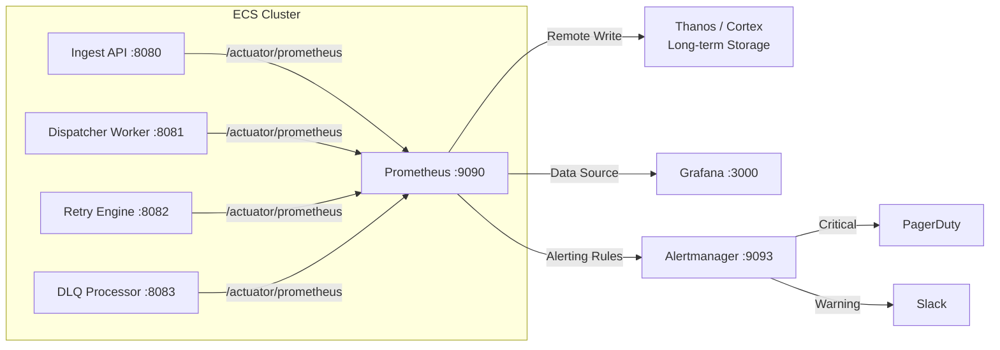

# Prometheus Setup & Configuration

## Overview

Prometheus is the primary metrics collection and storage backend for EventRelay. It scrapes metrics exposed by Spring Boot Actuator via Micrometer and provides the query engine (PromQL) that powers Grafana dashboards and alerting rules.

> [!IMPORTANT]
> All EventRelay services MUST expose a `/actuator/prometheus` endpoint. This is the single source of truth for operational metrics across the platform.

---

## Architecture



---

## Spring Boot Actuator + Micrometer Integration

### Dependencies

```xml
<!-- pom.xml -->
<dependencies>
    <!-- Spring Boot Actuator -->
    <dependency>
        <groupId>org.springframework.boot</groupId>
        <artifactId>spring-boot-starter-actuator</artifactId>
    </dependency>

    <!-- Micrometer Prometheus Registry -->
    <dependency>
        <groupId>io.micrometer</groupId>
        <artifactId>micrometer-registry-prometheus</artifactId>
    </dependency>

    <!-- Micrometer Observation API (for tracing integration) -->
    <dependency>
        <groupId>io.micrometer</groupId>
        <artifactId>micrometer-tracing-bridge-otel</artifactId>
    </dependency>
</dependencies>
```

### Application Configuration

```yaml
# application.yml
spring:
  application:
    name: eventrelay-ingest-api

management:
  endpoints:
    web:
      exposure:
        include: health, info, prometheus, metrics
      base-path: /actuator
  endpoint:
    health:
      show-details: when_authorized
      probes:
        enabled: true  # Kubernetes/ECS health probes
    prometheus:
      enabled: true
  metrics:
    tags:
      application: ${spring.application.name}
      environment: ${ENVIRONMENT:local}
      region: ${AWS_REGION:us-east-1}
    distribution:
      percentiles-histogram:
        http.server.requests: true
        eventrelay.delivery.latency: true
        eventrelay.ingestion.latency: true
      percentiles:
        http.server.requests: 0.5, 0.75, 0.9, 0.95, 0.99
        eventrelay.delivery.latency: 0.5, 0.75, 0.9, 0.95, 0.99
      sla:
        eventrelay.delivery.latency: 100ms, 250ms, 500ms, 1s, 5s, 30s
        eventrelay.ingestion.latency: 10ms, 50ms, 100ms, 250ms, 500ms
    export:
      prometheus:
        enabled: true
        step: 15s  # Matches Prometheus scrape interval
        descriptions: true
    enable:
      jvm: true
      process: true
      system: true
      logback: true
      tomcat: true
      hikaricp: true

  # Prometheus push gateway (optional, for short-lived batch jobs)
  # prometheus:
  #   metrics:
  #     export:
  #       pushgateway:
  #         enabled: false
  #         base-url: http://pushgateway:9091

server:
  port: 8080
  tomcat:
    mbeanregistry:
      enabled: true  # Required for Tomcat metrics
```

### Custom Metrics Bean Configuration

```java
package com.eventrelay.config;

import io.micrometer.core.instrument.MeterRegistry;
import io.micrometer.core.instrument.Tag;
import io.micrometer.core.instrument.config.MeterFilter;
import io.micrometer.core.instrument.distribution.DistributionStatisticConfig;
import org.springframework.boot.actuate.autoconfigure.metrics.MeterRegistryCustomizer;
import org.springframework.context.annotation.Bean;
import org.springframework.context.annotation.Configuration;

import java.time.Duration;
import java.util.List;

@Configuration
public class MetricsConfig {

    @Bean
    public MeterRegistryCustomizer<MeterRegistry> metricsCommonTags() {
        return registry -> registry.config()
            .commonTags(List.of(
                Tag.of("service", "eventrelay"),
                Tag.of("version", BuildInfo.getVersion())
            ))
            .meterFilter(MeterFilter.deny(id -> {
                // Deny high-cardinality metrics that could overwhelm Prometheus
                String name = id.getName();
                return name.startsWith("jvm.buffer") 
                    || name.startsWith("process.files");
            }))
            .meterFilter(new MeterFilter() {
                @Override
                public DistributionStatisticConfig configure(
                        DistributionStatisticConfig config,
                        DistributionStatisticConfig.Builder builder) {
                    if (config.isPublishingHistogram()) {
                        return DistributionStatisticConfig.builder()
                            .percentilesHistogram(true)
                            .minimumExpectedValue(Duration.ofMillis(1).toNanos() * 1.0)
                            .maximumExpectedValue(Duration.ofSeconds(60).toNanos() * 1.0)
                            .build()
                            .merge(config);
                    }
                    return config;
                }
            });
    }
}
```

---

## Metric Naming Conventions

All EventRelay custom metrics follow a strict naming convention to ensure consistency and discoverability.

### Naming Rules

| Rule | Convention | Example |
|------|-----------|---------|
| **Prefix** | All custom metrics start with `eventrelay_` | `eventrelay_events_received_total` |
| **Separator** | Underscore `_` between words | `eventrelay_delivery_latency_seconds` |
| **Units** | Suffix with unit name | `_seconds`, `_bytes`, `_total` |
| **Counters** | Suffix with `_total` | `eventrelay_deliveries_total` |
| **Histograms** | Suffix with unit (`_seconds`, `_bytes`) | `eventrelay_delivery_latency_seconds` |
| **Gauges** | Describe the current state | `eventrelay_queue_depth` |
| **Case** | Snake case only | `eventrelay_retry_attempts_total` |

### Label Conventions

| Label | Description | Cardinality | Example Values |
|-------|-------------|-------------|----------------|
| `tenant_id` | Tenant identifier | Medium (~100-1000) | `tenant_abc123` |
| `event_type` | Type of event | Low (~20-50) | `order.created`, `payment.completed` |
| `status` | Delivery status | Very Low (4-5) | `success`, `failed`, `timeout`, `circuit_open` |
| `http_status` | HTTP response code | Low (~10) | `200`, `429`, `500`, `502` |
| `endpoint` | API endpoint path | Low (~10-15) | `/api/v1/events`, `/api/v1/webhooks` |
| `retry_count` | Retry attempt number | Very Low (0-10) | `0`, `1`, `2`, `5` |

> [!WARNING]
> **Cardinality Control**: Never use unbounded labels (e.g., `event_id`, `delivery_id`, `user_agent`). High-cardinality labels can cause Prometheus OOM. The maximum label cardinality target is **1,000 unique combinations per metric**.

---

## Metric Types: Counter vs Gauge vs Histogram

### Decision Matrix

| Use Case | Metric Type | Rationale |
|----------|-------------|-----------|
| Total events ingested | **Counter** | Monotonically increasing, use `rate()` for throughput |
| Current queue depth | **Gauge** | Value goes up and down |
| Delivery response time | **Histogram** | Need percentile distribution |
| Active worker threads | **Gauge** | Fluctuates with load |
| Total failed deliveries | **Counter** | Monotonically increasing |
| Connection pool size | **Gauge** | Bounded, fluctuating value |
| Request payload size | **Histogram** | Need distribution analysis |
| Error budget remaining | **Gauge** | Percentage that decreases |

### Histogram Bucket Configuration

Histograms are critical for latency measurement. EventRelay uses two bucket schemes:

```yaml
# Ingestion latency (fast path: single-digit to hundreds of ms)
eventrelay_ingestion_latency_seconds_bucket:
  - 0.005   # 5ms
  - 0.010   # 10ms
  - 0.025   # 25ms
  - 0.050   # 50ms
  - 0.100   # 100ms
  - 0.250   # 250ms
  - 0.500   # 500ms
  - 1.000   # 1s
  - 2.500   # 2.5s
  - 5.000   # 5s
  - 10.000  # 10s

# Delivery latency (includes network round-trip: ms to seconds)
eventrelay_delivery_latency_seconds_bucket:
  - 0.050   # 50ms
  - 0.100   # 100ms
  - 0.250   # 250ms
  - 0.500   # 500ms
  - 1.000   # 1s
  - 2.500   # 2.5s
  - 5.000   # 5s
  - 10.000  # 10s
  - 30.000  # 30s
  - 60.000  # 60s
```

Java histogram registration:

```java
import io.micrometer.core.instrument.DistributionSummary;
import io.micrometer.core.instrument.MeterRegistry;
import io.micrometer.core.instrument.Timer;

@Component
public class DeliveryMetrics {

    private final Timer deliveryLatencyTimer;
    private final DistributionSummary payloadSizeSummary;

    public DeliveryMetrics(MeterRegistry registry) {
        this.deliveryLatencyTimer = Timer.builder("eventrelay.delivery.latency")
            .description("Time taken to deliver a webhook to the target endpoint")
            .publishPercentiles(0.5, 0.75, 0.9, 0.95, 0.99)
            .publishPercentileHistogram()
            .serviceLevelObjectives(
                Duration.ofMillis(100),
                Duration.ofMillis(250),
                Duration.ofMillis(500),
                Duration.ofSeconds(1),
                Duration.ofSeconds(5)
            )
            .minimumExpectedValue(Duration.ofMillis(10))
            .maximumExpectedValue(Duration.ofSeconds(60))
            .register(registry);

        this.payloadSizeSummary = DistributionSummary.builder("eventrelay.payload.size")
            .description("Size of webhook payloads in bytes")
            .baseUnit("bytes")
            .publishPercentiles(0.5, 0.9, 0.99)
            .publishPercentileHistogram()
            .minimumExpectedValue(100.0)
            .maximumExpectedValue(1_048_576.0) // 1MB
            .register(registry);
    }

    public void recordDelivery(String tenantId, String status, Duration latency) {
        deliveryLatencyTimer.record(latency);
    }

    public void recordPayloadSize(long sizeBytes) {
        payloadSizeSummary.record(sizeBytes);
    }
}
```

---

## Prometheus Deployment

### Option A: ECS Sidecar (Recommended for Small Deployments)

```json
{
  "family": "eventrelay-prometheus",
  "networkMode": "awsvpc",
  "containerDefinitions": [
    {
      "name": "prometheus",
      "image": "prom/prometheus:v2.51.0",
      "essential": true,
      "portMappings": [
        { "containerPort": 9090, "protocol": "tcp" }
      ],
      "mountPoints": [
        {
          "sourceVolume": "prometheus-config",
          "containerPath": "/etc/prometheus"
        },
        {
          "sourceVolume": "prometheus-data",
          "containerPath": "/prometheus"
        }
      ],
      "command": [
        "--config.file=/etc/prometheus/prometheus.yml",
        "--storage.tsdb.path=/prometheus",
        "--storage.tsdb.retention.time=15d",
        "--storage.tsdb.retention.size=50GB",
        "--web.enable-lifecycle",
        "--web.enable-admin-api"
      ],
      "logConfiguration": {
        "logDriver": "awslogs",
        "options": {
          "awslogs-group": "/ecs/eventrelay/prometheus",
          "awslogs-region": "us-east-1",
          "awslogs-stream-prefix": "prometheus"
        }
      },
      "memory": 4096,
      "cpu": 2048
    }
  ],
  "volumes": [
    {
      "name": "prometheus-data",
      "efsVolumeConfiguration": {
        "fileSystemId": "fs-0123456789abcdef0",
        "rootDirectory": "/prometheus-data",
        "transitEncryption": "ENABLED"
      }
    },
    {
      "name": "prometheus-config",
      "efsVolumeConfiguration": {
        "fileSystemId": "fs-0123456789abcdef0",
        "rootDirectory": "/prometheus-config",
        "transitEncryption": "ENABLED"
      }
    }
  ],
  "taskRoleArn": "arn:aws:iam::123456789012:role/eventrelay-prometheus-task-role",
  "executionRoleArn": "arn:aws:iam::123456789012:role/ecsTaskExecutionRole"
}
```

### Option B: Dedicated ECS Service (Recommended for Production)

Deploy Prometheus as a standalone ECS service with EFS-backed persistent storage and service discovery via AWS Cloud Map.

---

## Prometheus Scrape Configuration

```yaml
# prometheus.yml
global:
  scrape_interval: 15s       # Default scrape interval
  evaluation_interval: 15s   # Rule evaluation interval
  scrape_timeout: 10s        # Scrape timeout
  external_labels:
    cluster: eventrelay-production
    region: us-east-1

# Rule files for alerting
rule_files:
  - /etc/prometheus/rules/*.yml

# Alertmanager targets
alerting:
  alertmanagers:
    - static_configs:
        - targets:
            - alertmanager:9093
      timeout: 10s

# Scrape configurations
scrape_configs:
  # ──────────────────────────────────────────────
  # Prometheus self-monitoring
  # ──────────────────────────────────────────────
  - job_name: "prometheus"
    static_configs:
      - targets: ["localhost:9090"]

  # ──────────────────────────────────────────────
  # EventRelay Ingest API
  # ──────────────────────────────────────────────
  - job_name: "eventrelay-ingest-api"
    metrics_path: /actuator/prometheus
    scrape_interval: 10s     # More frequent for latency-sensitive service
    scrape_timeout: 5s

    # Option 1: AWS ECS Service Discovery (recommended)
    ec2_sd_configs:
      - region: us-east-1
        port: 8080
        filters:
          - name: "tag:Service"
            values: ["eventrelay-ingest-api"]
          - name: "tag:Environment"
            values: ["production"]

    # Option 2: DNS-based service discovery via Cloud Map
    # dns_sd_configs:
    #   - names:
    #       - ingest-api.eventrelay.local
    #     type: A
    #     port: 8080
    #     refresh_interval: 30s

    # Option 3: Static targets (dev/staging only)
    # static_configs:
    #   - targets:
    #       - ingest-api-1:8080
    #       - ingest-api-2:8080
    #     labels:
    #       service: ingest-api
    #       environment: staging

    relabel_configs:
      - source_labels: [__meta_ec2_tag_Name]
        target_label: instance_name
      - source_labels: [__meta_ec2_instance_id]
        target_label: instance_id
      - source_labels: [__meta_ec2_availability_zone]
        target_label: availability_zone

  # ──────────────────────────────────────────────
  # EventRelay Dispatcher Workers
  # ──────────────────────────────────────────────
  - job_name: "eventrelay-dispatcher"
    metrics_path: /actuator/prometheus
    scrape_interval: 15s

    ec2_sd_configs:
      - region: us-east-1
        port: 8081
        filters:
          - name: "tag:Service"
            values: ["eventrelay-dispatcher"]
          - name: "tag:Environment"
            values: ["production"]

    relabel_configs:
      - source_labels: [__meta_ec2_tag_Name]
        target_label: instance_name
      - source_labels: [__meta_ec2_instance_id]
        target_label: instance_id

  # ──────────────────────────────────────────────
  # EventRelay Retry Engine
  # ──────────────────────────────────────────────
  - job_name: "eventrelay-retry-engine"
    metrics_path: /actuator/prometheus
    scrape_interval: 15s

    ec2_sd_configs:
      - region: us-east-1
        port: 8082
        filters:
          - name: "tag:Service"
            values: ["eventrelay-retry-engine"]
          - name: "tag:Environment"
            values: ["production"]

  # ──────────────────────────────────────────────
  # Redis Exporter
  # ──────────────────────────────────────────────
  - job_name: "redis"
    static_configs:
      - targets: ["redis-exporter:9121"]
    metrics_path: /metrics

  # ──────────────────────────────────────────────
  # PostgreSQL Exporter
  # ──────────────────────────────────────────────
  - job_name: "postgresql"
    static_configs:
      - targets: ["postgres-exporter:9187"]
    metrics_path: /metrics

  # ──────────────────────────────────────────────
  # Node Exporter (infrastructure metrics)
  # ──────────────────────────────────────────────
  - job_name: "node-exporter"
    ec2_sd_configs:
      - region: us-east-1
        port: 9100
        filters:
          - name: "tag:Service"
            values: ["eventrelay-*"]

# Remote write for long-term storage (Thanos/Cortex/Mimir)
remote_write:
  - url: "https://mimir.internal.eventrelay.io/api/v1/push"
    queue_config:
      capacity: 10000
      max_shards: 30
      min_shards: 1
      max_samples_per_send: 5000
      batch_send_deadline: 5s
    write_relabel_configs:
      # Only remote-write eventrelay_* and critical system metrics
      - source_labels: [__name__]
        regex: "eventrelay_.*|up|scrape_.*"
        action: keep
```

---

## Retention and Storage

### Storage Sizing Guidelines

| Metric | Value |
|--------|-------|
| **Scrape targets** | ~20-50 containers |
| **Metrics per target** | ~500-800 time series |
| **Total active series** | ~25,000-40,000 |
| **Bytes per sample** | ~1.5-2 bytes (compressed) |
| **Samples per day** | ~25,000 × 5,760 (15s intervals) ≈ 144M |
| **Daily storage** | ~250-400 MB |
| **15-day retention** | ~4-6 GB |
| **30-day retention** | ~8-12 GB |

### Recommended Configuration

```yaml
# prometheus.yml command-line flags
storage:
  tsdb:
    retention:
      time: 15d          # Keep 15 days locally
      size: 50GB         # Hard cap on disk usage
    wal-compression: true # Enable WAL compression (~40% savings)
    min-block-duration: 2h
    max-block-duration: 36h
```

### Long-Term Storage Strategy

| Tier | Retention | Resolution | Storage |
|------|-----------|------------|---------|
| **Hot** (Prometheus local) | 15 days | 15s | EFS/EBS |
| **Warm** (Thanos/Mimir) | 90 days | 15s | S3 |
| **Cold** (Thanos/Mimir downsampled) | 1 year | 5m | S3 Glacier |

---

## Production Considerations

### High Availability

- Deploy **two Prometheus replicas** scraping the same targets (Prometheus does not natively support HA; use Thanos or Cortex for deduplication)
- Use **Thanos Sidecar** on each Prometheus instance to upload blocks to S3
- **Thanos Querier** provides a unified query layer across replicas

### Performance Tuning

```yaml
# prometheus.yml — performance flags
global:
  # Reduce memory usage for high-cardinality environments
  query_log_file: ""  # Disable query logging in production

# Command-line flags
# --storage.tsdb.no-lockfile          # Required for shared storage (EFS)
# --web.max-connections=512           # Max concurrent connections
# --query.max-concurrency=20         # Max concurrent queries
# --query.timeout=2m                 # Query timeout
# --query.max-samples=50000000       # Max samples per query
```

### Security

- Prometheus endpoint (`/actuator/prometheus`) should **not** be publicly accessible
- Use **VPC security groups** to restrict access to Prometheus port (9090)
- Enable **basic auth** or **mTLS** for Prometheus scrape targets in production
- Consider **Prometheus RBAC** (via reverse proxy) for multi-team access

### Monitoring Prometheus Itself

Key self-monitoring metrics:

| Metric | Alert Threshold | Description |
|--------|----------------|-------------|
| `prometheus_tsdb_head_series` | > 100,000 | Cardinality explosion |
| `prometheus_target_scrape_pool_exceeded_target_limit_total` | > 0 | Target limit exceeded |
| `up == 0` | Any target | Scrape target down |
| `scrape_duration_seconds` | > 10s | Slow scrape |
| `prometheus_rule_evaluation_failures_total` | > 0 | Rule evaluation failures |

---

## Related Documents

- [Metrics.md](./Metrics.md) — Complete metrics catalog
- [Grafana.md](./Grafana.md) — Grafana dashboard setup
- [Alerting.md](./Alerting.md) — Alerting rules and Alertmanager config
- [Dashboards.md](./Dashboards.md) — Dashboard designs and layouts
