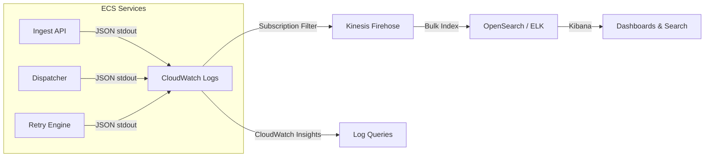
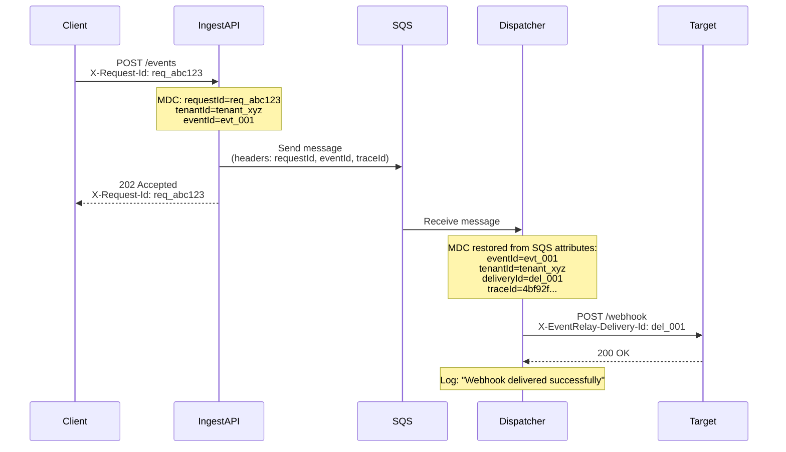

# Structured Logging

## Overview

EventRelay uses structured JSON logging via Logback with SLF4J. Every log line is a machine-parseable JSON object enriched with contextual metadata (tenant ID, event ID, delivery ID) through MDC (Mapped Diagnostic Context). This enables efficient searching, filtering, and correlation across distributed services.

> [!IMPORTANT]
> All log output MUST be structured JSON. Human-readable console format is only permitted in local development (`spring.profiles.active=local`). Production, staging, and CI environments always emit JSON.

---

## Architecture



---

## Dependencies

```xml
<!-- pom.xml -->
<dependencies>
    <!-- SLF4J API (via Spring Boot Starter) -->
    <dependency>
        <groupId>org.springframework.boot</groupId>
        <artifactId>spring-boot-starter</artifactId>
    </dependency>

    <!-- Logstash Logback Encoder (JSON format) -->
    <dependency>
        <groupId>net.logstash.logback</groupId>
        <artifactId>logstash-logback-encoder</artifactId>
        <version>7.4</version>
    </dependency>
</dependencies>
```

---

## Logback Configuration

### logback-spring.xml

```xml
<?xml version="1.0" encoding="UTF-8"?>
<configuration scan="true" scanPeriod="30 seconds">

    <!-- ══════════════════════════════════════════════════════════════ -->
    <!-- Properties                                                    -->
    <!-- ══════════════════════════════════════════════════════════════ -->
    <springProperty scope="context" name="APP_NAME" 
                    source="spring.application.name" defaultValue="eventrelay"/>
    <springProperty scope="context" name="ENVIRONMENT" 
                    source="eventrelay.environment" defaultValue="local"/>

    <!-- ══════════════════════════════════════════════════════════════ -->
    <!-- Console Appender: Human-readable (local dev only)             -->
    <!-- ══════════════════════════════════════════════════════════════ -->
    <appender name="CONSOLE_PRETTY" class="ch.qos.logback.core.ConsoleAppender">
        <encoder>
            <pattern>
                %d{yyyy-MM-dd HH:mm:ss.SSS} %highlight(%-5level) [%thread] %cyan(%logger{36}) - %msg %mdc%n
            </pattern>
        </encoder>
    </appender>

    <!-- ══════════════════════════════════════════════════════════════ -->
    <!-- JSON Appender: Structured logging (production)                -->
    <!-- ══════════════════════════════════════════════════════════════ -->
    <appender name="JSON_STDOUT" class="ch.qos.logback.core.ConsoleAppender">
        <encoder class="net.logstash.logback.encoder.LogstashEncoder">
            <!-- Timestamp format (ISO 8601 with milliseconds) -->
            <timestampPattern>yyyy-MM-dd'T'HH:mm:ss.SSSZ</timestampPattern>
            
            <!-- Include MDC fields as top-level JSON keys -->
            <includeMdcKeyName>tenantId</includeMdcKeyName>
            <includeMdcKeyName>eventId</includeMdcKeyName>
            <includeMdcKeyName>deliveryId</includeMdcKeyName>
            <includeMdcKeyName>requestId</includeMdcKeyName>
            <includeMdcKeyName>traceId</includeMdcKeyName>
            <includeMdcKeyName>spanId</includeMdcKeyName>
            <includeMdcKeyName>subscriptionId</includeMdcKeyName>
            <includeMdcKeyName>endpointUrl</includeMdcKeyName>
            <includeMdcKeyName>attemptNumber</includeMdcKeyName>
            
            <!-- Static fields added to every log line -->
            <customFields>
                {"service":"${APP_NAME}","environment":"${ENVIRONMENT}"}
            </customFields>
            
            <!-- Field naming -->
            <fieldNames>
                <timestamp>timestamp</timestamp>
                <version>[ignore]</version>
                <message>message</message>
                <logger>logger</logger>
                <thread>thread</thread>
                <level>level</level>
                <levelValue>[ignore]</levelValue>
                <caller>[ignore]</caller>
                <stackTrace>stackTrace</stackTrace>
            </fieldNames>
            
            <!-- Stack trace formatting -->
            <throwableConverter class="net.logstash.logback.stacktrace.ShortenedThrowableConverter">
                <maxDepthPerThrowable>30</maxDepthPerThrowable>
                <maxLength>4096</maxLength>
                <shortenedClassNameLength>36</shortenedClassNameLength>
                <rootCauseFirst>true</rootCauseFirst>
                <exclude>org\.springframework\..*</exclude>
                <exclude>sun\.reflect\..*</exclude>
                <exclude>java\.lang\.reflect\..*</exclude>
            </throwableConverter>
            
            <!-- Sensitive data masking -->
            <jsonGeneratorDecorator 
                class="net.logstash.logback.mask.MaskJsonGeneratorDecorator">
                <!-- Mask API keys, tokens, and secrets -->
                <valueMask>
                    <value>"(api[_-]?key|token|secret|password|authorization)["\s:]*["']?([^"'\s,}]+)"</value>
                    <mask>$1: "****MASKED****"</mask>
                </valueMask>
                <!-- Mask email addresses in values -->
                <valueMask>
                    <value>"[a-zA-Z0-9._%+-]+@[a-zA-Z0-9.-]+\.[a-zA-Z]{2,}"</value>
                    <mask>"****@masked.com"</mask>
                </valueMask>
            </jsonGeneratorDecorator>
        </encoder>
    </appender>

    <!-- ══════════════════════════════════════════════════════════════ -->
    <!-- Async Appender: Non-blocking log writes                       -->
    <!-- ══════════════════════════════════════════════════════════════ -->
    <appender name="ASYNC_JSON" class="ch.qos.logback.classic.AsyncAppender">
        <queueSize>1024</queueSize>
        <discardingThreshold>0</discardingThreshold>  <!-- Never discard logs -->
        <includeCallerData>false</includeCallerData>  <!-- Performance: skip caller lookup -->
        <neverBlock>true</neverBlock>                 <!-- Never block the application thread -->
        <appender-ref ref="JSON_STDOUT"/>
    </appender>

    <!-- ══════════════════════════════════════════════════════════════ -->
    <!-- Profile-specific Root Logger Configuration                    -->
    <!-- ══════════════════════════════════════════════════════════════ -->
    
    <!-- LOCAL development: pretty console output -->
    <springProfile name="local">
        <root level="INFO">
            <appender-ref ref="CONSOLE_PRETTY"/>
        </root>
        <logger name="com.eventrelay" level="DEBUG"/>
        <logger name="org.springframework.web" level="DEBUG"/>
    </springProfile>

    <!-- PRODUCTION / STAGING: JSON structured output -->
    <springProfile name="!local">
        <root level="INFO">
            <appender-ref ref="ASYNC_JSON"/>
        </root>
        <logger name="com.eventrelay" level="INFO"/>
        <logger name="com.eventrelay.delivery" level="INFO"/>
        <logger name="com.eventrelay.retry" level="INFO"/>
        
        <!-- Suppress noisy framework loggers -->
        <logger name="org.apache.http" level="WARN"/>
        <logger name="com.amazonaws" level="WARN"/>
        <logger name="org.hibernate.SQL" level="WARN"/>
        <logger name="io.lettuce" level="WARN"/>
        <logger name="io.netty" level="WARN"/>
    </springProfile>

</configuration>
```

---

## Sample Log Output

### JSON Format (Production)

```json
{
  "timestamp": "2026-07-10T09:15:23.456+0000",
  "level": "INFO",
  "logger": "c.e.delivery.WebhookDispatcher",
  "thread": "dispatcher-worker-3",
  "message": "Webhook delivered successfully",
  "service": "eventrelay-dispatcher",
  "environment": "production",
  "tenantId": "tenant_abc123",
  "eventId": "evt_01H5K3PQRS",
  "deliveryId": "del_01H5K3PTYZ",
  "requestId": "req_a1b2c3d4",
  "traceId": "4bf92f3577b34da6a3ce929d0e0e4736",
  "spanId": "00f067aa0ba902b7",
  "subscriptionId": "sub_xyz789",
  "endpointUrl": "https://api.customer.com/webhooks",
  "attemptNumber": "1",
  "httpStatus": 200,
  "responseTimeMs": 145
}
```

### Error Log with Stack Trace

```json
{
  "timestamp": "2026-07-10T09:15:24.789+0000",
  "level": "ERROR",
  "logger": "c.e.delivery.WebhookDispatcher",
  "thread": "dispatcher-worker-7",
  "message": "Webhook delivery failed: connection timeout",
  "service": "eventrelay-dispatcher",
  "environment": "production",
  "tenantId": "tenant_def456",
  "eventId": "evt_01H5K3QRST",
  "deliveryId": "del_01H5K3QUAB",
  "attemptNumber": "3",
  "endpointUrl": "https://api.flaky-customer.com/hooks",
  "stackTrace": "java.net.SocketTimeoutException: connect timed out\n\tat c.e.delivery.HttpWebhookClient.send(HttpWebhookClient.java:87)\n\tat c.e.delivery.WebhookDispatcher.dispatch(WebhookDispatcher.java:142)\n\t..."
}
```

---

## MDC Context Management

### MDC Fields Reference

| MDC Key | Set By | Lifecycle | Description |
|---------|--------|-----------|-------------|
| `requestId` | HTTP Filter | Per HTTP request | Unique request identifier (from `X-Request-Id` header or generated) |
| `tenantId` | Auth Filter | Per HTTP request | Authenticated tenant identifier |
| `eventId` | Ingest Service | Per event | Unique event identifier (ULID) |
| `deliveryId` | Dispatcher | Per delivery | Unique delivery attempt identifier |
| `subscriptionId` | Dispatcher | Per delivery | Webhook subscription being fulfilled |
| `endpointUrl` | Dispatcher | Per delivery | Target URL (masked for security) |
| `attemptNumber` | Retry Engine | Per attempt | Current retry attempt number |
| `traceId` | OpenTelemetry | Per trace | Distributed trace identifier |
| `spanId` | OpenTelemetry | Per span | Current span identifier |

### Request-Scoped MDC Filter

```java
package com.eventrelay.logging;

import jakarta.servlet.FilterChain;
import jakarta.servlet.ServletException;
import jakarta.servlet.http.HttpServletRequest;
import jakarta.servlet.http.HttpServletResponse;
import org.slf4j.MDC;
import org.springframework.core.Ordered;
import org.springframework.core.annotation.Order;
import org.springframework.stereotype.Component;
import org.springframework.web.filter.OncePerRequestFilter;

import java.io.IOException;
import java.util.UUID;

@Component
@Order(Ordered.HIGHEST_PRECEDENCE)
public class MdcRequestFilter extends OncePerRequestFilter {

    private static final String REQUEST_ID_HEADER = "X-Request-Id";
    private static final String MDC_REQUEST_ID = "requestId";
    private static final String MDC_TENANT_ID = "tenantId";
    private static final String MDC_CLIENT_IP = "clientIp";
    private static final String MDC_HTTP_METHOD = "httpMethod";
    private static final String MDC_REQUEST_URI = "requestUri";

    @Override
    protected void doFilterInternal(
            HttpServletRequest request,
            HttpServletResponse response,
            FilterChain filterChain) throws ServletException, IOException {
        
        try {
            // Generate or extract request ID
            String requestId = request.getHeader(REQUEST_ID_HEADER);
            if (requestId == null || requestId.isBlank()) {
                requestId = UUID.randomUUID().toString();
            }

            // Set MDC context
            MDC.put(MDC_REQUEST_ID, requestId);
            MDC.put(MDC_CLIENT_IP, getClientIp(request));
            MDC.put(MDC_HTTP_METHOD, request.getMethod());
            MDC.put(MDC_REQUEST_URI, request.getRequestURI());

            // Echo request ID back in response header
            response.setHeader(REQUEST_ID_HEADER, requestId);

            filterChain.doFilter(request, response);
        } finally {
            // CRITICAL: Always clear MDC to prevent context leaking
            MDC.clear();
        }
    }

    private String getClientIp(HttpServletRequest request) {
        String xForwardedFor = request.getHeader("X-Forwarded-For");
        if (xForwardedFor != null && !xForwardedFor.isBlank()) {
            return xForwardedFor.split(",")[0].trim();
        }
        return request.getRemoteAddr();
    }
}
```

### Event-Processing MDC Helper

```java
package com.eventrelay.logging;

import org.slf4j.MDC;

import java.util.Map;
import java.util.function.Supplier;

/**
 * Utility for managing MDC context during event processing.
 * Ensures MDC is properly set and cleared, including for async operations.
 */
public final class EventMdcContext {

    private EventMdcContext() {}

    /**
     * Executes a block with event-specific MDC context.
     */
    public static <T> T withEventContext(
            String tenantId,
            String eventId,
            String deliveryId,
            Supplier<T> operation) {
        
        Map<String, String> previousContext = MDC.getCopyOfContextMap();
        try {
            MDC.put("tenantId", tenantId);
            MDC.put("eventId", eventId);
            if (deliveryId != null) {
                MDC.put("deliveryId", deliveryId);
            }
            return operation.get();
        } finally {
            restoreContext(previousContext);
        }
    }

    /**
     * Executes a Runnable with event-specific MDC context.
     */
    public static void withEventContext(
            String tenantId,
            String eventId,
            String deliveryId,
            Runnable operation) {
        
        withEventContext(tenantId, eventId, deliveryId, () -> {
            operation.run();
            return null;
        });
    }

    /**
     * Sets delivery-specific MDC fields.
     */
    public static void setDeliveryContext(
            String subscriptionId,
            String endpointUrl,
            int attemptNumber) {
        MDC.put("subscriptionId", subscriptionId);
        MDC.put("endpointUrl", maskUrl(endpointUrl));
        MDC.put("attemptNumber", String.valueOf(attemptNumber));
    }

    /**
     * Wraps a Runnable to propagate the current MDC context into a new thread.
     * Essential for @Async methods and CompletableFuture operations.
     */
    public static Runnable propagate(Runnable task) {
        Map<String, String> contextMap = MDC.getCopyOfContextMap();
        return () -> {
            if (contextMap != null) {
                MDC.setContextMap(contextMap);
            }
            try {
                task.run();
            } finally {
                MDC.clear();
            }
        };
    }

    /**
     * Wraps a Supplier to propagate MDC context into a new thread.
     */
    public static <T> Supplier<T> propagate(Supplier<T> task) {
        Map<String, String> contextMap = MDC.getCopyOfContextMap();
        return () -> {
            if (contextMap != null) {
                MDC.setContextMap(contextMap);
            }
            try {
                return task.get();
            } finally {
                MDC.clear();
            }
        };
    }

    private static String maskUrl(String url) {
        // Mask query parameters that might contain secrets
        if (url == null) return null;
        int queryStart = url.indexOf('?');
        return queryStart > 0 ? url.substring(0, queryStart) + "?****" : url;
    }

    private static void restoreContext(Map<String, String> previousContext) {
        MDC.clear();
        if (previousContext != null) {
            MDC.setContextMap(previousContext);
        }
    }
}
```

### Usage in Service Code

```java
@Service
@Slf4j
public class WebhookDispatcher {

    public DeliveryResult dispatch(WebhookDelivery delivery) {
        return EventMdcContext.withEventContext(
            delivery.getTenantId(),
            delivery.getEventId(),
            delivery.getDeliveryId(),
            () -> {
                EventMdcContext.setDeliveryContext(
                    delivery.getSubscriptionId(),
                    delivery.getEndpointUrl(),
                    delivery.getAttemptNumber()
                );

                log.info("Starting webhook delivery");

                try {
                    HttpResponse response = httpClient.send(delivery);
                    
                    log.info("Webhook delivered successfully, httpStatus={}, responseTimeMs={}",
                        response.statusCode(), response.duration().toMillis());
                    
                    return DeliveryResult.success(response);
                } catch (SocketTimeoutException e) {
                    log.warn("Webhook delivery timed out after {}ms", 
                        delivery.getTimeoutMs());
                    return DeliveryResult.timeout();
                } catch (Exception e) {
                    log.error("Webhook delivery failed: {}", e.getMessage(), e);
                    return DeliveryResult.failure(e);
                }
            }
        );
    }
}
```

---

## Correlation IDs Across Services



### SQS Message Attribute Propagation

```java
@Component
public class SqsMessagePublisher {

    public void publishToQueue(Event event) {
        Map<String, MessageAttributeValue> attributes = new HashMap<>();
        
        // Propagate correlation IDs as SQS message attributes
        attributes.put("tenantId", stringAttribute(event.getTenantId()));
        attributes.put("eventId", stringAttribute(event.getEventId()));
        attributes.put("requestId", stringAttribute(MDC.get("requestId")));
        
        // Propagate trace context for distributed tracing
        String traceId = MDC.get("traceId");
        if (traceId != null) {
            attributes.put("traceId", stringAttribute(traceId));
        }
        String spanId = MDC.get("spanId");
        if (spanId != null) {
            attributes.put("spanId", stringAttribute(spanId));
        }

        sqsClient.sendMessage(SendMessageRequest.builder()
            .queueUrl(queueUrl)
            .messageBody(objectMapper.writeValueAsString(event))
            .messageAttributes(attributes)
            .build());
        
        log.info("Event published to SQS queue");
    }

    private MessageAttributeValue stringAttribute(String value) {
        return MessageAttributeValue.builder()
            .dataType("String")
            .stringValue(value)
            .build();
    }
}
```

```java
@Component
public class SqsMessageConsumer {

    public void processMessage(Message message) {
        // Restore MDC from SQS message attributes
        Map<String, MessageAttributeValue> attrs = message.messageAttributes();
        
        try {
            if (attrs.containsKey("tenantId")) {
                MDC.put("tenantId", attrs.get("tenantId").stringValue());
            }
            if (attrs.containsKey("eventId")) {
                MDC.put("eventId", attrs.get("eventId").stringValue());
            }
            if (attrs.containsKey("requestId")) {
                MDC.put("requestId", attrs.get("requestId").stringValue());
            }
            if (attrs.containsKey("traceId")) {
                MDC.put("traceId", attrs.get("traceId").stringValue());
            }

            log.info("Processing message from SQS queue");
            // ... process the message
        } finally {
            MDC.clear();
        }
    }
}
```

---

## Log Levels Strategy

| Level | When to Use | Production Volume | Example |
|-------|------------|-------------------|---------|
| **ERROR** | Unrecoverable failure, requires investigation | Low (~10-100/hour) | DLQ insertion, circuit breaker OPEN, DB connection failure |
| **WARN** | Recoverable issue, may need attention | Medium (~100-1000/hour) | Delivery retry, rate limit hit, slow query |
| **INFO** | Significant business events, happy path milestones | High (~1000-10000/hour) | Event received, delivery success, subscription created |
| **DEBUG** | Detailed processing data, useful for debugging | Disabled in production | HTTP request/response bodies, SQL queries, cache operations |
| **TRACE** | Extremely detailed, rarely used | Never in production | Method entry/exit, individual loop iterations |

### Dynamic Log Level Changes

```java
// Expose actuator endpoint for runtime log level changes
// POST /actuator/loggers/com.eventrelay.delivery
// { "configuredLevel": "DEBUG" }
```

```yaml
# application.yml
management:
  endpoint:
    loggers:
      enabled: true  # Enable dynamic log level changes
  endpoints:
    web:
      exposure:
        include: health, prometheus, loggers
```

> [!CAUTION]
> Enabling DEBUG level in production generates **10-100x** more log volume. Always set a time-bound reminder to revert back to INFO. Use dynamic log level changes sparingly and only during active incident investigation.

---

## Sensitive Data Masking

### Masking Strategy

| Data Type | Handling | Example |
|-----------|----------|---------|
| API Keys | Replace with `****MASKED****` | `apiKey: ****MASKED****` |
| Webhook Secrets | Never log | (omitted entirely) |
| Payload Bodies | Hash or truncate | `payloadHash=sha256:abc123...` |
| URL Query Params | Strip after `?` | `https://api.example.com/hook?****` |
| Email Addresses | Mask local part | `****@masked.com` |
| IP Addresses | Keep (needed for debugging) | `192.168.1.100` |

### Custom Masking Filter

```java
package com.eventrelay.logging;

import ch.qos.logback.classic.spi.ILoggingEvent;
import ch.qos.logback.core.filter.Filter;
import ch.qos.logback.core.spi.FilterReply;

import java.util.regex.Pattern;

public class SensitiveDataFilter extends Filter<ILoggingEvent> {

    private static final Pattern API_KEY_PATTERN = 
        Pattern.compile("(api[_-]?key|token|secret|password)\\s*[=:]\\s*\\S+", 
                        Pattern.CASE_INSENSITIVE);

    @Override
    public FilterReply decide(ILoggingEvent event) {
        // This filter always allows the event through,
        // but the LogstashEncoder's MaskJsonGeneratorDecorator
        // handles the actual masking in the JSON output.
        return FilterReply.NEUTRAL;
    }
}
```

---

## Log Shipping

### Option A: CloudWatch Logs (Default for ECS)

ECS Fargate automatically ships container stdout/stderr to CloudWatch when using `awslogs` driver:

```json
{
  "logConfiguration": {
    "logDriver": "awslogs",
    "options": {
      "awslogs-group": "/ecs/eventrelay/${SERVICE_NAME}",
      "awslogs-region": "us-east-1",
      "awslogs-stream-prefix": "ecs",
      "awslogs-create-group": "true"
    }
  }
}
```

**CloudWatch Insights Queries:**

```sql
-- Find all logs for a specific event
fields @timestamp, level, message, tenantId, eventId, deliveryId
| filter eventId = "evt_01H5K3PQRS"
| sort @timestamp asc

-- Error rate by service (last hour)
filter level = "ERROR"
| stats count(*) as errors by service
| sort errors desc

-- Delivery latency percentiles
filter message = "Webhook delivered successfully"
| stats avg(responseTimeMs) as avg_ms,
        pct(responseTimeMs, 50) as p50,
        pct(responseTimeMs, 95) as p95,
        pct(responseTimeMs, 99) as p99
  by bin(5m)

-- Top error messages
filter level = "ERROR"
| stats count(*) as count by message
| sort count desc
| limit 20
```

### Option B: ELK Stack (OpenSearch)

For teams requiring advanced log analysis, ship logs from CloudWatch to OpenSearch via Kinesis Firehose:

```yaml
# CloudFormation snippet for log shipping pipeline
LogSubscriptionFilter:
  Type: AWS::Logs::SubscriptionFilter
  Properties:
    LogGroupName: /ecs/eventrelay/ingest-api
    FilterPattern: ""  # All logs
    DestinationArn: !GetAtt KinesisFirehose.Arn

KinesisFirehose:
  Type: AWS::KinesisFirehose::DeliveryStream
  Properties:
    DeliveryStreamType: DirectPut
    ElasticsearchDestinationConfiguration:
      DomainARN: !GetAtt OpenSearchDomain.Arn
      IndexName: eventrelay-logs
      IndexRotationPeriod: OneDay
      RetryOptions:
        DurationInSeconds: 300
      S3BackupMode: AllDocuments
      BufferingHints:
        IntervalInSeconds: 60
        SizeInMBs: 5
```

### Log Retention Policy

| Environment | CloudWatch Retention | OpenSearch Retention | Archive |
|-------------|---------------------|---------------------|---------|
| Production | 30 days | 90 days | S3 Glacier (1 year) |
| Staging | 14 days | 30 days | None |
| Development | 7 days | None | None |

---

## Production Considerations

### Performance Impact

- Async appender queue size: **1024** (never blocks application threads)
- JSON serialization overhead: **~2-5μs per log line**
- Log volume target: **< 50 MB/hour per service** at INFO level
- MDC operations: **< 100ns** (ThreadLocal-based)

### Log Volume Management

- Use **sampling** for high-frequency DEBUG paths (log 1 in 100)
- Enable **rate limiting** on repetitive error messages (e.g., same exception per minute)
- Set **max message length** to 8KB to prevent payload logging

```java
// Rate-limited logging for repetitive errors
@Component
public class RateLimitedLogger {
    private final Cache<String, Boolean> recentlyLogged = Caffeine.newBuilder()
        .expireAfterWrite(Duration.ofMinutes(1))
        .maximumSize(1000)
        .build();

    public void logErrorOnce(Logger log, String key, String message, Object... args) {
        if (recentlyLogged.getIfPresent(key) == null) {
            recentlyLogged.put(key, true);
            log.error(message, args);
        }
    }
}
```

---

## Related Documents

- [Tracing.md](./Tracing.md) — Distributed tracing and trace-to-log correlation
- [Metrics.md](./Metrics.md) — Metrics catalog (complementary to logs)
- [Alerting.md](./Alerting.md) — Log-based alerting rules
