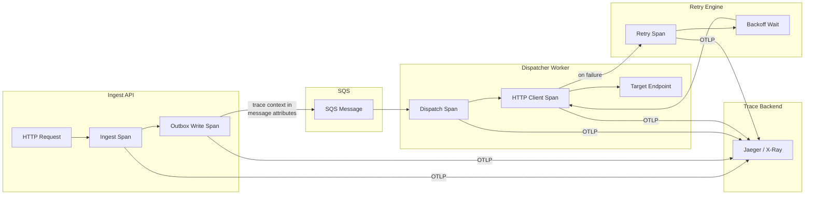

# Distributed Tracing

## Overview

EventRelay uses OpenTelemetry (OTel) with Micrometer Tracing for distributed trace propagation across the ingestion, dispatch, and retry pipeline. Traces provide end-to-end visibility into an event's journey from API ingestion through queue processing to final webhook delivery.

> [!NOTE]
> Unlike synchronous request-response services, EventRelay's trace spans are **asynchronous**: the ingestion span ends when the event is written to the outbox, and a new trace is linked when the dispatcher picks it up from SQS. We use **trace linking** (not parent-child) to connect these segments.

---

## Architecture



---

## Dependencies

```xml
<!-- pom.xml -->
<dependencies>
    <!-- Micrometer Tracing (abstraction layer) -->
    <dependency>
        <groupId>io.micrometer</groupId>
        <artifactId>micrometer-tracing</artifactId>
    </dependency>

    <!-- Micrometer → OpenTelemetry Bridge -->
    <dependency>
        <groupId>io.micrometer</groupId>
        <artifactId>micrometer-tracing-bridge-otel</artifactId>
    </dependency>

    <!-- OpenTelemetry OTLP Exporter -->
    <dependency>
        <groupId>io.opentelemetry</groupId>
        <artifactId>opentelemetry-exporter-otlp</artifactId>
    </dependency>

    <!-- OpenTelemetry SDK Autoconfigure -->
    <dependency>
        <groupId>io.opentelemetry</groupId>
        <artifactId>opentelemetry-sdk-extension-autoconfigure</artifactId>
    </dependency>

    <!-- Spring Boot Actuator for observation support -->
    <dependency>
        <groupId>org.springframework.boot</groupId>
        <artifactId>spring-boot-starter-actuator</artifactId>
    </dependency>

    <!-- Automatic instrumentation for common libraries -->
    <dependency>
        <groupId>io.opentelemetry.instrumentation</groupId>
        <artifactId>opentelemetry-spring-boot-starter</artifactId>
        <version>2.4.0</version>
    </dependency>
</dependencies>
```

---

## Spring Boot Tracing Configuration

```yaml
# application.yml
spring:
  application:
    name: eventrelay-ingest-api

management:
  tracing:
    enabled: true
    sampling:
      probability: 1.0      # 100% in staging, adjust for production
    propagation:
      type: w3c             # W3C Trace Context (traceparent header)
      consume: [w3c, b3]    # Also accept B3 format for compatibility
      produce: [w3c]        # Always produce W3C format
  observations:
    annotations:
      enabled: true          # Enable @Observed annotation support

# OpenTelemetry SDK configuration
otel:
  exporter:
    otlp:
      endpoint: http://otel-collector:4317     # gRPC endpoint
      protocol: grpc
      timeout: 10000                            # 10s export timeout
      compression: gzip
  resource:
    attributes:
      service.name: ${spring.application.name}
      service.version: ${BUILD_VERSION:0.0.0}
      deployment.environment: ${ENVIRONMENT:local}
      cloud.provider: aws
      cloud.region: ${AWS_REGION:us-east-1}
  traces:
    sampler:
      type: parentbased_traceidratio
      arg: "0.1"                               # 10% sampling in production
  logs:
    exporter: none                              # Logs via Logback, not OTel

---
# Per-environment overrides
spring:
  config:
    activate:
      on-profile: production

management:
  tracing:
    sampling:
      probability: 0.1     # 10% sampling in production
```

---

## Trace Context Propagation (W3C)

### HTTP Headers

EventRelay propagates trace context via W3C Trace Context headers:

```
traceparent: 00-4bf92f3577b34da6a3ce929d0e0e4736-00f067aa0ba902b7-01
tracestate: eventrelay=tenant_abc123
```

| Header | Format | Example |
|--------|--------|---------|
| `traceparent` | `{version}-{trace-id}-{parent-id}-{trace-flags}` | `00-4bf92f...-00f067...-01` |
| `tracestate` | Vendor-specific key-value pairs | `eventrelay=tenant_abc123` |

### SQS Message Attribute Propagation

Since SQS does not natively support W3C headers, we propagate trace context as **message attributes**:

```java
package com.eventrelay.tracing;

import io.opentelemetry.api.trace.Span;
import io.opentelemetry.api.trace.SpanContext;
import io.opentelemetry.context.Context;
import io.opentelemetry.context.propagation.TextMapGetter;
import io.opentelemetry.context.propagation.TextMapSetter;
import software.amazon.awssdk.services.sqs.model.MessageAttributeValue;

import java.util.HashMap;
import java.util.Map;

public class SqsTracePropagator {

    private static final String TRACEPARENT_KEY = "traceparent";
    private static final String TRACESTATE_KEY = "tracestate";

    /**
     * Injects current trace context into SQS message attributes.
     * Call this when sending a message to SQS.
     */
    public static Map<String, MessageAttributeValue> injectTraceContext(
            Map<String, MessageAttributeValue> existingAttributes) {

        Map<String, MessageAttributeValue> attributes = new HashMap<>(existingAttributes);
        Map<String, String> carrier = new HashMap<>();

        // Inject W3C trace context into carrier map
        io.opentelemetry.api.GlobalOpenTelemetry.getPropagators()
            .getTextMapPropagator()
            .inject(Context.current(), carrier, MapSetter.INSTANCE);

        // Convert carrier map to SQS message attributes
        carrier.forEach((key, value) -> {
            attributes.put(key, MessageAttributeValue.builder()
                .dataType("String")
                .stringValue(value)
                .build());
        });

        return attributes;
    }

    /**
     * Extracts trace context from SQS message attributes.
     * Call this when receiving a message from SQS.
     */
    public static Context extractTraceContext(
            Map<String, MessageAttributeValue> messageAttributes) {

        // Convert SQS attributes to simple string map
        Map<String, String> carrier = new HashMap<>();
        messageAttributes.forEach((key, value) -> {
            if (TRACEPARENT_KEY.equals(key) || TRACESTATE_KEY.equals(key)) {
                carrier.put(key, value.stringValue());
            }
        });

        // Extract W3C trace context from carrier
        return io.opentelemetry.api.GlobalOpenTelemetry.getPropagators()
            .getTextMapPropagator()
            .extract(Context.current(), carrier, MapGetter.INSTANCE);
    }

    private enum MapSetter implements TextMapSetter<Map<String, String>> {
        INSTANCE;
        @Override
        public void set(Map<String, String> carrier, String key, String value) {
            carrier.put(key, value);
        }
    }

    private enum MapGetter implements TextMapGetter<Map<String, String>> {
        INSTANCE;
        @Override
        public Iterable<String> keys(Map<String, String> carrier) {
            return carrier.keySet();
        }
        @Override
        public String get(Map<String, String> carrier, String key) {
            return carrier.get(key);
        }
    }
}
```

---

## Span Creation for Key Operations

### Span Hierarchy

```mermaid
gantt
    title EventRelay Trace Timeline
    dateFormat X
    axisFormat %s

    section Ingest API
    HTTP Request           :a1, 0, 50
    Validate Payload       :a2, 5, 15
    Write to Outbox        :a3, 15, 40
    Publish to SQS         :a4, 40, 48

    section Dispatcher
    Receive from SQS       :b1, 100, 105
    Resolve Subscriptions  :b2, 105, 110
    Sign Payload (HMAC)    :b3, 110, 112
    HTTP POST to Target    :b4, 112, 250
    Record Result          :b5, 250, 255

    section Retry (if failed)
    Schedule Retry         :c1, 260, 265
    Backoff Wait           :c2, 265, 5265
    Re-dispatch            :c3, 5265, 5400
```



### Custom Span Creation

```java
package com.eventrelay.tracing;

import io.micrometer.observation.Observation;
import io.micrometer.observation.ObservationRegistry;
import io.opentelemetry.api.trace.Span;
import io.opentelemetry.api.trace.SpanKind;
import io.opentelemetry.api.trace.StatusCode;
import io.opentelemetry.api.trace.Tracer;
import io.opentelemetry.context.Context;
import io.opentelemetry.context.Scope;
import org.springframework.stereotype.Component;

import java.util.function.Supplier;

@Component
public class EventRelayTracer {

    private final Tracer tracer;
    private final ObservationRegistry observationRegistry;

    public EventRelayTracer(Tracer tracer, ObservationRegistry observationRegistry) {
        this.tracer = tracer;
        this.observationRegistry = observationRegistry;
    }

    // ── Ingestion Spans ──────────────────────────────────────────

    /**
     * Creates a span for the event ingestion operation.
     */
    public <T> T traceIngestion(String tenantId, String eventId, 
                                 String eventType, Supplier<T> operation) {
        Span span = tracer.spanBuilder("eventrelay.ingest")
            .setSpanKind(SpanKind.SERVER)
            .setAttribute("eventrelay.tenant_id", tenantId)
            .setAttribute("eventrelay.event_id", eventId)
            .setAttribute("eventrelay.event_type", eventType)
            .startSpan();

        try (Scope scope = span.makeCurrent()) {
            T result = operation.get();
            span.setStatus(StatusCode.OK);
            return result;
        } catch (Exception e) {
            span.setStatus(StatusCode.ERROR, e.getMessage());
            span.recordException(e);
            throw e;
        } finally {
            span.end();
        }
    }

    /**
     * Creates a child span for outbox table write.
     */
    public <T> T traceOutboxWrite(String eventId, Supplier<T> operation) {
        Span span = tracer.spanBuilder("eventrelay.outbox.write")
            .setSpanKind(SpanKind.CLIENT)
            .setAttribute("db.system", "postgresql")
            .setAttribute("db.operation", "INSERT")
            .setAttribute("db.sql.table", "outbox_events")
            .setAttribute("eventrelay.event_id", eventId)
            .startSpan();

        try (Scope scope = span.makeCurrent()) {
            T result = operation.get();
            span.setStatus(StatusCode.OK);
            return result;
        } catch (Exception e) {
            span.setStatus(StatusCode.ERROR, e.getMessage());
            span.recordException(e);
            throw e;
        } finally {
            span.end();
        }
    }

    // ── Delivery Spans ───────────────────────────────────────────

    /**
     * Creates a span for webhook delivery with a linked parent from SQS.
     */
    public <T> T traceDelivery(Context parentContext, String deliveryId,
                                String tenantId, String endpointUrl,
                                int attemptNumber, Supplier<T> operation) {
        Span span = tracer.spanBuilder("eventrelay.deliver")
            .setParent(parentContext)
            .setSpanKind(SpanKind.CLIENT)
            .setAttribute("eventrelay.delivery_id", deliveryId)
            .setAttribute("eventrelay.tenant_id", tenantId)
            .setAttribute("eventrelay.endpoint_url", sanitizeUrl(endpointUrl))
            .setAttribute("eventrelay.attempt_number", attemptNumber)
            .setAttribute("http.method", "POST")
            .setAttribute("http.url", sanitizeUrl(endpointUrl))
            .startSpan();

        try (Scope scope = span.makeCurrent()) {
            T result = operation.get();
            span.setStatus(StatusCode.OK);
            return result;
        } catch (Exception e) {
            span.setStatus(StatusCode.ERROR, e.getMessage());
            span.recordException(e);
            throw e;
        } finally {
            span.end();
        }
    }

    /**
     * Creates a span for the HTTP call to the target endpoint.
     */
    public <T> T traceHttpPost(String url, Supplier<T> operation) {
        Span span = tracer.spanBuilder("HTTP POST")
            .setSpanKind(SpanKind.CLIENT)
            .setAttribute("http.method", "POST")
            .setAttribute("http.url", sanitizeUrl(url))
            .startSpan();

        try (Scope scope = span.makeCurrent()) {
            T result = operation.get();
            span.setStatus(StatusCode.OK);
            return result;
        } catch (Exception e) {
            span.setStatus(StatusCode.ERROR, e.getMessage());
            span.recordException(e);
            throw e;
        } finally {
            span.end();
        }
    }

    /**
     * Adds delivery result attributes to the current span.
     */
    public void recordDeliveryResult(int httpStatus, long durationMs) {
        Span current = Span.current();
        current.setAttribute("http.status_code", httpStatus);
        current.setAttribute("eventrelay.delivery_duration_ms", durationMs);
        
        if (httpStatus >= 200 && httpStatus < 300) {
            current.setStatus(StatusCode.OK);
        } else {
            current.setStatus(StatusCode.ERROR, "HTTP " + httpStatus);
        }
    }

    // ── Retry Spans ──────────────────────────────────────────────

    /**
     * Creates a span for a retry scheduling operation.
     */
    public void traceRetryScheduled(String eventId, int attemptNumber,
                                     long backoffMs) {
        Span span = tracer.spanBuilder("eventrelay.retry.schedule")
            .setSpanKind(SpanKind.INTERNAL)
            .setAttribute("eventrelay.event_id", eventId)
            .setAttribute("eventrelay.attempt_number", attemptNumber)
            .setAttribute("eventrelay.backoff_ms", backoffMs)
            .startSpan();
        span.end();
    }

    // ── Using Micrometer Observation API ─────────────────────────

    /**
     * Alternative: Use Micrometer Observation API for auto-instrumented
     * spans that also generate metrics automatically.
     */
    public <T> T observe(String name, String contextualName,
                          Supplier<T> operation) {
        return Observation.createNotStarted(name, observationRegistry)
            .contextualName(contextualName)
            .observe(operation);
    }

    private String sanitizeUrl(String url) {
        if (url == null) return "unknown";
        int queryStart = url.indexOf('?');
        return queryStart > 0 ? url.substring(0, queryStart) : url;
    }
}
```

### Using @Observed Annotation

```java
package com.eventrelay.service;

import io.micrometer.observation.annotation.Observed;
import org.springframework.stereotype.Service;

@Service
public class EventValidationService {

    @Observed(
        name = "eventrelay.validate",
        contextualName = "validate-event-payload",
        lowCardinalityKeyValues = {"component", "validation"}
    )
    public ValidationResult validate(Event event) {
        // Schema validation logic
        // Automatically creates a span + timer metric
        return performValidation(event);
    }
}
```

---

## Trace Sampling Strategy

### Sampling Decision Matrix

| Condition | Sample Rate | Rationale |
|-----------|-------------|-----------|
| **Production - normal traffic** | 10% | Sufficient for trend analysis, manageable volume |
| **Production - errors** | 100% | Always capture error traces for debugging |
| **Production - high latency** | 100% | Capture slow operations for optimization |
| **Production - DLQ events** | 100% | Always trace events that end up in DLQ |
| **Staging** | 100% | Full visibility for testing |
| **Load testing** | 1% | Prevent trace backend overload |

### Custom Sampler Implementation

```java
package com.eventrelay.tracing;

import io.opentelemetry.api.common.Attributes;
import io.opentelemetry.api.trace.SpanKind;
import io.opentelemetry.context.Context;
import io.opentelemetry.sdk.trace.data.LinkData;
import io.opentelemetry.sdk.trace.samplers.Sampler;
import io.opentelemetry.sdk.trace.samplers.SamplingDecision;
import io.opentelemetry.sdk.trace.samplers.SamplingResult;

import java.util.List;

/**
 * Custom sampler that always samples errors and slow operations,
 * and uses probabilistic sampling for normal traffic.
 */
public class EventRelaySampler implements Sampler {

    private final Sampler baseSampler;

    public EventRelaySampler(double baseProbability) {
        this.baseSampler = Sampler.traceIdRatioBased(baseProbability);
    }

    @Override
    public SamplingResult shouldSample(
            Context parentContext,
            String traceId,
            String name,
            SpanKind spanKind,
            Attributes attributes,
            List<LinkData> parentLinks) {

        // Always sample error spans
        String status = attributes.get(io.opentelemetry.api.common.AttributeKey
            .stringKey("eventrelay.status"));
        if ("error".equals(status) || "failed".equals(status)) {
            return SamplingResult.create(SamplingDecision.RECORD_AND_SAMPLE);
        }

        // Always sample DLQ operations
        if (name.contains("dlq")) {
            return SamplingResult.create(SamplingDecision.RECORD_AND_SAMPLE);
        }

        // Always sample retry attempts > 3 (something is wrong)
        Long attemptNumber = attributes.get(io.opentelemetry.api.common.AttributeKey
            .longKey("eventrelay.attempt_number"));
        if (attemptNumber != null && attemptNumber > 3) {
            return SamplingResult.create(SamplingDecision.RECORD_AND_SAMPLE);
        }

        // Use base probabilistic sampling for normal traffic
        return baseSampler.shouldSample(
            parentContext, traceId, name, spanKind, attributes, parentLinks);
    }

    @Override
    public String getDescription() {
        return "EventRelaySampler(always sample errors/DLQ, probabilistic otherwise)";
    }
}
```

### Sampler Registration

```java
@Configuration
public class TracingConfig {

    @Bean
    public Sampler customSampler(
            @Value("${management.tracing.sampling.probability:0.1}") double probability) {
        return Sampler.parentBased(new EventRelaySampler(probability));
    }
}
```

---

## Trace Export

### Option A: Jaeger (Self-Hosted)

```yaml
# OpenTelemetry Collector configuration (otel-collector-config.yml)
receivers:
  otlp:
    protocols:
      grpc:
        endpoint: 0.0.0.0:4317
      http:
        endpoint: 0.0.0.0:4318

processors:
  batch:
    timeout: 5s
    send_batch_size: 512
    send_batch_max_size: 1024
  
  memory_limiter:
    check_interval: 1s
    limit_mib: 1024
    spike_limit_mib: 256

  attributes:
    actions:
      # Enrich spans with deployment metadata
      - key: deployment.cluster
        value: eventrelay-production
        action: upsert

exporters:
  jaeger:
    endpoint: jaeger-collector:14250
    tls:
      insecure: true

  # Also export to AWS X-Ray for AWS-native tracing
  awsxray:
    region: us-east-1
    index_all_attributes: true

  logging:
    verbosity: basic
    sampling_initial: 5
    sampling_thereafter: 200

service:
  pipelines:
    traces:
      receivers: [otlp]
      processors: [memory_limiter, batch, attributes]
      exporters: [jaeger, awsxray]
```

### Option B: AWS X-Ray (Managed)

```yaml
# application.yml for X-Ray export
otel:
  exporter:
    otlp:
      endpoint: http://otel-collector:4317
  # X-Ray ID format configuration
  traces:
    id-generator: xray  # Generates X-Ray compatible trace IDs
```

---

## Trace-to-Log Correlation

The trace ID and span ID are automatically injected into MDC by Micrometer Tracing, making every log line correlatable to its trace:

### Logback MDC Integration

```xml
<!-- In logback-spring.xml — these fields are auto-populated by Micrometer Tracing -->
<encoder class="net.logstash.logback.encoder.LogstashEncoder">
    <includeMdcKeyName>traceId</includeMdcKeyName>
    <includeMdcKeyName>spanId</includeMdcKeyName>
</encoder>
```

### Resulting Log + Trace Correlation

```json
{
  "timestamp": "2026-07-10T09:15:23.456+0000",
  "level": "INFO",
  "message": "Webhook delivered successfully",
  "traceId": "4bf92f3577b34da6a3ce929d0e0e4736",
  "spanId": "00f067aa0ba902b7",
  "tenantId": "tenant_abc123",
  "eventId": "evt_01H5K3PQRS",
  "deliveryId": "del_01H5K3PTYZ"
}
```

### Grafana Correlation

In Grafana, configure **Derived Fields** in the Loki/CloudWatch data source to create clickable links from `traceId` in logs to Jaeger traces:

```yaml
# Grafana datasource provisioning
datasources:
  - name: CloudWatch
    type: cloudwatch
    jsonData:
      tracesToLogs:
        datasourceUid: jaeger
        tags: ["traceId"]
        mappedTags:
          - key: traceId
            value: traceID
        mapTagNamesEnabled: true
        spanStartTimeShift: "-1h"
        spanEndTimeShift: "1h"
        filterByTraceID: true
        filterBySpanID: false
```

---

## OpenTelemetry Collector Deployment

### ECS Task Definition

```json
{
  "family": "eventrelay-otel-collector",
  "networkMode": "awsvpc",
  "containerDefinitions": [
    {
      "name": "otel-collector",
      "image": "otel/opentelemetry-collector-contrib:0.98.0",
      "essential": true,
      "portMappings": [
        { "containerPort": 4317, "protocol": "tcp" },
        { "containerPort": 4318, "protocol": "tcp" },
        { "containerPort": 8888, "protocol": "tcp" }
      ],
      "command": ["--config=/etc/otel/config.yml"],
      "mountPoints": [
        {
          "sourceVolume": "otel-config",
          "containerPath": "/etc/otel"
        }
      ],
      "memory": 2048,
      "cpu": 1024,
      "healthCheck": {
        "command": ["CMD-SHELL", "wget --spider -q http://localhost:13133/health || exit 1"],
        "interval": 30,
        "timeout": 5,
        "retries": 3
      }
    }
  ]
}
```

---

## Production Considerations

### Trace Volume Estimation

| Parameter | Value |
|-----------|-------|
| Events per second | ~1,000 |
| Spans per event trace | ~5-8 (ingest + validate + outbox + SQS + dispatch + HTTP + result) |
| 10% sampling rate | ~100 traces/s = ~500-800 spans/s |
| Average span size | ~500 bytes |
| Daily trace storage | ~20-35 GB |
| 30-day retention | ~600 GB - 1 TB |

### Performance Impact

- **Overhead per span**: ~5-10μs (span creation + attribute setting)
- **Export overhead**: Batched async export, minimal impact (~1% CPU)
- **Memory**: OTel SDK uses ~50MB for span buffers
- **Context propagation**: ~100ns (ThreadLocal-based)

### Troubleshooting Traces

| Symptom | Likely Cause | Resolution |
|---------|-------------|------------|
| Missing spans | Sampling filtered them out | Check sampler config, use error-always-sample |
| Broken trace chains | MDC/context not propagated across SQS | Verify SqsTracePropagator is used |
| High trace volume | Sampling rate too high | Reduce to 1-5% for production |
| Missing attributes | Attributes set after span end | Set attributes before `span.end()` |

---

## Related Documents

- [Structured_Logging.md](./Structured_Logging.md) — Structured logging and MDC context
- [Metrics.md](./Metrics.md) — Metrics generated from traces via Micrometer
- [Dashboards.md](./Dashboards.md) — Trace-integrated dashboards
