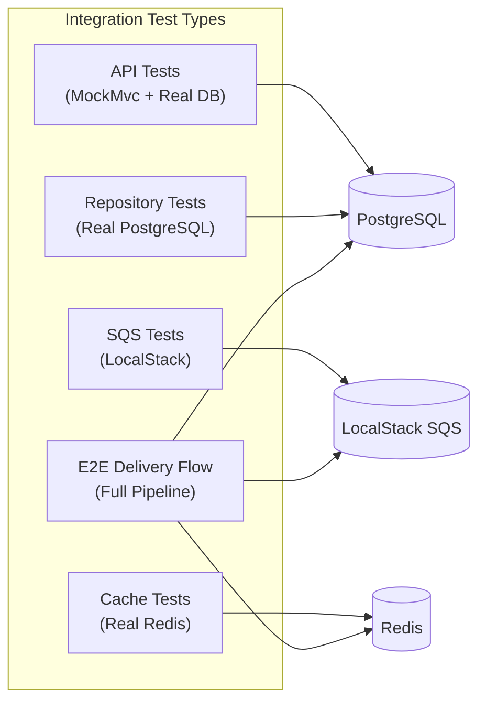

# Integration Testing

> **Document Status:** Living Document · **Last Updated:** 2026-07-10 · **Owner:** Platform Engineering

## 1. Overview

Integration tests validate that EventRelay components work correctly when connected to **real infrastructure** — PostgreSQL, Redis, and SQS (via LocalStack). Unlike unit tests, integration tests start a Spring Boot application context and exercise full request/response cycles through actual database queries, cache operations, and message queue interactions.

> [!IMPORTANT]
> Integration tests use **Testcontainers** to spin up ephemeral PostgreSQL, Redis, and LocalStack instances. No shared test databases, no manual infrastructure setup. Every test suite gets a clean environment.

---

## 2. Integration Test Categories



| Category | Scope | Infrastructure | Avg. Duration |
|---|---|---|---|
| **API Integration** | Controller → Service → Repository | PostgreSQL | 2–5s per test |
| **Repository Integration** | JPA queries, schema validation | PostgreSQL | 1–3s per test |
| **SQS Integration** | Message publish/consume lifecycle | LocalStack | 3–8s per test |
| **Cache Integration** | Redis operations, TTL, eviction | Redis | 1–2s per test |
| **E2E Delivery Flow** | Full ingest → dispatch → delivery | All | 5–15s per test |

---

## 3. Spring Boot Test Configuration

### 3.1 Base Integration Test Class

```java
@SpringBootTest(webEnvironment = SpringBootTest.WebEnvironment.RANDOM_PORT)
@ActiveProfiles("test")
@Testcontainers
@TestMethodOrder(MethodOrderer.OrderAnnotation.class)
public abstract class BaseIntegrationTest {

    @Container
    @ServiceConnection
    static PostgreSQLContainer<?> postgres = new PostgreSQLContainer<>("postgres:16-alpine")
        .withDatabaseName("eventrelay_test")
        .withUsername("test")
        .withPassword("test")
        .withReuse(true);

    @Container
    @ServiceConnection
    static GenericContainer<?> redis = new GenericContainer<>("redis:7-alpine")
        .withExposedPorts(6379)
        .withReuse(true);

    @Container
    static LocalStackContainer localstack = new LocalStackContainer(
            DockerImageName.parse("localstack/localstack:3.4"))
        .withServices(LocalStackContainer.Service.SQS)
        .withReuse(true);

    @DynamicPropertySource
    static void configureProperties(DynamicPropertyRegistry registry) {
        // SQS configuration (not auto-configured by @ServiceConnection)
        registry.add("aws.sqs.endpoint", () -> localstack.getEndpointOverride(SQS).toString());
        registry.add("aws.sqs.region", () -> localstack.getRegion());
        registry.add("aws.sqs.access-key", () -> localstack.getAccessKey());
        registry.add("aws.sqs.secret-key", () -> localstack.getSecretKey());
    }

    @Autowired
    protected TestRestTemplate restTemplate;

    @Autowired
    protected JdbcTemplate jdbcTemplate;

    @BeforeEach
    void cleanDatabase() {
        jdbcTemplate.execute("TRUNCATE TABLE delivery_attempts CASCADE");
        jdbcTemplate.execute("TRUNCATE TABLE events CASCADE");
        jdbcTemplate.execute("TRUNCATE TABLE outbox CASCADE");
        // Preserve subscriptions and targets for test setup
    }
}
```

### 3.2 Test Profile — `application-test.yml`

```yaml
spring:
  application:
    name: eventrelay-test

  datasource:
    # Overridden by Testcontainers @ServiceConnection
    url: jdbc:postgresql://localhost:5432/eventrelay_test
    username: test
    password: test
    hikari:
      maximum-pool-size: 5
      minimum-idle: 1
      connection-timeout: 5000

  jpa:
    hibernate:
      ddl-auto: validate
    show-sql: true
    properties:
      hibernate:
        format_sql: true

  flyway:
    enabled: true
    locations: classpath:db/migration
    clean-disabled: false

  data:
    redis:
      # Overridden by Testcontainers @ServiceConnection
      host: localhost
      port: 6379
      timeout: 2000

# EventRelay-specific test config
eventrelay:
  retry:
    max-attempts: 3
    initial-delay-ms: 100
    max-delay-ms: 1000
    multiplier: 2.0
    jitter-factor: 0.0  # Disable jitter for deterministic tests

  rate-limit:
    default-rps: 100
    burst-capacity: 200

  dispatch:
    thread-pool-size: 2
    http-timeout-ms: 5000
    connect-timeout-ms: 2000

  hmac:
    algorithm: HmacSHA256
    signature-version: v1

  sqs:
    event-queue-name: eventrelay-events-test
    dlq-name: eventrelay-dlq-test
    max-messages-per-poll: 5
    visibility-timeout-seconds: 30
    wait-time-seconds: 1

logging:
  level:
    com.eventrelay: DEBUG
    org.springframework.web: DEBUG
    org.hibernate.SQL: DEBUG
    org.hibernate.type.descriptor.sql.BasicBinder: TRACE
```

---

## 4. API Integration Tests (MockMvc + Real PostgreSQL)

### 4.1 Event Ingestion API Tests

```java
@SpringBootTest
@AutoConfigureMockMvc
@ActiveProfiles("test")
@Testcontainers
class EventIngestionApiIntegrationTest extends BaseIntegrationTest {

    @Autowired
    private MockMvc mockMvc;

    @Autowired
    private EventRepository eventRepository;

    @Autowired
    private OutboxRepository outboxRepository;

    private String validApiKey;

    @BeforeEach
    void setUp() {
        validApiKey = createTestTenant("tenant_integration_test");
    }

    @Test
    void shouldIngestEventAndWriteToOutbox() throws Exception {
        String requestBody = """
            {
                "eventType": "order.completed",
                "payload": {"orderId": 42, "amount": 99.99},
                "idempotencyKey": "idem_test_001"
            }
            """;

        mockMvc.perform(post("/api/v1/events")
                .header("Authorization", "Bearer " + validApiKey)
                .header("X-Tenant-Id", "tenant_integration_test")
                .contentType(MediaType.APPLICATION_JSON)
                .content(requestBody))
            .andExpect(status().isAccepted())
            .andExpect(jsonPath("$.eventId").exists())
            .andExpect(jsonPath("$.status").value("ACCEPTED"));

        // Verify event persisted
        assertThat(eventRepository.findByIdempotencyKey("idem_test_001"))
            .isPresent()
            .get()
            .satisfies(event -> {
                assertThat(event.getEventType()).isEqualTo("order.completed");
                assertThat(event.getTenantId()).isEqualTo("tenant_integration_test");
                assertThat(event.getStatus()).isEqualTo(EventStatus.PENDING);
            });

        // Verify outbox entry created (transactional outbox pattern)
        assertThat(outboxRepository.findUnprocessedEntries(10))
            .hasSize(1)
            .first()
            .satisfies(entry -> {
                assertThat(entry.getAggregateType()).isEqualTo("Event");
                assertThat(entry.getEventType()).isEqualTo("order.completed");
            });
    }

    @Test
    void shouldRejectDuplicateIdempotencyKey() throws Exception {
        String requestBody = """
            {
                "eventType": "order.completed",
                "payload": {"orderId": 42},
                "idempotencyKey": "idem_duplicate_test"
            }
            """;

        // First request — accepted
        mockMvc.perform(post("/api/v1/events")
                .header("Authorization", "Bearer " + validApiKey)
                .header("X-Tenant-Id", "tenant_integration_test")
                .contentType(MediaType.APPLICATION_JSON)
                .content(requestBody))
            .andExpect(status().isAccepted());

        // Second request — conflict (idempotency key already used)
        mockMvc.perform(post("/api/v1/events")
                .header("Authorization", "Bearer " + validApiKey)
                .header("X-Tenant-Id", "tenant_integration_test")
                .contentType(MediaType.APPLICATION_JSON)
                .content(requestBody))
            .andExpect(status().isConflict())
            .andExpect(jsonPath("$.error").value("IDEMPOTENCY_KEY_CONFLICT"))
            .andExpect(jsonPath("$.existingEventId").exists());
    }

    @Test
    void shouldReturn401_forInvalidApiKey() throws Exception {
        mockMvc.perform(post("/api/v1/events")
                .header("Authorization", "Bearer invalid_key")
                .header("X-Tenant-Id", "tenant_integration_test")
                .contentType(MediaType.APPLICATION_JSON)
                .content("{\"eventType\":\"test\",\"payload\":{}}"))
            .andExpect(status().isUnauthorized());
    }

    @Test
    void shouldReturn422_forInvalidEventPayload() throws Exception {
        mockMvc.perform(post("/api/v1/events")
                .header("Authorization", "Bearer " + validApiKey)
                .header("X-Tenant-Id", "tenant_integration_test")
                .contentType(MediaType.APPLICATION_JSON)
                .content("{\"payload\":{}}")) // missing eventType
            .andExpect(status().isUnprocessableEntity())
            .andExpect(jsonPath("$.errors[0].field").value("eventType"));
    }

    @Test
    void shouldReturn429_whenRateLimitExceeded() throws Exception {
        String requestBody = """
            {
                "eventType": "order.completed",
                "payload": {"orderId": 1}
            }
            """;

        // Exhaust rate limit
        for (int i = 0; i < 100; i++) {
            mockMvc.perform(post("/api/v1/events")
                .header("Authorization", "Bearer " + validApiKey)
                .header("X-Tenant-Id", "tenant_integration_test")
                .header("X-Idempotency-Key", "idem_rl_" + i)
                .contentType(MediaType.APPLICATION_JSON)
                .content(requestBody));
        }

        // Next request should be rate limited
        mockMvc.perform(post("/api/v1/events")
                .header("Authorization", "Bearer " + validApiKey)
                .header("X-Tenant-Id", "tenant_integration_test")
                .header("X-Idempotency-Key", "idem_rl_overflow")
                .contentType(MediaType.APPLICATION_JSON)
                .content(requestBody))
            .andExpect(status().isTooManyRequests())
            .andExpect(header().exists("Retry-After"));
    }

    private String createTestTenant(String tenantId) {
        jdbcTemplate.update(
            "INSERT INTO tenants (id, name, api_key, rate_limit_rps, active) VALUES (?, ?, ?, ?, ?)",
            tenantId, "Test Tenant", "test_api_key_" + tenantId, 100, true
        );
        return "test_api_key_" + tenantId;
    }
}
```

### 4.2 Subscription Management API Tests

```java
@SpringBootTest
@AutoConfigureMockMvc
@ActiveProfiles("test")
@Testcontainers
class SubscriptionApiIntegrationTest extends BaseIntegrationTest {

    @Autowired
    private MockMvc mockMvc;

    @Test
    void shouldCreateSubscriptionWithWebhookTarget() throws Exception {
        String requestBody = """
            {
                "url": "https://example.com/webhook",
                "secret": "whsec_test_secret_123",
                "eventTypes": ["order.completed", "order.refunded"],
                "description": "Order notifications"
            }
            """;

        MvcResult result = mockMvc.perform(post("/api/v1/subscriptions")
                .header("Authorization", "Bearer " + validApiKey)
                .header("X-Tenant-Id", "tenant_test")
                .contentType(MediaType.APPLICATION_JSON)
                .content(requestBody))
            .andExpect(status().isCreated())
            .andExpect(jsonPath("$.id").exists())
            .andExpect(jsonPath("$.url").value("https://example.com/webhook"))
            .andExpect(jsonPath("$.eventTypes", hasSize(2)))
            .andExpect(jsonPath("$.status").value("ACTIVE"))
            .andReturn();

        String subscriptionId = JsonPath.read(result.getResponse().getContentAsString(), "$.id");

        // Verify retrieval
        mockMvc.perform(get("/api/v1/subscriptions/" + subscriptionId)
                .header("Authorization", "Bearer " + validApiKey)
                .header("X-Tenant-Id", "tenant_test"))
            .andExpect(status().isOk())
            .andExpect(jsonPath("$.id").value(subscriptionId))
            .andExpect(jsonPath("$.url").value("https://example.com/webhook"));
    }

    @Test
    void shouldListSubscriptionsForTenant() throws Exception {
        // Create 3 subscriptions
        for (int i = 0; i < 3; i++) {
            createSubscription("https://example.com/hook" + i, "order.event" + i);
        }

        mockMvc.perform(get("/api/v1/subscriptions")
                .header("Authorization", "Bearer " + validApiKey)
                .header("X-Tenant-Id", "tenant_test")
                .param("page", "0")
                .param("size", "10"))
            .andExpect(status().isOk())
            .andExpect(jsonPath("$.content", hasSize(3)))
            .andExpect(jsonPath("$.totalElements").value(3));
    }
}
```

---

## 5. Repository Integration Tests

```java
@DataJpaTest
@AutoConfigureTestDatabase(replace = AutoConfigureTestDatabase.Replace.NONE)
@ActiveProfiles("test")
@Testcontainers
class EventRepositoryIntegrationTest {

    @Container
    @ServiceConnection
    static PostgreSQLContainer<?> postgres = new PostgreSQLContainer<>("postgres:16-alpine")
        .withDatabaseName("eventrelay_test")
        .withUsername("test")
        .withPassword("test");

    @Autowired
    private EventRepository eventRepository;

    @Autowired
    private TestEntityManager entityManager;

    @Test
    void shouldFindEventsByTenantIdAndStatus() {
        // Arrange — create events with different statuses
        Event pending = TestFixtures.eventEntity("tenant_a", "order.completed", EventStatus.PENDING);
        Event delivered = TestFixtures.eventEntity("tenant_a", "order.shipped", EventStatus.DELIVERED);
        Event otherTenant = TestFixtures.eventEntity("tenant_b", "order.completed", EventStatus.PENDING);

        entityManager.persist(pending);
        entityManager.persist(delivered);
        entityManager.persist(otherTenant);
        entityManager.flush();

        // Act
        Page<Event> results = eventRepository.findByTenantIdAndStatus(
            "tenant_a", EventStatus.PENDING, PageRequest.of(0, 10));

        // Assert
        assertThat(results.getContent())
            .hasSize(1)
            .first()
            .satisfies(event -> {
                assertThat(event.getTenantId()).isEqualTo("tenant_a");
                assertThat(event.getStatus()).isEqualTo(EventStatus.PENDING);
            });
    }

    @Test
    void shouldEnforceIdempotencyKeyUniqueness() {
        Event first = TestFixtures.eventEntity("tenant_a", "order.completed", EventStatus.PENDING);
        first.setIdempotencyKey("idem_unique_test");
        entityManager.persistAndFlush(first);

        Event duplicate = TestFixtures.eventEntity("tenant_a", "order.completed", EventStatus.PENDING);
        duplicate.setIdempotencyKey("idem_unique_test");

        assertThatThrownBy(() -> {
            entityManager.persistAndFlush(duplicate);
        }).isInstanceOf(PersistenceException.class);
    }

    @Test
    void shouldFindUndeliveredEventsOlderThan() {
        Event oldPending = TestFixtures.eventEntity("tenant_a", "order.completed", EventStatus.PENDING);
        oldPending.setCreatedAt(Instant.now().minus(Duration.ofHours(2)));
        entityManager.persist(oldPending);

        Event recentPending = TestFixtures.eventEntity("tenant_a", "order.completed", EventStatus.PENDING);
        recentPending.setCreatedAt(Instant.now());
        entityManager.persist(recentPending);
        entityManager.flush();

        List<Event> staleEvents = eventRepository.findUndeliveredOlderThan(
            Instant.now().minus(Duration.ofHours(1)));

        assertThat(staleEvents).hasSize(1)
            .first()
            .satisfies(e -> assertThat(e.getId()).isEqualTo(oldPending.getId()));
    }

    @Test
    void shouldSupportPaginatedQueries() {
        for (int i = 0; i < 25; i++) {
            entityManager.persist(TestFixtures.eventEntity("tenant_a", "order.event_" + i, EventStatus.PENDING));
        }
        entityManager.flush();

        Page<Event> page1 = eventRepository.findByTenantId("tenant_a", PageRequest.of(0, 10));
        Page<Event> page2 = eventRepository.findByTenantId("tenant_a", PageRequest.of(1, 10));
        Page<Event> page3 = eventRepository.findByTenantId("tenant_a", PageRequest.of(2, 10));

        assertThat(page1.getContent()).hasSize(10);
        assertThat(page2.getContent()).hasSize(10);
        assertThat(page3.getContent()).hasSize(5);
        assertThat(page1.getTotalElements()).isEqualTo(25);
    }
}
```

---

## 6. SQS Integration Tests (LocalStack)

```java
@SpringBootTest
@ActiveProfiles("test")
@Testcontainers
class SqsIntegrationTest extends BaseIntegrationTest {

    @Autowired
    private SqsEventPublisher publisher;

    @Autowired
    private SqsEventConsumer consumer;

    @Autowired
    private SqsClient sqsClient;

    private String queueUrl;

    @BeforeEach
    void setUpQueue() {
        CreateQueueResponse response = sqsClient.createQueue(
            CreateQueueRequest.builder()
                .queueName("eventrelay-events-test")
                .build());
        queueUrl = response.queueUrl();
    }

    @Test
    void shouldPublishAndConsumeEvent() throws Exception {
        // Arrange
        Event event = TestFixtures.sampleEvent("order.completed");
        OutboxEntry outboxEntry = OutboxEntry.fromEvent(event);

        // Act — publish
        publisher.publish(outboxEntry);

        // Assert — consume
        await().atMost(Duration.ofSeconds(10))
            .untilAsserted(() -> {
                List<SqsMessage> messages = consumer.poll(5);
                assertThat(messages)
                    .hasSize(1)
                    .first()
                    .satisfies(msg -> {
                        EventEnvelope envelope = msg.parseBody(EventEnvelope.class);
                        assertThat(envelope.getEventType()).isEqualTo("order.completed");
                        assertThat(envelope.getEventId()).isEqualTo(event.getId());
                    });
            });
    }

    @Test
    void shouldPreserveMessageOrderingForSamePartitionKey() throws Exception {
        List<String> eventTypes = List.of("order.created", "order.paid", "order.shipped");
        String orderId = "order_123";

        for (String type : eventTypes) {
            Event event = TestFixtures.sampleEventWithPayload(type, 
                "{\"orderId\":\"" + orderId + "\"}");
            publisher.publish(OutboxEntry.fromEvent(event), orderId); // partition key
        }

        await().atMost(Duration.ofSeconds(10))
            .untilAsserted(() -> {
                List<SqsMessage> messages = consumer.poll(10);
                assertThat(messages).hasSizeGreaterThanOrEqualTo(3);
            });
    }

    @Test
    void shouldMoveToDeadLetterQueueAfterMaxReceives() throws Exception {
        // Create DLQ
        sqsClient.createQueue(CreateQueueRequest.builder()
            .queueName("eventrelay-dlq-test").build());

        Event event = TestFixtures.sampleEvent("order.failed");
        publisher.publish(OutboxEntry.fromEvent(event));

        // Consume without deleting (simulates processing failure) — max 3 receives
        for (int i = 0; i < 3; i++) {
            List<SqsMessage> messages = consumer.poll(5);
            // Don't acknowledge — message returns to queue
        }

        // Message should eventually appear in DLQ
        await().atMost(Duration.ofSeconds(30))
            .untilAsserted(() -> {
                ReceiveMessageResponse dlqResponse = sqsClient.receiveMessage(
                    ReceiveMessageRequest.builder()
                        .queueUrl(dlqQueueUrl)
                        .maxNumberOfMessages(10)
                        .waitTimeSeconds(1)
                        .build());
                assertThat(dlqResponse.messages()).isNotEmpty();
            });
    }

    @Test
    void shouldHandleBatchPublishing() throws Exception {
        List<OutboxEntry> entries = IntStream.range(0, 10)
            .mapToObj(i -> OutboxEntry.fromEvent(TestFixtures.sampleEvent("batch.event_" + i)))
            .toList();

        publisher.publishBatch(entries);

        await().atMost(Duration.ofSeconds(10))
            .untilAsserted(() -> {
                int totalReceived = 0;
                List<SqsMessage> batch;
                do {
                    batch = consumer.poll(10);
                    totalReceived += batch.size();
                } while (!batch.isEmpty());

                assertThat(totalReceived).isEqualTo(10);
            });
    }
}
```

---

## 7. End-to-End Delivery Flow Tests

```java
@SpringBootTest(webEnvironment = SpringBootTest.WebEnvironment.RANDOM_PORT)
@ActiveProfiles("test")
@Testcontainers
class DeliveryFlowE2ETest extends BaseIntegrationTest {

    @Autowired
    private TestRestTemplate restTemplate;

    @Autowired
    private EventRepository eventRepository;

    @Autowired
    private DeliveryAttemptRepository deliveryAttemptRepository;

    private WireMockServer webhookReceiver;

    @BeforeEach
    void setUp() {
        webhookReceiver = new WireMockServer(WireMockConfiguration.options()
            .dynamicPort());
        webhookReceiver.start();
    }

    @AfterEach
    void tearDown() {
        webhookReceiver.stop();
    }

    @Test
    void shouldDeliverEventEndToEnd() throws Exception {
        // Arrange — set up subscription pointing to WireMock
        webhookReceiver.stubFor(post(urlEqualTo("/webhook"))
            .willReturn(aResponse().withStatus(200)));

        String subscriptionId = createSubscription(
            webhookReceiver.baseUrl() + "/webhook",
            "order.completed"
        );

        // Act — ingest an event
        EventRequest request = new EventRequest("order.completed",
            Map.of("orderId", 42, "amount", 99.99), "idem_e2e_001");

        ResponseEntity<EventResponse> response = restTemplate.postForEntity(
            "/api/v1/events", request, EventResponse.class);

        assertThat(response.getStatusCode()).isEqualTo(HttpStatus.ACCEPTED);
        String eventId = response.getBody().getEventId();

        // Assert — wait for delivery
        await().atMost(Duration.ofSeconds(30))
            .pollInterval(Duration.ofMillis(500))
            .untilAsserted(() -> {
                Event event = eventRepository.findById(UUID.fromString(eventId)).orElseThrow();
                assertThat(event.getStatus()).isEqualTo(EventStatus.DELIVERED);
            });

        // Verify webhook received the POST
        webhookReceiver.verify(postRequestedFor(urlEqualTo("/webhook"))
            .withHeader("Content-Type", equalTo("application/json"))
            .withHeader("X-EventRelay-Event-Type", equalTo("order.completed"))
            .withHeader("X-EventRelay-Signature", matching("v1=.*"))
            .withHeader("X-EventRelay-Delivery-Id", matching(".*"))
            .withHeader("X-EventRelay-Timestamp", matching("\\d+"))
        );

        // Verify delivery attempt recorded
        List<DeliveryAttempt> attempts = deliveryAttemptRepository.findByEventId(
            UUID.fromString(eventId));
        assertThat(attempts)
            .hasSize(1)
            .first()
            .satisfies(attempt -> {
                assertThat(attempt.getHttpStatus()).isEqualTo(200);
                assertThat(attempt.isSuccess()).isTrue();
                assertThat(attempt.getAttemptNumber()).isEqualTo(1);
            });
    }

    @Test
    void shouldRetryOnTransientFailureAndEventuallySucceed() throws Exception {
        // First 2 attempts fail, third succeeds
        webhookReceiver.stubFor(post(urlEqualTo("/webhook"))
            .inScenario("retry-test")
            .whenScenarioStateIs(Scenario.STARTED)
            .willReturn(aResponse().withStatus(503))
            .willSetStateTo("SECOND_ATTEMPT"));

        webhookReceiver.stubFor(post(urlEqualTo("/webhook"))
            .inScenario("retry-test")
            .whenScenarioStateIs("SECOND_ATTEMPT")
            .willReturn(aResponse().withStatus(503))
            .willSetStateTo("THIRD_ATTEMPT"));

        webhookReceiver.stubFor(post(urlEqualTo("/webhook"))
            .inScenario("retry-test")
            .whenScenarioStateIs("THIRD_ATTEMPT")
            .willReturn(aResponse().withStatus(200)));

        createSubscription(webhookReceiver.baseUrl() + "/webhook", "order.completed");

        // Ingest event
        restTemplate.postForEntity("/api/v1/events",
            new EventRequest("order.completed", Map.of("orderId", 42), "idem_retry_001"),
            EventResponse.class);

        // Wait for successful delivery after retries
        await().atMost(Duration.ofSeconds(60))
            .pollInterval(Duration.ofSeconds(1))
            .untilAsserted(() -> {
                webhookReceiver.verify(3, postRequestedFor(urlEqualTo("/webhook")));
            });
    }

    @Test
    void shouldDeadLetterAfterMaxRetries() throws Exception {
        // All attempts fail
        webhookReceiver.stubFor(post(urlEqualTo("/webhook"))
            .willReturn(aResponse().withStatus(500)));

        createSubscription(webhookReceiver.baseUrl() + "/webhook", "order.completed");

        ResponseEntity<EventResponse> response = restTemplate.postForEntity("/api/v1/events",
            new EventRequest("order.completed", Map.of("orderId", 42), "idem_dlq_001"),
            EventResponse.class);

        String eventId = response.getBody().getEventId();

        // Wait for event to be dead-lettered after max retries (3 in test config)
        await().atMost(Duration.ofMinutes(2))
            .pollInterval(Duration.ofSeconds(2))
            .untilAsserted(() -> {
                Event event = eventRepository.findById(UUID.fromString(eventId)).orElseThrow();
                assertThat(event.getStatus()).isEqualTo(EventStatus.DEAD_LETTERED);
            });

        // Verify all retry attempts were recorded
        List<DeliveryAttempt> attempts = deliveryAttemptRepository.findByEventId(
            UUID.fromString(eventId));
        assertThat(attempts).hasSize(3); // matches max-attempts in test config
        assertThat(attempts).allSatisfy(a -> assertThat(a.getHttpStatus()).isEqualTo(500));
    }
}
```

---

## 8. Test Data Management

### 8.1 Database Seeding

```java
@Component
@Profile("test")
public class TestDataSeeder implements ApplicationRunner {

    private final JdbcTemplate jdbcTemplate;

    public TestDataSeeder(JdbcTemplate jdbcTemplate) {
        this.jdbcTemplate = jdbcTemplate;
    }

    @Override
    public void run(ApplicationArguments args) {
        seedTenants();
    }

    private void seedTenants() {
        jdbcTemplate.update("""
            INSERT INTO tenants (id, name, api_key, rate_limit_rps, active)
            VALUES (?, ?, ?, ?, ?)
            ON CONFLICT (id) DO NOTHING
            """, "tenant_test", "Test Tenant", "test_api_key_default", 100, true);
    }
}
```

### 8.2 SQL Test Data Scripts

```sql
-- src/test/resources/testdata/seed-subscriptions.sql
INSERT INTO webhook_targets (id, tenant_id, url, secret, active, created_at)
VALUES
    ('11111111-1111-1111-1111-111111111111', 'tenant_test',
     'https://example.com/hook1', 'whsec_test1', true, NOW()),
    ('22222222-2222-2222-2222-222222222222', 'tenant_test',
     'https://example.com/hook2', 'whsec_test2', true, NOW());

INSERT INTO subscriptions (id, target_id, event_type, active, created_at)
VALUES
    ('aaaaaaaa-aaaa-aaaa-aaaa-aaaaaaaaaaaa', '11111111-1111-1111-1111-111111111111',
     'order.completed', true, NOW()),
    ('bbbbbbbb-bbbb-bbbb-bbbb-bbbbbbbbbbbb', '11111111-1111-1111-1111-111111111111',
     'order.refunded', true, NOW()),
    ('cccccccc-cccc-cccc-cccc-cccccccccccc', '22222222-2222-2222-2222-222222222222',
     'user.created', true, NOW());
```

```java
@Test
@Sql(scripts = "/testdata/seed-subscriptions.sql", executionPhase = Sql.ExecutionPhase.BEFORE_TEST_METHOD)
@Sql(scripts = "/testdata/cleanup.sql", executionPhase = Sql.ExecutionPhase.AFTER_TEST_METHOD)
void shouldMatchEventsToSubscriptions() {
    // ...
}
```

### 8.3 Data Cleanup Strategy

| Strategy | Use Case | Mechanism |
|---|---|---|
| `TRUNCATE` in `@BeforeEach` | Most integration tests | `JdbcTemplate.execute()` |
| `@Sql` cleanup scripts | Complex seed data | `Sql.ExecutionPhase.AFTER_TEST_METHOD` |
| `@Transactional` rollback | Repository tests (`@DataJpaTest`) | Automatic Spring rollback |
| Per-container isolation | Expensive setup, rare | Testcontainers `withReuse(false)` |

> [!WARNING]
> `@Transactional` on integration tests can **mask bugs** — it rolls back before listeners fire and may hide lazy-loading issues. Use `TRUNCATE` for full-stack integration tests; reserve `@Transactional` for repository-only tests.

---

## 9. Redis Integration Tests

```java
@SpringBootTest
@ActiveProfiles("test")
@Testcontainers
class RedisRateLimiterIntegrationTest extends BaseIntegrationTest {

    @Autowired
    private RedisRateLimiterService rateLimiter;

    @Autowired
    private StringRedisTemplate redisTemplate;

    @BeforeEach
    void cleanRedis() {
        redisTemplate.getConnectionFactory().getConnection().serverCommands().flushAll();
    }

    @Test
    void shouldEnforcePerTenantRateLimit() {
        TenantId tenantId = TenantId.of("tenant_redis_test");

        // Consume all tokens (100 RPS in test config)
        int allowed = 0;
        for (int i = 0; i < 150; i++) {
            if (rateLimiter.tryAcquire(tenantId)) {
                allowed++;
            }
        }

        assertThat(allowed).isEqualTo(100);
    }

    @Test
    void shouldRefillTokensAfterWindow() throws InterruptedException {
        TenantId tenantId = TenantId.of("tenant_refill_test");

        // Drain tokens
        for (int i = 0; i < 100; i++) {
            rateLimiter.tryAcquire(tenantId);
        }

        assertThat(rateLimiter.tryAcquire(tenantId)).isFalse();

        // Wait for window to pass
        Thread.sleep(1100); // 1 second window

        assertThat(rateLimiter.tryAcquire(tenantId)).isTrue();
    }

    @Test
    void shouldIsolateTenants() {
        TenantId tenantA = TenantId.of("tenant_a");
        TenantId tenantB = TenantId.of("tenant_b");

        // Exhaust tenant A's limit
        for (int i = 0; i < 100; i++) {
            rateLimiter.tryAcquire(tenantA);
        }

        // Tenant B should be unaffected
        assertThat(rateLimiter.tryAcquire(tenantB)).isTrue();
    }
}
```

---

## 10. Production Considerations

> [!TIP]
> **Integration test best practices:**
> - Use `withReuse(true)` on Testcontainers to speed up local development (containers survive across test runs)
> - Disable SQS long-polling in tests (`wait-time-seconds: 1`) to speed up consumer tests
> - Set retry delays to small values in `application-test.yml` so retry tests complete quickly
> - Use `Awaitility` (`await().atMost()`) instead of `Thread.sleep()` — it's deterministic and fast
> - Run integration tests in a separate Maven phase (`mvn verify`) to keep `mvn test` fast

> [!WARNING]
> **Common pitfalls:**
> - Forgetting to clean Redis between tests → state leaks cause random failures
> - Using `@Transactional` with full-stack tests → hides real commit behavior
> - Hardcoding ports → use `dynamicPort()` for WireMock and random port for Spring Boot
> - Not waiting long enough in `await()` → flaky tests in CI where machines are slower

---

## 11. Related Documents

| Document | Relationship |
|---|---|
| [Unit Testing](./Unit_Testing.md) | Isolated component tests |
| [Testcontainers](./Testcontainers.md) | Container infrastructure setup |
| [Contract Testing](./Contract_Testing.md) | API contract validation |
| [CI Test Pipeline](./CI_Test_Pipeline.md) | How integration tests run in CI |
| [Chaos Testing](./Chaos_Testing.md) | Failure injection during integration tests |
