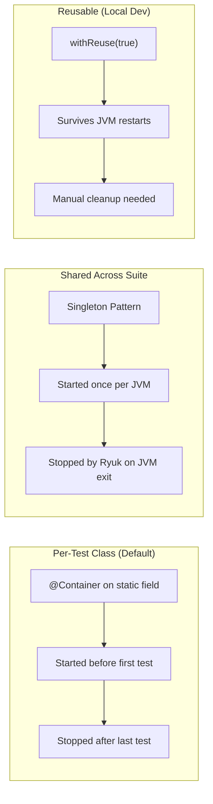

# Testcontainers Setup

> **Document Status:** Living Document · **Last Updated:** 2026-07-10 · **Owner:** Platform Engineering

## 1. Overview

EventRelay uses **Testcontainers** to run integration tests against real infrastructure — PostgreSQL, Redis, and AWS SQS (via LocalStack) — spun up as ephemeral Docker containers. This eliminates "works on my machine" issues and ensures CI environments mirror local development exactly.

> [!IMPORTANT]
> Testcontainers requires a **Docker-compatible runtime** (Docker Desktop, Colima, Rancher Desktop, or Podman). All containers are started automatically when tests run — no manual `docker-compose up` required.

---

## 2. Architecture

```mermaid
graph TB
    subgraph "Test JVM"
        TC["Testcontainers Library"]
        JU["JUnit 5 Extension"]
        SB["Spring Boot Test Context"]
        TS["Test Suite"]
    end

    subgraph "Docker Engine"
        PG["PostgreSQL 16<br/>Container"]
        RD["Redis 7<br/>Container"]
        LS["LocalStack 3.4<br/>Container (SQS)"]
        RR["Ryuk Container<br/>(Cleanup)"]
    end

    JU -->|Lifecycle| TC
    TC -->|Start/Stop| PG
    TC -->|Start/Stop| RD
    TC -->|Start/Stop| LS
    TC -->|Manages| RR
    SB -->|@DynamicPropertySource| TC
    TS --> SB
    RR -->|"Removes containers<br/>after JVM exit"| PG
    RR -->|"Removes containers<br/>after JVM exit"| RD
    RR -->|"Removes containers<br/>after JVM exit"| LS
```

---

## 3. Dependencies

### 3.1 Maven Configuration

```xml
<properties>
    <testcontainers.version>1.19.7</testcontainers.version>
    <localstack.version>1.19.7</localstack.version>
</properties>

<dependencyManagement>
    <dependencies>
        <dependency>
            <groupId>org.testcontainers</groupId>
            <artifactId>testcontainers-bom</artifactId>
            <version>${testcontainers.version}</version>
            <type>pom</type>
            <scope>import</scope>
        </dependency>
    </dependencies>
</dependencyManagement>

<dependencies>
    <!-- Testcontainers Core -->
    <dependency>
        <groupId>org.testcontainers</groupId>
        <artifactId>testcontainers</artifactId>
        <scope>test</scope>
    </dependency>

    <!-- JUnit 5 Integration -->
    <dependency>
        <groupId>org.testcontainers</groupId>
        <artifactId>junit-jupiter</artifactId>
        <scope>test</scope>
    </dependency>

    <!-- PostgreSQL Module -->
    <dependency>
        <groupId>org.testcontainers</groupId>
        <artifactId>postgresql</artifactId>
        <scope>test</scope>
    </dependency>

    <!-- LocalStack Module (for SQS) -->
    <dependency>
        <groupId>org.testcontainers</groupId>
        <artifactId>localstack</artifactId>
        <scope>test</scope>
    </dependency>

    <!-- Spring Boot Testcontainers Support (auto @ServiceConnection) -->
    <dependency>
        <groupId>org.springframework.boot</groupId>
        <artifactId>spring-boot-testcontainers</artifactId>
        <scope>test</scope>
    </dependency>
</dependencies>
```

---

## 4. Container Definitions

### 4.1 PostgreSQL Container

```java
/**
 * PostgreSQL 16 container pre-configured for EventRelay integration tests.
 * Uses the official postgres:16-alpine image for fast startup (~3s).
 *
 * Features:
 * - Runs Flyway migrations on startup via Spring Boot auto-config
 * - Uses @ServiceConnection for zero-config datasource binding
 * - Supports container reuse across test runs
 */
@ServiceConnection
static PostgreSQLContainer<?> postgres = new PostgreSQLContainer<>(
        DockerImageName.parse("postgres:16-alpine"))
    .withDatabaseName("eventrelay_test")
    .withUsername("eventrelay")
    .withPassword("eventrelay_test_pass")
    .withInitScript("db/init-test-schema.sql") // Optional: pre-migration setup
    .withCommand(
        "postgres",
        "-c", "max_connections=50",
        "-c", "shared_buffers=128MB",
        "-c", "log_statement=all"         // Log all SQL for debugging
    )
    .withReuse(true)
    .withLabel("eventrelay.test", "postgresql");
```

### 4.2 Redis Container

```java
/**
 * Redis 7 container for rate limiting and deduplication cache tests.
 * Spring Boot's @ServiceConnection auto-configures RedisConnectionFactory.
 */
@ServiceConnection
static GenericContainer<?> redis = new GenericContainer<>(
        DockerImageName.parse("redis:7-alpine"))
    .withExposedPorts(6379)
    .withCommand(
        "redis-server",
        "--maxmemory", "64mb",
        "--maxmemory-policy", "allkeys-lru",
        "--save", ""  // Disable persistence for test speed
    )
    .waitingFor(Wait.forListeningPort()
        .withStartupTimeout(Duration.ofSeconds(30)))
    .withReuse(true)
    .withLabel("eventrelay.test", "redis");
```

### 4.3 LocalStack Container (SQS)

```java
/**
 * LocalStack container providing SQS emulation for message queue tests.
 * Not auto-configurable via @ServiceConnection — requires @DynamicPropertySource.
 */
static LocalStackContainer localstack = new LocalStackContainer(
        DockerImageName.parse("localstack/localstack:3.4"))
    .withServices(LocalStackContainer.Service.SQS)
    .withEnv("DEFAULT_REGION", "us-east-1")
    .withEnv("EAGER_SERVICE_LOADING", "1") // Pre-initialize SQS on startup
    .waitingFor(Wait.forListeningPort()
        .withStartupTimeout(Duration.ofSeconds(60)))
    .withReuse(true)
    .withLabel("eventrelay.test", "localstack");
```

### 4.4 Container Startup Times

| Container | Image | Startup Time | Pull Size |
|---|---|---|---|
| PostgreSQL 16 | `postgres:16-alpine` | ~3s (cached) | ~85 MB |
| Redis 7 | `redis:7-alpine` | ~1s (cached) | ~15 MB |
| LocalStack 3.4 | `localstack/localstack:3.4` | ~8s (cached) | ~650 MB |
| Ryuk (cleanup) | `testcontainers/ryuk` | ~1s (auto) | ~12 MB |
| **Total** | — | **~13s first run** | ~762 MB |

---

## 5. Container Lifecycle Management

### 5.1 Lifecycle Strategies



### 5.2 Singleton Container Pattern (Recommended for CI)

```java
/**
 * Singleton containers shared across ALL integration test classes.
 * Starts containers once and reuses them for the entire test suite.
 * Reduces total integration test time by ~60%.
 */
public abstract class SharedContainerBaseTest {

    static final PostgreSQLContainer<?> POSTGRES;
    static final GenericContainer<?> REDIS;
    static final LocalStackContainer LOCALSTACK;

    static {
        POSTGRES = new PostgreSQLContainer<>(DockerImageName.parse("postgres:16-alpine"))
            .withDatabaseName("eventrelay_test")
            .withUsername("eventrelay")
            .withPassword("test");

        REDIS = new GenericContainer<>(DockerImageName.parse("redis:7-alpine"))
            .withExposedPorts(6379);

        LOCALSTACK = new LocalStackContainer(DockerImageName.parse("localstack/localstack:3.4"))
            .withServices(LocalStackContainer.Service.SQS);

        // Start all containers in parallel
        Startables.deepStart(POSTGRES, REDIS, LOCALSTACK).join();
    }

    @DynamicPropertySource
    static void configureProperties(DynamicPropertyRegistry registry) {
        // PostgreSQL
        registry.add("spring.datasource.url", POSTGRES::getJdbcUrl);
        registry.add("spring.datasource.username", POSTGRES::getUsername);
        registry.add("spring.datasource.password", POSTGRES::getPassword);

        // Redis
        registry.add("spring.data.redis.host", REDIS::getHost);
        registry.add("spring.data.redis.port", () -> REDIS.getMappedPort(6379));

        // SQS (LocalStack)
        registry.add("aws.sqs.endpoint",
            () -> LOCALSTACK.getEndpointOverride(LocalStackContainer.Service.SQS).toString());
        registry.add("aws.sqs.region", LOCALSTACK::getRegion);
        registry.add("aws.sqs.access-key", LOCALSTACK::getAccessKey);
        registry.add("aws.sqs.secret-key", LOCALSTACK::getSecretKey);
    }
}
```

### 5.3 Container Reuse for Local Development

Add to `~/.testcontainers.properties`:

```properties
# Enable container reuse — containers survive across test runs
testcontainers.reuse.enable=true
```

> [!TIP]
> Container reuse cuts local test iteration time from ~13s (cold start) to ~0s (warm). **Disable reuse in CI** — CI environments should always start fresh to prevent state leaks.

### 5.4 Parallel Container Startup

```java
// Start all containers simultaneously — saves ~60% startup time
static {
    Stream.of(POSTGRES, REDIS, LOCALSTACK)
        .parallel()
        .forEach(GenericContainer::start);
}

// Or use the Testcontainers utility:
Startables.deepStart(POSTGRES, REDIS, LOCALSTACK).join();
```

---

## 6. Spring Boot Integration

### 6.1 `@ServiceConnection` (Spring Boot 3.1+)

Spring Boot 3.1+ supports `@ServiceConnection`, which automatically configures connection properties:

```java
@SpringBootTest
@Testcontainers
class EventServiceIntegrationTest {

    @Container
    @ServiceConnection
    static PostgreSQLContainer<?> postgres = new PostgreSQLContainer<>("postgres:16-alpine");

    @Container
    @ServiceConnection
    static GenericContainer<?> redis = new GenericContainer<>("redis:7-alpine")
        .withExposedPorts(6379);

    // No @DynamicPropertySource needed for PostgreSQL and Redis!
    // Spring Boot auto-detects and configures:
    //   - spring.datasource.url
    //   - spring.datasource.username / password
    //   - spring.data.redis.host / port
}
```

### 6.2 `@DynamicPropertySource` (For non-auto-configured services)

```java
@DynamicPropertySource
static void configureSqs(DynamicPropertyRegistry registry) {
    registry.add("aws.sqs.endpoint",
        () -> localstack.getEndpointOverride(SQS).toString());
    registry.add("aws.sqs.region", localstack::getRegion);
    registry.add("aws.sqs.access-key", localstack::getAccessKey);
    registry.add("aws.sqs.secret-key", localstack::getSecretKey);
}
```

### 6.3 Spring Boot `TestConfiguration` for SQS

```java
@TestConfiguration
public class TestSqsConfiguration {

    @Bean
    public SqsClient sqsClient(
            @Value("${aws.sqs.endpoint}") String endpoint,
            @Value("${aws.sqs.region}") String region,
            @Value("${aws.sqs.access-key}") String accessKey,
            @Value("${aws.sqs.secret-key}") String secretKey) {

        return SqsClient.builder()
            .endpointOverride(URI.create(endpoint))
            .region(Region.of(region))
            .credentialsProvider(StaticCredentialsProvider.create(
                AwsBasicCredentials.create(accessKey, secretKey)))
            .build();
    }

    @Bean
    public SqsQueueInitializer sqsQueueInitializer(SqsClient sqsClient) {
        return new SqsQueueInitializer(sqsClient);
    }
}

/**
 * Initializes SQS queues in LocalStack on application startup.
 */
@Component
@Profile("test")
public class SqsQueueInitializer implements ApplicationRunner {

    private final SqsClient sqsClient;

    @Override
    public void run(ApplicationArguments args) {
        createQueue("eventrelay-events-test");
        createQueue("eventrelay-dlq-test");
        createQueue("eventrelay-retry-test");
    }

    private void createQueue(String queueName) {
        try {
            sqsClient.createQueue(CreateQueueRequest.builder()
                .queueName(queueName)
                .attributes(Map.of(
                    QueueAttributeName.VISIBILITY_TIMEOUT, "30",
                    QueueAttributeName.MESSAGE_RETENTION_PERIOD, "3600"
                ))
                .build());
        } catch (QueueNameExistsException e) {
            // Queue already exists (reusable containers)
        }
    }
}
```

---

## 7. Test Data Initialization

### 7.1 Flyway Migrations (Automatic)

Spring Boot runs Flyway migrations automatically when the PostgreSQL container starts:

```yaml
# application-test.yml
spring:
  flyway:
    enabled: true
    locations: classpath:db/migration
    clean-disabled: false
    # Optional: test-only migrations
    # locations: classpath:db/migration,classpath:db/testmigration
```

### 7.2 Per-Test Data Setup

```java
@SpringBootTest
@Testcontainers
class MyIntegrationTest extends SharedContainerBaseTest {

    @Autowired
    private JdbcTemplate jdbcTemplate;

    @BeforeEach
    void seedTestData() {
        // Clean slate
        jdbcTemplate.execute("TRUNCATE TABLE delivery_attempts, events, outbox CASCADE");

        // Seed baseline data
        jdbcTemplate.update("""
            INSERT INTO tenants (id, name, api_key, rate_limit_rps, active)
            VALUES ('tenant_test', 'Test', 'apikey_test', 100, true)
            ON CONFLICT DO NOTHING
            """);
    }

    @AfterEach
    void verifyNoResourceLeaks() {
        // Assert no orphaned outbox entries
        Integer orphaned = jdbcTemplate.queryForObject(
            "SELECT COUNT(*) FROM outbox WHERE processed_at IS NULL AND created_at < NOW() - INTERVAL '1 minute'",
            Integer.class);
        assertThat(orphaned).isZero();
    }
}
```

### 7.3 Redis Data Initialization

```java
@BeforeEach
void resetRedis(@Autowired StringRedisTemplate redisTemplate) {
    Objects.requireNonNull(redisTemplate.getConnectionFactory())
        .getConnection()
        .serverCommands()
        .flushAll();
}
```

---

## 8. Custom Container Configurations

### 8.1 PostgreSQL with Extensions

```java
static PostgreSQLContainer<?> postgres = new PostgreSQLContainer<>("postgres:16-alpine")
    .withDatabaseName("eventrelay_test")
    .withUsername("eventrelay")
    .withPassword("test")
    .withInitScript("db/init-extensions.sql");
```

```sql
-- src/test/resources/db/init-extensions.sql
CREATE EXTENSION IF NOT EXISTS "uuid-ossp";
CREATE EXTENSION IF NOT EXISTS "pg_trgm";
```

### 8.2 PostgreSQL with Custom Configuration

```java
static PostgreSQLContainer<?> postgres = new PostgreSQLContainer<>("postgres:16-alpine")
    .withDatabaseName("eventrelay_test")
    .withCommand(
        "postgres",
        "-c", "max_connections=50",
        "-c", "shared_buffers=128MB",
        "-c", "work_mem=16MB",
        "-c", "log_min_duration_statement=100",  // Log slow queries > 100ms
        "-c", "log_statement=all",
        "-c", "synchronous_commit=off"            // Faster tests (skip fsync)
    );
```

### 8.3 Redis with Custom Configuration

```java
static GenericContainer<?> redis = new GenericContainer<>("redis:7-alpine")
    .withExposedPorts(6379)
    .withCommand(
        "redis-server",
        "--maxmemory", "64mb",
        "--maxmemory-policy", "allkeys-lru",
        "--save", "",                  // Disable RDB persistence
        "--appendonly", "no",          // Disable AOF persistence
        "--loglevel", "warning"
    )
    .withTmpFs(Map.of("/data", "rw,size=64m")); // tmpfs for speed
```

### 8.4 LocalStack with SQS + Dead Letter Queue

```java
static LocalStackContainer localstack = new LocalStackContainer(
        DockerImageName.parse("localstack/localstack:3.4"))
    .withServices(LocalStackContainer.Service.SQS)
    .withEnv("DEFAULT_REGION", "us-east-1")
    .withEnv("SQS_DELAY_RECENTLY_DELETED", "0") // Allow instant re-creation
    .withStartupTimeout(Duration.ofSeconds(120));
```

---

## 9. Testcontainers in CI (GitHub Actions)

### 9.1 GitHub Actions Workflow

```yaml
name: Integration Tests

on:
  push:
    branches: [main, develop]
  pull_request:
    branches: [main]

jobs:
  integration-tests:
    runs-on: ubuntu-latest

    services:
      # No services needed — Testcontainers manages everything

    steps:
      - name: Checkout
        uses: actions/checkout@v4

      - name: Set up JDK 17
        uses: actions/setup-java@v4
        with:
          distribution: 'temurin'
          java-version: '17'
          cache: 'maven'

      - name: Cache Docker images
        uses: ScribeMD/docker-cache@0.5.0
        with:
          key: docker-${{ runner.os }}-${{ hashFiles('**/pom.xml') }}

      - name: Pre-pull Docker images
        run: |
          docker pull postgres:16-alpine &
          docker pull redis:7-alpine &
          docker pull localstack/localstack:3.4 &
          wait

      - name: Run Integration Tests
        run: |
          mvn verify \
            -pl eventrelay-app \
            -Dtest.containers.reuse=false \
            -Dspring.profiles.active=test \
            -Dfailsafe.rerunFailingTestsCount=1
        env:
          TESTCONTAINERS_RYUK_DISABLED: false
          DOCKER_HOST: unix:///var/run/docker.sock

      - name: Upload Test Reports
        if: always()
        uses: actions/upload-artifact@v4
        with:
          name: integration-test-reports
          path: '**/target/failsafe-reports/'
```

### 9.2 CI-Specific Testcontainers Configuration

```properties
# src/test/resources/testcontainers.properties
# Disable reuse in CI (always start fresh)
testcontainers.reuse.enable=false

# Use Ryuk for container cleanup
ryuk.container.privileged=true

# Increase startup timeouts for CI (slower machines)
startup.timeout=120
```

### 9.3 Docker-in-Docker Considerations

| CI Environment | Docker Support | Notes |
|---|---|---|
| **GitHub Actions (ubuntu)** | ✅ Native | Docker pre-installed, no extra config |
| **GitHub Actions (windows)** | ⚠️ Limited | Use WSL2 or skip Testcontainers tests |
| **GitLab CI** | ✅ DinD service | Add `docker:dind` service |
| **Jenkins** | ✅ Docker socket | Mount `/var/run/docker.sock` |
| **AWS CodeBuild** | ✅ Privileged mode | Set `privilegedMode: true` |

---

## 10. Troubleshooting

### 10.1 Common Issues

| Issue | Cause | Solution |
|---|---|---|
| `ContainerLaunchException` | Docker not running | Start Docker Desktop / daemon |
| `Ryuk failed to start` | Docker socket not accessible | Check `DOCKER_HOST` env var |
| Port conflict | Container port already bound | Use `withExposedPorts()` (random ports) |
| Slow container startup | First image pull | Pre-pull images in CI; use `withReuse(true)` locally |
| Container stops unexpectedly | OOM kill | Increase Docker memory limit |
| Flaky tests after reuse | State leakage | Clean data in `@BeforeEach`; use `flushAll()` for Redis |

### 10.2 Debugging Container Issues

```java
// Enable container logs
@Container
static PostgreSQLContainer<?> postgres = new PostgreSQLContainer<>("postgres:16-alpine")
    .withLogConsumer(new Slf4jLogConsumer(LoggerFactory.getLogger("tc.postgres")));
```

```java
// Inspect running container
@Test
void debugContainer() {
    System.out.println("PostgreSQL URL: " + postgres.getJdbcUrl());
    System.out.println("PostgreSQL port: " + postgres.getMappedPort(5432));
    System.out.println("Redis port: " + redis.getMappedPort(6379));
    System.out.println("LocalStack SQS: " + localstack.getEndpointOverride(SQS));
}
```

---

## 11. Performance Optimization

| Optimization | Impact | How |
|---|---|---|
| **Parallel container startup** | -60% startup | `Startables.deepStart()` |
| **Container reuse** | -100% startup (warm) | `.withReuse(true)` + `testcontainers.reuse.enable=true` |
| **Alpine images** | -50% pull time | `postgres:16-alpine`, `redis:7-alpine` |
| **tmpfs for Redis** | -20% Redis ops | `.withTmpFs(Map.of("/data", "rw"))` |
| **Disable PostgreSQL fsync** | -30% write ops | `synchronous_commit=off` |
| **Pre-pull in CI** | -30s first run | `docker pull` in separate CI step |
| **Singleton containers** | -80% across suite | Static initializer pattern |

> [!TIP]
> Combine **singleton containers** + **parallel startup** + **Alpine images** for optimal CI performance. A full integration test suite with 50+ tests should complete in under 2 minutes.

---

## 12. Related Documents

| Document | Relationship |
|---|---|
| [Integration Testing](./Integration_Testing.md) | Uses Testcontainers infrastructure |
| [CI Test Pipeline](./CI_Test_Pipeline.md) | Runs Testcontainers in GitHub Actions |
| [Chaos Testing](./Chaos_Testing.md) | Uses Toxiproxy containers |
| [Failure Injection](./Failure_Injection.md) | WireMock containers |
