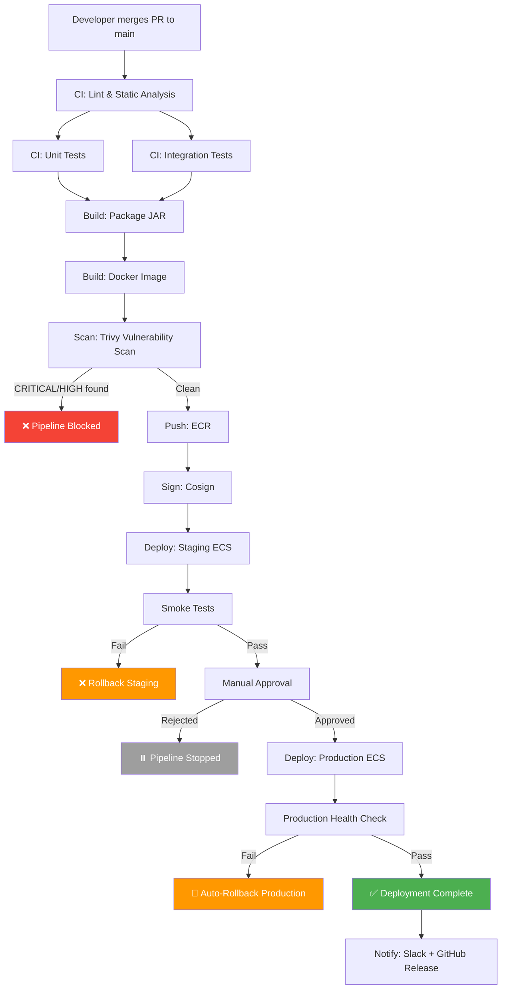
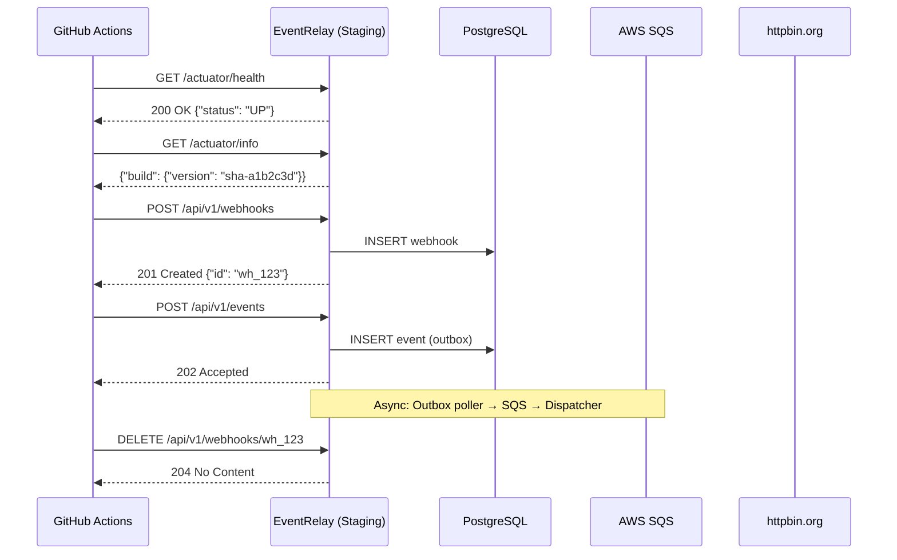

# Deployment Pipeline

## Overview

EventRelay's deployment pipeline orchestrates the full journey from code merge to production deployment. The pipeline enforces a strict progression: **test → build → scan → push → deploy staging → smoke test → manual approval → deploy production**. Every stage acts as a quality gate — a failure at any point halts the pipeline and triggers notifications.

> [!IMPORTANT]
> Production deployments require **manual approval** via GitHub Environments. This is a deliberate gate to prevent accidental or untested code from reaching production, even if all automated checks pass.

---

## Pipeline Overview



---

## Stage Breakdown

### Stage Timing

| Stage | Typical Duration | Timeout | Parallelizable |
|---|---|---|---|
| Lint & Static Analysis | 1-2 min | 10 min | Yes (with tests) |
| Unit Tests | 2-4 min | 15 min | Yes (with lint) |
| Integration Tests | 5-10 min | 25 min | Yes (with unit tests) |
| Build JAR | 1-2 min | 10 min | No (needs tests) |
| Docker Build | 30s-4 min | 10 min | No (needs JAR) |
| Trivy Scan | 1-2 min | 10 min | No (needs image) |
| Push to ECR | 30s-2 min | 5 min | No (needs scan) |
| Deploy Staging | 3-5 min | 15 min | No (needs push) |
| Smoke Tests | 1-2 min | 10 min | No (needs staging) |
| Manual Approval | 0-∞ | 72 hours | — |
| Deploy Production | 3-5 min | 20 min | No (needs approval) |
| **Total (automated)** | **~15-30 min** | — | — |

---

## Complete Pipeline Workflow

```yaml
# .github/workflows/pipeline.yml
name: EventRelay Deployment Pipeline

on:
  push:
    branches: [main]

concurrency:
  group: pipeline-main
  cancel-in-progress: false

permissions:
  id-token: write
  contents: read
  checks: write
  security-events: write

env:
  AWS_REGION: us-east-1
  ECR_REPOSITORY: eventrelay
  ECS_CLUSTER: eventrelay-cluster

jobs:
  # ═══════════════════════════════════════════════
  # STAGE 1: Test
  # ═══════════════════════════════════════════════
  lint:
    name: "🔍 Lint & Static Analysis"
    runs-on: ubuntu-latest
    timeout-minutes: 10
    steps:
      - uses: actions/checkout@v4
      - uses: actions/setup-java@v4
        with: { java-version: '17', distribution: 'temurin' }
      - uses: actions/cache@v4
        with:
          path: ~/.m2/repository
          key: maven-${{ runner.os }}-${{ hashFiles('**/pom.xml') }}
      - run: ./mvnw spotless:check checkstyle:check spotbugs:check -B -q

  unit-tests:
    name: "🧪 Unit Tests"
    runs-on: ubuntu-latest
    timeout-minutes: 15
    steps:
      - uses: actions/checkout@v4
      - uses: actions/setup-java@v4
        with: { java-version: '17', distribution: 'temurin' }
      - uses: actions/cache@v4
        with:
          path: ~/.m2/repository
          key: maven-${{ runner.os }}-${{ hashFiles('**/pom.xml') }}
      - run: ./mvnw test -B -Dgroups=unit
      - uses: dorny/test-reporter@v1
        if: always()
        with:
          name: Unit Test Results
          path: '**/target/surefire-reports/TEST-*.xml'
          reporter: java-junit

  integration-tests:
    name: "🔗 Integration Tests"
    runs-on: ubuntu-latest
    timeout-minutes: 25
    services:
      postgres:
        image: postgres:15-alpine
        env:
          POSTGRES_DB: eventrelay_test
          POSTGRES_USER: eventrelay
          POSTGRES_PASSWORD: testpassword
        ports: ['5432:5432']
        options: --health-cmd="pg_isready -U eventrelay" --health-interval=10s --health-timeout=5s --health-retries=5
      redis:
        image: redis:7-alpine
        ports: ['6379:6379']
        options: --health-cmd="redis-cli ping" --health-interval=10s --health-timeout=5s --health-retries=5
    steps:
      - uses: actions/checkout@v4
      - uses: actions/setup-java@v4
        with: { java-version: '17', distribution: 'temurin' }
      - uses: actions/cache@v4
        with:
          path: ~/.m2/repository
          key: maven-${{ runner.os }}-${{ hashFiles('**/pom.xml') }}
      - run: ./mvnw verify -B -Dgroups=integration -DskipUnitTests=true
        env:
          SPRING_DATASOURCE_URL: jdbc:postgresql://localhost:5432/eventrelay_test
          SPRING_DATASOURCE_USERNAME: eventrelay
          SPRING_DATASOURCE_PASSWORD: testpassword
          SPRING_REDIS_HOST: localhost

  # ═══════════════════════════════════════════════
  # STAGE 2: Build & Scan
  # ═══════════════════════════════════════════════
  build-and-push:
    name: "🐳 Build, Scan & Push"
    runs-on: ubuntu-latest
    timeout-minutes: 20
    needs: [lint, unit-tests, integration-tests]
    outputs:
      image_uri: ${{ steps.output.outputs.image_uri }}
      image_tag: ${{ steps.meta.outputs.version }}
    steps:
      - uses: actions/checkout@v4

      - name: Configure AWS credentials
        uses: aws-actions/configure-aws-credentials@v4
        with:
          role-to-assume: ${{ secrets.AWS_DEPLOY_ROLE_ARN }}
          aws-region: ${{ env.AWS_REGION }}

      - name: Login to ECR
        id: ecr-login
        uses: aws-actions/amazon-ecr-login@v2

      - name: Extract metadata
        id: meta
        run: |
          SHA_SHORT=$(git rev-parse --short=7 HEAD)
          echo "version=sha-${SHA_SHORT}" >> $GITHUB_OUTPUT
          echo "registry=${{ steps.ecr-login.outputs.registry }}" >> $GITHUB_OUTPUT

      - uses: docker/setup-buildx-action@v3

      - name: Build for scanning
        uses: docker/build-push-action@v5
        with:
          context: .
          load: true
          tags: eventrelay:scan
          cache-from: type=gha
          build-args: APP_VERSION=${{ steps.meta.outputs.version }}

      - name: Trivy scan
        uses: aquasecurity/trivy-action@master
        with:
          image-ref: eventrelay:scan
          severity: 'CRITICAL,HIGH'
          exit-code: '1'
          ignore-unfixed: true
          format: sarif
          output: trivy-results.sarif

      - name: Upload SARIF
        uses: github/codeql-action/upload-sarif@v3
        if: always()
        with:
          sarif_file: trivy-results.sarif

      - name: Push to ECR
        uses: docker/build-push-action@v5
        with:
          context: .
          push: true
          tags: |
            ${{ steps.meta.outputs.registry }}/${{ env.ECR_REPOSITORY }}:${{ steps.meta.outputs.version }}
            ${{ steps.meta.outputs.registry }}/${{ env.ECR_REPOSITORY }}:latest
          cache-from: type=gha
          cache-to: type=gha,mode=max
          build-args: APP_VERSION=${{ steps.meta.outputs.version }}

      - name: Set output
        id: output
        run: |
          echo "image_uri=${{ steps.meta.outputs.registry }}/${{ env.ECR_REPOSITORY }}:${{ steps.meta.outputs.version }}" >> $GITHUB_OUTPUT

  # ═══════════════════════════════════════════════
  # STAGE 3: Deploy to Staging
  # ═══════════════════════════════════════════════
  deploy-staging:
    name: "🚀 Deploy to Staging"
    runs-on: ubuntu-latest
    timeout-minutes: 15
    needs: [build-and-push]
    environment:
      name: staging
      url: https://staging.eventrelay.example.com
    steps:
      - uses: actions/checkout@v4

      - name: Configure AWS credentials
        uses: aws-actions/configure-aws-credentials@v4
        with:
          role-to-assume: ${{ secrets.AWS_DEPLOY_ROLE_ARN }}
          aws-region: ${{ env.AWS_REGION }}

      - name: Update ECS task definition
        id: task-def
        uses: aws-actions/amazon-ecs-render-task-definition@v1
        with:
          task-definition: deploy/ecs/task-definition-staging.json
          container-name: eventrelay
          image: ${{ needs.build-and-push.outputs.image_uri }}

      - name: Deploy to ECS
        uses: aws-actions/amazon-ecs-deploy-task-definition@v1
        with:
          task-definition: ${{ steps.task-def.outputs.task-definition }}
          service: eventrelay-staging
          cluster: ${{ env.ECS_CLUSTER }}
          wait-for-service-stability: true

  # ═══════════════════════════════════════════════
  # STAGE 4: Smoke Tests
  # ═══════════════════════════════════════════════
  smoke-tests:
    name: "🔥 Smoke Tests"
    runs-on: ubuntu-latest
    timeout-minutes: 10
    needs: [deploy-staging]
    steps:
      - uses: actions/checkout@v4

      - name: Wait for service readiness
        run: sleep 30

      - name: Health check
        run: |
          STATUS=$(curl -s -o /dev/null -w "%{http_code}" \
            --retry 5 --retry-delay 10 --retry-all-errors \
            https://staging.eventrelay.example.com/actuator/health)
          if [ "$STATUS" != "200" ]; then
            echo "::error::Health check failed (HTTP $STATUS)"
            exit 1
          fi
          echo "✅ Health check passed"

      - name: API version check
        run: |
          VERSION=$(curl -s https://staging.eventrelay.example.com/actuator/info \
            | jq -r '.build.version // "unknown"')
          echo "Deployed version: $VERSION"

      - name: Webhook registration test
        run: |
          RESPONSE=$(curl -s -w "\n%{http_code}" -X POST \
            https://staging.eventrelay.example.com/api/v1/webhooks \
            -H "Content-Type: application/json" \
            -H "Authorization: Bearer ${{ secrets.STAGING_API_KEY }}" \
            -d '{
              "url": "https://httpbin.org/post",
              "events": ["test.smoke"],
              "description": "CI smoke test webhook"
            }')
          HTTP_CODE=$(echo "$RESPONSE" | tail -1)
          BODY=$(echo "$RESPONSE" | sed '$d')

          if [ "$HTTP_CODE" != "201" ] && [ "$HTTP_CODE" != "200" ]; then
            echo "::error::Webhook registration failed (HTTP $HTTP_CODE): $BODY"
            exit 1
          fi

          WEBHOOK_ID=$(echo "$BODY" | jq -r '.id')
          echo "✅ Webhook registered: $WEBHOOK_ID"
          echo "webhook_id=$WEBHOOK_ID" >> $GITHUB_ENV

      - name: Event delivery test
        run: |
          curl -s -f -X POST \
            https://staging.eventrelay.example.com/api/v1/events \
            -H "Content-Type: application/json" \
            -H "Authorization: Bearer ${{ secrets.STAGING_API_KEY }}" \
            -d '{
              "type": "test.smoke",
              "payload": {"smoke": true, "timestamp": "'$(date -u +%Y-%m-%dT%H:%M:%SZ)'"}
            }'
          echo "✅ Event published"

      - name: Cleanup smoke test webhook
        if: always()
        run: |
          if [ -n "${{ env.webhook_id }}" ]; then
            curl -s -X DELETE \
              "https://staging.eventrelay.example.com/api/v1/webhooks/${{ env.webhook_id }}" \
              -H "Authorization: Bearer ${{ secrets.STAGING_API_KEY }}"
            echo "🧹 Cleaned up smoke test webhook"
          fi

  # ═══════════════════════════════════════════════
  # STAGE 5: Deploy to Production
  # ═══════════════════════════════════════════════
  deploy-production:
    name: "🏭 Deploy to Production"
    runs-on: ubuntu-latest
    timeout-minutes: 20
    needs: [build-and-push, smoke-tests]
    environment:
      name: production
      url: https://api.eventrelay.example.com
    steps:
      - uses: actions/checkout@v4

      - name: Configure AWS credentials
        uses: aws-actions/configure-aws-credentials@v4
        with:
          role-to-assume: ${{ secrets.AWS_DEPLOY_ROLE_ARN }}
          aws-region: ${{ env.AWS_REGION }}

      - name: Update ECS task definition
        id: task-def
        uses: aws-actions/amazon-ecs-render-task-definition@v1
        with:
          task-definition: deploy/ecs/task-definition-production.json
          container-name: eventrelay
          image: ${{ needs.build-and-push.outputs.image_uri }}

      - name: Deploy to ECS
        uses: aws-actions/amazon-ecs-deploy-task-definition@v1
        with:
          task-definition: ${{ steps.task-def.outputs.task-definition }}
          service: eventrelay-production
          cluster: ${{ env.ECS_CLUSTER }}
          wait-for-service-stability: true
          codedeploy-appspec: deploy/codedeploy/appspec.yml
          codedeploy-application: eventrelay-production
          codedeploy-deployment-group: eventrelay-production-dg

      - name: Verify production health
        run: |
          sleep 30
          for i in {1..5}; do
            STATUS=$(curl -s -o /dev/null -w "%{http_code}" \
              https://api.eventrelay.example.com/actuator/health)
            if [ "$STATUS" = "200" ]; then
              echo "✅ Production health check passed (attempt $i)"
              exit 0
            fi
            echo "⏳ Attempt $i: HTTP $STATUS, retrying in 15s..."
            sleep 15
          done
          echo "::error::Production health check failed after 5 attempts"
          exit 1

      - name: Notify deployment success
        if: success()
        uses: slackapi/slack-github-action@v1
        with:
          payload: |
            {
              "blocks": [
                {
                  "type": "section",
                  "text": {
                    "type": "mrkdwn",
                    "text": "✅ *EventRelay deployed to production*\n*Image:* `${{ needs.build-and-push.outputs.image_tag }}`\n*Actor:* ${{ github.actor }}\n<${{ github.server_url }}/${{ github.repository }}/actions/runs/${{ github.run_id }}|View Pipeline>"
                  }
                }
              ]
            }
        env:
          SLACK_WEBHOOK_URL: ${{ secrets.SLACK_WEBHOOK_URL }}

      - name: Notify deployment failure
        if: failure()
        uses: slackapi/slack-github-action@v1
        with:
          payload: |
            {
              "text": "🚨 *EventRelay PRODUCTION deployment FAILED*\n*Image:* `${{ needs.build-and-push.outputs.image_tag }}`\n<${{ github.server_url }}/${{ github.repository }}/actions/runs/${{ github.run_id }}|View Pipeline>"
            }
        env:
          SLACK_WEBHOOK_URL: ${{ secrets.SLACK_WEBHOOK_URL }}
```

---

## Deployment Scripts

### ECS Task Definition Template

```json
{
  "family": "eventrelay-production",
  "networkMode": "awsvpc",
  "requiresCompatibilities": ["FARGATE"],
  "cpu": "1024",
  "memory": "2048",
  "executionRoleArn": "arn:aws:iam::123456789012:role/eventrelay-execution-role",
  "taskRoleArn": "arn:aws:iam::123456789012:role/eventrelay-task-role",
  "containerDefinitions": [
    {
      "name": "eventrelay",
      "image": "PLACEHOLDER_IMAGE_URI",
      "essential": true,
      "portMappings": [
        { "containerPort": 8080, "protocol": "tcp" },
        { "containerPort": 8081, "protocol": "tcp" }
      ],
      "environment": [
        { "name": "SPRING_PROFILES_ACTIVE", "value": "production" },
        { "name": "AWS_REGION", "value": "us-east-1" }
      ],
      "secrets": [
        {
          "name": "SPRING_DATASOURCE_PASSWORD",
          "valueFrom": "arn:aws:secretsmanager:us-east-1:123456789012:secret:eventrelay/db-password"
        },
        {
          "name": "HMAC_SIGNING_KEY",
          "valueFrom": "arn:aws:secretsmanager:us-east-1:123456789012:secret:eventrelay/hmac-key"
        }
      ],
      "healthCheck": {
        "command": ["CMD-SHELL", "curl -f http://localhost:8081/actuator/health/liveness || exit 1"],
        "interval": 30,
        "timeout": 5,
        "retries": 3,
        "startPeriod": 60
      },
      "logConfiguration": {
        "logDriver": "awslogs",
        "options": {
          "awslogs-group": "/ecs/eventrelay-production",
          "awslogs-region": "us-east-1",
          "awslogs-stream-prefix": "eventrelay"
        }
      },
      "stopTimeout": 30,
      "readonlyRootFilesystem": true,
      "mountPoints": [
        {
          "sourceVolume": "tmp",
          "containerPath": "/tmp"
        }
      ]
    }
  ],
  "volumes": [
    {
      "name": "tmp",
      "host": {}
    }
  ]
}
```

---

## Smoke Test Architecture



---

## Pipeline Failure Handling

| Stage | Failure Action | Notification |
|---|---|---|
| Lint | Block pipeline | PR check failure |
| Unit Tests | Block pipeline | PR check failure + test report |
| Integration Tests | Block pipeline | PR check failure + test report |
| Trivy Scan | Block pipeline | SARIF upload to Security tab |
| Deploy Staging | Block pipeline + no auto-rollback | Slack alert |
| Smoke Tests | Block pipeline + investigate | Slack alert |
| Deploy Production | **Auto-rollback** (ECS circuit breaker) | Slack critical alert |

---

## Production Considerations

1. **Approval timeout**: GitHub Environment deployments timeout after 30 days by default. Set a shorter window (e.g., 72 hours) to prevent stale approvals.
2. **Deployment windows**: Consider restricting production deployments to business hours (Mon–Fri, 9 AM–4 PM) via environment protection rules.
3. **Deployment frequency**: Target 1-5 deployments per day. If exceeding this, consider implementing automated canary analysis.
4. **Pipeline observability**: Export pipeline metrics (duration, success rate) to Prometheus/Grafana for tracking DORA metrics (lead time, deployment frequency, failure rate, MTTR).
5. **Immutable infrastructure**: Never SSH into production containers. If debugging is needed, use ECS Exec with audit logging enabled.

---

## Related Documents

- [GitHub_Actions.md](./GitHub_Actions.md) — CI/CD workflow configuration
- [Docker.md](./Docker.md) — Dockerfile and Docker Compose
- [Image_Building.md](./Image_Building.md) — Image tagging and scanning
- [Rollbacks.md](./Rollbacks.md) — Rollback strategy and procedures
- [Blue_Green_Deployment.md](./Blue_Green_Deployment.md) — Blue-green deployment with ECS
