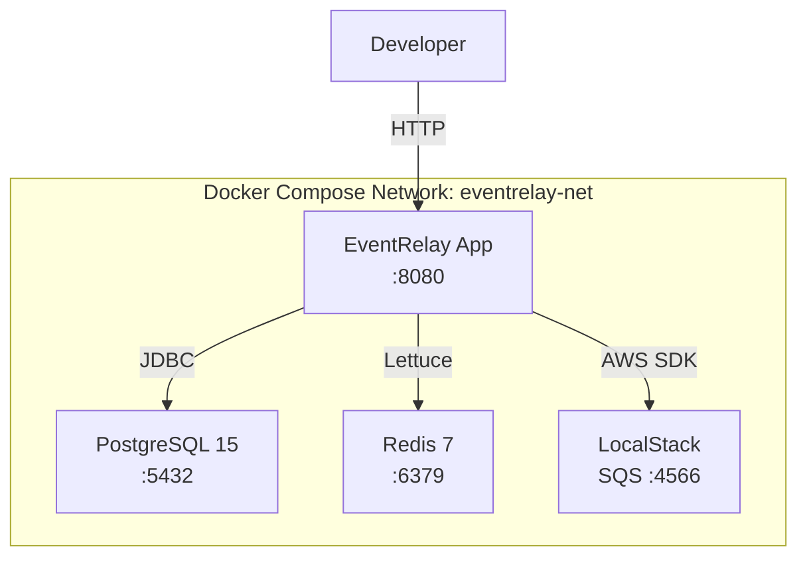

# Docker Configuration

## Overview

EventRelay uses Docker for both **local development** and **production deployment**. This document covers the multi-stage Dockerfile optimized for minimal image size, a Docker Compose stack for local development (PostgreSQL + Redis + LocalStack for SQS), and production-grade health check configuration.

> [!NOTE]
> The production image targets **< 200 MB** compressed size using a multi-stage build with Eclipse Temurin JRE 17 on Alpine Linux.

---

## Architecture — Local Development Stack



---

## Multi-Stage Dockerfile

```dockerfile
# ============================================================
# Stage 1: Build
# ============================================================
FROM eclipse-temurin:17-jdk-alpine AS builder

WORKDIR /build

# Copy dependency descriptors first (maximizes layer caching)
COPY pom.xml mvnw ./
COPY .mvn/ .mvn/

# Download dependencies (cached unless pom.xml changes)
RUN ./mvnw dependency:go-offline -B -q

# Copy source code
COPY src/ src/

# Build the application JAR (skip tests — they run in CI)
RUN ./mvnw package -B -DskipTests -q \
    && mv target/eventrelay-*.jar target/app.jar

# Extract Spring Boot layers for optimized Docker layering
RUN java -Djarmode=layertools -jar target/app.jar extract --destination /extracted

# ============================================================
# Stage 2: Runtime
# ============================================================
FROM eclipse-temurin:17-jre-alpine AS runtime

# Security: run as non-root user
RUN addgroup -S appgroup && adduser -S appuser -G appgroup

# Install curl for health checks, then clean up
RUN apk add --no-cache curl tini

WORKDIR /app

# Copy Spring Boot layers in dependency order (least → most changing)
COPY --from=builder /extracted/dependencies/ ./
COPY --from=builder /extracted/spring-boot-loader/ ./
COPY --from=builder /extracted/snapshot-dependencies/ ./
COPY --from=builder /extracted/application/ ./

# Set ownership
RUN chown -R appuser:appgroup /app

USER appuser

# JVM tuning for containers
ENV JAVA_OPTS="-XX:+UseContainerSupport \
  -XX:MaxRAMPercentage=75.0 \
  -XX:InitialRAMPercentage=50.0 \
  -XX:+UseG1GC \
  -XX:+ExitOnOutOfMemoryError \
  -Djava.security.egd=file:/dev/./urandom"

EXPOSE 8080
EXPOSE 8081

# Health check
HEALTHCHECK --interval=30s --timeout=5s --start-period=45s --retries=3 \
  CMD curl -f http://localhost:8081/actuator/health/liveness || exit 1

# Use tini as init process for proper signal handling
ENTRYPOINT ["tini", "--"]

# Launch with layered Spring Boot
CMD ["sh", "-c", "java $JAVA_OPTS org.springframework.boot.loader.launch.JarLauncher"]
```

### Dockerfile — Layer Optimization

```
┌──────────────────────────────────────────────────┐
│  Layer 1: eclipse-temurin:17-jre-alpine (~95 MB) │  ← Base OS + JRE
├──────────────────────────────────────────────────┤
│  Layer 2: dependencies/          (~40 MB)        │  ← Third-party JARs (rarely changes)
├──────────────────────────────────────────────────┤
│  Layer 3: spring-boot-loader/    (~0.5 MB)       │  ← Spring Boot loader
├──────────────────────────────────────────────────┤
│  Layer 4: snapshot-dependencies/ (~0 MB)         │  ← SNAPSHOT deps (uncommon in prod)
├──────────────────────────────────────────────────┤
│  Layer 5: application/           (~5 MB)         │  ← YOUR code (changes every build)
└──────────────────────────────────────────────────┘
```

> [!TIP]
> By using Spring Boot's layered JAR extraction, only the **application layer (~5 MB)** changes on each deployment. The JRE and dependency layers are cached, reducing push/pull times from ~140 MB to ~5 MB.

---

## .dockerignore

```dockerignore
# Version control
.git
.gitignore

# IDE
.idea/
*.iml
.vscode/
.settings/
.project
.classpath

# Build output (we rebuild inside Docker)
target/
build/
out/

# CI/CD
.github/
.gitlab-ci.yml
Jenkinsfile

# Documentation
docs/
*.md
LICENSE

# Docker (avoid recursive build context)
docker-compose*.yml
Dockerfile*

# OS files
.DS_Store
Thumbs.db

# Local environment
.env
.env.local
*.log

# Test data
src/test/
testcontainers/
```

**Impact**: Reduces build context from ~500 MB (with `.git` and `target/`) to ~15 MB, making `docker build` significantly faster.

---

## Docker Compose — Local Development

```yaml
# docker-compose.yml
version: '3.9'

services:
  # ─────────────────────────────────────────────
  # EventRelay Application
  # ─────────────────────────────────────────────
  app:
    build:
      context: .
      dockerfile: Dockerfile
      target: runtime
    container_name: eventrelay-app
    ports:
      - "8080:8080"   # Application API
      - "8081:8081"   # Management/Actuator
      - "5005:5005"   # Remote debug
    environment:
      SPRING_PROFILES_ACTIVE: local
      SPRING_DATASOURCE_URL: jdbc:postgresql://postgres:5432/eventrelay
      SPRING_DATASOURCE_USERNAME: eventrelay
      SPRING_DATASOURCE_PASSWORD: localdev123
      SPRING_DATA_REDIS_HOST: redis
      SPRING_DATA_REDIS_PORT: 6379
      AWS_SQS_ENDPOINT: http://localstack:4566
      AWS_REGION: us-east-1
      AWS_ACCESS_KEY_ID: test
      AWS_SECRET_ACCESS_KEY: test
      JAVA_OPTS: >-
        -XX:+UseContainerSupport
        -XX:MaxRAMPercentage=75.0
        -agentlib:jdwp=transport=dt_socket,server=y,suspend=n,address=*:5005
    depends_on:
      postgres:
        condition: service_healthy
      redis:
        condition: service_healthy
      localstack:
        condition: service_healthy
    healthcheck:
      test: ["CMD", "curl", "-f", "http://localhost:8081/actuator/health"]
      interval: 15s
      timeout: 5s
      start_period: 60s
      retries: 5
    networks:
      - eventrelay-net
    restart: unless-stopped

  # ─────────────────────────────────────────────
  # PostgreSQL 15
  # ─────────────────────────────────────────────
  postgres:
    image: postgres:15-alpine
    container_name: eventrelay-postgres
    ports:
      - "5432:5432"
    environment:
      POSTGRES_DB: eventrelay
      POSTGRES_USER: eventrelay
      POSTGRES_PASSWORD: localdev123
      POSTGRES_INITDB_ARGS: "--encoding=UTF-8 --lc-collate=en_US.utf8 --lc-ctype=en_US.utf8"
    volumes:
      - postgres-data:/var/lib/postgresql/data
      - ./scripts/init-db.sql:/docker-entrypoint-initdb.d/01-init.sql:ro
    healthcheck:
      test: ["CMD-SHELL", "pg_isready -U eventrelay -d eventrelay"]
      interval: 10s
      timeout: 5s
      retries: 5
    networks:
      - eventrelay-net
    restart: unless-stopped

  # ─────────────────────────────────────────────
  # Redis 7
  # ─────────────────────────────────────────────
  redis:
    image: redis:7-alpine
    container_name: eventrelay-redis
    ports:
      - "6379:6379"
    command: >
      redis-server
        --maxmemory 128mb
        --maxmemory-policy allkeys-lru
        --appendonly yes
    volumes:
      - redis-data:/data
    healthcheck:
      test: ["CMD", "redis-cli", "ping"]
      interval: 10s
      timeout: 5s
      retries: 5
    networks:
      - eventrelay-net
    restart: unless-stopped

  # ─────────────────────────────────────────────
  # LocalStack (SQS emulation)
  # ─────────────────────────────────────────────
  localstack:
    image: localstack/localstack:3.0
    container_name: eventrelay-localstack
    ports:
      - "4566:4566"
    environment:
      SERVICES: sqs
      DEFAULT_REGION: us-east-1
      DOCKER_HOST: unix:///var/run/docker.sock
    volumes:
      - localstack-data:/var/lib/localstack
      - ./scripts/localstack-init.sh:/etc/localstack/init/ready.d/init.sh:ro
    healthcheck:
      test: ["CMD", "curl", "-f", "http://localhost:4566/_localstack/health"]
      interval: 10s
      timeout: 5s
      retries: 5
    networks:
      - eventrelay-net
    restart: unless-stopped

volumes:
  postgres-data:
    driver: local
  redis-data:
    driver: local
  localstack-data:
    driver: local

networks:
  eventrelay-net:
    driver: bridge
```

### LocalStack Init Script

```bash
#!/bin/bash
# scripts/localstack-init.sh
# Creates SQS queues that mimic production AWS resources

echo "Creating SQS queues..."

awslocal sqs create-queue \
  --queue-name eventrelay-events \
  --attributes '{
    "VisibilityTimeout": "60",
    "MessageRetentionPeriod": "1209600",
    "ReceiveMessageWaitTimeSeconds": "20"
  }'

awslocal sqs create-queue \
  --queue-name eventrelay-events-dlq \
  --attributes '{
    "MessageRetentionPeriod": "1209600"
  }'

# Set DLQ redrive policy on the main queue
MAIN_QUEUE_URL=$(awslocal sqs get-queue-url --queue-name eventrelay-events --output text)
DLQ_ARN=$(awslocal sqs get-queue-attributes \
  --queue-url "$(awslocal sqs get-queue-url --queue-name eventrelay-events-dlq --output text)" \
  --attribute-names QueueArn --query 'Attributes.QueueArn' --output text)

awslocal sqs set-queue-attributes \
  --queue-url "$MAIN_QUEUE_URL" \
  --attributes "{\"RedrivePolicy\": \"{\\\"maxReceiveCount\\\": 5, \\\"deadLetterTargetArn\\\": \\\"$DLQ_ARN\\\"}\"}"

echo "SQS queues created successfully."
```

---

## Docker Compose Profiles

```yaml
# docker-compose.override.yml — optional developer overrides
services:
  # Enable pgAdmin for database inspection
  pgadmin:
    image: dpage/pgadmin4:latest
    container_name: eventrelay-pgadmin
    ports:
      - "5050:80"
    environment:
      PGADMIN_DEFAULT_EMAIL: admin@eventrelay.local
      PGADMIN_DEFAULT_PASSWORD: admin
    profiles:
      - debug
    networks:
      - eventrelay-net

  # Redis Commander for cache inspection
  redis-commander:
    image: rediscommander/redis-commander:latest
    container_name: eventrelay-redis-commander
    ports:
      - "8082:8081"
    environment:
      REDIS_HOSTS: local:redis:6379
    profiles:
      - debug
    networks:
      - eventrelay-net
```

Usage:

```bash
# Start core services only
docker compose up -d

# Start with debug tools (pgAdmin, Redis Commander)
docker compose --profile debug up -d

# Rebuild after code changes
docker compose up -d --build app

# View logs
docker compose logs -f app

# Tear down everything (including volumes)
docker compose down -v
```

---

## Health Checks

### Application Health Check (Dockerfile)

```dockerfile
HEALTHCHECK --interval=30s --timeout=5s --start-period=45s --retries=3 \
  CMD curl -f http://localhost:8081/actuator/health/liveness || exit 1
```

| Parameter | Value | Rationale |
|---|---|---|
| `interval` | 30s | Check every 30 seconds |
| `timeout` | 5s | Fail fast on unresponsive app |
| `start-period` | 45s | Spring Boot startup grace period |
| `retries` | 3 | 3 consecutive failures = unhealthy |

### Spring Boot Actuator Configuration

```yaml
# application-local.yml
management:
  server:
    port: 8081  # Separate management port
  endpoints:
    web:
      exposure:
        include: health,info,metrics,prometheus
  endpoint:
    health:
      show-details: always
      probes:
        enabled: true
      group:
        liveness:
          include: livenessState
        readiness:
          include: readinessState, db, redis
```

---

## Environment Variable Configuration

### Required Variables

| Variable | Default | Description |
|---|---|---|
| `SPRING_PROFILES_ACTIVE` | `default` | Active Spring profile (`local`, `staging`, `production`) |
| `SPRING_DATASOURCE_URL` | — | JDBC connection string |
| `SPRING_DATASOURCE_USERNAME` | — | Database username |
| `SPRING_DATASOURCE_PASSWORD` | — | Database password |
| `SPRING_DATA_REDIS_HOST` | `localhost` | Redis hostname |
| `SPRING_DATA_REDIS_PORT` | `6379` | Redis port |
| `AWS_SQS_ENDPOINT` | (AWS default) | SQS endpoint (override for LocalStack) |
| `AWS_REGION` | `us-east-1` | AWS region |

### JVM Tuning Variables

| Variable | Default | Description |
|---|---|---|
| `JAVA_OPTS` | See Dockerfile | JVM flags passed to `java` command |
| `XX:MaxRAMPercentage` | `75.0` | Max heap as % of container memory |
| `XX:InitialRAMPercentage` | `50.0` | Initial heap as % of container memory |

> [!IMPORTANT]
> Always set `-XX:+UseContainerSupport` (default since JDK 10) and `-XX:MaxRAMPercentage` instead of fixed `-Xmx`. This lets the JVM auto-detect the container's memory limit from cgroups.

---

## Image Size Comparison

| Approach | Image Size | Notes |
|---|---|---|
| `eclipse-temurin:17-jdk` (single stage) | ~520 MB | Includes compiler, build tools |
| `eclipse-temurin:17-jre` (multi-stage) | ~210 MB | JRE only |
| `eclipse-temurin:17-jre-alpine` (multi-stage) | ~140 MB | Alpine base + JRE |
| With Spring Boot layers (this setup) | ~140 MB total, **~5 MB delta** | Only app layer changes per deploy |

---

## Production Considerations

1. **Never use `latest` tag in production** — always pin to a specific version tag (git SHA or semver). See [Image_Building.md](./Image_Building.md).
2. **Read-only root filesystem** — In ECS task definitions, set `readonlyRootFilesystem: true` and mount `/tmp` as a tmpfs volume.
3. **Non-root user** — The Dockerfile runs as `appuser` (UID 1000), not root. ECS task definitions should not override this.
4. **Signal handling** — `tini` ensures SIGTERM propagates correctly to the JVM for graceful shutdown.
5. **No secrets in images** — Pass all secrets via environment variables or AWS Secrets Manager, never bake them into the image.
6. **Reproducible builds** — Pin base image digests in production Dockerfiles: `FROM eclipse-temurin:17-jre-alpine@sha256:abc123...`.

---

## Related Documents

- [GitHub_Actions.md](./GitHub_Actions.md) — CI/CD workflow configuration
- [Image_Building.md](./Image_Building.md) — Image tagging and scanning
- [Deployment_Pipeline.md](./Deployment_Pipeline.md) — Full deployment pipeline
