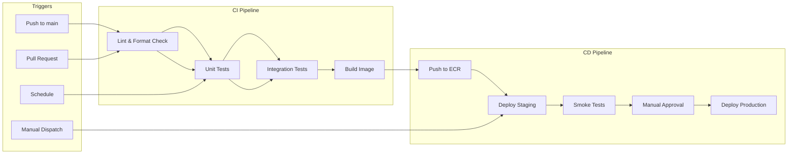

# GitHub Actions CI/CD

## Overview

EventRelay uses **GitHub Actions** as the primary CI/CD platform. This document covers the complete workflow setup — from triggers and job structure to secrets management, caching strategies, and branch protection rules that enforce code quality gates before merging.

> [!NOTE]
> All workflow files live in `.github/workflows/` in the repository root. GitHub automatically discovers and runs them based on their trigger configuration.

---

## Workflow Architecture



---

## Workflow Triggers

| Trigger | Scope | Pipeline | Use Case |
|---|---|---|---|
| `push` to `main` | Full CI + CD | Test → Build → Deploy | Production releases |
| `pull_request` to `main` | CI only | Lint → Test | Code review validation |
| `workflow_dispatch` | Configurable | Deploy to selected env | Manual/emergency deploy |
| `schedule` (cron) | CI only | Full test suite | Nightly regression |

---

## Primary CI Workflow

```yaml
# .github/workflows/ci.yml
name: EventRelay CI

on:
  pull_request:
    branches: [main, 'release/**']
    paths-ignore:
      - '*.md'
      - 'docs/**'
      - '.github/ISSUE_TEMPLATE/**'
  push:
    branches: [main]

# Cancel in-progress runs for the same PR/branch
concurrency:
  group: ci-${{ github.ref }}
  cancel-in-progress: ${{ github.event_name == 'pull_request' }}

permissions:
  contents: read
  checks: write
  pull-requests: write

env:
  JAVA_VERSION: '17'
  JAVA_DISTRIBUTION: 'temurin'
  MAVEN_OPTS: '-Xmx1024m -XX:MaxMetaspaceSize=256m'

jobs:
  # ──────────────────────────────────────────────
  # Job 1: Lint & Static Analysis
  # ──────────────────────────────────────────────
  lint:
    name: Lint & Static Analysis
    runs-on: ubuntu-latest
    timeout-minutes: 10
    steps:
      - name: Checkout code
        uses: actions/checkout@v4

      - name: Set up JDK ${{ env.JAVA_VERSION }}
        uses: actions/setup-java@v4
        with:
          java-version: ${{ env.JAVA_VERSION }}
          distribution: ${{ env.JAVA_DISTRIBUTION }}

      - name: Cache Maven dependencies
        uses: actions/cache@v4
        with:
          path: ~/.m2/repository
          key: maven-${{ runner.os }}-${{ hashFiles('**/pom.xml') }}
          restore-keys: |
            maven-${{ runner.os }}-

      - name: Check code formatting (Spotless)
        run: ./mvnw spotless:check -B -q

      - name: Run Checkstyle
        run: ./mvnw checkstyle:check -B -q

      - name: Run SpotBugs
        run: ./mvnw spotbugs:check -B -q

  # ──────────────────────────────────────────────
  # Job 2: Unit Tests
  # ──────────────────────────────────────────────
  unit-tests:
    name: Unit Tests
    runs-on: ubuntu-latest
    timeout-minutes: 15
    needs: [lint]
    steps:
      - name: Checkout code
        uses: actions/checkout@v4

      - name: Set up JDK ${{ env.JAVA_VERSION }}
        uses: actions/setup-java@v4
        with:
          java-version: ${{ env.JAVA_VERSION }}
          distribution: ${{ env.JAVA_DISTRIBUTION }}

      - name: Cache Maven dependencies
        uses: actions/cache@v4
        with:
          path: ~/.m2/repository
          key: maven-${{ runner.os }}-${{ hashFiles('**/pom.xml') }}
          restore-keys: |
            maven-${{ runner.os }}-

      - name: Run unit tests
        run: ./mvnw test -B -Dgroups=unit -Dmaven.test.failure.ignore=false

      - name: Publish test results
        if: always()
        uses: dorny/test-reporter@v1
        with:
          name: Unit Test Results
          path: '**/target/surefire-reports/TEST-*.xml'
          reporter: java-junit

      - name: Upload coverage to Codecov
        if: always()
        uses: codecov/codecov-action@v4
        with:
          token: ${{ secrets.CODECOV_TOKEN }}
          files: '**/target/site/jacoco/jacoco.xml'
          flags: unit-tests
          fail_ci_if_error: false

  # ──────────────────────────────────────────────
  # Job 3: Integration Tests
  # ──────────────────────────────────────────────
  integration-tests:
    name: Integration Tests
    runs-on: ubuntu-latest
    timeout-minutes: 25
    needs: [lint]
    services:
      postgres:
        image: postgres:15-alpine
        env:
          POSTGRES_DB: eventrelay_test
          POSTGRES_USER: eventrelay
          POSTGRES_PASSWORD: testpassword
        ports:
          - 5432:5432
        options: >-
          --health-cmd="pg_isready -U eventrelay"
          --health-interval=10s
          --health-timeout=5s
          --health-retries=5

      redis:
        image: redis:7-alpine
        ports:
          - 6379:6379
        options: >-
          --health-cmd="redis-cli ping"
          --health-interval=10s
          --health-timeout=5s
          --health-retries=5

    steps:
      - name: Checkout code
        uses: actions/checkout@v4

      - name: Set up JDK ${{ env.JAVA_VERSION }}
        uses: actions/setup-java@v4
        with:
          java-version: ${{ env.JAVA_VERSION }}
          distribution: ${{ env.JAVA_DISTRIBUTION }}

      - name: Cache Maven dependencies
        uses: actions/cache@v4
        with:
          path: ~/.m2/repository
          key: maven-${{ runner.os }}-${{ hashFiles('**/pom.xml') }}
          restore-keys: |
            maven-${{ runner.os }}-

      - name: Run integration tests
        env:
          SPRING_DATASOURCE_URL: jdbc:postgresql://localhost:5432/eventrelay_test
          SPRING_DATASOURCE_USERNAME: eventrelay
          SPRING_DATASOURCE_PASSWORD: testpassword
          SPRING_REDIS_HOST: localhost
          SPRING_REDIS_PORT: 6379
        run: ./mvnw verify -B -Dgroups=integration -DskipUnitTests=true

      - name: Publish test results
        if: always()
        uses: dorny/test-reporter@v1
        with:
          name: Integration Test Results
          path: '**/target/failsafe-reports/TEST-*.xml'
          reporter: java-junit

  # ──────────────────────────────────────────────
  # Job 4: Build Verification
  # ──────────────────────────────────────────────
  build:
    name: Build & Package
    runs-on: ubuntu-latest
    timeout-minutes: 10
    needs: [unit-tests, integration-tests]
    steps:
      - name: Checkout code
        uses: actions/checkout@v4

      - name: Set up JDK ${{ env.JAVA_VERSION }}
        uses: actions/setup-java@v4
        with:
          java-version: ${{ env.JAVA_VERSION }}
          distribution: ${{ env.JAVA_DISTRIBUTION }}

      - name: Cache Maven dependencies
        uses: actions/cache@v4
        with:
          path: ~/.m2/repository
          key: maven-${{ runner.os }}-${{ hashFiles('**/pom.xml') }}
          restore-keys: |
            maven-${{ runner.os }}-

      - name: Build JAR (skip tests — already ran)
        run: ./mvnw package -B -DskipTests

      - name: Upload build artifact
        uses: actions/upload-artifact@v4
        with:
          name: eventrelay-jar
          path: target/eventrelay-*.jar
          retention-days: 5
          if-no-files-found: error
```

---

## CD Workflow (Deploy)

```yaml
# .github/workflows/cd.yml
name: EventRelay CD

on:
  push:
    branches: [main]
  workflow_dispatch:
    inputs:
      environment:
        description: 'Target environment'
        required: true
        default: 'staging'
        type: choice
        options:
          - staging
          - production
      image_tag:
        description: 'Docker image tag to deploy (leave empty for latest)'
        required: false
        type: string

concurrency:
  group: deploy-${{ github.event.inputs.environment || 'staging' }}
  cancel-in-progress: false  # Never cancel in-progress deployments

permissions:
  id-token: write   # For OIDC with AWS
  contents: read

env:
  AWS_REGION: us-east-1
  ECR_REPOSITORY: eventrelay
  ECS_CLUSTER: eventrelay-cluster
  ECS_SERVICE_STAGING: eventrelay-staging
  ECS_SERVICE_PRODUCTION: eventrelay-production

jobs:
  build-and-push:
    name: Build & Push Image
    runs-on: ubuntu-latest
    timeout-minutes: 15
    if: github.event_name == 'push'
    outputs:
      image_tag: ${{ steps.meta.outputs.version }}
      image_uri: ${{ steps.build.outputs.image_uri }}
    steps:
      - name: Checkout code
        uses: actions/checkout@v4

      - name: Configure AWS credentials (OIDC)
        uses: aws-actions/configure-aws-credentials@v4
        with:
          role-to-assume: ${{ secrets.AWS_DEPLOY_ROLE_ARN }}
          aws-region: ${{ env.AWS_REGION }}

      - name: Login to Amazon ECR
        id: ecr-login
        uses: aws-actions/amazon-ecr-login@v2

      - name: Extract metadata
        id: meta
        run: |
          SHA_SHORT=$(git rev-parse --short HEAD)
          echo "version=${SHA_SHORT}" >> $GITHUB_OUTPUT
          echo "full_image=${{ steps.ecr-login.outputs.registry }}/${{ env.ECR_REPOSITORY }}" >> $GITHUB_OUTPUT

      - name: Set up Docker Buildx
        uses: docker/setup-buildx-action@v3

      - name: Build and push image
        id: build
        uses: docker/build-push-action@v5
        with:
          context: .
          push: true
          tags: |
            ${{ steps.meta.outputs.full_image }}:${{ steps.meta.outputs.version }}
            ${{ steps.meta.outputs.full_image }}:latest
          cache-from: type=gha
          cache-to: type=gha,mode=max
          build-args: |
            APP_VERSION=${{ steps.meta.outputs.version }}
            BUILD_DATE=${{ github.event.head_commit.timestamp }}

      - name: Output image URI
        run: |
          IMAGE_URI="${{ steps.meta.outputs.full_image }}:${{ steps.meta.outputs.version }}"
          echo "image_uri=${IMAGE_URI}" >> $GITHUB_OUTPUT
          echo "::notice::Published image ${IMAGE_URI}"

  deploy-staging:
    name: Deploy to Staging
    runs-on: ubuntu-latest
    timeout-minutes: 15
    needs: [build-and-push]
    environment:
      name: staging
      url: https://staging.eventrelay.example.com
    steps:
      - name: Configure AWS credentials
        uses: aws-actions/configure-aws-credentials@v4
        with:
          role-to-assume: ${{ secrets.AWS_DEPLOY_ROLE_ARN }}
          aws-region: ${{ env.AWS_REGION }}

      - name: Deploy to ECS (Staging)
        uses: aws-actions/amazon-ecs-deploy-task-definition@v1
        with:
          task-definition: task-definition-staging.json
          service: ${{ env.ECS_SERVICE_STAGING }}
          cluster: ${{ env.ECS_CLUSTER }}
          wait-for-service-stability: true

      - name: Run smoke tests
        run: |
          echo "Waiting for service to stabilize..."
          sleep 30
          curl --fail --retry 5 --retry-delay 10 \
            https://staging.eventrelay.example.com/actuator/health

  deploy-production:
    name: Deploy to Production
    runs-on: ubuntu-latest
    timeout-minutes: 20
    needs: [deploy-staging]
    environment:
      name: production
      url: https://api.eventrelay.example.com
    steps:
      - name: Configure AWS credentials
        uses: aws-actions/configure-aws-credentials@v4
        with:
          role-to-assume: ${{ secrets.AWS_DEPLOY_ROLE_ARN }}
          aws-region: ${{ env.AWS_REGION }}

      - name: Deploy to ECS (Production)
        uses: aws-actions/amazon-ecs-deploy-task-definition@v1
        with:
          task-definition: task-definition-production.json
          service: ${{ env.ECS_SERVICE_PRODUCTION }}
          cluster: ${{ env.ECS_CLUSTER }}
          wait-for-service-stability: true

      - name: Verify production health
        run: |
          sleep 30
          STATUS=$(curl -s -o /dev/null -w "%{http_code}" \
            https://api.eventrelay.example.com/actuator/health)
          if [ "$STATUS" != "200" ]; then
            echo "::error::Production health check failed (HTTP $STATUS)"
            exit 1
          fi
          echo "::notice::Production deployment verified successfully"
```

---

## Secrets Management

### Required Secrets

| Secret | Scope | Description |
|---|---|---|
| `AWS_DEPLOY_ROLE_ARN` | Repository | IAM role ARN for OIDC-based AWS auth |
| `CODECOV_TOKEN` | Repository | Codecov upload token |
| `SLACK_WEBHOOK_URL` | Repository | Slack notification webhook |
| `SONAR_TOKEN` | Repository | SonarCloud analysis token |

### Environment Secrets

| Secret | Environment | Description |
|---|---|---|
| `DB_PASSWORD` | staging / production | PostgreSQL password |
| `HMAC_SIGNING_KEY` | staging / production | Webhook HMAC signing secret |
| `REDIS_AUTH_TOKEN` | production | ElastiCache auth token |

> [!IMPORTANT]
> **Never use long-lived AWS access keys.** Use OIDC (OpenID Connect) to assume an IAM role directly from GitHub Actions. This eliminates the need to store `AWS_ACCESS_KEY_ID` / `AWS_SECRET_ACCESS_KEY` as secrets.

### OIDC Trust Policy for AWS IAM Role

```json
{
  "Version": "2012-10-17",
  "Statement": [
    {
      "Effect": "Allow",
      "Principal": {
        "Federated": "arn:aws:iam::123456789012:oidc-provider/token.actions.githubusercontent.com"
      },
      "Action": "sts:AssumeRoleWithWebIdentity",
      "Condition": {
        "StringEquals": {
          "token.actions.githubusercontent.com:aud": "sts.amazonaws.com"
        },
        "StringLike": {
          "token.actions.githubusercontent.com:sub": "repo:your-org/eventrelay:*"
        }
      }
    }
  ]
}
```

---

## Caching Strategy

### Maven Dependency Cache

```yaml
- name: Cache Maven dependencies
  uses: actions/cache@v4
  with:
    path: ~/.m2/repository
    key: maven-${{ runner.os }}-${{ hashFiles('**/pom.xml') }}
    restore-keys: |
      maven-${{ runner.os }}-
```

**Impact**: Reduces dependency download from ~2 minutes to ~5 seconds on cache hit.

### Docker Layer Cache (GitHub Actions Cache Backend)

```yaml
- name: Build and push
  uses: docker/build-push-action@v5
  with:
    cache-from: type=gha
    cache-to: type=gha,mode=max
```

**Impact**: Reduces image build from ~4 minutes to ~30 seconds when only application code changes.

### Cache Size Limits

| Cache Type | Typical Size | GitHub Limit | Eviction Policy |
|---|---|---|---|
| Maven `.m2` | 200–500 MB | 10 GB total | LRU, 7-day expiry |
| Docker layers (GHA) | 500 MB–2 GB | 10 GB total | LRU, 7-day expiry |
| Gradle (if used) | 300–800 MB | 10 GB total | LRU, 7-day expiry |

---

## Workflow Concurrency

```yaml
# For PRs: cancel previous runs when a new commit is pushed
concurrency:
  group: ci-${{ github.ref }}
  cancel-in-progress: ${{ github.event_name == 'pull_request' }}
```

| Scenario | Behavior |
|---|---|
| New commit pushed to open PR | Previous CI run cancelled, new run starts |
| Push to `main` | Runs sequentially (never cancelled) |
| Concurrent deploys to same env | Queued — `cancel-in-progress: false` |

> [!WARNING]
> Never set `cancel-in-progress: true` on deployment workflows. Cancelling a deployment mid-flight can leave infrastructure in an inconsistent state.

---

## Workflow Status Badges

Add these to your `README.md`:

```markdown


```

---

## Nightly Regression Workflow

```yaml
# .github/workflows/nightly.yml
name: Nightly Regression

on:
  schedule:
    - cron: '0 3 * * 1-5'  # 3 AM UTC, weekdays only
  workflow_dispatch:

jobs:
  full-test-suite:
    name: Full Test Suite (incl. slow tests)
    runs-on: ubuntu-latest
    timeout-minutes: 45
    steps:
      - uses: actions/checkout@v4
      - uses: actions/setup-java@v4
        with:
          java-version: '17'
          distribution: 'temurin'

      - name: Run all tests including slow/flaky
        run: ./mvnw verify -B -Dgroups=unit,integration,slow

      - name: Notify on failure
        if: failure()
        uses: slackapi/slack-github-action@v1
        with:
          payload: |
            {
              "text": "🚨 Nightly regression failed on EventRelay!\n<${{ github.server_url }}/${{ github.repository }}/actions/runs/${{ github.run_id }}|View Run>"
            }
        env:
          SLACK_WEBHOOK_URL: ${{ secrets.SLACK_WEBHOOK_URL }}
```

---

## Branch Protection Rules

Configure these under **Settings → Branches → Branch protection rules** for `main`:

| Rule | Setting | Rationale |
|---|---|---|
| Require pull request reviews | 1 approval minimum | Peer review gate |
| Dismiss stale reviews | Enabled | Re-review after force push |
| Require status checks to pass | `lint`, `unit-tests`, `integration-tests` | All CI jobs must pass |
| Require branches to be up to date | Enabled | Merge conflicts caught early |
| Require signed commits | Recommended | Verify commit authorship |
| Require linear history | Enabled (squash merge) | Clean git history |
| Restrict pushes | Team leads only | Prevent direct pushes to main |
| Allow force pushes | Disabled | Protect commit history |
| Allow deletions | Disabled | Protect main branch |

### Required Status Checks

```
✅ lint
✅ unit-tests
✅ integration-tests
✅ build
```

All four checks must pass before a PR can be merged.

---

## Notification Strategy

```yaml
# Add to any workflow job
- name: Notify Slack on failure
  if: failure() && github.ref == 'refs/heads/main'
  uses: slackapi/slack-github-action@v1
  with:
    payload: |
      {
        "blocks": [
          {
            "type": "section",
            "text": {
              "type": "mrkdwn",
              "text": "❌ *${{ github.workflow }}* failed on `${{ github.ref_name }}`\n*Commit:* `${{ github.sha }}` by ${{ github.actor }}\n<${{ github.server_url }}/${{ github.repository }}/actions/runs/${{ github.run_id }}|View Run>"
            }
          }
        ]
      }
  env:
    SLACK_WEBHOOK_URL: ${{ secrets.SLACK_WEBHOOK_URL }}
```

---

## Production Considerations

1. **Self-hosted runners**: For integration tests requiring Docker-in-Docker, consider self-hosted runners with pre-cached images to reduce cold-start time.
2. **Workflow timeouts**: Always set `timeout-minutes` on every job. Default is 360 minutes (6 hours), which wastes compute on hung jobs.
3. **Secret rotation**: Rotate all secrets quarterly. Use AWS Secrets Manager with automatic rotation for database passwords.
4. **Audit trail**: GitHub Actions logs are retained for 90 days by default. For compliance, export logs to S3 or a SIEM.
5. **Cost control**: Use `paths-ignore` to skip CI on documentation-only changes. Use `concurrency` to cancel redundant PR runs.
6. **Dependabot**: Enable Dependabot for GitHub Actions versions to stay on latest (security patches).

---

## Related Documents

- [Docker.md](./Docker.md) — Dockerfile and Docker Compose setup
- [Image_Building.md](./Image_Building.md) — Image tagging and scanning
- [Deployment_Pipeline.md](./Deployment_Pipeline.md) — Full deployment pipeline
- [Release_Strategy.md](./Release_Strategy.md) — Versioning and release process
