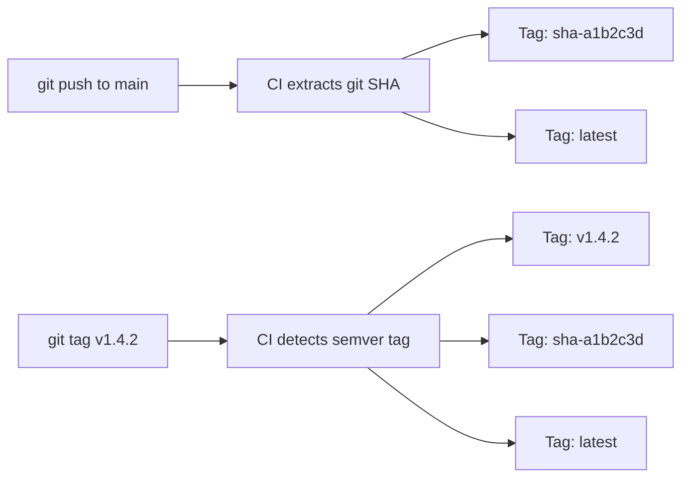
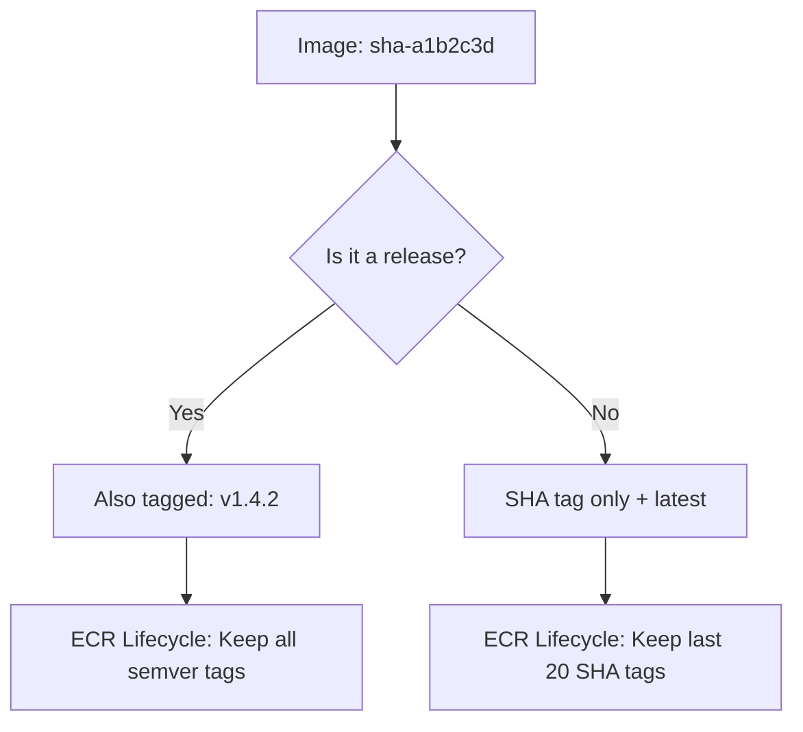

# Container Image Building

## Overview

EventRelay's container images are built in CI using multi-stage Docker builds and pushed to **Amazon ECR** (Elastic Container Registry). This document covers the image tagging strategy, vulnerability scanning, image signing, and the GitHub Actions workflow that ties it all together.

> [!NOTE]
> Every image pushed to ECR is scanned for vulnerabilities, tagged with the git commit SHA, and signed before it can be deployed. This ensures traceability from every running container back to the exact source commit.

---

## Image Tagging Strategy

### Tag Format

Every image receives **three tags** on build:

| Tag | Format | Example | Purpose |
|---|---|---|---|
| Git SHA (short) | `sha-<7-char>` | `sha-a1b2c3d` | Immutable, traceable to exact commit |
| Semantic Version | `v<MAJOR>.<MINOR>.<PATCH>` | `v1.4.2` | Human-readable release identifier |
| `latest` | `latest` | `latest` | Convenience for staging (never used in prod) |

### Tagging Flow



### Tag Lifecycle Rules



> [!WARNING]
> **Never deploy `latest` to production.** The `latest` tag is mutable and can point to different images over time. Always use the immutable SHA or semver tag for production deployments.

---

## Multi-Stage Build

See [Docker.md](./Docker.md) for the complete Dockerfile. Key principles:

```
┌────────────────────────────────────────────┐
│  Builder Stage (eclipse-temurin:17-jdk)    │
│  ─ Maven build                             │
│  ─ Spring Boot layer extraction            │
│  ─ NOT included in final image             │
└────────────────────────────────────────────┘
              │
              ▼
┌────────────────────────────────────────────┐
│  Runtime Stage (eclipse-temurin:17-jre)    │
│  ─ JRE only (no compiler, no Maven)       │
│  ─ Non-root user                           │
│  ─ Health check included                   │
│  ─ Final image: ~140 MB                    │
└────────────────────────────────────────────┘
```

### Build Arguments

| Argument | Description | Example |
|---|---|---|
| `APP_VERSION` | Application version baked into the image | `sha-a1b2c3d` or `v1.4.2` |
| `BUILD_DATE` | ISO 8601 timestamp of the build | `2025-01-15T10:30:00Z` |
| `VCS_REF` | Full git commit SHA | `a1b2c3d4e5f6...` |

```dockerfile
ARG APP_VERSION=dev
ARG BUILD_DATE=unknown
ARG VCS_REF=unknown

LABEL org.opencontainers.image.version="${APP_VERSION}" \
      org.opencontainers.image.created="${BUILD_DATE}" \
      org.opencontainers.image.revision="${VCS_REF}" \
      org.opencontainers.image.title="eventrelay" \
      org.opencontainers.image.description="Reliable Webhook Delivery Platform" \
      org.opencontainers.image.vendor="EventRelay" \
      org.opencontainers.image.source="https://github.com/your-org/eventrelay"
```

---

## Image Scanning

### Trivy — Vulnerability Scanner

Trivy scans the built image for OS package and application dependency vulnerabilities before pushing to ECR.

```yaml
# GitHub Actions step
- name: Run Trivy vulnerability scanner
  uses: aquasecurity/trivy-action@master
  with:
    image-ref: ${{ env.IMAGE_URI }}
    format: 'sarif'
    output: 'trivy-results.sarif'
    severity: 'CRITICAL,HIGH'
    exit-code: '1'           # Fail the build on CRITICAL/HIGH
    ignore-unfixed: true     # Skip vulnerabilities with no fix available
    timeout: '10m'

- name: Upload Trivy scan results
  uses: github/codeql-action/upload-sarif@v3
  if: always()
  with:
    sarif_file: 'trivy-results.sarif'
```

### Scan Policy

| Severity | Action | Rationale |
|---|---|---|
| CRITICAL | **Block deployment** | Active exploits, must fix immediately |
| HIGH | **Block deployment** | Significant risk, fix before release |
| MEDIUM | **Warning** | Track in backlog, fix within 30 days |
| LOW | **Info only** | Track, no urgency |

### ECR Native Scanning

Enable **ECR Enhanced Scanning** (powered by Amazon Inspector) for continuous scanning of images already in the registry:

```bash
aws ecr put-registry-scanning-configuration \
  --scan-type ENHANCED \
  --rules '[
    {
      "repositoryFilters": [{"filter": "eventrelay", "filterType": "WILDCARD"}],
      "scanFrequency": "CONTINUOUS_SCAN"
    }
  ]'
```

---

## Image Signing

### Cosign (Sigstore)

Sign images after scanning to create a verifiable chain of trust:

```yaml
- name: Install Cosign
  uses: sigstore/cosign-installer@v3

- name: Sign the image
  env:
    COSIGN_EXPERIMENTAL: 1  # Keyless signing via OIDC
  run: |
    cosign sign --yes \
      ${{ env.ECR_REGISTRY }}/${{ env.ECR_REPOSITORY }}@${{ steps.build.outputs.digest }}
```

### Verification

```bash
# Verify image signature before deployment
cosign verify \
  --certificate-identity-regexp "https://github.com/your-org/eventrelay" \
  --certificate-oidc-issuer "https://token.actions.githubusercontent.com" \
  123456789012.dkr.ecr.us-east-1.amazonaws.com/eventrelay:sha-a1b2c3d
```

---

## Pushing to Amazon ECR

### ECR Repository Setup

```bash
# Create ECR repository
aws ecr create-repository \
  --repository-name eventrelay \
  --image-scanning-configuration scanOnPush=true \
  --encryption-configuration encryptionType=AES256 \
  --image-tag-mutability IMMUTABLE

# Set lifecycle policy (auto-cleanup old images)
aws ecr put-lifecycle-policy \
  --repository-name eventrelay \
  --lifecycle-policy-text '{
    "rules": [
      {
        "rulePriority": 1,
        "description": "Keep last 5 semver releases",
        "selection": {
          "tagStatus": "tagged",
          "tagPrefixList": ["v"],
          "countType": "imageCountMoreThan",
          "countNumber": 5
        },
        "action": { "type": "expire" }
      },
      {
        "rulePriority": 2,
        "description": "Keep last 20 SHA-tagged images",
        "selection": {
          "tagStatus": "tagged",
          "tagPrefixList": ["sha-"],
          "countType": "imageCountMoreThan",
          "countNumber": 20
        },
        "action": { "type": "expire" }
      },
      {
        "rulePriority": 3,
        "description": "Remove untagged images after 7 days",
        "selection": {
          "tagStatus": "untagged",
          "countType": "sinceImagePushed",
          "countUnit": "days",
          "countNumber": 7
        },
        "action": { "type": "expire" }
      }
    ]
  }'
```

---

## Complete GitHub Actions Build-and-Push Job

```yaml
# .github/workflows/build-image.yml
name: Build & Push Image

on:
  push:
    branches: [main]
    tags: ['v*']

permissions:
  id-token: write
  contents: read
  security-events: write  # For SARIF upload

env:
  AWS_REGION: us-east-1
  ECR_REPOSITORY: eventrelay

jobs:
  build-scan-push:
    name: Build, Scan & Push
    runs-on: ubuntu-latest
    timeout-minutes: 20
    outputs:
      image_uri: ${{ steps.output.outputs.image_uri }}
      image_digest: ${{ steps.build.outputs.digest }}
    steps:
      # ── Checkout ──
      - name: Checkout code
        uses: actions/checkout@v4
        with:
          fetch-depth: 0  # Full history for version detection

      # ── AWS Authentication (OIDC) ──
      - name: Configure AWS credentials
        uses: aws-actions/configure-aws-credentials@v4
        with:
          role-to-assume: ${{ secrets.AWS_DEPLOY_ROLE_ARN }}
          aws-region: ${{ env.AWS_REGION }}

      - name: Login to Amazon ECR
        id: ecr-login
        uses: aws-actions/amazon-ecr-login@v2

      # ── Metadata & Tags ──
      - name: Extract image metadata
        id: meta
        run: |
          SHA_SHORT=$(git rev-parse --short=7 HEAD)
          REGISTRY="${{ steps.ecr-login.outputs.registry }}"
          FULL_IMAGE="${REGISTRY}/${{ env.ECR_REPOSITORY }}"

          # Always tag with SHA
          TAGS="${FULL_IMAGE}:sha-${SHA_SHORT}"
          TAGS="${TAGS},${FULL_IMAGE}:latest"

          # If this is a git tag push (v*), add semver tag
          if [[ "${GITHUB_REF}" == refs/tags/v* ]]; then
            VERSION="${GITHUB_REF#refs/tags/}"
            TAGS="${TAGS},${FULL_IMAGE}:${VERSION}"
            echo "version=${VERSION}" >> $GITHUB_OUTPUT
          else
            echo "version=sha-${SHA_SHORT}" >> $GITHUB_OUTPUT
          fi

          echo "tags=${TAGS}" >> $GITHUB_OUTPUT
          echo "full_image=${FULL_IMAGE}" >> $GITHUB_OUTPUT
          echo "sha_short=${SHA_SHORT}" >> $GITHUB_OUTPUT

      # ── Build ──
      - name: Set up Docker Buildx
        uses: docker/setup-buildx-action@v3

      - name: Build image (local load for scanning)
        uses: docker/build-push-action@v5
        with:
          context: .
          load: true
          tags: eventrelay:scan
          cache-from: type=gha
          cache-to: type=gha,mode=max
          build-args: |
            APP_VERSION=${{ steps.meta.outputs.version }}
            BUILD_DATE=${{ github.event.head_commit.timestamp }}
            VCS_REF=${{ github.sha }}

      # ── Scan ──
      - name: Run Trivy vulnerability scanner
        uses: aquasecurity/trivy-action@master
        with:
          image-ref: eventrelay:scan
          format: 'sarif'
          output: 'trivy-results.sarif'
          severity: 'CRITICAL,HIGH'
          exit-code: '1'
          ignore-unfixed: true
          timeout: '10m'

      - name: Upload Trivy SARIF results
        uses: github/codeql-action/upload-sarif@v3
        if: always()
        with:
          sarif_file: 'trivy-results.sarif'

      # ── Push ──
      - name: Build and push to ECR
        id: build
        uses: docker/build-push-action@v5
        with:
          context: .
          push: true
          tags: ${{ steps.meta.outputs.tags }}
          cache-from: type=gha
          cache-to: type=gha,mode=max
          build-args: |
            APP_VERSION=${{ steps.meta.outputs.version }}
            BUILD_DATE=${{ github.event.head_commit.timestamp }}
            VCS_REF=${{ github.sha }}
          provenance: true
          sbom: true

      # ── Sign ──
      - name: Install Cosign
        uses: sigstore/cosign-installer@v3

      - name: Sign the image
        env:
          COSIGN_EXPERIMENTAL: 1
        run: |
          cosign sign --yes \
            ${{ steps.meta.outputs.full_image }}@${{ steps.build.outputs.digest }}

      # ── Output ──
      - name: Set output
        id: output
        run: |
          IMAGE_URI="${{ steps.meta.outputs.full_image }}:${{ steps.meta.outputs.version }}"
          echo "image_uri=${IMAGE_URI}" >> $GITHUB_OUTPUT
          echo "### 🐳 Image Published" >> $GITHUB_STEP_SUMMARY
          echo "" >> $GITHUB_STEP_SUMMARY
          echo "| Property | Value |" >> $GITHUB_STEP_SUMMARY
          echo "|---|---|" >> $GITHUB_STEP_SUMMARY
          echo "| Image | \`${IMAGE_URI}\` |" >> $GITHUB_STEP_SUMMARY
          echo "| Digest | \`${{ steps.build.outputs.digest }}\` |" >> $GITHUB_STEP_SUMMARY
          echo "| Signed | ✅ |" >> $GITHUB_STEP_SUMMARY
          echo "| Scanned | ✅ |" >> $GITHUB_STEP_SUMMARY
```

---

## Image Caching in CI

### GitHub Actions Cache (GHA) Backend

```yaml
cache-from: type=gha
cache-to: type=gha,mode=max
```

| Mode | Behavior | Cache Size |
|---|---|---|
| `mode=min` | Cache only final stage layers | Smaller, faster |
| `mode=max` | Cache all intermediate stages | Larger, better hit rate |

**Recommendation**: Use `mode=max` for EventRelay. The builder stage's dependency layer rarely changes and provides the biggest cache benefit.

### ECR Cache (Alternative)

For larger teams where GHA cache (10 GB limit) isn't sufficient:

```yaml
cache-from: type=registry,ref=123456789012.dkr.ecr.us-east-1.amazonaws.com/eventrelay:buildcache
cache-to: type=registry,ref=123456789012.dkr.ecr.us-east-1.amazonaws.com/eventrelay:buildcache,mode=max
```

### Cache Hit Rates (Expected)

| Scenario | Cache Hit? | Build Time |
|---|---|---|
| Application code change only | ✅ All layers except app | ~30s |
| pom.xml dependency change | ✅ OS + JRE layers | ~2m |
| Base image update | ❌ Full rebuild | ~4m |
| First build (cold cache) | ❌ Full rebuild | ~5m |

---

## Software Bill of Materials (SBOM)

Generate SBOM on every build for supply chain security:

```yaml
- name: Build and push
  uses: docker/build-push-action@v5
  with:
    provenance: true   # Build provenance attestation
    sbom: true          # SBOM generation (SPDX format)
```

Query the SBOM:

```bash
# List all packages in the image
docker buildx imagetools inspect \
  123456789012.dkr.ecr.us-east-1.amazonaws.com/eventrelay:v1.4.2 \
  --format '{{ json .SBOM }}'
```

---

## Production Considerations

1. **Immutable tags**: Set ECR repository to `IMMUTABLE` tag mutability. This prevents overwriting a tag (e.g., `v1.4.2`) with a different image.
2. **Cross-region replication**: If deploying to multiple regions, configure ECR replication rules to replicate images automatically.
3. **Scan before deploy**: The pipeline scans images *before* pushing. If a CRITICAL vulnerability is found, the image is never pushed to ECR.
4. **Image provenance**: The `provenance: true` flag generates a SLSA provenance attestation, allowing consumers to verify *how* the image was built.
5. **Lifecycle policies**: Configure ECR lifecycle policies to automatically clean up old images and prevent storage cost bloat.

---

## Related Documents

- [Docker.md](./Docker.md) — Dockerfile and Docker Compose configuration
- [GitHub_Actions.md](./GitHub_Actions.md) — CI/CD workflow configuration
- [Deployment_Pipeline.md](./Deployment_Pipeline.md) — Full deployment pipeline
