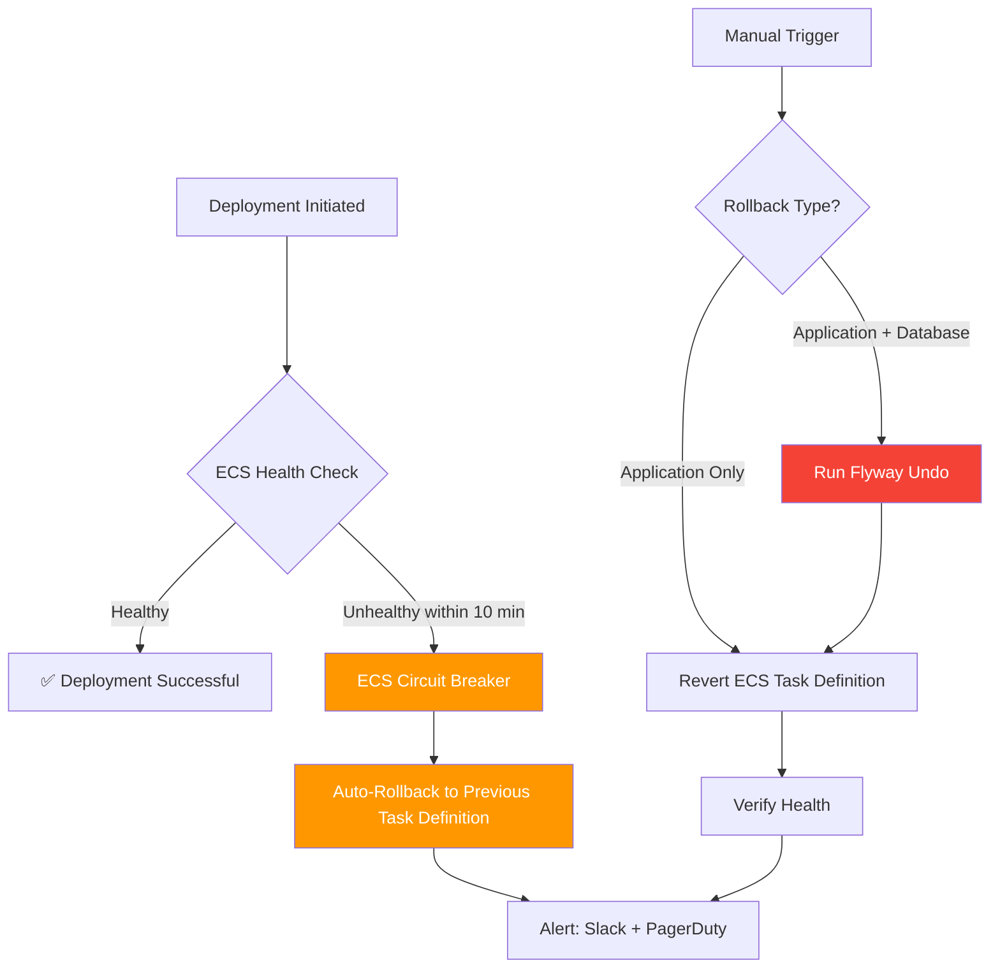
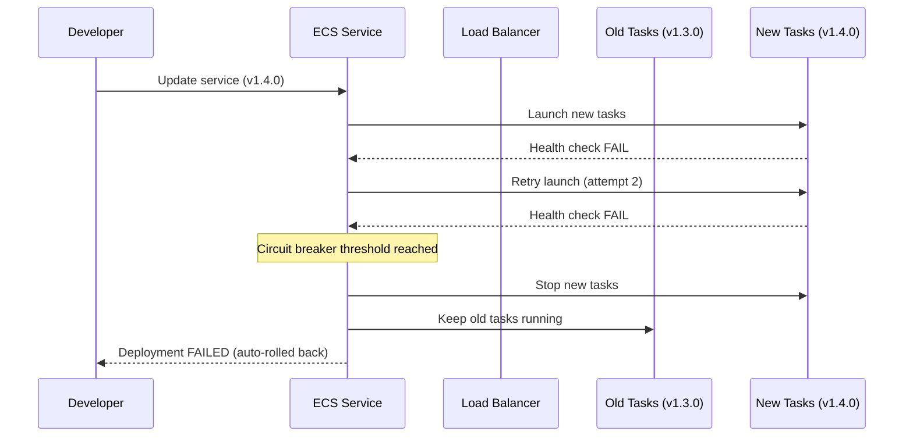
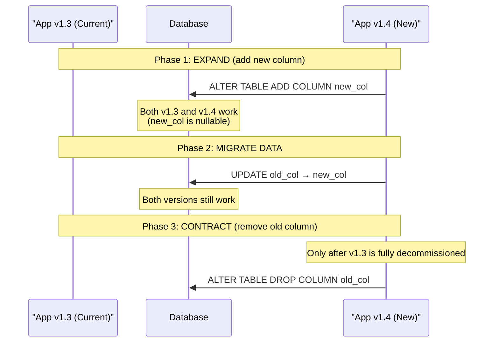
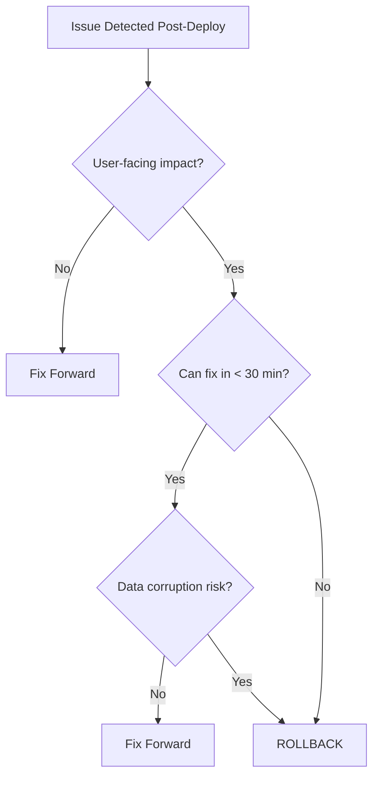

# Rollback Strategy

## Overview

Rollbacks are the safety net for failed deployments. EventRelay implements a **layered rollback strategy**: ECS handles automatic rollback for container deployment failures, while database migrations use Flyway undo scripts for schema rollback. This document covers both automatic and manual rollback procedures, decision criteria, and post-rollback verification.

> [!CAUTION]
> Rollbacks involving **database schema changes** are significantly more complex than application-only rollbacks. Always design migrations to be backward-compatible so that the previous application version can run against the new schema. See the [Backward Compatibility](#backward-compatibility) section.

---

## Rollback Architecture



---

## Automatic Rollback (ECS Circuit Breaker)

### How It Works

ECS **Deployment Circuit Breaker** automatically rolls back a deployment if the new tasks fail to reach a healthy state. This is the first line of defense — no manual intervention required.



### ECS Service Configuration

```json
{
  "serviceName": "eventrelay-production",
  "deploymentConfiguration": {
    "deploymentCircuitBreaker": {
      "enable": true,
      "rollback": true
    },
    "maximumPercent": 200,
    "minimumHealthyPercent": 100
  },
  "healthCheckGracePeriodSeconds": 120
}
```

| Parameter | Value | Rationale |
|---|---|---|
| `deploymentCircuitBreaker.enable` | `true` | Enable automatic failure detection |
| `deploymentCircuitBreaker.rollback` | `true` | Auto-rollback on failure |
| `maximumPercent` | `200` | Allow 2x tasks during deployment (old + new) |
| `minimumHealthyPercent` | `100` | Never kill old tasks until new ones are healthy |
| `healthCheckGracePeriodSeconds` | `120` | Grace period for Spring Boot startup |

### Circuit Breaker Thresholds

The circuit breaker triggers when `failedTasks >= threshold`. The threshold is calculated as:

```
threshold = max(10, 2 × desiredCount)
```

For EventRelay with `desiredCount: 3`:
- Threshold = max(10, 6) = **10 failed task launches**
- After 10 failed attempts, ECS stops the deployment and rolls back

---

## Manual Rollback Procedure

### Step 1: Identify the Previous Task Definition

```bash
#!/bin/bash
# scripts/rollback/identify-previous-version.sh

CLUSTER="eventrelay-cluster"
SERVICE="eventrelay-production"

# Get current and previous task definition ARNs
echo "=== Current Deployment ==="
CURRENT_TD=$(aws ecs describe-services \
  --cluster $CLUSTER \
  --services $SERVICE \
  --query 'services[0].taskDefinition' \
  --output text)
echo "Current: $CURRENT_TD"

# List recent task definition revisions
FAMILY=$(echo $CURRENT_TD | cut -d'/' -f2 | rev | cut -d':' -f2- | rev)
echo ""
echo "=== Recent Revisions ==="
aws ecs list-task-definitions \
  --family-prefix $FAMILY \
  --sort DESC \
  --max-items 5 \
  --query 'taskDefinitionArns[]' \
  --output table
```

### Step 2: Execute Rollback

```bash
#!/bin/bash
# scripts/rollback/rollback-ecs.sh
set -euo pipefail

CLUSTER="eventrelay-cluster"
SERVICE="eventrelay-production"
REGION="us-east-1"

# Parse arguments
TARGET_REVISION="${1:?Usage: $0 <task-definition-arn>}"

echo "╔══════════════════════════════════════════╗"
echo "║     ECS ROLLBACK - EventRelay            ║"
echo "╠══════════════════════════════════════════╣"
echo "║  Cluster:  $CLUSTER"
echo "║  Service:  $SERVICE"
echo "║  Target:   $TARGET_REVISION"
echo "╚══════════════════════════════════════════╝"

# Confirm
read -p "Proceed with rollback? (yes/no): " CONFIRM
if [ "$CONFIRM" != "yes" ]; then
  echo "Rollback cancelled."
  exit 0
fi

# Get current task definition for logging
CURRENT_TD=$(aws ecs describe-services \
  --cluster $CLUSTER \
  --services $SERVICE \
  --region $REGION \
  --query 'services[0].taskDefinition' \
  --output text)

echo ""
echo "Rolling back from: $CURRENT_TD"
echo "Rolling back to:   $TARGET_REVISION"
echo ""

# Execute rollback
aws ecs update-service \
  --cluster $CLUSTER \
  --service $SERVICE \
  --region $REGION \
  --task-definition "$TARGET_REVISION" \
  --force-new-deployment

echo "⏳ Waiting for service to stabilize..."
aws ecs wait services-stable \
  --cluster $CLUSTER \
  --services $SERVICE \
  --region $REGION

echo ""
echo "✅ Rollback complete. Verifying health..."

# Verify
sleep 15
STATUS=$(curl -s -o /dev/null -w "%{http_code}" \
  https://api.eventrelay.example.com/actuator/health)

if [ "$STATUS" = "200" ]; then
  echo "✅ Health check passed (HTTP $STATUS)"
else
  echo "❌ Health check FAILED (HTTP $STATUS) — manual investigation required"
  exit 1
fi
```

### Step 3: GitHub Actions Manual Rollback Workflow

```yaml
# .github/workflows/rollback.yml
name: Manual Rollback

on:
  workflow_dispatch:
    inputs:
      environment:
        description: 'Environment to rollback'
        required: true
        type: choice
        options: [staging, production]
      task_definition_arn:
        description: 'Task definition ARN to rollback to (leave empty for previous revision)'
        required: false
        type: string
      reason:
        description: 'Reason for rollback'
        required: true
        type: string

permissions:
  id-token: write
  contents: read

env:
  AWS_REGION: us-east-1
  ECS_CLUSTER: eventrelay-cluster

jobs:
  rollback:
    name: "🔄 Rollback ${{ inputs.environment }}"
    runs-on: ubuntu-latest
    timeout-minutes: 15
    environment: ${{ inputs.environment }}
    steps:
      - name: Configure AWS credentials
        uses: aws-actions/configure-aws-credentials@v4
        with:
          role-to-assume: ${{ secrets.AWS_DEPLOY_ROLE_ARN }}
          aws-region: ${{ env.AWS_REGION }}

      - name: Determine target task definition
        id: target
        run: |
          SERVICE="eventrelay-${{ inputs.environment }}"

          if [ -n "${{ inputs.task_definition_arn }}" ]; then
            echo "td=${{ inputs.task_definition_arn }}" >> $GITHUB_OUTPUT
          else
            # Get the previous task definition (current revision - 1)
            CURRENT_TD=$(aws ecs describe-services \
              --cluster ${{ env.ECS_CLUSTER }} \
              --services $SERVICE \
              --query 'services[0].taskDefinition' \
              --output text)

            FAMILY=$(echo $CURRENT_TD | cut -d'/' -f2 | rev | cut -d':' -f2- | rev)
            CURRENT_REV=$(echo $CURRENT_TD | rev | cut -d':' -f1 | rev)
            PREV_REV=$((CURRENT_REV - 1))

            PREV_TD="${FAMILY}:${PREV_REV}"
            echo "Current: $CURRENT_TD"
            echo "Rolling back to: $PREV_TD"
            echo "td=${PREV_TD}" >> $GITHUB_OUTPUT
          fi

      - name: Execute rollback
        run: |
          SERVICE="eventrelay-${{ inputs.environment }}"
          aws ecs update-service \
            --cluster ${{ env.ECS_CLUSTER }} \
            --service $SERVICE \
            --task-definition ${{ steps.target.outputs.td }} \
            --force-new-deployment

      - name: Wait for stability
        run: |
          SERVICE="eventrelay-${{ inputs.environment }}"
          aws ecs wait services-stable \
            --cluster ${{ env.ECS_CLUSTER }} \
            --services $SERVICE

      - name: Notify
        uses: slackapi/slack-github-action@v1
        with:
          payload: |
            {
              "text": "🔄 *Rollback executed* on *${{ inputs.environment }}*\n*Reason:* ${{ inputs.reason }}\n*Target:* `${{ steps.target.outputs.td }}`\n*Actor:* ${{ github.actor }}"
            }
        env:
          SLACK_WEBHOOK_URL: ${{ secrets.SLACK_WEBHOOK_URL }}
```

---

## Database Migration Rollback

### Flyway Undo Migrations

EventRelay uses Flyway for database migrations. Each forward migration (`V{version}__description.sql`) has a corresponding undo migration (`U{version}__description.sql`).

```
db/migration/
├── V1__create_tenants.sql
├── V2__create_webhooks.sql
├── V3__create_events_outbox.sql
├── V4__add_retry_columns.sql
├── U4__remove_retry_columns.sql    ← Undo for V4
├── U3__drop_events_outbox.sql      ← Undo for V3
```

### Example Undo Migration

```sql
-- U4__remove_retry_columns.sql
-- Undo: Removes retry tracking columns added in V4

ALTER TABLE webhook_deliveries
  DROP COLUMN IF EXISTS retry_count,
  DROP COLUMN IF EXISTS next_retry_at,
  DROP COLUMN IF EXISTS last_error;

-- Restore the previous index
DROP INDEX IF EXISTS idx_deliveries_next_retry;
```

### Running Flyway Undo

```bash
#!/bin/bash
# scripts/rollback/flyway-undo.sh
set -euo pipefail

TARGET_VERSION="${1:?Usage: $0 <target-version>}"
ENVIRONMENT="${2:-staging}"

echo "╔══════════════════════════════════════════╗"
echo "║     DATABASE ROLLBACK - Flyway Undo      ║"
echo "╠══════════════════════════════════════════╣"
echo "║  Target Version: $TARGET_VERSION"
echo "║  Environment:    $ENVIRONMENT"
echo "╚══════════════════════════════════════════╝"

# Fetch database credentials from Secrets Manager
DB_URL=$(aws secretsmanager get-secret-value \
  --secret-id "eventrelay/${ENVIRONMENT}/db-url" \
  --query 'SecretString' --output text)
DB_USER=$(aws secretsmanager get-secret-value \
  --secret-id "eventrelay/${ENVIRONMENT}/db-user" \
  --query 'SecretString' --output text)
DB_PASS=$(aws secretsmanager get-secret-value \
  --secret-id "eventrelay/${ENVIRONMENT}/db-password" \
  --query 'SecretString' --output text)

# Show current migration status
echo ""
echo "Current migration status:"
flyway -url="$DB_URL" -user="$DB_USER" -password="$DB_PASS" info

# Confirm
read -p "Undo migrations down to version $TARGET_VERSION? (yes/no): " CONFIRM
if [ "$CONFIRM" != "yes" ]; then
  echo "Database rollback cancelled."
  exit 0
fi

# Execute undo
flyway -url="$DB_URL" -user="$DB_USER" -password="$DB_PASS" \
  -target="$TARGET_VERSION" \
  undo

echo ""
echo "Migration status after undo:"
flyway -url="$DB_URL" -user="$DB_USER" -password="$DB_PASS" info

echo ""
echo "✅ Database rolled back to version $TARGET_VERSION"
```

> [!WARNING]
> **Database rollbacks can cause data loss.** If a migration added a column that the application has been writing data to, undoing that migration will drop the column and its data. Always verify that no critical data exists in affected columns before undoing.

---

## Backward Compatibility

### The Expand-Contract Pattern

To ensure safe rollbacks, design database migrations using the **expand-contract** pattern:



### Rules for Backward-Compatible Migrations

| Operation | Safe? | Notes |
|---|---|---|
| ADD nullable column | ✅ | Old app ignores it |
| ADD column with DEFAULT | ✅ | Old app ignores it |
| DROP column | ❌ | Old app may SELECT it |
| RENAME column | ❌ | Old app uses old name |
| CHANGE column type | ❌ | Old app expects old type |
| ADD table | ✅ | Old app doesn't reference it |
| DROP table | ❌ | Old app may reference it |
| ADD index | ✅ | Transparent to app |
| DROP index | ⚠️ | May degrade old app performance |

---

## Rollback Decision Criteria

### When to Rollback

| Signal | Severity | Action |
|---|---|---|
| Health check failing (5xx) | 🔴 Critical | **Immediate rollback** |
| Error rate > 5% (baseline: < 0.1%) | 🔴 Critical | **Immediate rollback** |
| P99 latency > 5s (baseline: < 500ms) | 🟠 High | Rollback within 15 min |
| Webhook delivery failure rate > 10% | 🟠 High | Rollback within 15 min |
| SQS DLQ message rate spike | 🟡 Medium | Investigate, rollback if needed |
| Non-critical feature broken | 🟡 Medium | Hotfix preferred over rollback |
| UI cosmetic issue | 🟢 Low | Fix forward |

### Rollback vs Fix Forward Decision Tree



---

## Post-Rollback Verification

### Verification Checklist

```bash
#!/bin/bash
# scripts/rollback/verify-rollback.sh

ENVIRONMENT="${1:-production}"
BASE_URL="https://api.eventrelay.example.com"
if [ "$ENVIRONMENT" = "staging" ]; then
  BASE_URL="https://staging.eventrelay.example.com"
fi

echo "╔══════════════════════════════════════════╗"
echo "║     POST-ROLLBACK VERIFICATION           ║"
echo "╠══════════════════════════════════════════╣"

# 1. Health check
echo -n "║  [1/6] Health check.............. "
STATUS=$(curl -s -o /dev/null -w "%{http_code}" "$BASE_URL/actuator/health")
if [ "$STATUS" = "200" ]; then echo "✅"; else echo "❌ (HTTP $STATUS)"; fi

# 2. Version check
echo -n "║  [2/6] Version check............. "
VERSION=$(curl -s "$BASE_URL/actuator/info" | jq -r '.build.version // "unknown"')
echo "📌 $VERSION"

# 3. Database connectivity
echo -n "║  [3/6] Database connectivity...... "
DB_STATUS=$(curl -s "$BASE_URL/actuator/health" | jq -r '.components.db.status // "UNKNOWN"')
if [ "$DB_STATUS" = "UP" ]; then echo "✅"; else echo "❌ ($DB_STATUS)"; fi

# 4. Redis connectivity
echo -n "║  [4/6] Redis connectivity......... "
REDIS_STATUS=$(curl -s "$BASE_URL/actuator/health" | jq -r '.components.redis.status // "UNKNOWN"')
if [ "$REDIS_STATUS" = "UP" ]; then echo "✅"; else echo "❌ ($REDIS_STATUS)"; fi

# 5. SQS connectivity
echo -n "║  [5/6] SQS connectivity.......... "
SQS_RESPONSE=$(curl -s -o /dev/null -w "%{http_code}" "$BASE_URL/api/v1/events" \
  -X POST -H "Content-Type: application/json" \
  -H "Authorization: Bearer $API_KEY" \
  -d '{"type":"system.healthcheck","payload":{}}')
if [ "$SQS_RESPONSE" = "202" ]; then echo "✅"; else echo "❌ (HTTP $SQS_RESPONSE)"; fi

# 6. Error rate check
echo -n "║  [6/6] Error rate (last 5 min).... "
echo "📊 Check Grafana dashboard"

echo "╚══════════════════════════════════════════╝"
```

---

## Rollback Testing

### Regular Rollback Drills

Schedule quarterly rollback drills to verify the rollback process works:

1. **Deploy a known-bad version** to staging (intentionally failing health check)
2. **Verify ECS auto-rollback** triggers within expected timeframe
3. **Execute manual rollback** using the rollback script
4. **Execute database undo** on a staging database copy
5. **Document results** and update procedures if gaps found

### Chaos Engineering Integration

```yaml
# Simulate deployment failure for rollback testing
- name: Deploy intentionally broken version
  run: |
    # Deploy an image with a failing health check
    aws ecs update-service \
      --cluster eventrelay-cluster \
      --service eventrelay-staging \
      --task-definition eventrelay-chaos-test:1 \
      --force-new-deployment

- name: Verify auto-rollback occurs
  run: |
    # Wait and verify the service rolled back
    sleep 300  # Circuit breaker timeout
    CURRENT_TD=$(aws ecs describe-services \
      --cluster eventrelay-cluster \
      --services eventrelay-staging \
      --query 'services[0].taskDefinition' \
      --output text)
    echo "Current task definition after rollback: $CURRENT_TD"
```

---

## Production Considerations

1. **Rollback SLA**: Target < 5 minutes for application-only rollback, < 15 minutes for application + database rollback.
2. **Communication**: Notify stakeholders immediately when initiating a rollback. Use a dedicated Slack channel (#eventrelay-incidents).
3. **Post-mortem**: Every production rollback should trigger a blameless post-mortem within 48 hours.
4. **Rollback limits**: Keep the last 5 task definition revisions in ECS. Beyond that, you'll need to rebuild and redeploy.
5. **Data migrations**: If a migration has been running in production for > 24 hours and data has been written to new columns, rollback becomes significantly more complex. Consider a fix-forward approach.
6. **Feature flags**: Use feature flags to decouple deployment from release. This reduces the need for rollbacks — simply toggle the flag off.

---

## Related Documents

- [Deployment_Pipeline.md](./Deployment_Pipeline.md) — Full deployment pipeline
- [Blue_Green_Deployment.md](./Blue_Green_Deployment.md) — Blue-green deployment with ECS
- [Release_Strategy.md](./Release_Strategy.md) — Versioning and release process
