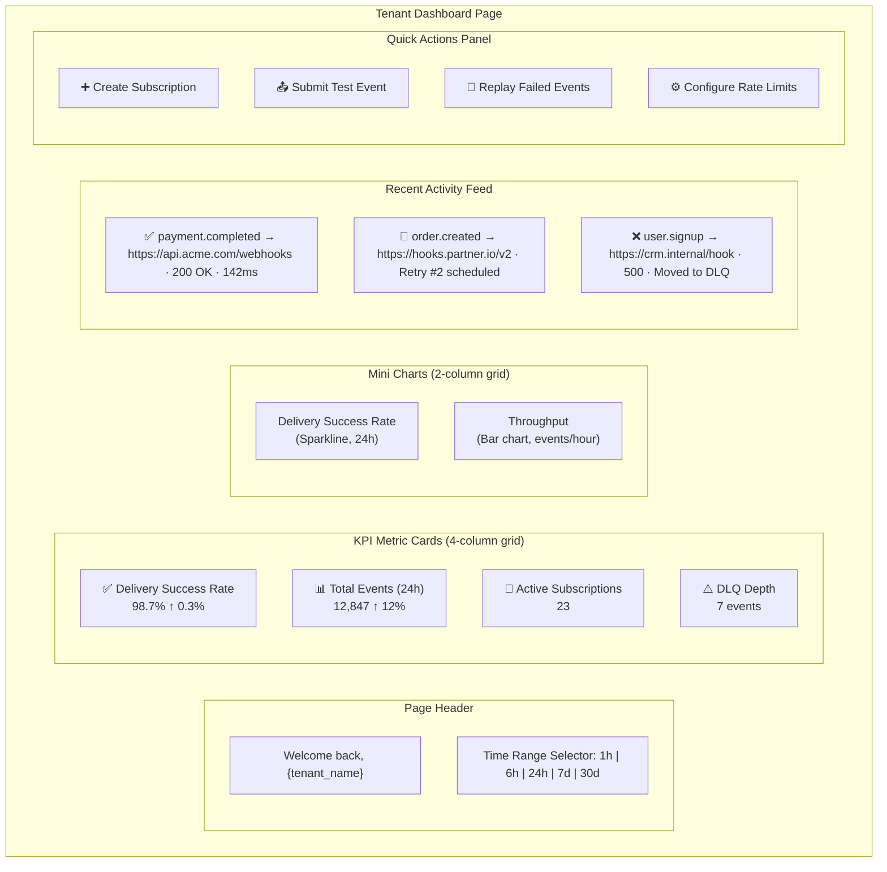

# Frontend Dashboard — Tenant Dashboard

> **Document Status:** Living Document · **Last Updated:** 2026-07-10 · **Owner:** Platform Engineering

## 1. Overview

The Tenant Dashboard is the **landing page** after login — the single-pane-of-glass for a tenant's webhook delivery health. It surfaces the four most critical metrics at a glance, shows recent activity, provides quick-action shortcuts, and exposes tenant-level configuration.

> [!IMPORTANT]
> The dashboard is designed for **operational awareness**, not deep debugging. Each metric card and activity entry links to the relevant detail page (Delivery Monitor, Event Explorer, DLQ Manager) for investigation.

---

## 2. Page Layout



---

## 3. KPI Metric Cards

### 3.1 Card Specifications

| Card | Metric | Source | Calculation | Update Frequency |
|---|---|---|---|---|
| **Delivery Success Rate** | % of deliveries with HTTP 2xx on first or retry attempt | `GET /api/v1/dashboard/metrics/success-rate` | `(successful_deliveries / total_deliveries) × 100` | 30s auto-refresh |
| **Total Events (period)** | Count of events ingested in selected time range | `GET /api/v1/dashboard/metrics/event-count` | `COUNT(events) WHERE created_at >= now() - interval` | 60s auto-refresh |
| **Active Subscriptions** | Subscriptions with `status = ACTIVE` | `GET /api/v1/dashboard/metrics/subscription-count` | `COUNT(subscriptions) WHERE status = 'ACTIVE'` | 5m auto-refresh |
| **DLQ Depth** | Events currently in dead-letter state | `GET /api/v1/dashboard/metrics/dlq-depth` | `COUNT(delivery_attempts) WHERE status = 'DEAD_LETTERED'` | 30s auto-refresh |

### 3.2 Card Component

```typescript
// src/components/dashboard/MetricCard.tsx

import { Card, CardContent, CardHeader, CardTitle } from '@/components/ui/card';
import { TrendingUp, TrendingDown, Minus } from 'lucide-react';
import { cn } from '@/lib/utils';

interface MetricCardProps {
  title: string;
  value: string | number;
  unit?: string;
  change?: number;        // Percentage change from previous period
  changeLabel?: string;   // e.g., "vs. yesterday"
  icon: React.ReactNode;
  loading?: boolean;
  alert?: 'warning' | 'critical'; // Visual severity
  href?: string;          // Link to detail page
}

export function MetricCard({
  title, value, unit, change, changeLabel, icon, loading, alert, href,
}: MetricCardProps) {
  const TrendIcon =
    change === undefined || change === 0 ? Minus :
    change > 0 ? TrendingUp : TrendingDown;

  const trendColor =
    change === undefined ? 'text-muted-foreground' :
    change > 0 ? 'text-success' : 'text-destructive';

  return (
    <Card
      className={cn(
        'transition-shadow hover:shadow-md cursor-pointer',
        alert === 'warning' && 'border-warning/50 bg-warning/5',
        alert === 'critical' && 'border-destructive/50 bg-destructive/5'
      )}
    >
      <CardHeader className="flex flex-row items-center justify-between pb-2">
        <CardTitle className="text-sm font-medium text-muted-foreground">
          {title}
        </CardTitle>
        <div className="h-8 w-8 text-muted-foreground">{icon}</div>
      </CardHeader>
      <CardContent>
        {loading ? (
          <Skeleton className="h-8 w-24" />
        ) : (
          <>
            <div className="text-2xl font-bold">
              {value}
              {unit && <span className="text-sm font-normal text-muted-foreground ml-1">{unit}</span>}
            </div>
            {change !== undefined && (
              <p className={cn('text-xs flex items-center gap-1 mt-1', trendColor)}>
                <TrendIcon className="h-3 w-3" />
                {Math.abs(change).toFixed(1)}% {changeLabel ?? 'vs. previous period'}
              </p>
            )}
          </>
        )}
      </CardContent>
    </Card>
  );
}
```

### 3.3 Alert Thresholds

| Metric | Warning Threshold | Critical Threshold | Visual Indicator |
|---|---|---|---|
| Delivery Success Rate | < 95% | < 90% | Yellow / Red card border + background |
| DLQ Depth | > 10 events | > 50 events | Yellow / Red card border + background |
| Total Events | N/A (informational) | N/A | No alert state |
| Active Subscriptions | N/A (informational) | N/A | No alert state |

---

## 4. Mini Charts

### 4.1 Delivery Success Rate Sparkline

A small area chart showing delivery success rate over the selected time range, plotted at 5-minute intervals (for 24h) or hourly intervals (for 7d/30d).

```typescript
// src/components/dashboard/SuccessRateSparkline.tsx

import { Area, AreaChart, ResponsiveContainer, Tooltip, XAxis, YAxis } from 'recharts';

interface DataPoint {
  timestamp: string;
  successRate: number;
}

interface Props {
  data: DataPoint[];
  loading?: boolean;
}

export function SuccessRateSparkline({ data, loading }: Props) {
  if (loading) return <Skeleton className="h-32 w-full" />;

  return (
    <Card>
      <CardHeader>
        <CardTitle className="text-sm">Delivery Success Rate</CardTitle>
      </CardHeader>
      <CardContent>
        <ResponsiveContainer width="100%" height={120}>
          <AreaChart data={data} margin={{ top: 0, right: 0, left: 0, bottom: 0 }}>
            <defs>
              <linearGradient id="successGradient" x1="0" y1="0" x2="0" y2="1">
                <stop offset="5%" stopColor="hsl(var(--success))" stopOpacity={0.3} />
                <stop offset="95%" stopColor="hsl(var(--success))" stopOpacity={0} />
              </linearGradient>
            </defs>
            <XAxis dataKey="timestamp" hide />
            <YAxis domain={[90, 100]} hide />
            <Tooltip
              content={({ active, payload }) =>
                active && payload?.[0] ? (
                  <div className="bg-card border rounded px-3 py-2 text-xs shadow-md">
                    <p className="font-medium">{payload[0].payload.timestamp}</p>
                    <p className="text-success">{payload[0].value}%</p>
                  </div>
                ) : null
              }
            />
            <Area
              type="monotone"
              dataKey="successRate"
              stroke="hsl(var(--success))"
              fill="url(#successGradient)"
              strokeWidth={2}
            />
          </AreaChart>
        </ResponsiveContainer>
      </CardContent>
    </Card>
  );
}
```

### 4.2 Throughput Bar Chart

A compact bar chart showing events ingested per hour over the last 24 hours:

```typescript
// API response shape for throughput
interface ThroughputDataPoint {
  hour: string;       // "2026-07-10T14:00:00Z"
  eventCount: number; // 847
}
```

---

## 5. Recent Activity Feed

### 5.1 Data Requirements

The activity feed shows the **last 50 delivery attempts** across all subscriptions, ordered by `attempted_at DESC`. Each entry shows:

| Field | Source | Example |
|---|---|---|
| Status icon | Derived from `status` | ✅ / 🔄 / ❌ |
| Event type | `events.event_type` | `payment.completed` |
| Target URL | `subscriptions.target_url` | `https://api.acme.com/webhooks` |
| HTTP status | `delivery_attempts.http_status` | `200 OK` |
| Latency | `delivery_attempts.latency_ms` | `142ms` |
| Attempt number | `delivery_attempts.attempt_number` | `Attempt #1` |
| Timestamp | `delivery_attempts.attempted_at` | `2 minutes ago` |

### 5.2 API Endpoint

```
GET /api/v1/dashboard/activity?limit=50
```

Response:

```json
{
  "data": [
    {
      "id": "del_01J5KBQ3XR...",
      "event_id": "evt_01J5KBQ3XR...",
      "event_type": "payment.completed",
      "subscription_id": "sub_01J5KBQ3XR...",
      "target_url": "https://api.acme.com/webhooks",
      "status": "DELIVERED",
      "http_status": 200,
      "latency_ms": 142,
      "attempt_number": 1,
      "attempted_at": "2026-07-10T09:28:00Z"
    },
    {
      "id": "del_01J5KBQ3XS...",
      "event_id": "evt_01J5KBQ3XS...",
      "event_type": "order.created",
      "subscription_id": "sub_01J5KBQ3XS...",
      "target_url": "https://hooks.partner.io/v2",
      "status": "RETRY_SCHEDULED",
      "http_status": 503,
      "latency_ms": 5023,
      "attempt_number": 2,
      "next_retry_at": "2026-07-10T09:33:00Z",
      "attempted_at": "2026-07-10T09:27:30Z"
    }
  ],
  "meta": {
    "total": 50,
    "has_more": true
  }
}
```

### 5.3 Activity Feed Component

```typescript
// src/components/dashboard/ActivityFeed.tsx

import { useQuery } from '@tanstack/react-query';
import { apiClient } from '@/lib/api-client';
import { useWebSocket } from '@/hooks/use-websocket';
import { DeliveryStatusBadge } from '@/components/delivery/DeliveryStatusBadge';
import { RelativeTime } from '@/components/common/RelativeTime';

export function ActivityFeed() {
  const { data, isLoading } = useQuery({
    queryKey: ['dashboard', 'activity'],
    queryFn: () => apiClient.get('/dashboard/activity?limit=50').then((r) => r.data),
    refetchInterval: 30_000,
  });

  // Prepend new deliveries from WebSocket in real-time
  const queryClient = useQueryClient();
  useWebSocket('DELIVERY_UPDATE', (msg) => {
    queryClient.setQueryData(['dashboard', 'activity'], (old: any) => ({
      ...old,
      data: [msg.payload, ...(old?.data ?? []).slice(0, 49)],
    }));
  });

  return (
    <Card>
      <CardHeader className="flex flex-row items-center justify-between">
        <CardTitle className="text-sm">Recent Activity</CardTitle>
        <Button variant="ghost" size="sm" asChild>
          <Link to="/deliveries">View all →</Link>
        </Button>
      </CardHeader>
      <CardContent>
        <div className="space-y-3">
          {isLoading ? (
            Array.from({ length: 5 }).map((_, i) => (
              <Skeleton key={i} className="h-12 w-full" />
            ))
          ) : (
            data?.data?.map((entry: ActivityEntry) => (
              <ActivityRow key={entry.id} entry={entry} />
            ))
          )}
        </div>
      </CardContent>
    </Card>
  );
}

function ActivityRow({ entry }: { entry: ActivityEntry }) {
  return (
    <Link
      to={`/events/${entry.event_id}`}
      className="flex items-center justify-between p-3 rounded-lg hover:bg-muted/50 transition-colors"
    >
      <div className="flex items-center gap-3 min-w-0">
        <DeliveryStatusBadge status={entry.status} />
        <div className="min-w-0">
          <p className="text-sm font-medium truncate">
            {entry.event_type}
          </p>
          <p className="text-xs text-muted-foreground truncate">
            → {entry.target_url}
          </p>
        </div>
      </div>
      <div className="flex items-center gap-4 flex-shrink-0">
        {entry.http_status && (
          <span className="text-xs font-mono">
            {entry.http_status}
          </span>
        )}
        {entry.latency_ms && (
          <span className="text-xs text-muted-foreground">
            {entry.latency_ms}ms
          </span>
        )}
        <RelativeTime date={entry.attempted_at} className="text-xs text-muted-foreground" />
      </div>
    </Link>
  );
}
```

---

## 6. Quick Actions Panel

### 6.1 Actions Grid

| Action | Icon | Behavior | Target |
|---|---|---|---|
| **Create Subscription** | `Plus` | Opens create subscription dialog | `/settings/subscriptions?action=create` |
| **Submit Test Event** | `Send` | Opens test event dialog (pre-filled template) | Dialog with `POST /api/v1/events` |
| **Replay Failed Events** | `RotateCcw` | Navigates to replay page with DLQ filter | `/replay?source=dlq` |
| **Configure Rate Limits** | `Settings` | Navigates to tenant settings | `/settings/general` |

### 6.2 Test Event Dialog

```typescript
// src/components/dashboard/TestEventDialog.tsx

const DEFAULT_TEST_EVENT = {
  event_type: 'test.ping',
  payload: {
    message: 'Hello from EventRelay dashboard!',
    timestamp: new Date().toISOString(),
  },
  metadata: {
    source: 'dashboard',
    purpose: 'connectivity_test',
  },
};

export function TestEventDialog() {
  const [open, setOpen] = useState(false);
  const [payload, setPayload] = useState(
    JSON.stringify(DEFAULT_TEST_EVENT, null, 2)
  );

  const mutation = useMutation({
    mutationFn: (event: object) =>
      apiClient.post('/events', event, {
        headers: { 'Idempotency-Key': crypto.randomUUID() },
      }),
    onSuccess: (response) => {
      toast.success('Test event submitted', {
        description: `Event ID: ${response.data.data.event_id}`,
      });
      setOpen(false);
    },
    onError: (error: AppError) => {
      toast.error('Failed to submit test event', {
        description: error.message,
      });
    },
  });

  return (
    <Dialog open={open} onOpenChange={setOpen}>
      <DialogTrigger asChild>
        <Button variant="outline" className="gap-2">
          <Send className="h-4 w-4" />
          Submit Test Event
        </Button>
      </DialogTrigger>
      <DialogContent className="max-w-lg">
        <DialogHeader>
          <DialogTitle>Submit Test Event</DialogTitle>
          <DialogDescription>
            Send a test event to all matching subscriptions.
          </DialogDescription>
        </DialogHeader>
        <div className="space-y-4">
          <Textarea
            value={payload}
            onChange={(e) => setPayload(e.target.value)}
            className="font-mono text-sm min-h-[200px]"
            placeholder="Event JSON..."
          />
          <div className="flex justify-end gap-2">
            <Button variant="outline" onClick={() => setOpen(false)}>
              Cancel
            </Button>
            <Button
              onClick={() => mutation.mutate(JSON.parse(payload))}
              disabled={mutation.isPending}
            >
              {mutation.isPending ? 'Submitting...' : 'Submit Event'}
            </Button>
          </div>
        </div>
      </DialogContent>
    </Dialog>
  );
}
```

---

## 7. Tenant Configuration Panel

A collapsible panel at the bottom of the dashboard showing current tenant configuration at a glance:

### 7.1 Configuration Summary

| Setting | Display | Value Example |
|---|---|---|
| **Tenant ID** | Read-only | `tenant_01H5KBQ3XR...` |
| **Plan** | Read-only | `Pro` |
| **Rate Limit** | Editable (link to settings) | `1,000 events/minute` |
| **Retry Policy** | Editable (link to settings) | `Exponential backoff, 8 max attempts` |
| **Active API Keys** | Count + link to manage | `3 active keys` |
| **Signing Algorithm** | Read-only | `HMAC-SHA256` |
| **Events This Month** | Usage meter | `47,234 / 100,000` |

### 7.2 API Endpoint

```
GET /api/v1/dashboard/tenant-config
```

Response:

```json
{
  "data": {
    "tenant_id": "tenant_01H5KBQ3XR...",
    "tenant_name": "Acme Corp",
    "plan": "PRO",
    "rate_limit": {
      "max_events_per_minute": 1000,
      "current_usage_per_minute": 142
    },
    "retry_policy": {
      "strategy": "EXPONENTIAL_BACKOFF",
      "max_attempts": 8,
      "initial_delay_seconds": 1,
      "max_delay_seconds": 3600,
      "backoff_multiplier": 5.0
    },
    "api_keys": {
      "active_count": 3,
      "last_created_at": "2026-07-01T10:00:00Z"
    },
    "signing": {
      "algorithm": "HMAC-SHA256",
      "secret_last_rotated_at": "2026-06-15T00:00:00Z"
    },
    "usage": {
      "events_this_month": 47234,
      "events_limit": 100000,
      "billing_period_start": "2026-07-01T00:00:00Z",
      "billing_period_end": "2026-07-31T23:59:59Z"
    }
  }
}
```

---

## 8. Data Fetching Strategy

### 8.1 Query Configuration

| Data | Query Key | Stale Time | Refetch Interval | On Window Focus |
|---|---|---|---|---|
| KPI Metrics | `['dashboard', 'metrics', timeRange]` | 15s | 30s | Yes |
| Activity Feed | `['dashboard', 'activity']` | 10s | 30s | Yes |
| Throughput Chart | `['dashboard', 'throughput', timeRange]` | 30s | 60s | Yes |
| Success Rate Chart | `['dashboard', 'success-rate-chart', timeRange]` | 30s | 60s | Yes |
| Tenant Config | `['dashboard', 'tenant-config']` | 5m | 10m | Yes |

### 8.2 Time Range Selector

```typescript
// src/components/dashboard/TimeRangeSelector.tsx

type TimeRange = '1h' | '6h' | '24h' | '7d' | '30d';

const TIME_RANGES: { value: TimeRange; label: string; dataPoints: number }[] = [
  { value: '1h',  label: '1 hour',   dataPoints: 12 },   // 5-min intervals
  { value: '6h',  label: '6 hours',  dataPoints: 36 },   // 10-min intervals
  { value: '24h', label: '24 hours', dataPoints: 48 },   // 30-min intervals
  { value: '7d',  label: '7 days',   dataPoints: 168 },  // hourly intervals
  { value: '30d', label: '30 days',  dataPoints: 180 },  // 4-hour intervals
];
```

### 8.3 Dashboard Page Hook

```typescript
// src/hooks/use-dashboard-overview.ts

import { useQuery } from '@tanstack/react-query';
import { apiClient } from '@/lib/api-client';

export function useDashboardOverview(timeRange: TimeRange) {
  const metricsQuery = useQuery({
    queryKey: ['dashboard', 'metrics', timeRange],
    queryFn: () =>
      apiClient
        .get(`/dashboard/metrics?range=${timeRange}`)
        .then((r) => r.data.data),
    staleTime: 15_000,
    refetchInterval: 30_000,
  });

  const activityQuery = useQuery({
    queryKey: ['dashboard', 'activity'],
    queryFn: () =>
      apiClient.get('/dashboard/activity?limit=50').then((r) => r.data.data),
    staleTime: 10_000,
    refetchInterval: 30_000,
  });

  const throughputQuery = useQuery({
    queryKey: ['dashboard', 'throughput', timeRange],
    queryFn: () =>
      apiClient
        .get(`/dashboard/metrics/throughput?range=${timeRange}`)
        .then((r) => r.data.data),
    staleTime: 30_000,
    refetchInterval: 60_000,
  });

  const configQuery = useQuery({
    queryKey: ['dashboard', 'tenant-config'],
    queryFn: () =>
      apiClient.get('/dashboard/tenant-config').then((r) => r.data.data),
    staleTime: 300_000,
    refetchInterval: 600_000,
  });

  return {
    metrics: metricsQuery,
    activity: activityQuery,
    throughput: throughputQuery,
    config: configQuery,
    isLoading:
      metricsQuery.isLoading ||
      activityQuery.isLoading ||
      throughputQuery.isLoading,
  };
}
```

---

## 9. Wireframe Description

### 9.1 Desktop Layout (≥ 1024px)

```
┌─────────────────────────────────────────────────────────────────────┐
│ Header: "Welcome back, Acme Corp"              [1h][6h][24h][7d][30d] │
├─────────┬─────────┬─────────────┬───────────────────────────────────┤
│         │         │             │                                   │
│  ✅ 98.7%│ 📊12,847│ 🔗 23 subs  │ ⚠️ 7 DLQ events                  │
│ Success │ Events  │ Active      │ Dead-lettered                     │
│ ↑ 0.3%  │ ↑ 12%   │             │ !! Critical                       │
│         │         │             │                                   │
├─────────┴─────────┼─────────────┴───────────────────────────────────┤
│                   │                                                 │
│ Success Rate      │ Throughput (events/hour)                        │
│ ~~~~/\~~~~        │ ▐▐ ▐▐▐▐ ▐▐▐▐▐▐ ▐▐ ▐▐▐                         │
│                   │                                                 │
├───────────────────┴─────────────────────────────────────────────────┤
│ Recent Activity                                      [View all →]  │
│ ─────────────────────────────────────────────────────────────────── │
│ ✅ payment.completed → api.acme.com/webhooks     200  142ms  2m ago│
│ 🔄 order.created → hooks.partner.io/v2          503  5023ms 3m ago│
│ ❌ user.signup → crm.internal/hook              500          5m ago│
│ ✅ invoice.paid → billing.acme.com/hook          200   89ms  5m ago│
│ ✅ payment.completed → api.acme.com/webhooks     200  156ms  6m ago│
├─────────────────────────────────────────────────────────────────────┤
│ Quick Actions                                                       │
│ [➕ Create Subscription] [📤 Test Event] [🔄 Replay] [⚙️ Settings] │
├─────────────────────────────────────────────────────────────────────┤
│ Tenant Configuration                                    [Expand ▼] │
│ Plan: Pro │ Rate Limit: 1000/min │ Retries: 8 max │ Keys: 3 active│
│ Usage: ████████░░░░ 47,234 / 100,000 events this month             │
└─────────────────────────────────────────────────────────────────────┘
```

### 9.2 Mobile Layout (< 768px)

```
┌──────────────────────────────┐
│ ☰  Welcome back, Acme Corp  │
│     [24h ▼]                  │
├──────────────────────────────┤
│ ┌────────────┬─────────────┐ │
│ │ ✅ 98.7%    │ 📊 12,847   │ │
│ │ Success    │ Events      │ │
│ ├────────────┼─────────────┤ │
│ │ 🔗 23      │ ⚠️ 7        │ │
│ │ Active     │ DLQ Depth   │ │
│ └────────────┴─────────────┘ │
│                              │
│ Recent Activity              │
│ ✅ payment.completed   2m    │
│ 🔄 order.created       3m    │
│ ❌ user.signup          5m    │
│ [View all →]                 │
│                              │
│ [➕ Subscribe] [📤 Test]     │
├──────────────────────────────┤
│ 🏠  📊  🔄  ⚙️              │
│ Home Metrics Replay Settings │
└──────────────────────────────┘
```

---

## 10. Status Badge Mapping

| Delivery Status | Icon | Color | Badge Text |
|---|---|---|---|
| `DELIVERED` | ✅ `CheckCircle` | Green (`text-success`) | Delivered |
| `PENDING` | ⏳ `Clock` | Yellow (`text-warning`) | Pending |
| `RETRY_SCHEDULED` | 🔄 `RotateCcw` | Blue (`text-primary`) | Retry #N |
| `DELIVERING` | 🔵 `Loader2` (spinning) | Blue (`text-primary`) | Delivering |
| `FAILED` | ❌ `XCircle` | Red (`text-destructive`) | Failed |
| `DEAD_LETTERED` | ☠️ `Skull` | Red (`text-destructive`) | Dead-lettered |

---

## 11. Production Considerations

### 11.1 Loading States

Every data section must handle four states:

1. **Loading** — Skeleton placeholders matching the content shape
2. **Success** — Rendered data with auto-refresh indicators
3. **Empty** — Meaningful empty state ("No events in the last 24 hours")
4. **Error** — Inline error message with retry button

### 11.2 Real-Time Updates

- Activity feed uses **WebSocket** for instant updates (prepend new entries)
- KPI cards use **polling** (30s interval) — simpler and sufficient for summary metrics
- Charts use **polling** (60s interval) — chart data is aggregated and doesn't benefit from sub-second updates

### 11.3 Performance

| Optimization | Detail |
|---|---|
| KPI cards render independently | Each card has its own loading state; one slow query doesn't block others |
| Activity feed virtualized if > 50 items | Prevents DOM node explosion |
| Charts use `useMemo` for data transformation | Prevents recalculation on unrelated re-renders |
| Time range changes invalidate relevant queries only | Tenant config is not re-fetched on time range change |

---

## 12. Cross-References

| Document | Relevance |
|---|---|
| [UI_Architecture.md](./UI_Architecture.md) | Overall frontend architecture, auth flow, state management |
| [Delivery_Monitor.md](./Delivery_Monitor.md) | Detailed delivery monitoring (linked from activity feed) |
| [Metrics.md](./Metrics.md) | Full metrics dashboard (linked from mini charts) |
| [DLQ_Manager.md](./DLQ_Manager.md) | DLQ management (linked from DLQ depth card) |
| [Settings.md](./Settings.md) | Tenant settings (linked from quick actions and config panel) |
| [REST_API.md](../02_Ingestion_Service/REST_API.md) | Backend API contract for test event submission |
