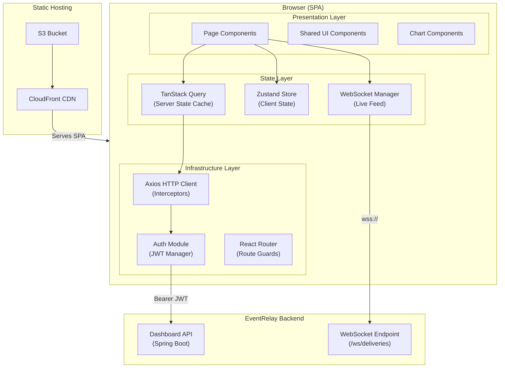
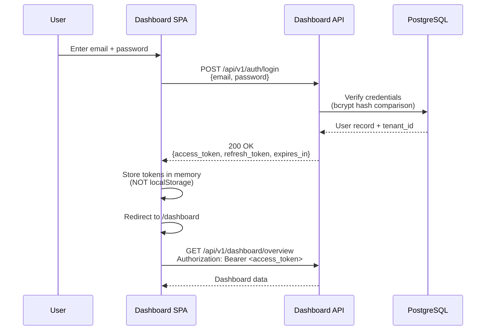
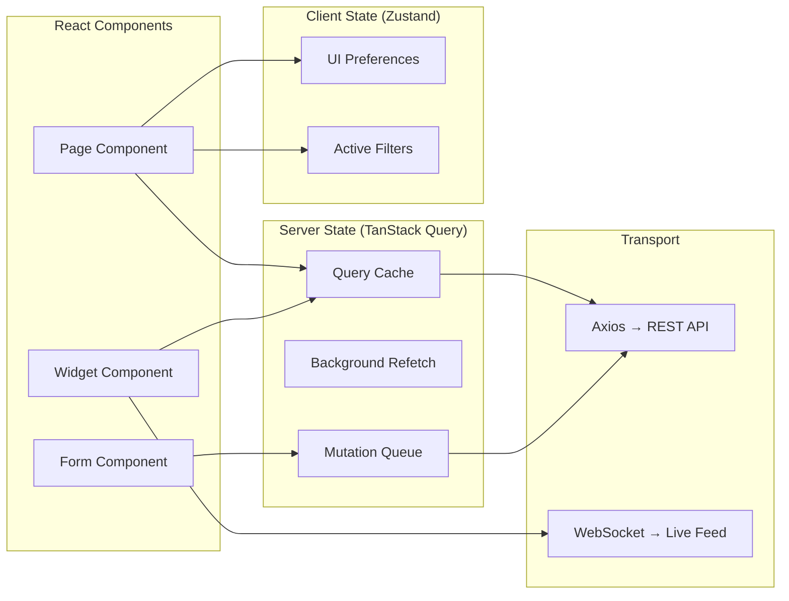

# Frontend Dashboard — UI Architecture

> **Document Status:** Living Document · **Last Updated:** 2026-07-10 · **Owner:** Platform Engineering

## 1. Overview

The EventRelay Dashboard is a **single-page application (SPA)** that provides tenants with operational visibility into their webhook delivery pipeline. It communicates exclusively with the Dashboard REST API and presents real-time metrics, delivery monitoring, DLQ management, replay controls, and tenant configuration.

> [!IMPORTANT]
> The dashboard is a **management plane** UI only. It does not participate in the event delivery hot path. All data flows through the Dashboard API — the frontend never connects directly to PostgreSQL, Redis, or SQS.

---

## 2. Technology Decisions

| Concern | Decision | Rationale |
|---|---|---|
| **Framework** | React 18 + TypeScript | Industry standard, massive ecosystem, strong typing reduces bugs |
| **Build Tool** | Vite 5 | Sub-second HMR, native ESM, 10-20× faster than CRA/Webpack |
| **Routing** | React Router v6 | Standard for React SPAs, supports nested layouts and loaders |
| **State Management** | TanStack Query (React Query) v5 + Zustand | Server state via React Query; minimal client state via Zustand |
| **Component Library** | shadcn/ui + Tailwind CSS v3 | Copy-paste components, full customization, no bundle bloat |
| **Charts** | Recharts 2.x | React-native charts, composable, good TypeScript support |
| **HTTP Client** | Axios 1.x with interceptors | Request/response interceptors for auth, retry, error normalization |
| **WebSocket** | Native WebSocket + reconnecting-websocket | Lightweight, no Socket.IO overhead needed |
| **Form Handling** | React Hook Form + Zod | Performant forms with schema-based validation |
| **Date Handling** | date-fns v3 | Tree-shakeable, immutable, no Moment.js bloat |
| **Testing** | Vitest + React Testing Library + Playwright | Unit/integration/E2E coverage |
| **Linting** | ESLint + Prettier + TypeScript strict mode | Consistent code quality |

> [!NOTE]
> **Why not Next.js?** The dashboard is a pure SPA with no SEO requirements. Server-side rendering adds operational complexity (Node.js server) without meaningful benefits for an authenticated management console. A static SPA deployed to S3 + CloudFront is simpler and cheaper.

---

## 3. Architecture Diagram



---

## 4. Authentication Flow

The dashboard uses **JWT-based authentication** issued by the Dashboard API. Tenants log in with email/password (or SSO), receive a JWT access token + refresh token, and the SPA manages token lifecycle automatically.

### 4.1 Login Sequence



### 4.2 Token Management

```typescript
// src/lib/auth.ts

interface AuthTokens {
  accessToken: string;
  refreshToken: string;
  expiresAt: number; // Unix timestamp in ms
}

class AuthManager {
  private tokens: AuthTokens | null = null;
  private refreshPromise: Promise<AuthTokens> | null = null;

  /**
   * Store tokens in memory only — never localStorage.
   * localStorage is vulnerable to XSS. Memory is cleared on tab close,
   * which is acceptable for a management console.
   */
  setTokens(tokens: AuthTokens): void {
    this.tokens = tokens;
    this.scheduleRefresh(tokens.expiresAt);
  }

  getAccessToken(): string | null {
    if (!this.tokens) return null;
    if (Date.now() >= this.tokens.expiresAt) return null;
    return this.tokens.accessToken;
  }

  /**
   * Refresh the access token 60 seconds before expiry.
   * Deduplicates concurrent refresh requests.
   */
  async refreshAccessToken(): Promise<AuthTokens> {
    if (this.refreshPromise) return this.refreshPromise;

    this.refreshPromise = axios
      .post<AuthTokens>('/api/v1/auth/refresh', {
        refresh_token: this.tokens?.refreshToken,
      })
      .then((res) => {
        this.setTokens(res.data);
        return res.data;
      })
      .finally(() => {
        this.refreshPromise = null;
      });

    return this.refreshPromise;
  }

  private scheduleRefresh(expiresAt: number): void {
    const refreshAt = expiresAt - 60_000; // 60s before expiry
    const delay = Math.max(refreshAt - Date.now(), 0);
    setTimeout(() => this.refreshAccessToken(), delay);
  }

  logout(): void {
    this.tokens = null;
    window.location.href = '/login';
  }
}

export const authManager = new AuthManager();
```

### 4.3 Axios Interceptors

```typescript
// src/lib/api-client.ts

import axios, { AxiosError, InternalAxiosRequestConfig } from 'axios';
import { authManager } from './auth';

const apiClient = axios.create({
  baseURL: import.meta.env.VITE_API_BASE_URL || '/api/v1',
  timeout: 15_000,
  headers: { 'Content-Type': 'application/json' },
});

// Request interceptor — attach JWT
apiClient.interceptors.request.use(
  async (config: InternalAxiosRequestConfig) => {
    let token = authManager.getAccessToken();

    // If token is expired, try refresh
    if (!token) {
      try {
        const newTokens = await authManager.refreshAccessToken();
        token = newTokens.accessToken;
      } catch {
        authManager.logout();
        return Promise.reject(new Error('Session expired'));
      }
    }

    config.headers.Authorization = `Bearer ${token}`;
    return config;
  }
);

// Response interceptor — handle 401
apiClient.interceptors.response.use(
  (response) => response,
  async (error: AxiosError) => {
    if (error.response?.status === 401) {
      try {
        const tokens = await authManager.refreshAccessToken();
        // Retry original request with new token
        const config = error.config!;
        config.headers.Authorization = `Bearer ${tokens.accessToken}`;
        return apiClient.request(config);
      } catch {
        authManager.logout();
      }
    }

    return Promise.reject(normalizeError(error));
  }
);

function normalizeError(error: AxiosError): AppError {
  return {
    status: error.response?.status ?? 0,
    code: (error.response?.data as any)?.error?.code ?? 'UNKNOWN_ERROR',
    message: (error.response?.data as any)?.error?.message ?? error.message,
    requestId: error.response?.headers['x-request-id'],
  };
}

export interface AppError {
  status: number;
  code: string;
  message: string;
  requestId?: string;
}

export { apiClient };
```

### 4.4 JWT Payload Structure

```json
{
  "sub": "user_01H5KBQ3XR...",
  "tenant_id": "tenant_01H5KBQ3...",
  "email": "admin@acme.com",
  "role": "TENANT_ADMIN",
  "permissions": [
    "events:read",
    "events:write",
    "subscriptions:manage",
    "dlq:manage",
    "settings:manage"
  ],
  "iat": 1720000000,
  "exp": 1720003600,
  "iss": "eventrelay-dashboard-api"
}
```

### 4.5 Security Configuration

| Parameter | Value | Rationale |
|---|---|---|
| Access token TTL | 60 minutes | Balance between security and UX |
| Refresh token TTL | 7 days | Allows persistent sessions without re-login |
| Token storage | In-memory only | Prevents XSS token theft |
| Refresh token rotation | Enabled | Each refresh invalidates the previous refresh token |
| CSRF protection | SameSite=Strict cookies | Not needed for Bearer token auth, but set anyway |
| CSP headers | Strict policy via CloudFront | Mitigates XSS and injection attacks |

---

## 5. State Management Architecture

### 5.1 Server State — TanStack Query

All API-fetched data is managed by TanStack Query. This provides automatic caching, background refetching, stale-while-revalidate, and request deduplication for free.

```typescript
// src/hooks/use-dashboard-overview.ts

import { useQuery } from '@tanstack/react-query';
import { apiClient } from '@/lib/api-client';

interface DashboardOverview {
  deliverySuccessRate: number;
  totalEvents24h: number;
  activeSubscriptions: number;
  dlqDepth: number;
  recentActivity: ActivityEntry[];
}

export function useDashboardOverview() {
  return useQuery({
    queryKey: ['dashboard', 'overview'],
    queryFn: () =>
      apiClient.get<DashboardOverview>('/dashboard/overview').then((r) => r.data),
    staleTime: 30_000,        // Data considered fresh for 30s
    refetchInterval: 60_000,  // Auto-refresh every 60s
    refetchOnWindowFocus: true,
    retry: 3,
    retryDelay: (attempt) => Math.min(1000 * 2 ** attempt, 10_000),
  });
}
```

### 5.2 Client State — Zustand

Minimal client-only state (UI preferences, sidebar state, filters) lives in Zustand stores:

```typescript
// src/stores/ui-store.ts

import { create } from 'zustand';
import { persist } from 'zustand/middleware';

interface UIState {
  sidebarCollapsed: boolean;
  theme: 'light' | 'dark' | 'system';
  timezone: string;
  dateFormat: 'relative' | 'absolute';
  toggleSidebar: () => void;
  setTheme: (theme: UIState['theme']) => void;
}

export const useUIStore = create<UIState>()(
  persist(
    (set) => ({
      sidebarCollapsed: false,
      theme: 'system',
      timezone: Intl.DateTimeFormat().resolvedOptions().timeZone,
      dateFormat: 'relative',
      toggleSidebar: () => set((s) => ({ sidebarCollapsed: !s.sidebarCollapsed })),
      setTheme: (theme) => set({ theme }),
    }),
    { name: 'eventrelay-ui-prefs' }
  )
);
```

### 5.3 State Architecture Diagram



---

## 6. Component Architecture

### 6.1 Project Structure

```
src/
├── app/
│   ├── layout.tsx              # Root layout (sidebar + header)
│   └── routes.tsx              # Route definitions
├── pages/
│   ├── dashboard/
│   │   └── DashboardPage.tsx   # Overview page
│   ├── deliveries/
│   │   ├── DeliveryMonitorPage.tsx
│   │   └── DeliveryDetailPage.tsx
│   ├── events/
│   │   ├── EventExplorerPage.tsx
│   │   └── EventDetailPage.tsx
│   ├── dlq/
│   │   ├── DLQManagerPage.tsx
│   │   └── DLQDetailPage.tsx
│   ├── replay/
│   │   └── ReplayPage.tsx
│   ├── metrics/
│   │   └── MetricsPage.tsx
│   ├── settings/
│   │   ├── SettingsLayout.tsx
│   │   ├── GeneralSettingsPage.tsx
│   │   ├── APIKeysPage.tsx
│   │   ├── SubscriptionsPage.tsx
│   │   └── SigningSecretsPage.tsx
│   └── auth/
│       ├── LoginPage.tsx
│       └── ForgotPasswordPage.tsx
├── components/
│   ├── ui/                     # shadcn/ui primitives
│   │   ├── button.tsx
│   │   ├── card.tsx
│   │   ├── data-table.tsx
│   │   ├── dialog.tsx
│   │   ├── dropdown-menu.tsx
│   │   ├── input.tsx
│   │   ├── select.tsx
│   │   ├── sheet.tsx
│   │   ├── skeleton.tsx
│   │   ├── tabs.tsx
│   │   └── toast.tsx
│   ├── layout/
│   │   ├── Sidebar.tsx
│   │   ├── Header.tsx
│   │   ├── Breadcrumbs.tsx
│   │   └── PageContainer.tsx
│   ├── charts/
│   │   ├── SuccessRateChart.tsx
│   │   ├── ThroughputChart.tsx
│   │   ├── LatencyHistogram.tsx
│   │   └── ErrorBreakdownPie.tsx
│   ├── delivery/
│   │   ├── DeliveryFeed.tsx
│   │   ├── DeliveryTimeline.tsx
│   │   └── DeliveryStatusBadge.tsx
│   ├── events/
│   │   ├── EventSearch.tsx
│   │   ├── PayloadViewer.tsx
│   │   └── EventMetadata.tsx
│   └── common/
│       ├── EmptyState.tsx
│       ├── ErrorBoundary.tsx
│       ├── LoadingSkeleton.tsx
│       ├── ConfirmDialog.tsx
│       ├── CopyButton.tsx
│       └── RelativeTime.tsx
├── hooks/
│   ├── use-dashboard-overview.ts
│   ├── use-deliveries.ts
│   ├── use-events.ts
│   ├── use-dlq.ts
│   ├── use-subscriptions.ts
│   ├── use-websocket.ts
│   └── use-debounce.ts
├── lib/
│   ├── api-client.ts           # Axios instance + interceptors
│   ├── auth.ts                 # JWT token manager
│   ├── websocket.ts            # WebSocket connection manager
│   ├── constants.ts            # App-wide constants
│   └── utils.ts                # Utility functions
├── stores/
│   ├── ui-store.ts             # UI preferences (Zustand)
│   └── filter-store.ts         # Active filter state (Zustand)
├── types/
│   ├── api.ts                  # API response types
│   ├── events.ts               # Event domain types
│   ├── deliveries.ts           # Delivery domain types
│   └── subscriptions.ts        # Subscription domain types
└── styles/
    └── globals.css             # Tailwind directives + custom CSS
```

### 6.2 Routing Configuration

```typescript
// src/app/routes.tsx

import { createBrowserRouter, Navigate } from 'react-router-dom';
import { ProtectedRoute } from '@/components/auth/ProtectedRoute';
import { AppLayout } from '@/app/layout';

export const router = createBrowserRouter([
  {
    path: '/login',
    lazy: () => import('@/pages/auth/LoginPage'),
  },
  {
    element: <ProtectedRoute />,
    children: [
      {
        element: <AppLayout />,
        children: [
          { index: true, element: <Navigate to="/dashboard" replace /> },
          {
            path: 'dashboard',
            lazy: () => import('@/pages/dashboard/DashboardPage'),
          },
          {
            path: 'deliveries',
            lazy: () => import('@/pages/deliveries/DeliveryMonitorPage'),
          },
          {
            path: 'deliveries/:deliveryId',
            lazy: () => import('@/pages/deliveries/DeliveryDetailPage'),
          },
          {
            path: 'events',
            lazy: () => import('@/pages/events/EventExplorerPage'),
          },
          {
            path: 'events/:eventId',
            lazy: () => import('@/pages/events/EventDetailPage'),
          },
          {
            path: 'dlq',
            lazy: () => import('@/pages/dlq/DLQManagerPage'),
          },
          {
            path: 'replay',
            lazy: () => import('@/pages/replay/ReplayPage'),
          },
          {
            path: 'metrics',
            lazy: () => import('@/pages/metrics/MetricsPage'),
          },
          {
            path: 'settings',
            lazy: () => import('@/pages/settings/SettingsLayout'),
            children: [
              { index: true, element: <Navigate to="general" replace /> },
              {
                path: 'general',
                lazy: () => import('@/pages/settings/GeneralSettingsPage'),
              },
              {
                path: 'api-keys',
                lazy: () => import('@/pages/settings/APIKeysPage'),
              },
              {
                path: 'subscriptions',
                lazy: () => import('@/pages/settings/SubscriptionsPage'),
              },
              {
                path: 'signing-secrets',
                lazy: () => import('@/pages/settings/SigningSecretsPage'),
              },
            ],
          },
        ],
      },
    ],
  },
]);
```

---

## 7. Responsive Design

### 7.1 Breakpoint System

EventRelay uses Tailwind's default breakpoint system with a **desktop-first** approach (most users are on desktop for operations dashboards):

| Breakpoint | Min Width | Target |
|---|---|---|
| `sm` | 640px | Large phones (landscape) |
| `md` | 768px | Tablets |
| `lg` | 1024px | Small laptops |
| `xl` | 1280px | Desktops |
| `2xl` | 1536px | Large displays |

### 7.2 Layout Behavior

| Viewport | Sidebar | Data Tables | Charts | Navigation |
|---|---|---|---|---|
| `>= 1024px` | Fixed sidebar (256px) | Full columns | Side-by-side | Sidebar nav |
| `768–1023px` | Collapsible sidebar (icon only, 64px) | Reduced columns | Stacked | Sidebar (icons) |
| `< 768px` | Hidden, hamburger menu | Card layout | Full-width stacked | Bottom tab bar |

```typescript
// src/components/layout/Sidebar.tsx — responsive behavior

export function Sidebar() {
  const { sidebarCollapsed, toggleSidebar } = useUIStore();

  return (
    <>
      {/* Desktop sidebar */}
      <aside
        className={cn(
          'hidden lg:flex flex-col border-r bg-background transition-all duration-200',
          sidebarCollapsed ? 'w-16' : 'w-64'
        )}
      >
        <SidebarContent collapsed={sidebarCollapsed} />
      </aside>

      {/* Mobile sheet */}
      <Sheet>
        <SheetTrigger asChild className="lg:hidden">
          <Button variant="ghost" size="icon">
            <Menu className="h-5 w-5" />
          </Button>
        </SheetTrigger>
        <SheetContent side="left" className="w-64 p-0">
          <SidebarContent collapsed={false} />
        </SheetContent>
      </Sheet>
    </>
  );
}
```

---

## 8. Dark Mode Support

### 8.1 Implementation Strategy

Dark mode is implemented via Tailwind's `class` strategy, allowing three modes: **light**, **dark**, and **system** (follows OS preference).

```typescript
// src/lib/theme.ts

export function applyTheme(theme: 'light' | 'dark' | 'system'): void {
  const root = document.documentElement;

  if (theme === 'system') {
    const prefersDark = window.matchMedia('(prefers-color-scheme: dark)').matches;
    root.classList.toggle('dark', prefersDark);
  } else {
    root.classList.toggle('dark', theme === 'dark');
  }
}

// Listen for OS theme changes when in 'system' mode
export function watchSystemTheme(callback: (isDark: boolean) => void): () => void {
  const mq = window.matchMedia('(prefers-color-scheme: dark)');
  const handler = (e: MediaQueryListEvent) => callback(e.matches);
  mq.addEventListener('change', handler);
  return () => mq.removeEventListener('change', handler);
}
```

### 8.2 Design Tokens (CSS Variables)

```css
/* src/styles/globals.css */

@tailwind base;
@tailwind components;
@tailwind utilities;

@layer base {
  :root {
    --background: 0 0% 100%;
    --foreground: 222.2 84% 4.9%;
    --card: 0 0% 100%;
    --card-foreground: 222.2 84% 4.9%;
    --primary: 221.2 83.2% 53.3%;
    --primary-foreground: 210 40% 98%;
    --secondary: 210 40% 96.1%;
    --muted: 210 40% 96.1%;
    --muted-foreground: 215.4 16.3% 46.9%;
    --destructive: 0 84.2% 60.2%;
    --border: 214.3 31.8% 91.4%;
    --ring: 221.2 83.2% 53.3%;
    --success: 142 76% 36%;
    --warning: 38 92% 50%;
    --chart-1: 221.2 83.2% 53.3%;
    --chart-2: 142 76% 36%;
    --chart-3: 38 92% 50%;
    --chart-4: 0 84.2% 60.2%;
    --chart-5: 262 83% 58%;
  }

  .dark {
    --background: 222.2 84% 4.9%;
    --foreground: 210 40% 98%;
    --card: 222.2 84% 4.9%;
    --card-foreground: 210 40% 98%;
    --primary: 217.2 91.2% 59.8%;
    --primary-foreground: 222.2 47.4% 11.2%;
    --secondary: 217.2 32.6% 17.5%;
    --muted: 217.2 32.6% 17.5%;
    --muted-foreground: 215 20.2% 65.1%;
    --destructive: 0 62.8% 30.6%;
    --border: 217.2 32.6% 17.5%;
    --ring: 224.3 76.3% 48%;
    --success: 142 70% 45%;
    --warning: 38 92% 50%;
    --chart-1: 217.2 91.2% 59.8%;
    --chart-2: 142 70% 45%;
    --chart-3: 38 92% 50%;
    --chart-4: 0 62.8% 50.6%;
    --chart-5: 262 83% 68%;
  }
}
```

---

## 9. WebSocket Integration

### 9.1 Connection Manager

```typescript
// src/lib/websocket.ts

import ReconnectingWebSocket from 'reconnecting-websocket';
import { authManager } from './auth';

type MessageHandler = (data: WebSocketMessage) => void;

export interface WebSocketMessage {
  type: 'DELIVERY_UPDATE' | 'DLQ_EVENT' | 'METRIC_UPDATE';
  payload: Record<string, unknown>;
  timestamp: string;
}

class WebSocketManager {
  private ws: ReconnectingWebSocket | null = null;
  private handlers = new Map<string, Set<MessageHandler>>();

  connect(): void {
    const token = authManager.getAccessToken();
    if (!token) return;

    const wsUrl = `${import.meta.env.VITE_WS_URL}/ws/deliveries?token=${token}`;

    this.ws = new ReconnectingWebSocket(wsUrl, [], {
      maxRetries: 20,
      connectionTimeout: 5_000,
      maxReconnectionDelay: 30_000,
      minReconnectionDelay: 1_000,
    });

    this.ws.onmessage = (event: MessageEvent) => {
      const msg: WebSocketMessage = JSON.parse(event.data);
      const handlers = this.handlers.get(msg.type);
      handlers?.forEach((handler) => handler(msg));
    };

    this.ws.onclose = (event) => {
      console.warn(`WebSocket closed: code=${event.code} reason=${event.reason}`);
    };
  }

  subscribe(type: string, handler: MessageHandler): () => void {
    if (!this.handlers.has(type)) {
      this.handlers.set(type, new Set());
    }
    this.handlers.get(type)!.add(handler);

    // Return unsubscribe function
    return () => {
      this.handlers.get(type)?.delete(handler);
    };
  }

  disconnect(): void {
    this.ws?.close();
    this.ws = null;
    this.handlers.clear();
  }
}

export const wsManager = new WebSocketManager();
```

### 9.2 React Hook

```typescript
// src/hooks/use-websocket.ts

import { useEffect, useRef } from 'react';
import { wsManager, WebSocketMessage } from '@/lib/websocket';

export function useWebSocket(
  type: WebSocketMessage['type'],
  handler: (msg: WebSocketMessage) => void
): void {
  const handlerRef = useRef(handler);
  handlerRef.current = handler;

  useEffect(() => {
    const unsubscribe = wsManager.subscribe(type, (msg) => {
      handlerRef.current(msg);
    });
    return unsubscribe;
  }, [type]);
}
```

---

## 10. Error Handling & Boundaries

```typescript
// src/components/common/ErrorBoundary.tsx

import { Component, ErrorInfo, ReactNode } from 'react';
import { AlertTriangle } from 'lucide-react';
import { Button } from '@/components/ui/button';

interface Props {
  children: ReactNode;
  fallback?: ReactNode;
}

interface State {
  hasError: boolean;
  error?: Error;
}

export class ErrorBoundary extends Component<Props, State> {
  state: State = { hasError: false };

  static getDerivedStateFromError(error: Error): State {
    return { hasError: true, error };
  }

  componentDidCatch(error: Error, errorInfo: ErrorInfo): void {
    console.error('ErrorBoundary caught:', error, errorInfo);
    // Send to error tracking service (Sentry, etc.)
  }

  render() {
    if (this.state.hasError) {
      return (
        this.props.fallback ?? (
          <div className="flex flex-col items-center justify-center p-12 text-center">
            <AlertTriangle className="h-12 w-12 text-destructive mb-4" />
            <h3 className="text-lg font-semibold mb-2">Something went wrong</h3>
            <p className="text-muted-foreground mb-4 max-w-md">
              {this.state.error?.message ?? 'An unexpected error occurred.'}
            </p>
            <Button onClick={() => this.setState({ hasError: false })}>
              Try Again
            </Button>
          </div>
        )
      );
    }

    return this.props.children;
  }
}
```

---

## 11. Build & Deployment

### 11.1 Build Pipeline

```yaml
# .github/workflows/dashboard-deploy.yml

name: Deploy Dashboard
on:
  push:
    branches: [main]
    paths: ['dashboard/**']

jobs:
  build-and-deploy:
    runs-on: ubuntu-latest
    steps:
      - uses: actions/checkout@v4

      - uses: actions/setup-node@v4
        with:
          node-version: '20'
          cache: 'npm'
          cache-dependency-path: dashboard/package-lock.json

      - name: Install dependencies
        run: npm ci
        working-directory: dashboard

      - name: Type check
        run: npx tsc --noEmit
        working-directory: dashboard

      - name: Lint
        run: npm run lint
        working-directory: dashboard

      - name: Test
        run: npm run test -- --run
        working-directory: dashboard

      - name: Build
        run: npm run build
        working-directory: dashboard
        env:
          VITE_API_BASE_URL: ${{ vars.API_BASE_URL }}
          VITE_WS_URL: ${{ vars.WS_URL }}

      - name: Deploy to S3
        run: aws s3 sync dist/ s3://${{ vars.DASHBOARD_BUCKET }}/ --delete
        working-directory: dashboard

      - name: Invalidate CloudFront
        run: |
          aws cloudfront create-invalidation \
            --distribution-id ${{ vars.CF_DISTRIBUTION_ID }} \
            --paths "/*"
```

### 11.2 Environment Configuration

| Variable | Development | Staging | Production |
|---|---|---|---|
| `VITE_API_BASE_URL` | `http://localhost:8080/api/v1` | `https://api.staging.eventrelay.io/api/v1` | `https://api.eventrelay.io/api/v1` |
| `VITE_WS_URL` | `ws://localhost:8080` | `wss://api.staging.eventrelay.io` | `wss://api.eventrelay.io` |

---

## 12. Performance Optimization

| Technique | Implementation | Impact |
|---|---|---|
| **Code splitting** | `lazy()` imports for all route pages | Reduce initial bundle by ~60% |
| **Query deduplication** | TanStack Query deduplicates identical in-flight requests | Prevents redundant API calls |
| **Virtualized lists** | `@tanstack/react-virtual` for long delivery/event lists | Render 10K+ rows at 60fps |
| **Optimistic updates** | Mutations update cache before server confirms | Instant UI feedback |
| **Image optimization** | Preload critical icons, lazy-load non-critical assets | Faster LCP |
| **Bundle analysis** | `rollup-plugin-visualizer` in CI | Catch bundle regressions |

### Performance Budgets

| Metric | Target | Measurement |
|---|---|---|
| First Contentful Paint | < 1.5s | Lighthouse CI |
| Largest Contentful Paint | < 2.5s | Lighthouse CI |
| Total Blocking Time | < 200ms | Lighthouse CI |
| Initial JS bundle | < 200 KB (gzip) | Build output |
| Per-route chunk | < 50 KB (gzip) | Build output |

---

## 13. Cross-References

| Document | Relevance |
|---|---|
| [REST_API.md](../02_Ingestion_Service/REST_API.md) | Backend API the dashboard consumes |
| [Tenant_Dashboard.md](./Tenant_Dashboard.md) | Dashboard overview page design |
| [Delivery_Monitor.md](./Delivery_Monitor.md) | Real-time delivery feed UI |
| [Metrics.md](./Metrics.md) | Metrics dashboard charts and data |
| [DLQ_Manager.md](./DLQ_Manager.md) | Dead letter queue management UI |
| [Settings.md](./Settings.md) | Tenant configuration pages |
