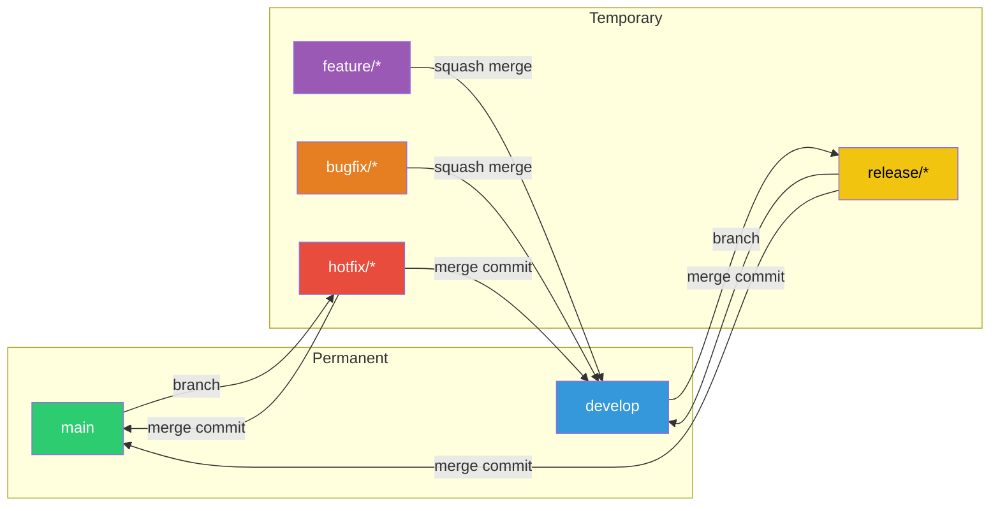
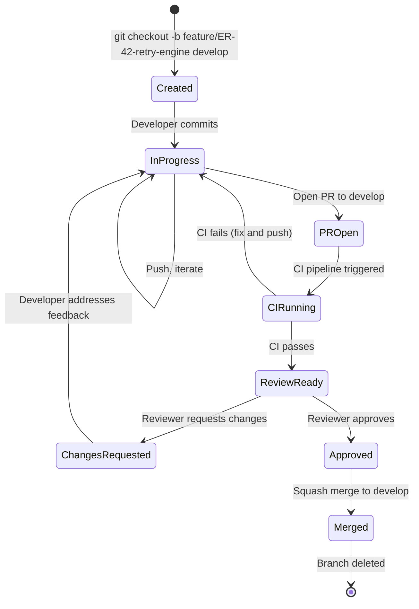
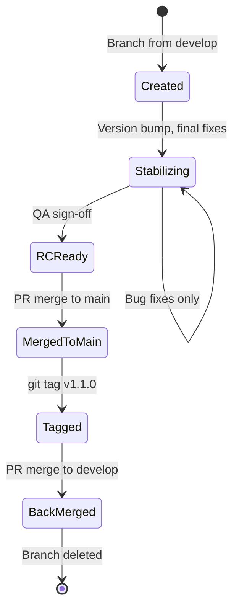
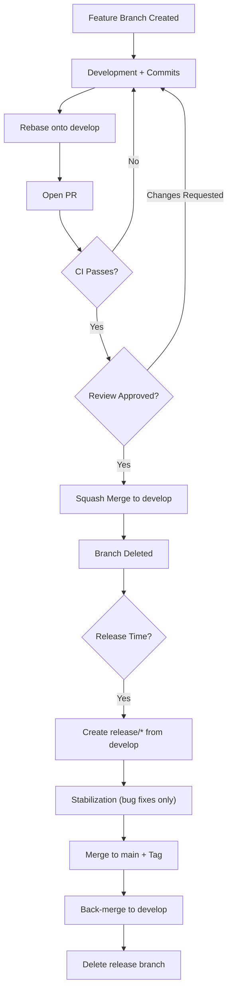

# Branching Model

> **EventRelay — Reliable Webhook Delivery Platform**
> Detailed branching model, branch lifecycle, protection rules, and merge strategies.

---

## 1. Overview

EventRelay uses a **modified Gitflow** branching model designed for a team of 3–15 engineers working on a microservices-oriented backend platform. The model provides clear separation between development, stabilization, and production while supporting parallel feature work and rapid hotfix deployment.



---

## 2. Branch Types — Deep Dive

### 2.1 `main` Branch

| Property | Value |
|---|---|
| **Purpose** | Production-ready code; every commit is deployable |
| **Lifetime** | Permanent |
| **Created From** | Initial repository setup |
| **Merges From** | `release/*`, `hotfix/*` only |
| **Protected** | Yes (see Section 5) |
| **CI/CD** | Auto-deploys to production on merge |

**Invariants:**
- Every commit on `main` has a corresponding version tag
- `main` is always in a deployable state
- No direct commits (all changes via PR merge)
- Linear history via merge commits (no rebasing onto main)

### 2.2 `develop` Branch

| Property | Value |
|---|---|
| **Purpose** | Integration branch for the next planned release |
| **Lifetime** | Permanent |
| **Created From** | `main` (initially) |
| **Merges From** | `feature/*`, `bugfix/*`, `release/*` (back-merge), `hotfix/*` (back-merge) |
| **Protected** | Yes (see Section 5) |
| **CI/CD** | Auto-deploys to staging environment |

**Invariants:**
- `develop` should always compile and pass tests
- Feature branches are squash-merged into `develop`
- Nightly integration test suite runs against `develop`

### 2.3 `feature/*` Branches

| Property | Value |
|---|---|
| **Purpose** | Develop new features in isolation |
| **Lifetime** | Temporary (days to 2 weeks max) |
| **Created From** | `develop` |
| **Merges To** | `develop` (via squash merge PR) |
| **Naming** | `feature/{ticket}-{short-description}` |
| **Deleted After** | Merge to develop |

**Lifecycle:**



**Guidelines:**
- Rebase onto `develop` regularly (at least every 2 days) to minimize merge conflicts
- Keep branches short-lived — if a feature takes > 2 weeks, break it into sub-features behind a feature flag
- Push daily to enable CI and backup

```bash
# Create feature branch
git checkout develop
git pull origin develop
git checkout -b feature/ER-42-retry-engine

# Regular rebase to stay current
git fetch origin
git rebase origin/develop

# Resolve conflicts during rebase
# Edit conflicted files, then:
git add <resolved-files>
git rebase --continue

# Push (force-with-lease after rebase)
git push --force-with-lease origin feature/ER-42-retry-engine
```

### 2.4 `bugfix/*` Branches

| Property | Value |
|---|---|
| **Purpose** | Fix non-critical bugs discovered during development |
| **Lifetime** | Temporary (hours to days) |
| **Created From** | `develop` |
| **Merges To** | `develop` (via squash merge PR) |
| **Naming** | `bugfix/{ticket}-{short-description}` |

Follows the same lifecycle as `feature/*` branches.

### 2.5 `release/*` Branches

| Property | Value |
|---|---|
| **Purpose** | Stabilize a release candidate |
| **Lifetime** | Temporary (3–7 days typically) |
| **Created From** | `develop` |
| **Merges To** | `main` AND `develop` (via merge commit PRs) |
| **Naming** | `release/{major}.{minor}.{patch}` |
| **Allowed Commits** | Bug fixes, version bumps, documentation only |

**Lifecycle:**



**Rules:**
- No new features on release branches
- Only bug fixes, documentation, and version bumps
- Must pass full regression test suite before merge to `main`
- Back-merge to `develop` immediately after merging to `main`

```bash
# Create release branch
git checkout develop
git pull origin develop
git checkout -b release/1.1.0

# Bump version
mvn versions:set -DnewVersion=1.1.0
mvn versions:commit
git commit -am "chore: bump version to 1.1.0"

# After stabilization — merge to main (via PR)
# Then tag on main
git checkout main
git pull origin main
git tag -a v1.1.0 -m "Release v1.1.0"
git push origin v1.1.0

# Back-merge to develop (via PR)
# Then delete
git push origin --delete release/1.1.0
```

### 2.6 `hotfix/*` Branches

| Property | Value |
|---|---|
| **Purpose** | Emergency fixes for production issues |
| **Lifetime** | Temporary (hours) |
| **Created From** | `main` |
| **Merges To** | `main` AND `develop` (via merge commit PRs) |
| **Naming** | `hotfix/{ticket}-{short-description}` |

> [!CAUTION]
> Hotfix branches bypass the normal release process. Use only for P0/P1 production incidents. Every hotfix must still pass CI and receive at least one review (can be expedited).

```bash
# Emergency hotfix
git checkout main
git pull origin main
git checkout -b hotfix/ER-301-sig-bypass

# Fix, test, commit
git commit -m "fix(api): validate HMAC before payload processing"

# PR to main (expedited review)
# After merge, tag patch release
git checkout main
git tag -a v1.1.1 -m "Hotfix v1.1.1"
git push origin v1.1.1

# Back-merge to develop (via PR)
git push origin --delete hotfix/ER-301-sig-bypass
```

---

## 3. Merge Strategies

### 3.1 Strategy Matrix

| Merge Type | When Used | Commit History |
|---|---|---|
| **Squash Merge** | `feature/*` → `develop`, `bugfix/*` → `develop` | Single clean commit on target |
| **Merge Commit** | `release/*` → `main`, `hotfix/*` → `main` | Preserves full branch history |
| **Merge Commit** | `release/*` → `develop`, `hotfix/*` → `develop` | Preserves merge point |

### 3.2 Why Squash for Features?

- **Clean history on develop:** Each feature is a single commit, making `git log` readable
- **Easier reverts:** Reverting a feature = reverting one commit
- **Atomic bisect:** `git bisect` on `develop` tests whole features, not individual WIP commits

### 3.3 Why Merge Commits for Releases?

- **Traceability:** The merge commit records exactly when a release was integrated
- **Tag association:** Release tags point to merge commits on `main`
- **Audit trail:** Full release branch history preserved for compliance

---

## 4. Conflict Resolution

### 4.1 Prevention

| Practice | How It Helps |
|---|---|
| Small, focused PRs | Fewer files changed = fewer conflicts |
| Regular rebase onto `develop` | Catch conflicts early while context is fresh |
| Clear module ownership | Reduces concurrent edits to same files |
| Database migration naming (timestamps) | Avoids migration ordering conflicts |
| Feature flags | Allows merging incomplete features safely |

### 4.2 Resolution Process

```bash
# During rebase
git fetch origin
git rebase origin/develop

# If conflicts arise:
# 1. Git will pause and show conflicted files
# 2. Open each conflicted file, resolve markers
#    <<<<<<< HEAD
#    (your changes)
#    =======
#    (upstream changes)
#    >>>>>>> origin/develop

# 3. After resolving all files:
git add <resolved-files>
git rebase --continue

# 4. If rebase is too complex, abort and consider a merge instead:
git rebase --abort
```

### 4.3 Conflict Escalation

| Scenario | Action |
|---|---|
| Simple text conflict | Developer resolves during rebase |
| Conflicting business logic | Both developers discuss and agree on resolution |
| Conflicting database migrations | Renumber the later migration, verify full migration chain |
| Conflicting API contract changes | Tech lead decides; may require deprecation strategy |

---

## 5. Branch Protection Rules

### 5.1 `main` Branch Protection

| Rule | Setting |
|---|---|
| Require pull request reviews | ✅ Enabled |
| Required approving reviews | **2** |
| Dismiss stale reviews on new push | ✅ Enabled |
| Require review from code owners | ✅ Enabled |
| Require status checks to pass | ✅ Enabled |
| Required status checks | `build`, `test`, `checkstyle`, `spotbugs`, `fmt-check` |
| Require branches to be up to date | ✅ Enabled |
| Require signed commits | ✅ Enabled (GPG or SSH) |
| Require linear history | ❌ Disabled (merge commits allowed) |
| Allow force pushes | ❌ **Never** |
| Allow deletions | ❌ **Never** |
| Include administrators | ✅ Enabled (no bypass) |
| Restrict push access | Only CI bot and release automation |

### 5.2 `develop` Branch Protection

| Rule | Setting |
|---|---|
| Require pull request reviews | ✅ Enabled |
| Required approving reviews | **1** |
| Dismiss stale reviews on new push | ✅ Enabled |
| Require status checks to pass | ✅ Enabled |
| Required status checks | `build`, `test`, `fmt-check` |
| Allow force pushes | ❌ **Never** |
| Allow deletions | ❌ **Never** |

### 5.3 Feature Branch Settings

| Rule | Setting |
|---|---|
| Branch protection | ❌ Not protected (developer owned) |
| Force push | ✅ Allowed (for rebase workflow) |
| Auto-delete on merge | ✅ Enabled |
| Stale branch cleanup | Branches > 30 days without activity get warning |

### 5.4 CODEOWNERS

```
# .github/CODEOWNERS

# Default owners for everything
*                              @eventrelay/platform-team

# Module-specific owners
/eventrelay-api/               @eventrelay/api-team
/eventrelay-dispatcher/        @eventrelay/dispatcher-team
/eventrelay-core/              @eventrelay/platform-team

# Infrastructure
/docker/                       @eventrelay/devops
/.github/                      @eventrelay/devops
/config/                       @eventrelay/platform-team

# Database migrations require DBA review
**/db/migration/               @eventrelay/dba-reviewers

# Security-sensitive code requires security review
**/crypto/                     @eventrelay/security-team
**/security/                   @eventrelay/security-team
**/signing/                    @eventrelay/security-team
**/auth/                       @eventrelay/security-team
```

---

## 6. Release Branch Management

### 6.1 When to Create a Release Branch

- All planned features for the release are merged to `develop`
- `develop` passes full integration test suite
- Product/tech lead approves the feature set for release
- Typically on a **bi-weekly** or **monthly** cadence

### 6.2 Release Candidate Checklist

| # | Check | Owner |
|---|---|---|
| 1 | All planned features merged to `develop` | Tech Lead |
| 2 | Full integration test suite passes | CI/QA |
| 3 | Performance regression test passes | QA |
| 4 | Security scan (OWASP) passes | Security |
| 5 | Database migrations tested (up + down) | DBA |
| 6 | API documentation (OpenAPI) up to date | API Team |
| 7 | CHANGELOG.md updated | Release Manager |
| 8 | Version bumped in all POMs | Release Manager |
| 9 | Staging deployment successful | DevOps |
| 10 | Smoke tests pass on staging | QA |

### 6.3 Release Calendar

| Release | Branch Date | Stabilization | Production | Type |
|---|---|---|---|---|
| v1.0.0 | Sprint 12 end | 5 days | Sprint 13 start | Major |
| v1.1.0 | Monthly | 3 days | Following Monday | Minor |
| v1.x.y | As needed | 1 day | ASAP | Patch/Hotfix |

---

## 7. Branch Lifecycle Summary



---

## 8. Common Scenarios

### 8.1 Feature Depends on Another Feature

```bash
# Option A: Stack branches (if features are sequential)
git checkout -b feature/ER-43-retry-metrics feature/ER-42-retry-engine
# PR: ER-43 → develop (after ER-42 is merged)

# Option B: Wait for the dependency to merge
# Merge ER-42 first, then create ER-43 from develop
```

### 8.2 Release Branch Bug Fix

```bash
# Fix a bug found during release stabilization
git checkout release/1.1.0
git checkout -b bugfix/ER-200-release-fix
# Fix, test, PR to release/1.1.0
```

### 8.3 Concurrent Releases (Rare)

> [!WARNING]
> Avoid concurrent release branches. If unavoidable (e.g., emergency hotfix during active release), coordinate via team Slack channel and ensure back-merges are applied in correct order.

---

## 9. Related Documents

- [Git_Strategy.md](./Git_Strategy.md) — Commit conventions, PR templates, and CI integration
- [Contributing.md](./Contributing.md) — Step-by-step contributing workflow
- [Coding_Standards.md](./Coding_Standards.md) — Code review checklist

---

> **Last Updated:** 2026-07-10
> **Owner:** EventRelay Platform Team
