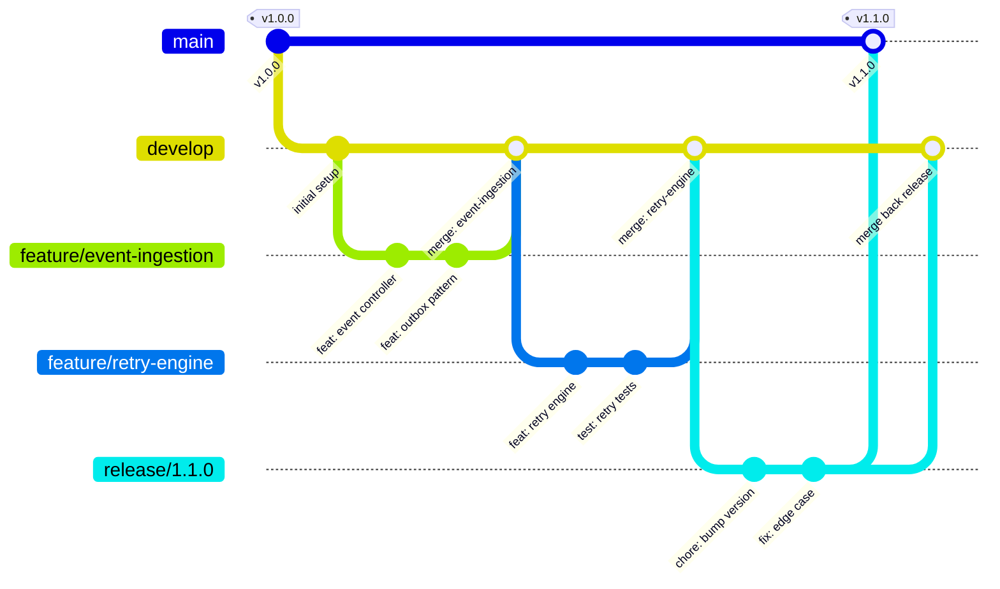
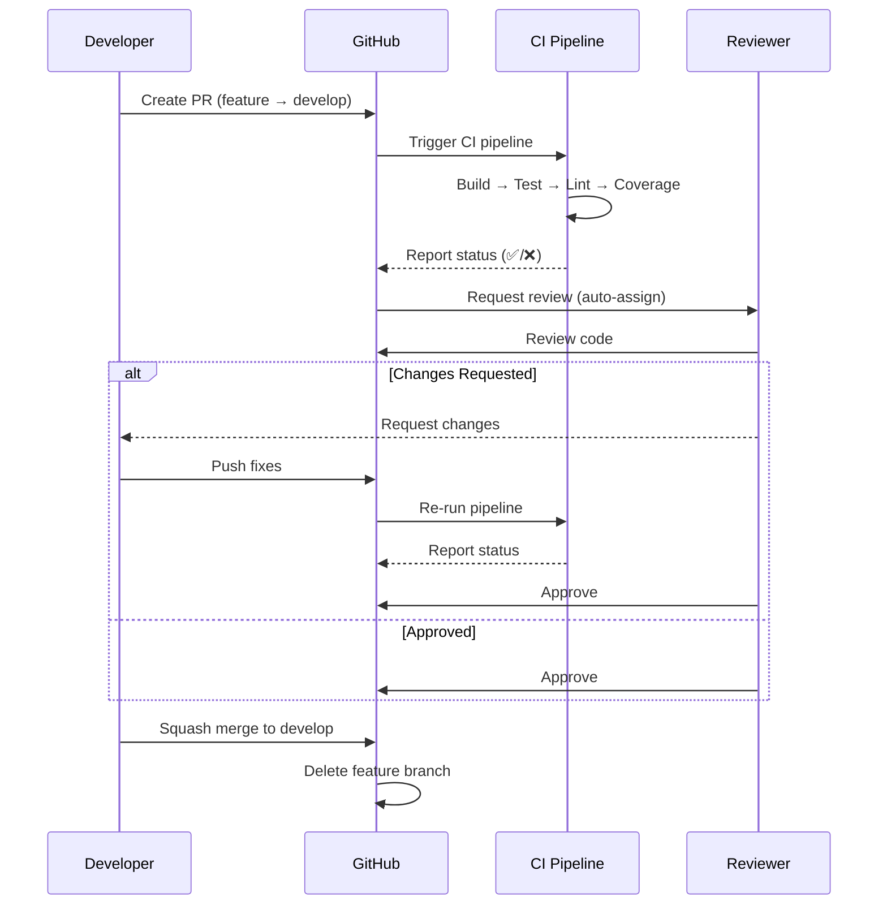

# Git Strategy

> **EventRelay — Reliable Webhook Delivery Platform**
> Git workflow, commit conventions, PR process, and release management.

---

## 1. Overview

EventRelay follows a **Gitflow-based branching strategy** with Conventional Commits, enforced PR reviews, and automated CI gating. This strategy balances development velocity with production stability by providing clear isolation between work-in-progress features, release candidates, and production code.



---

## 2. Branch Types

### 2.1 Branch Overview

| Branch | Pattern | Base | Merges To | Lifetime | Purpose |
|---|---|---|---|---|---|
| **main** | `main` | — | — | Permanent | Production-ready code; every commit is deployable |
| **develop** | `develop` | `main` | `main` (via release) | Permanent | Integration branch for next release |
| **feature** | `feature/{ticket}-{slug}` | `develop` | `develop` | Temporary | New features and enhancements |
| **bugfix** | `bugfix/{ticket}-{slug}` | `develop` | `develop` | Temporary | Non-critical bug fixes |
| **release** | `release/{version}` | `develop` | `main` + `develop` | Temporary | Release candidate stabilization |
| **hotfix** | `hotfix/{ticket}-{slug}` | `main` | `main` + `develop` | Temporary | Critical production fixes |

### 2.2 Branch Naming Conventions

```
# Feature branches
feature/ER-42-webhook-retry-engine
feature/ER-108-tenant-rate-limiting
feature/ER-215-hmac-signing

# Bugfix branches
bugfix/ER-67-duplicate-delivery-fix
bugfix/ER-89-outbox-polling-race

# Release branches
release/1.0.0
release/1.1.0
release/2.0.0

# Hotfix branches
hotfix/ER-301-signature-verification-bypass
hotfix/ER-315-connection-pool-leak
```

**Rules:**
- Always lowercase
- Use hyphens (`-`) as word separators
- Include Jira/issue ticket number when applicable
- Keep slugs concise but descriptive (3-5 words)

---

## 3. Commit Message Convention

### 3.1 Format: Conventional Commits

All commits follow [Conventional Commits v1.0.0](https://www.conventionalcommits.org/):

```
<type>(<scope>): <subject>

[optional body]

[optional footer(s)]
```

### 3.2 Types

| Type | Description | Triggers Version Bump |
|---|---|---|
| `feat` | A new feature | Minor (1.x.0) |
| `fix` | A bug fix | Patch (1.0.x) |
| `docs` | Documentation changes | None |
| `style` | Formatting, no code change | None |
| `refactor` | Code restructuring, no behavior change | None |
| `perf` | Performance improvement | Patch |
| `test` | Adding or updating tests | None |
| `build` | Build system or dependencies | None |
| `ci` | CI/CD configuration changes | None |
| `chore` | Maintenance tasks | None |
| `revert` | Reverts a previous commit | Depends on reverted type |

**Breaking changes:** Append `!` after type or add `BREAKING CHANGE:` footer.

### 3.3 Scopes

| Scope | Module/Area |
|---|---|
| `api` | `eventrelay-api` module |
| `core` | `eventrelay-core` module |
| `dispatcher` | `eventrelay-dispatcher` module |
| `common` | `eventrelay-common` module |
| `dashboard` | `eventrelay-dashboard` module |
| `db` | Database migrations |
| `docker` | Docker / container configuration |
| `ci` | CI/CD pipelines |
| `deps` | Dependency updates |

### 3.4 Examples

```bash
# Feature
feat(dispatcher): add exponential backoff with jitter to retry engine

Implement configurable retry schedule using exponential backoff with
randomized jitter. Default schedule: 1s, 5s, 30s, 5m, 1h, 6h, 24h.

Max retry attempts configurable via EVENTRELAY_MAX_RETRIES (default: 10).

Closes #ER-42

# Bug fix
fix(api): prevent duplicate event ingestion on concurrent requests

Add database-level unique constraint on (tenant_id, idempotency_key)
and handle ConstraintViolationException to return 409 Conflict.

Fixes #ER-67

# Breaking change
feat(api)!: rename /webhooks endpoint to /subscriptions

BREAKING CHANGE: The /api/v1/webhooks endpoint has been renamed to
/api/v1/subscriptions. Update all client integrations.

Closes #ER-150

# Documentation
docs(core): add Javadoc to OutboxService and outbox polling flow

# Test
test(dispatcher): add integration test for circuit breaker state transitions

# Dependency update
build(deps): bump spring-boot from 3.3.1 to 3.3.2

# CI change
ci: add OWASP dependency-check to nightly pipeline
```

### 3.5 Commit Message Rules

| Rule | Enforcement |
|---|---|
| Subject line ≤ 72 characters | CI check |
| Subject in imperative mood ("add" not "added") | Review |
| No period at end of subject | CI check |
| Body wrapped at 80 characters | Convention |
| Reference issue/ticket in footer | Required for `feat` and `fix` |

---

## 4. Pull Request Process

### 4.1 PR Lifecycle



### 4.2 PR Template

```markdown
## Description

<!-- Briefly describe what this PR does and why -->

## Type of Change

- [ ] 🆕 Feature (non-breaking change that adds functionality)
- [ ] 🐛 Bug Fix (non-breaking change that fixes an issue)
- [ ] 💥 Breaking Change (fix or feature that would cause existing functionality to change)
- [ ] 📝 Documentation
- [ ] 🔧 Refactor (no functional changes)
- [ ] ✅ Tests
- [ ] 🏗️ Infrastructure / CI

## Related Issues

<!-- Link to Jira/GitHub issues -->
Closes #ER-XXX

## Changes Made

- 
- 
- 

## Testing

- [ ] Unit tests added/updated
- [ ] Integration tests added/updated (if applicable)
- [ ] Manual testing performed

### Test Evidence

<!-- Screenshots, logs, curl commands showing the feature works -->

## Checklist

- [ ] Code follows the [Coding Standards](./Coding_Standards.md)
- [ ] Self-reviewed the code
- [ ] Javadoc added for public APIs
- [ ] No secrets or credentials in the code
- [ ] Database migration is backward-compatible
- [ ] No N+1 query patterns introduced
- [ ] Metrics/logging added for observability
- [ ] Related documentation updated

## Deployment Notes

<!-- Any special deployment steps, feature flags, env vars needed? -->

## Screenshots (if applicable)

<!-- UI changes, dashboard updates, API response examples -->
```

### 4.3 PR Review Guidelines

**For Authors:**
- Keep PRs small (< 400 lines of production code preferred)
- Provide context in the PR description
- Self-review before requesting reviews
- Respond to all review comments (resolve or discuss)
- Do not merge your own PR (except hotfixes with post-merge review)

**For Reviewers:**
- Review within 1 business day
- Focus on correctness, security, and design (not style — that's automated)
- Use GitHub suggestion blocks for specific code changes
- Approve only when all concerns are addressed
- Use the following review comment prefixes:

| Prefix | Meaning |
|---|---|
| `blocking:` | Must be fixed before merge |
| `suggestion:` | Nice to have, not blocking |
| `question:` | Seeking clarification |
| `nit:` | Minor style preference, not blocking |
| `praise:` | Something done well |

---

## 5. Merge Strategy

### 5.1 Merge Methods by Branch Type

| Source → Target | Merge Method | Rationale |
|---|---|---|
| `feature/*` → `develop` | **Squash merge** | Clean single-commit history on develop |
| `bugfix/*` → `develop` | **Squash merge** | Same as feature |
| `release/*` → `main` | **Merge commit** | Preserve release branch history |
| `release/*` → `develop` | **Merge commit** | Back-merge release fixes |
| `hotfix/*` → `main` | **Merge commit** | Preserve hotfix traceability |
| `hotfix/*` → `develop` | **Merge commit** | Back-merge hotfix |

### 5.2 Squash Merge Commit Message

When squash-merging a feature PR, use this format:

```
feat(dispatcher): implement retry engine with exponential backoff (#42)

- Add RetryEngine with configurable backoff schedule
- Implement BackoffCalculator with jitter
- Add retry policy configuration via application.yml
- Wire SQS visibility timeout extension for in-progress retries
- Add unit tests for all backoff scenarios

Closes #ER-42
```

---

## 6. Release Process

### 6.1 Creating a Release

```bash
# 1. Create release branch from develop
git checkout develop
git pull origin develop
git checkout -b release/1.1.0

# 2. Bump version in pom.xml
mvn versions:set -DnewVersion=1.1.0
mvn versions:commit

# 3. Final stabilization (bug fixes only on release branch)
git commit -m "chore: bump version to 1.1.0"

# 4. Merge to main (via PR)
# PR: release/1.1.0 → main

# 5. Tag the release
git checkout main
git pull origin main
git tag -a v1.1.0 -m "Release v1.1.0 — Retry engine, HMAC signing, rate limiting"
git push origin v1.1.0

# 6. Merge back to develop
# PR: release/1.1.0 → develop

# 7. Delete release branch
git branch -d release/1.1.0
git push origin --delete release/1.1.0
```

### 6.2 Release Tag Format

```
v{MAJOR}.{MINOR}.{PATCH}

Examples:
  v1.0.0    — Initial release
  v1.1.0    — New features (retry engine)
  v1.1.1    — Patch (bug fix)
  v2.0.0    — Breaking changes
```

### 6.3 Hotfix Process

```bash
# 1. Create hotfix from main
git checkout main
git pull origin main
git checkout -b hotfix/ER-301-sig-verification-bypass

# 2. Apply fix, commit, push
git commit -m "fix(api): validate HMAC signature before processing payload"

# 3. PR to main (expedited review)
# PR: hotfix/ER-301-sig-verification-bypass → main

# 4. Tag the patch release
git tag -a v1.1.1 -m "Hotfix v1.1.1 — Fix HMAC signature verification bypass"
git push origin v1.1.1

# 5. Back-merge to develop
# PR: hotfix/ER-301-sig-verification-bypass → develop

# 6. Delete hotfix branch
```

---

## 7. CI Pipeline Integration

### 7.1 GitHub Actions Triggers

```yaml
# .github/workflows/ci.yml
name: CI Pipeline

on:
  push:
    branches: [main, develop]
  pull_request:
    branches: [main, develop]

jobs:
  build:
    runs-on: ubuntu-latest
    steps:
      - uses: actions/checkout@v4
      - uses: actions/setup-java@v4
        with:
          java-version: '17'
          distribution: 'temurin'
          cache: maven

      - name: Check formatting
        run: mvn fmt:check

      - name: Checkstyle
        run: mvn checkstyle:check

      - name: Build & Test
        run: mvn clean verify

      - name: SpotBugs
        run: mvn spotbugs:check

      - name: Upload coverage
        uses: codecov/codecov-action@v4
        with:
          files: '**/target/site/jacoco/jacoco.xml'
```

### 7.2 Commit Message Linting

```yaml
# .github/workflows/commitlint.yml
name: Commit Lint

on:
  pull_request:
    branches: [develop, main]

jobs:
  commitlint:
    runs-on: ubuntu-latest
    steps:
      - uses: actions/checkout@v4
        with:
          fetch-depth: 0
      - uses: wagoid/commitlint-github-action@v5
        with:
          configFile: .commitlintrc.yml
```

**`.commitlintrc.yml`:**

```yaml
extends:
  - '@commitlint/config-conventional'
rules:
  type-enum:
    - 2
    - always
    - [feat, fix, docs, style, refactor, perf, test, build, ci, chore, revert]
  scope-enum:
    - 2
    - always
    - [api, core, dispatcher, common, dashboard, db, docker, ci, deps]
  subject-max-length:
    - 2
    - always
    - 72
```

---

## 8. Git Configuration

### 8.1 Recommended `.gitconfig`

```ini
[alias]
  co   = checkout
  br   = branch
  ci   = commit
  st   = status
  lg   = log --oneline --graph --decorate --all -20
  pf   = push --force-with-lease
  amend = commit --amend --no-edit

[pull]
  rebase = true

[push]
  autoSetupRemote = true
  default = current

[fetch]
  prune = true

[rerere]
  enabled = true

[core]
  autocrlf = input
  editor = vim
```

### 8.2 `.gitignore`

```gitignore
# Build
target/
build/
*.class
*.jar
*.war

# IDE
.idea/
*.iml
.vscode/
.settings/
.project
.classpath
*.swp

# Environment
.env
*.env.local
application-local.yml

# OS
.DS_Store
Thumbs.db

# Logs
*.log
logs/

# Test
test-output/
hs_err_pid*
```

---

## 9. Related Documents

- [Branching_Model.md](./Branching_Model.md) — Detailed branching model and protection rules
- [Coding_Standards.md](./Coding_Standards.md) — Code style and review checklist
- [Contributing.md](./Contributing.md) — Contributing guidelines

---

> **Last Updated:** 2026-07-10
> **Owner:** EventRelay Platform Team
