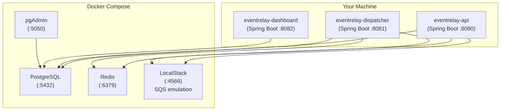

# Local Development Setup

> **EventRelay — Reliable Webhook Delivery Platform**
> Complete guide to setting up a local development environment.

---

## 1. Overview

This guide walks through setting up EventRelay for local development. The local stack mirrors the production architecture using Docker Compose for infrastructure services (PostgreSQL, Redis, LocalStack for SQS) while running the Spring Boot applications natively on your machine for fast iteration.



---

## 2. Prerequisites

### 2.1 Required Software

| Tool | Minimum Version | Recommended | Download |
|---|---|---|---|
| **JDK** | 17 | Eclipse Temurin 17.0.11 | [adoptium.net](https://adoptium.net/) |
| **Maven** | 3.8.0 | 3.9.6 | [maven.apache.org](https://maven.apache.org/download.cgi) |
| **Docker** | 24.0 | Latest stable | [docker.com](https://www.docker.com/products/docker-desktop/) |
| **Docker Compose** | v2.20 | Latest (bundled with Docker Desktop) | Included with Docker Desktop |
| **Git** | 2.40 | Latest | [git-scm.com](https://git-scm.com/) |
| **IDE** | — | IntelliJ IDEA 2024.1+ | [jetbrains.com](https://www.jetbrains.com/idea/) |

### 2.2 Verify Installation

```bash
# Java
java -version
# openjdk version "17.0.11" 2024-04-16

# Maven
mvn -version
# Apache Maven 3.9.6

# Docker
docker --version
# Docker version 26.1.0

# Docker Compose
docker compose version
# Docker Compose version v2.27.0

# Git
git --version
# git version 2.44.0
```

### 2.3 System Requirements

| Resource | Minimum | Recommended |
|---|---|---|
| **RAM** | 8 GB | 16 GB |
| **Disk** | 5 GB free | 10 GB free |
| **CPU** | 4 cores | 8 cores |
| **Docker Memory** | 4 GB allocated | 6 GB allocated |

> [!IMPORTANT]
> On Docker Desktop (Windows/macOS), increase the Docker memory allocation to at least 4 GB: `Settings → Resources → Memory`.

---

## 3. Quick Start (5 Minutes)

For developers who want to get running fast:

```bash
# 1. Clone the repository
git clone https://github.com/eventrelay/eventrelay.git
cd eventrelay

# 2. Start infrastructure
docker compose -f docker/docker-compose.yml up -d

# 3. Wait for services to be healthy (~15 seconds)
docker compose -f docker/docker-compose.yml ps

# 4. Build the project
mvn clean install -DskipTests

# 5. Run the API
mvn spring-boot:run -pl eventrelay-api -Dspring-boot.run.profiles=local

# 6. Verify
curl http://localhost:8080/actuator/health
# {"status":"UP"}
```

---

## 4. Docker Compose Configuration

### 4.1 Local Development Stack

```yaml
# docker/docker-compose.yml
version: '3.9'

services:
  # ──────────────────────────────────────────────
  # PostgreSQL — Primary datastore
  # ──────────────────────────────────────────────
  postgres:
    image: postgres:16-alpine
    container_name: eventrelay-postgres
    ports:
      - "5432:5432"
    environment:
      POSTGRES_DB: eventrelay
      POSTGRES_USER: eventrelay
      POSTGRES_PASSWORD: eventrelay_local
      POSTGRES_INITDB_ARGS: "--encoding=UTF-8 --lc-collate=en_US.utf8 --lc-ctype=en_US.utf8"
    volumes:
      - postgres_data:/var/lib/postgresql/data
      - ./init-scripts/init-db.sql:/docker-entrypoint-initdb.d/init-db.sql
    healthcheck:
      test: ["CMD-SHELL", "pg_isready -U eventrelay -d eventrelay"]
      interval: 5s
      timeout: 5s
      retries: 5
    networks:
      - eventrelay-network

  # ──────────────────────────────────────────────
  # Redis — Rate limiting, dedup cache
  # ──────────────────────────────────────────────
  redis:
    image: redis:7-alpine
    container_name: eventrelay-redis
    ports:
      - "6379:6379"
    command: redis-server --maxmemory 256mb --maxmemory-policy allkeys-lru
    volumes:
      - redis_data:/data
    healthcheck:
      test: ["CMD", "redis-cli", "ping"]
      interval: 5s
      timeout: 3s
      retries: 5
    networks:
      - eventrelay-network

  # ──────────────────────────────────────────────
  # LocalStack — AWS SQS emulation
  # ──────────────────────────────────────────────
  localstack:
    image: localstack/localstack:3.4
    container_name: eventrelay-localstack
    ports:
      - "4566:4566"      # LocalStack gateway
    environment:
      SERVICES: sqs
      DEFAULT_REGION: us-east-1
      DOCKER_HOST: unix:///var/run/docker.sock
      DEBUG: 0
    volumes:
      - localstack_data:/var/lib/localstack
      - ./init-scripts/init-sqs.sh:/etc/localstack/init/ready.d/init-sqs.sh
    healthcheck:
      test: ["CMD", "curl", "-f", "http://localhost:4566/_localstack/health"]
      interval: 10s
      timeout: 5s
      retries: 5
    networks:
      - eventrelay-network

  # ──────────────────────────────────────────────
  # pgAdmin — Database management UI
  # ──────────────────────────────────────────────
  pgadmin:
    image: dpage/pgadmin4:8
    container_name: eventrelay-pgadmin
    ports:
      - "5050:80"
    environment:
      PGADMIN_DEFAULT_EMAIL: admin@eventrelay.local
      PGADMIN_DEFAULT_PASSWORD: admin
      PGADMIN_CONFIG_SERVER_MODE: "False"
    depends_on:
      postgres:
        condition: service_healthy
    networks:
      - eventrelay-network
    profiles:
      - tools   # Only starts with: docker compose --profile tools up

  # ──────────────────────────────────────────────
  # Redis Commander — Redis management UI
  # ──────────────────────────────────────────────
  redis-commander:
    image: rediscommander/redis-commander:latest
    container_name: eventrelay-redis-commander
    ports:
      - "8085:8081"
    environment:
      REDIS_HOSTS: local:redis:6379
    depends_on:
      redis:
        condition: service_healthy
    networks:
      - eventrelay-network
    profiles:
      - tools

volumes:
  postgres_data:
    driver: local
  redis_data:
    driver: local
  localstack_data:
    driver: local

networks:
  eventrelay-network:
    driver: bridge
    name: eventrelay-network
```

### 4.2 Init Scripts

**`docker/init-scripts/init-db.sql`:**

```sql
-- Create additional databases for testing
CREATE DATABASE eventrelay_test;
GRANT ALL PRIVILEGES ON DATABASE eventrelay_test TO eventrelay;
```

**`docker/init-scripts/init-sqs.sh`:**

```bash
#!/bin/bash
echo "Creating SQS queues..."

# Main delivery queue
awslocal sqs create-queue \
  --queue-name eventrelay-delivery-queue \
  --attributes '{
    "VisibilityTimeout": "300",
    "MessageRetentionPeriod": "1209600",
    "ReceiveMessageWaitTimeSeconds": "20"
  }'

# Dead letter queue
awslocal sqs create-queue \
  --queue-name eventrelay-dead-letter-queue \
  --attributes '{
    "MessageRetentionPeriod": "1209600"
  }'

# Set DLQ redrive policy on main queue
MAIN_QUEUE_URL=$(awslocal sqs get-queue-url --queue-name eventrelay-delivery-queue --output text)
DLQ_ARN=$(awslocal sqs get-queue-attributes \
  --queue-url $(awslocal sqs get-queue-url --queue-name eventrelay-dead-letter-queue --output text) \
  --attribute-names QueueArn --output text --query 'Attributes.QueueArn')

awslocal sqs set-queue-attributes \
  --queue-url "$MAIN_QUEUE_URL" \
  --attributes "{\"RedrivePolicy\": \"{\\\"deadLetterTargetArn\\\":\\\"$DLQ_ARN\\\",\\\"maxReceiveCount\\\":\\\"5\\\"}\"}"

echo "✅ SQS queues created successfully."
awslocal sqs list-queues
```

---

## 5. Step-by-Step Setup

### 5.1 Clone and Configure

```bash
# Clone the repository
git clone https://github.com/eventrelay/eventrelay.git
cd eventrelay

# Install pre-commit hooks
chmod +x scripts/install-hooks.sh
./scripts/install-hooks.sh

# Copy local environment template
cp .env.example .env
```

### 5.2 Start Infrastructure

```bash
# Start core services (PostgreSQL, Redis, LocalStack)
docker compose -f docker/docker-compose.yml up -d

# Verify all services are healthy
docker compose -f docker/docker-compose.yml ps

# Expected output:
# NAME                     STATUS              PORTS
# eventrelay-postgres      Up (healthy)        0.0.0.0:5432->5432/tcp
# eventrelay-redis         Up (healthy)        0.0.0.0:6379->6379/tcp
# eventrelay-localstack    Up (healthy)        0.0.0.0:4566->4566/tcp

# (Optional) Start management UIs
docker compose -f docker/docker-compose.yml --profile tools up -d
```

### 5.3 Build the Project

```bash
# Full build (compile + test + package)
mvn clean install

# Quick build (skip tests for initial setup)
mvn clean install -DskipTests

# Verify the build
ls */target/*.jar
# eventrelay-api/target/eventrelay-api-1.0.0-SNAPSHOT.jar
# eventrelay-dispatcher/target/eventrelay-dispatcher-1.0.0-SNAPSHOT.jar
# eventrelay-dashboard/target/eventrelay-dashboard-1.0.0-SNAPSHOT.jar
```

### 5.4 Run Database Migrations

Flyway migrations run automatically when the API starts. To run them manually:

```bash
# Run migrations via Maven
mvn flyway:migrate -pl eventrelay-core \
  -Dflyway.url=jdbc:postgresql://localhost:5432/eventrelay \
  -Dflyway.user=eventrelay \
  -Dflyway.password=eventrelay_local

# Check migration status
mvn flyway:info -pl eventrelay-core \
  -Dflyway.url=jdbc:postgresql://localhost:5432/eventrelay \
  -Dflyway.user=eventrelay \
  -Dflyway.password=eventrelay_local
```

### 5.5 Run Applications

**Option A: Run individually via Maven**

```bash
# Terminal 1: API (port 8080)
mvn spring-boot:run -pl eventrelay-api -Dspring-boot.run.profiles=local

# Terminal 2: Dispatcher (port 8081)
mvn spring-boot:run -pl eventrelay-dispatcher -Dspring-boot.run.profiles=local

# Terminal 3: Dashboard (port 8082)
mvn spring-boot:run -pl eventrelay-dashboard -Dspring-boot.run.profiles=local
```

**Option B: Run via IDE**

1. Open each `*Application.java` file
2. Set the active profile to `local`
3. Run the main class

**Option C: Run via JAR**

```bash
java -jar eventrelay-api/target/eventrelay-api-1.0.0-SNAPSHOT.jar \
  --spring.profiles.active=local

java -jar eventrelay-dispatcher/target/eventrelay-dispatcher-1.0.0-SNAPSHOT.jar \
  --spring.profiles.active=local
```

### 5.6 Verify the Setup

```bash
# Health check
curl -s http://localhost:8080/actuator/health | jq .
# {
#   "status": "UP",
#   "components": {
#     "db": { "status": "UP" },
#     "redis": { "status": "UP" },
#     "diskSpace": { "status": "UP" }
#   }
# }

# Create a test tenant
curl -s -X POST http://localhost:8080/api/v1/tenants \
  -H 'Content-Type: application/json' \
  -d '{"name": "test-tenant", "contactEmail": "dev@example.com"}' | jq .

# Submit a test event
curl -s -X POST http://localhost:8080/api/v1/events \
  -H 'Content-Type: application/json' \
  -H 'X-API-Key: <tenant-api-key>' \
  -d '{"eventType": "order.created", "payload": {"orderId": "123"}}' | jq .

# Check SQS queue
aws --endpoint-url=http://localhost:4566 sqs get-queue-attributes \
  --queue-url http://localhost:4566/000000000000/eventrelay-delivery-queue \
  --attribute-names ApproximateNumberOfMessages
```

---

## 6. Running Tests

### 6.1 Test Commands

```bash
# All unit tests
mvn test

# All tests including integration tests
mvn verify

# Tests for a specific module
mvn test -pl eventrelay-core

# A specific test class
mvn test -pl eventrelay-dispatcher -Dtest=RetryEngineTest

# A specific test method
mvn test -pl eventrelay-dispatcher -Dtest="RetryEngineTest#shouldScheduleRetryWithExponentialBackoff"

# Skip unit tests, run only integration tests
mvn verify -Dskip.unit.tests=true

# Generate coverage report
mvn test jacoco:report
# Open: target/site/jacoco/index.html
```

### 6.2 Integration Tests

Integration tests use **Testcontainers** to spin up ephemeral Docker containers:

```bash
# Ensure Docker is running, then:
mvn verify -pl eventrelay-core

# Integration tests are identified by the *IntegrationTest suffix
# They are automatically excluded from `mvn test` and run during `mvn verify`
```

> [!NOTE]
> Testcontainers automatically manages container lifecycle. You do **not** need the Docker Compose stack running for integration tests — they create their own isolated containers.

### 6.3 Test Profiles

| Profile | Command | Uses |
|---|---|---|
| Unit tests only | `mvn test` | Mockito, JUnit 5 |
| Integration tests | `mvn verify` | Testcontainers |
| Performance tests | `mvn verify -Pperformance` | JMH benchmarks |
| Architecture tests | `mvn test -pl eventrelay-core -Dtest=ArchitectureTest` | ArchUnit |

---

## 7. Environment Variables Reference

### 7.1 Application Configuration

| Variable | Default | Description |
|---|---|---|
| `DB_HOST` | `localhost` | PostgreSQL host |
| `DB_PORT` | `5432` | PostgreSQL port |
| `DB_NAME` | `eventrelay` | Database name |
| `DB_USER` | `eventrelay` | Database username |
| `DB_PASSWORD` | `eventrelay_local` | Database password |
| `REDIS_HOST` | `localhost` | Redis host |
| `REDIS_PORT` | `6379` | Redis port |
| `AWS_ENDPOINT` | `http://localhost:4566` | LocalStack endpoint |
| `AWS_REGION` | `us-east-1` | AWS region |
| `AWS_ACCESS_KEY_ID` | `test` | LocalStack access key |
| `AWS_SECRET_ACCESS_KEY` | `test` | LocalStack secret key |
| `SQS_DELIVERY_QUEUE_URL` | `http://localhost:4566/...` | SQS delivery queue URL |
| `SQS_DLQ_URL` | `http://localhost:4566/...` | SQS dead letter queue URL |

### 7.2 Local Profile (`application-local.yml`)

```yaml
spring:
  datasource:
    url: jdbc:postgresql://${DB_HOST:localhost}:${DB_PORT:5432}/${DB_NAME:eventrelay}
    username: ${DB_USER:eventrelay}
    password: ${DB_PASSWORD:eventrelay_local}
  data:
    redis:
      host: ${REDIS_HOST:localhost}
      port: ${REDIS_PORT:6379}
  flyway:
    enabled: true

cloud:
  aws:
    sqs:
      endpoint: ${AWS_ENDPOINT:http://localhost:4566}
    region:
      static: ${AWS_REGION:us-east-1}
    credentials:
      access-key: ${AWS_ACCESS_KEY_ID:test}
      secret-key: ${AWS_SECRET_ACCESS_KEY:test}

eventrelay:
  delivery:
    queue-url: ${SQS_DELIVERY_QUEUE_URL:http://sqs.us-east-1.localhost.localstack.cloud:4566/000000000000/eventrelay-delivery-queue}
    timeout-ms: 10000
    max-retry-attempts: 10
  rate-limit:
    enabled: true
    default-requests-per-second: 100
  signing:
    algorithm: HmacSHA256

logging:
  level:
    com.eventrelay: DEBUG
    org.springframework.web: DEBUG
    org.hibernate.SQL: DEBUG
```

### 7.3 `.env.example`

```bash
# Database
DB_HOST=localhost
DB_PORT=5432
DB_NAME=eventrelay
DB_USER=eventrelay
DB_PASSWORD=eventrelay_local

# Redis
REDIS_HOST=localhost
REDIS_PORT=6379

# AWS / LocalStack
AWS_ENDPOINT=http://localhost:4566
AWS_REGION=us-east-1
AWS_ACCESS_KEY_ID=test
AWS_SECRET_ACCESS_KEY=test

# Application
SPRING_PROFILES_ACTIVE=local
SERVER_PORT=8080
```

---

## 8. Useful Commands

### 8.1 Docker Compose

```bash
# Start all services
docker compose -f docker/docker-compose.yml up -d

# Stop all services (preserve data)
docker compose -f docker/docker-compose.yml stop

# Stop and remove containers + volumes (clean reset)
docker compose -f docker/docker-compose.yml down -v

# View logs
docker compose -f docker/docker-compose.yml logs -f postgres
docker compose -f docker/docker-compose.yml logs -f localstack

# Restart a single service
docker compose -f docker/docker-compose.yml restart redis

# Start with management UIs
docker compose -f docker/docker-compose.yml --profile tools up -d
```

### 8.2 Database

```bash
# Connect to PostgreSQL via CLI
docker exec -it eventrelay-postgres psql -U eventrelay -d eventrelay

# Common SQL queries
# List tables
\dt

# Check outbox entries
SELECT * FROM outbox_entries ORDER BY created_at DESC LIMIT 10;

# Check delivery attempts
SELECT * FROM delivery_attempts ORDER BY attempted_at DESC LIMIT 10;

# pgAdmin UI
open http://localhost:5050
# Email: admin@eventrelay.local
# Password: admin
```

### 8.3 Redis

```bash
# Connect to Redis CLI
docker exec -it eventrelay-redis redis-cli

# Common commands
KEYS *                               # List all keys
GET rate_limit:tenant:123            # Check rate limit
TTL rate_limit:tenant:123            # Check TTL
DBSIZE                               # Total key count
FLUSHDB                              # Clear all data (dev only!)

# Redis Commander UI
open http://localhost:8085
```

### 8.4 LocalStack (SQS)

```bash
# List queues
aws --endpoint-url=http://localhost:4566 sqs list-queues

# Send a test message
aws --endpoint-url=http://localhost:4566 sqs send-message \
  --queue-url http://localhost:4566/000000000000/eventrelay-delivery-queue \
  --message-body '{"eventId":"test-123","type":"order.created"}'

# Receive messages
aws --endpoint-url=http://localhost:4566 sqs receive-message \
  --queue-url http://localhost:4566/000000000000/eventrelay-delivery-queue

# Check queue attributes
aws --endpoint-url=http://localhost:4566 sqs get-queue-attributes \
  --queue-url http://localhost:4566/000000000000/eventrelay-delivery-queue \
  --attribute-names All

# Purge queue
aws --endpoint-url=http://localhost:4566 sqs purge-queue \
  --queue-url http://localhost:4566/000000000000/eventrelay-delivery-queue
```

---

## 9. Common Issues & Solutions

### 9.1 Port Conflicts

| Port | Service | Solution |
|---|---|---|
| 5432 | PostgreSQL | Stop local PostgreSQL: `sudo systemctl stop postgresql` |
| 6379 | Redis | Stop local Redis: `sudo systemctl stop redis` |
| 4566 | LocalStack | No common conflicts; check with `lsof -i :4566` |
| 8080 | API | Set `SERVER_PORT=8090` in `.env` |

### 9.2 Docker Issues

**"Cannot connect to Docker daemon"**
```bash
# macOS/Linux
sudo systemctl start docker
# or restart Docker Desktop

# Windows
# Restart Docker Desktop from system tray
```

**"Not enough memory"**
- Increase Docker Desktop memory to 4+ GB
- `Settings → Resources → Memory`

**"Container exiting immediately"**
```bash
# Check container logs
docker compose -f docker/docker-compose.yml logs <service-name>
```

### 9.3 Build Issues

**"Java version mismatch"**
```bash
# Verify JAVA_HOME points to JDK 17
echo $JAVA_HOME
java -version

# macOS (if using SDKMAN)
sdk use java 17.0.11-tem

# Set JAVA_HOME explicitly
export JAVA_HOME=/path/to/jdk-17
```

**"Maven out of memory"**
```bash
export MAVEN_OPTS="-Xmx2g -XX:+UseG1GC"
```

**"Tests fail with Testcontainers"**
- Ensure Docker is running
- Ensure Docker socket is accessible
- On macOS: `docker context use desktop-linux`

### 9.4 Database Issues

**"Connection refused to PostgreSQL"**
```bash
# Check if container is running
docker ps | grep postgres

# Check container health
docker inspect eventrelay-postgres | jq '.[0].State.Health'

# Restart
docker compose -f docker/docker-compose.yml restart postgres
```

**"Flyway migration failed"**
```bash
# Clean and re-run migrations (dev only!)
mvn flyway:clean flyway:migrate -pl eventrelay-core \
  -Dflyway.url=jdbc:postgresql://localhost:5432/eventrelay \
  -Dflyway.user=eventrelay \
  -Dflyway.password=eventrelay_local
```

### 9.5 LocalStack Issues

**"SQS queue not found"**
```bash
# Recreate queues
docker compose -f docker/docker-compose.yml restart localstack
# Wait ~10 seconds for init scripts to run

# Verify queues exist
aws --endpoint-url=http://localhost:4566 sqs list-queues
```

---

## 10. Development Tips

### 10.1 Hot Reload

Enable Spring Boot DevTools for automatic restart on code changes:

```xml
<!-- Already included in local profile dependencies -->
<dependency>
  <groupId>org.springframework.boot</groupId>
  <artifactId>spring-boot-devtools</artifactId>
  <scope>runtime</scope>
  <optional>true</optional>
</dependency>
```

In IntelliJ, enable "Build project automatically" (`Settings → Build → Compiler`) and run with the "Debug" configuration for hot swap.

### 10.2 Debugging

```bash
# Run with remote debug port
mvn spring-boot:run -pl eventrelay-api \
  -Dspring-boot.run.profiles=local \
  -Dspring-boot.run.jvmArguments="-agentlib:jdwp=transport=dt_socket,server=y,suspend=n,address=5005"

# Then attach IntelliJ debugger to port 5005
```

### 10.3 Local Webhook Testing

Use [webhook.site](https://webhook.site) or run a local receiver:

```bash
# Quick local receiver (requires Python)
python3 -c "
from http.server import HTTPServer, BaseHTTPRequestHandler
import json

class Handler(BaseHTTPRequestHandler):
    def do_POST(self):
        content_length = int(self.headers.get('Content-Length', 0))
        body = self.rfile.read(content_length)
        print(f'Headers: {dict(self.headers)}')
        print(f'Body: {body.decode()}')
        self.send_response(200)
        self.end_headers()
        self.wfile.write(b'OK')

HTTPServer(('0.0.0.0', 9999), Handler).serve_forever()
"

# Register http://host.docker.internal:9999 as a subscription target URL
```

---

## 11. Related Documents

- [Project_Structure.md](./Project_Structure.md) — Module layout and dependencies
- [Contributing.md](./Contributing.md) — How to contribute
- [Coding_Standards.md](./Coding_Standards.md) — Code style configuration
- [Development_Roadmap.md](./Development_Roadmap.md) — Sprint planning

---

> **Last Updated:** 2026-07-10
> **Owner:** EventRelay Platform Team
