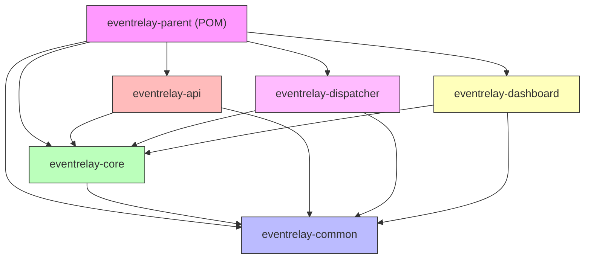

# Project Structure

> **EventRelay — Reliable Webhook Delivery Platform**
> Maven multi-module project layout, package organization, and dependency management.

---

## 1. Overview

EventRelay is organized as a **Maven multi-module project** with clear module boundaries enforcing separation of concerns. Each module has a defined responsibility, its own Spring Boot configuration (where applicable), and explicit dependency declarations.

```
┌────────────────────────────────────────────────────────────────────┐
│                         eventrelay (parent POM)                    │
│                                                                    │
│  ┌──────────────┐  ┌──────────────┐  ┌───────────────────────┐    │
│  │ eventrelay-  │  │ eventrelay-  │  │  eventrelay-          │    │
│  │   common     │  │   core       │  │   api                 │    │
│  │ (utilities)  │  │ (domain)     │  │  (REST endpoints)     │    │
│  └──────┬───────┘  └──────┬───────┘  └───────────┬───────────┘    │
│         │                 │                      │                 │
│         │    ┌────────────┴────────────┐         │                 │
│         │    │                         │         │                 │
│  ┌──────┴────┴──────┐  ┌──────────────┴─────────┴──────┐          │
│  │ eventrelay-      │  │  eventrelay-                  │          │
│  │   dispatcher     │  │    dashboard                  │          │
│  │ (delivery workers│  │  (dashboard backend)          │          │
│  └──────────────────┘  └───────────────────────────────┘          │
└────────────────────────────────────────────────────────────────────┘
```

---

## 2. Module Dependency Graph



| Module | Depends On | Deployable | Description |
|---|---|---|---|
| `eventrelay-common` | — | No (library) | Shared utilities, crypto helpers, common config |
| `eventrelay-core` | `common` | No (library) | Domain models, services, repository interfaces |
| `eventrelay-api` | `core`, `common` | Yes (Spring Boot app) | REST API for event ingestion and management |
| `eventrelay-dispatcher` | `core`, `common` | Yes (Spring Boot app) | SQS consumer, HTTP delivery, retry engine |
| `eventrelay-dashboard` | `core`, `common` | Yes (Spring Boot app) | Dashboard backend API |

---

## 3. Full Directory Tree

```
eventrelay/
├── pom.xml                                   # Parent POM (dependency management)
├── .editorconfig                             # Editor configuration
├── .gitignore
├── .github/
│   ├── workflows/
│   │   ├── ci.yml                            # CI pipeline
│   │   ├── release.yml                       # Release pipeline
│   │   └── dependency-check.yml              # OWASP vulnerability scan
│   ├── PULL_REQUEST_TEMPLATE.md
│   └── ISSUE_TEMPLATE/
│       ├── bug_report.md
│       └── feature_request.md
├── config/
│   ├── checkstyle/
│   │   ├── google_checks.xml
│   │   └── suppressions.xml
│   ├── spotbugs/
│   │   └── exclude.xml
│   └── pmd/
│       └── ruleset.xml
├── scripts/
│   ├── install-hooks.sh
│   ├── pre-commit
│   ├── local-setup.sh
│   └── run-integration-tests.sh
├── docker/
│   ├── docker-compose.yml                    # Local development stack
│   ├── docker-compose.test.yml               # Integration test stack
│   ├── api/
│   │   └── Dockerfile
│   ├── dispatcher/
│   │   └── Dockerfile
│   └── dashboard/
│       └── Dockerfile
│
├── eventrelay-common/
│   ├── pom.xml
│   └── src/
│       ├── main/java/com/eventrelay/common/
│       │   ├── util/
│       │   │   ├── IdGenerator.java           # UUID/ULID generation
│       │   │   ├── JsonUtils.java             # Jackson helpers
│       │   │   ├── TimeUtils.java             # Clock/time helpers
│       │   │   └── RetryUtils.java            # Backoff calculation
│       │   ├── crypto/
│       │   │   ├── HmacSigner.java            # HMAC-SHA256 signing
│       │   │   └── SecretKeyGenerator.java    # Signing key generation
│       │   ├── config/
│       │   │   └── JacksonConfig.java         # Shared Jackson ObjectMapper
│       │   ├── exception/
│       │   │   ├── EventRelayException.java   # Base exception
│       │   │   └── ErrorCode.java             # Error code enum
│       │   └── model/
│       │       ├── PageRequest.java           # Pagination request
│       │       └── PageResponse.java          # Pagination response
│       └── test/java/com/eventrelay/common/
│           ├── util/
│           │   └── RetryUtilsTest.java
│           └── crypto/
│               └── HmacSignerTest.java
│
├── eventrelay-core/
│   ├── pom.xml
│   └── src/
│       ├── main/
│       │   ├── java/com/eventrelay/core/
│       │   │   ├── model/
│       │   │   │   ├── Event.java              # Event entity
│       │   │   │   ├── EventType.java          # Event type enum/entity
│       │   │   │   ├── Subscription.java       # Webhook subscription
│       │   │   │   ├── Tenant.java             # Tenant entity
│       │   │   │   ├── DeliveryAttempt.java    # Delivery attempt log
│       │   │   │   ├── DeliveryStatus.java     # Status enum
│       │   │   │   ├── OutboxEntry.java        # Transactional outbox entry
│       │   │   │   └── DeadLetterEntry.java   # DLQ entry
│       │   │   ├── repository/
│       │   │   │   ├── EventRepository.java
│       │   │   │   ├── SubscriptionRepository.java
│       │   │   │   ├── TenantRepository.java
│       │   │   │   ├── DeliveryAttemptRepository.java
│       │   │   │   ├── OutboxRepository.java
│       │   │   │   └── DeadLetterRepository.java
│       │   │   ├── service/
│       │   │   │   ├── EventService.java
│       │   │   │   ├── SubscriptionService.java
│       │   │   │   ├── TenantService.java
│       │   │   │   ├── OutboxService.java
│       │   │   │   └── DeadLetterService.java
│       │   │   ├── event/
│       │   │   │   ├── DomainEvent.java        # Domain event interface
│       │   │   │   ├── EventCreated.java
│       │   │   │   └── DeliveryFailed.java
│       │   │   └── exception/
│       │   │       ├── TenantNotFoundException.java
│       │   │       ├── SubscriptionNotFoundException.java
│       │   │       ├── DuplicateEventException.java
│       │   │       └── RateLimitExceededException.java
│       │   └── resources/
│       │       └── db/migration/
│       │           ├── V1__create_tenants.sql
│       │           ├── V2__create_event_types.sql
│       │           ├── V3__create_subscriptions.sql
│       │           ├── V4__create_events.sql
│       │           ├── V5__create_outbox.sql
│       │           ├── V6__create_delivery_attempts.sql
│       │           └── V7__create_dead_letter_queue.sql
│       └── test/java/com/eventrelay/core/
│           ├── model/
│           │   └── EventTest.java
│           ├── service/
│           │   ├── EventServiceTest.java
│           │   └── OutboxServiceTest.java
│           └── repository/
│               └── EventRepositoryIntegrationTest.java
│
├── eventrelay-api/
│   ├── pom.xml
│   └── src/
│       ├── main/
│       │   ├── java/com/eventrelay/api/
│       │   │   ├── EventRelayApiApplication.java   # Spring Boot main class
│       │   │   ├── controller/
│       │   │   │   ├── EventController.java
│       │   │   │   ├── SubscriptionController.java
│       │   │   │   ├── TenantController.java
│       │   │   │   ├── DeadLetterController.java
│       │   │   │   └── HealthController.java
│       │   │   ├── dto/
│       │   │   │   ├── request/
│       │   │   │   │   ├── CreateEventRequest.java
│       │   │   │   │   ├── CreateSubscriptionRequest.java
│       │   │   │   │   ├── CreateTenantRequest.java
│       │   │   │   │   └── ReplayRequest.java
│       │   │   │   └── response/
│       │   │   │       ├── EventResponse.java
│       │   │   │       ├── SubscriptionResponse.java
│       │   │   │       ├── TenantResponse.java
│       │   │   │       ├── DeliveryAttemptResponse.java
│       │   │   │       └── ErrorResponse.java
│       │   │   ├── mapper/
│       │   │   │   ├── EventMapper.java
│       │   │   │   ├── SubscriptionMapper.java
│       │   │   │   └── TenantMapper.java
│       │   │   ├── config/
│       │   │   │   ├── SecurityConfig.java
│       │   │   │   ├── WebMvcConfig.java
│       │   │   │   ├── OpenApiConfig.java
│       │   │   │   └── RateLimitConfig.java
│       │   │   ├── filter/
│       │   │   │   ├── ApiKeyAuthFilter.java
│       │   │   │   ├── RateLimitFilter.java
│       │   │   │   └── RequestLoggingFilter.java
│       │   │   ├── exception/
│       │   │   │   └── GlobalExceptionHandler.java
│       │   │   └── validation/
│       │   │       └── WebhookUrlValidator.java
│       │   └── resources/
│       │       ├── application.yml
│       │       ├── application-local.yml
│       │       ├── application-staging.yml
│       │       ├── application-prod.yml
│       │       └── logback-spring.xml
│       └── test/java/com/eventrelay/api/
│           ├── controller/
│           │   ├── EventControllerTest.java
│           │   └── SubscriptionControllerTest.java
│           └── integration/
│               └── EventApiIntegrationTest.java
│
├── eventrelay-dispatcher/
│   ├── pom.xml
│   └── src/
│       ├── main/
│       │   ├── java/com/eventrelay/dispatcher/
│       │   │   ├── EventRelayDispatcherApplication.java  # Spring Boot main
│       │   │   ├── worker/
│       │   │   │   ├── SqsMessageConsumer.java
│       │   │   │   ├── OutboxPoller.java
│       │   │   │   └── DeadLetterProcessor.java
│       │   │   ├── delivery/
│       │   │   │   ├── WebhookDeliveryService.java
│       │   │   │   ├── HttpClientFactory.java
│       │   │   │   └── DeliveryResult.java
│       │   │   ├── signing/
│       │   │   │   └── RequestSigner.java
│       │   │   ├── retry/
│       │   │   │   ├── RetryEngine.java
│       │   │   │   ├── BackoffCalculator.java
│       │   │   │   └── RetryPolicy.java
│       │   │   ├── circuit/
│       │   │   │   ├── CircuitBreaker.java
│       │   │   │   ├── CircuitBreakerRegistry.java
│       │   │   │   └── CircuitState.java
│       │   │   ├── ratelimit/
│       │   │   │   ├── TokenBucketRateLimiter.java
│       │   │   │   └── RedisRateLimiter.java
│       │   │   └── config/
│       │   │       ├── SqsConfig.java
│       │   │       ├── HttpClientConfig.java
│       │   │       ├── RetryConfig.java
│       │   │       └── CircuitBreakerConfig.java
│       │   └── resources/
│       │       ├── application.yml
│       │       ├── application-local.yml
│       │       └── logback-spring.xml
│       └── test/java/com/eventrelay/dispatcher/
│           ├── delivery/
│           │   └── WebhookDeliveryServiceTest.java
│           ├── retry/
│           │   ├── RetryEngineTest.java
│           │   └── BackoffCalculatorTest.java
│           ├── circuit/
│           │   └── CircuitBreakerTest.java
│           └── integration/
│               └── DispatcherIntegrationTest.java
│
└── eventrelay-dashboard/
    ├── pom.xml
    └── src/
        ├── main/
        │   ├── java/com/eventrelay/dashboard/
        │   │   ├── EventRelayDashboardApplication.java  # Spring Boot main
        │   │   ├── controller/
        │   │   │   ├── DashboardController.java
        │   │   │   ├── MetricsController.java
        │   │   │   └── ReplayController.java
        │   │   ├── service/
        │   │   │   ├── DashboardService.java
        │   │   │   ├── AnalyticsService.java
        │   │   │   └── ReplayService.java
        │   │   ├── dto/
        │   │   │   ├── DashboardSummaryResponse.java
        │   │   │   ├── DeliveryMetricsResponse.java
        │   │   │   └── ReplayResponse.java
        │   │   └── config/
        │   │       └── DashboardConfig.java
        │   └── resources/
        │       ├── application.yml
        │       └── logback-spring.xml
        └── test/java/com/eventrelay/dashboard/
            └── service/
                └── DashboardServiceTest.java
```

---

## 4. Parent POM

The parent POM manages all dependency versions, plugin versions, and shared build configuration.

```xml
<?xml version="1.0" encoding="UTF-8"?>
<project xmlns="http://maven.apache.org/POM/4.0.0"
         xmlns:xsi="http://www.w3.org/2001/XMLSchema-instance"
         xsi:schemaLocation="http://maven.apache.org/POM/4.0.0
         https://maven.apache.org/xsd/maven-4.0.0.xsd">
  <modelVersion>4.0.0</modelVersion>

  <parent>
    <groupId>org.springframework.boot</groupId>
    <artifactId>spring-boot-starter-parent</artifactId>
    <version>3.3.2</version>
    <relativePath/>
  </parent>

  <groupId>com.eventrelay</groupId>
  <artifactId>eventrelay-parent</artifactId>
  <version>1.0.0-SNAPSHOT</version>
  <packaging>pom</packaging>
  <name>EventRelay Parent</name>
  <description>Reliable Webhook Delivery Platform</description>

  <modules>
    <module>eventrelay-common</module>
    <module>eventrelay-core</module>
    <module>eventrelay-api</module>
    <module>eventrelay-dispatcher</module>
    <module>eventrelay-dashboard</module>
  </modules>

  <properties>
    <java.version>17</java.version>
    <maven.compiler.source>17</maven.compiler.source>
    <maven.compiler.target>17</maven.compiler.target>
    <project.build.sourceEncoding>UTF-8</project.build.sourceEncoding>

    <!-- Dependency Versions -->
    <spring-cloud-aws.version>3.1.1</spring-cloud-aws.version>
    <flyway.version>10.10.0</flyway.version>
    <testcontainers.version>1.19.7</testcontainers.version>
    <awaitility.version>4.2.1</awaitility.version>
    <micrometer.version>1.12.4</micrometer.version>
    <springdoc.version>2.4.0</springdoc.version>
    <mapstruct.version>1.5.5.Final</mapstruct.version>
    <archunit.version>1.2.1</archunit.version>

    <!-- Plugin Versions -->
    <fmt-maven-plugin.version>2.21.1</fmt-maven-plugin.version>
    <checkstyle-plugin.version>3.3.1</checkstyle-plugin.version>
    <spotbugs-plugin.version>4.8.3.0</spotbugs-plugin.version>
    <jacoco-plugin.version>0.8.11</jacoco-plugin.version>
  </properties>

  <dependencyManagement>
    <dependencies>
      <!-- Internal Modules -->
      <dependency>
        <groupId>com.eventrelay</groupId>
        <artifactId>eventrelay-common</artifactId>
        <version>${project.version}</version>
      </dependency>
      <dependency>
        <groupId>com.eventrelay</groupId>
        <artifactId>eventrelay-core</artifactId>
        <version>${project.version}</version>
      </dependency>

      <!-- Spring Cloud AWS (SQS) -->
      <dependency>
        <groupId>io.awspring.cloud</groupId>
        <artifactId>spring-cloud-aws-dependencies</artifactId>
        <version>${spring-cloud-aws.version}</version>
        <type>pom</type>
        <scope>import</scope>
      </dependency>

      <!-- Flyway -->
      <dependency>
        <groupId>org.flywaydb</groupId>
        <artifactId>flyway-core</artifactId>
        <version>${flyway.version}</version>
      </dependency>
      <dependency>
        <groupId>org.flywaydb</groupId>
        <artifactId>flyway-database-postgresql</artifactId>
        <version>${flyway.version}</version>
      </dependency>

      <!-- Testcontainers -->
      <dependency>
        <groupId>org.testcontainers</groupId>
        <artifactId>testcontainers-bom</artifactId>
        <version>${testcontainers.version}</version>
        <type>pom</type>
        <scope>import</scope>
      </dependency>

      <!-- SpringDoc OpenAPI -->
      <dependency>
        <groupId>org.springdoc</groupId>
        <artifactId>springdoc-openapi-starter-webmvc-ui</artifactId>
        <version>${springdoc.version}</version>
      </dependency>

      <!-- MapStruct -->
      <dependency>
        <groupId>org.mapstruct</groupId>
        <artifactId>mapstruct</artifactId>
        <version>${mapstruct.version}</version>
      </dependency>

      <!-- Awaitility (test) -->
      <dependency>
        <groupId>org.awaitility</groupId>
        <artifactId>awaitility</artifactId>
        <version>${awaitility.version}</version>
        <scope>test</scope>
      </dependency>

      <!-- ArchUnit (test) -->
      <dependency>
        <groupId>com.tngtech.archunit</groupId>
        <artifactId>archunit-junit5</artifactId>
        <version>${archunit.version}</version>
        <scope>test</scope>
      </dependency>
    </dependencies>
  </dependencyManagement>

  <build>
    <pluginManagement>
      <!-- Shared plugin configuration -->
    </pluginManagement>
  </build>
</project>
```

---

## 5. Module Details

### 5.1 eventrelay-common

**Purpose:** Shared utilities with zero business logic. No Spring Boot auto-configuration.

```xml
<!-- eventrelay-common/pom.xml -->
<dependencies>
  <dependency>
    <groupId>com.fasterxml.jackson.core</groupId>
    <artifactId>jackson-databind</artifactId>
  </dependency>
  <dependency>
    <groupId>com.fasterxml.jackson.datatype</groupId>
    <artifactId>jackson-datatype-jsr310</artifactId>
  </dependency>
  <dependency>
    <groupId>org.slf4j</groupId>
    <artifactId>slf4j-api</artifactId>
  </dependency>
</dependencies>
```

| Package | Responsibility |
|---|---|
| `util` | ID generation, JSON serialization, time helpers, backoff math |
| `crypto` | HMAC-SHA256 signing, secret key generation |
| `config` | Shared Jackson `ObjectMapper` bean configuration |
| `exception` | Base exception hierarchy, error code enum |
| `model` | Pagination primitives (`PageRequest`, `PageResponse`) |

### 5.2 eventrelay-core

**Purpose:** Domain model, business rules, repository interfaces, database migrations.

```xml
<!-- eventrelay-core/pom.xml -->
<dependencies>
  <dependency>
    <groupId>com.eventrelay</groupId>
    <artifactId>eventrelay-common</artifactId>
  </dependency>
  <dependency>
    <groupId>org.springframework.boot</groupId>
    <artifactId>spring-boot-starter-data-jpa</artifactId>
  </dependency>
  <dependency>
    <groupId>org.flywaydb</groupId>
    <artifactId>flyway-core</artifactId>
  </dependency>
  <dependency>
    <groupId>org.flywaydb</groupId>
    <artifactId>flyway-database-postgresql</artifactId>
  </dependency>
  <dependency>
    <groupId>org.postgresql</groupId>
    <artifactId>postgresql</artifactId>
    <scope>runtime</scope>
  </dependency>

  <!-- Test -->
  <dependency>
    <groupId>org.testcontainers</groupId>
    <artifactId>postgresql</artifactId>
    <scope>test</scope>
  </dependency>
</dependencies>
```

> [!IMPORTANT]
> The `core` module owns all Flyway migration scripts under `src/main/resources/db/migration/`. Other modules must **never** include their own migration files — they inherit via classpath.

### 5.3 eventrelay-api

**Purpose:** REST API ingestion endpoints. This is a **deployable Spring Boot application**.

```xml
<!-- eventrelay-api/pom.xml -->
<dependencies>
  <dependency>
    <groupId>com.eventrelay</groupId>
    <artifactId>eventrelay-core</artifactId>
  </dependency>
  <dependency>
    <groupId>com.eventrelay</groupId>
    <artifactId>eventrelay-common</artifactId>
  </dependency>
  <dependency>
    <groupId>org.springframework.boot</groupId>
    <artifactId>spring-boot-starter-web</artifactId>
  </dependency>
  <dependency>
    <groupId>org.springframework.boot</groupId>
    <artifactId>spring-boot-starter-validation</artifactId>
  </dependency>
  <dependency>
    <groupId>org.springframework.boot</groupId>
    <artifactId>spring-boot-starter-actuator</artifactId>
  </dependency>
  <dependency>
    <groupId>org.springframework.boot</groupId>
    <artifactId>spring-boot-starter-data-redis</artifactId>
  </dependency>
  <dependency>
    <groupId>org.springdoc</groupId>
    <artifactId>springdoc-openapi-starter-webmvc-ui</artifactId>
  </dependency>
  <dependency>
    <groupId>io.micrometer</groupId>
    <artifactId>micrometer-registry-prometheus</artifactId>
  </dependency>
</dependencies>

<build>
  <plugins>
    <plugin>
      <groupId>org.springframework.boot</groupId>
      <artifactId>spring-boot-maven-plugin</artifactId>
    </plugin>
  </plugins>
</build>
```

**Spring Boot Configuration (`application.yml`):**

```yaml
server:
  port: 8080
  shutdown: graceful

spring:
  application:
    name: eventrelay-api
  datasource:
    url: jdbc:postgresql://${DB_HOST:localhost}:${DB_PORT:5432}/${DB_NAME:eventrelay}
    username: ${DB_USER:eventrelay}
    password: ${DB_PASSWORD:eventrelay}
    hikari:
      maximum-pool-size: 20
      minimum-idle: 5
      connection-timeout: 5000
      idle-timeout: 300000
      max-lifetime: 600000
  flyway:
    enabled: true
    locations: classpath:db/migration
  data:
    redis:
      host: ${REDIS_HOST:localhost}
      port: ${REDIS_PORT:6379}
  jackson:
    default-property-inclusion: non_null
    serialization:
      write-dates-as-timestamps: false

management:
  endpoints:
    web:
      exposure:
        include: health,info,prometheus,metrics
  endpoint:
    health:
      show-details: when-authorized
  metrics:
    tags:
      application: eventrelay-api
```

### 5.4 eventrelay-dispatcher

**Purpose:** SQS consumers, HTTP webhook delivery, retry engine, circuit breaker. This is a **deployable Spring Boot application**.

```xml
<!-- eventrelay-dispatcher/pom.xml -->
<dependencies>
  <dependency>
    <groupId>com.eventrelay</groupId>
    <artifactId>eventrelay-core</artifactId>
  </dependency>
  <dependency>
    <groupId>com.eventrelay</groupId>
    <artifactId>eventrelay-common</artifactId>
  </dependency>
  <dependency>
    <groupId>io.awspring.cloud</groupId>
    <artifactId>spring-cloud-aws-starter-sqs</artifactId>
  </dependency>
  <dependency>
    <groupId>org.springframework.boot</groupId>
    <artifactId>spring-boot-starter-data-redis</artifactId>
  </dependency>
  <dependency>
    <groupId>org.springframework.boot</groupId>
    <artifactId>spring-boot-starter-actuator</artifactId>
  </dependency>
  <dependency>
    <groupId>io.micrometer</groupId>
    <artifactId>micrometer-registry-prometheus</artifactId>
  </dependency>

  <!-- Test -->
  <dependency>
    <groupId>org.testcontainers</groupId>
    <artifactId>localstack</artifactId>
    <scope>test</scope>
  </dependency>
</dependencies>
```

### 5.5 eventrelay-dashboard

**Purpose:** Dashboard backend serving analytics, event inspection, and manual replay functionality.

```xml
<!-- eventrelay-dashboard/pom.xml -->
<dependencies>
  <dependency>
    <groupId>com.eventrelay</groupId>
    <artifactId>eventrelay-core</artifactId>
  </dependency>
  <dependency>
    <groupId>com.eventrelay</groupId>
    <artifactId>eventrelay-common</artifactId>
  </dependency>
  <dependency>
    <groupId>org.springframework.boot</groupId>
    <artifactId>spring-boot-starter-web</artifactId>
  </dependency>
  <dependency>
    <groupId>org.springframework.boot</groupId>
    <artifactId>spring-boot-starter-actuator</artifactId>
  </dependency>
</dependencies>
```

---

## 6. Build Commands

| Command | Purpose |
|---|---|
| `mvn clean install` | Full build (compile, test, package all modules) |
| `mvn clean install -DskipTests` | Build without tests |
| `mvn test` | Run all unit tests |
| `mvn verify` | Run unit + integration tests |
| `mvn test -pl eventrelay-core` | Test a specific module |
| `mvn fmt:format` | Format all source code |
| `mvn fmt:check` | Verify formatting (CI) |
| `mvn checkstyle:check` | Run Checkstyle |
| `mvn spotbugs:check` | Run SpotBugs |
| `mvn dependency:tree` | View dependency tree |
| `mvn versions:display-dependency-updates` | Check for dependency updates |

---

## 7. Architecture Rules (ArchUnit)

Enforce module boundaries and layered architecture with ArchUnit tests:

```java
@AnalyzeClasses(packages = "com.eventrelay")
class ArchitectureTest {

  @ArchTest
  static final ArchRule controllers_should_not_access_repositories =
      noClasses()
          .that().resideInAPackage("..controller..")
          .should().accessClassesThat().resideInAPackage("..repository..")
          .because("Controllers must go through the service layer");

  @ArchTest
  static final ArchRule core_should_not_depend_on_api =
      noClasses()
          .that().resideInAPackage("com.eventrelay.core..")
          .should().dependOnClassesThat().resideInAPackage("com.eventrelay.api..")
          .because("Core module must not depend on API module");

  @ArchTest
  static final ArchRule common_should_not_depend_on_other_modules =
      noClasses()
          .that().resideInAPackage("com.eventrelay.common..")
          .should().dependOnClassesThat()
              .resideInAnyPackage(
                  "com.eventrelay.core..",
                  "com.eventrelay.api..",
                  "com.eventrelay.dispatcher..",
                  "com.eventrelay.dashboard..")
          .because("Common module must have zero internal dependencies");

  @ArchTest
  static final ArchRule services_should_use_constructor_injection =
      classes()
          .that().resideInAPackage("..service..")
          .and().areAnnotatedWith(Service.class)
          .should().haveOnlyFinalFields()
          .because("Services should use constructor injection with final fields");
}
```

---

## 8. Docker Build

Each deployable module has its own multi-stage Dockerfile:

```dockerfile
# docker/api/Dockerfile
FROM eclipse-temurin:17-jdk-alpine AS build
WORKDIR /app
COPY pom.xml .
COPY eventrelay-common/pom.xml eventrelay-common/
COPY eventrelay-core/pom.xml eventrelay-core/
COPY eventrelay-api/pom.xml eventrelay-api/
RUN mvn dependency:go-offline -B

COPY . .
RUN mvn package -pl eventrelay-api -am -DskipTests -B

FROM eclipse-temurin:17-jre-alpine
WORKDIR /app
RUN addgroup -S appgroup && adduser -S appuser -G appgroup
COPY --from=build /app/eventrelay-api/target/*.jar app.jar
USER appuser
EXPOSE 8080
HEALTHCHECK --interval=30s --timeout=3s --start-period=30s \
  CMD wget -qO- http://localhost:8080/actuator/health || exit 1
ENTRYPOINT ["java", "-XX:+UseContainerSupport", "-XX:MaxRAMPercentage=75.0", "-jar", "app.jar"]
```

---

## 9. Related Documents

- [Coding_Standards.md](./Coding_Standards.md) — Code style and static analysis
- [Local_Setup.md](./Local_Setup.md) — Local development environment setup
- [Contributing.md](./Contributing.md) — Contribution guidelines
- [Development_Roadmap.md](./Development_Roadmap.md) — Sprint planning

---

> **Last Updated:** 2026-07-10
> **Owner:** EventRelay Platform Team
