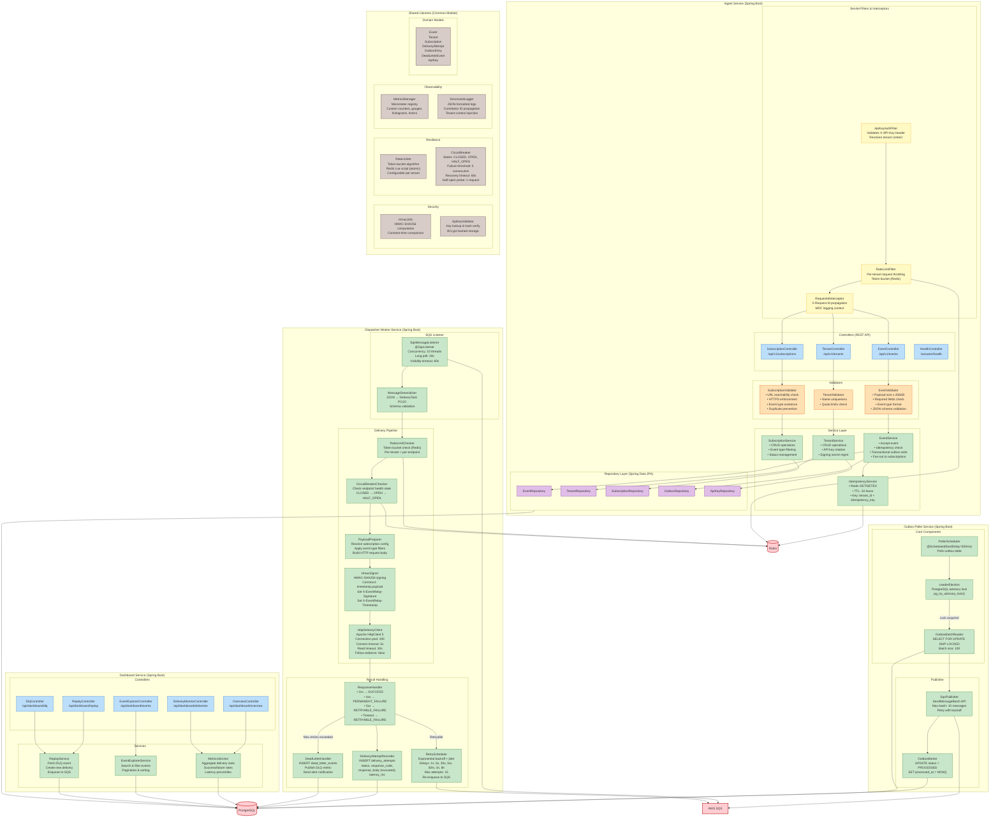
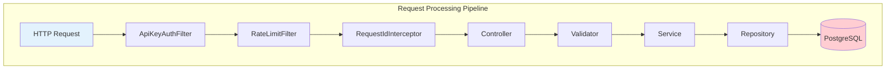
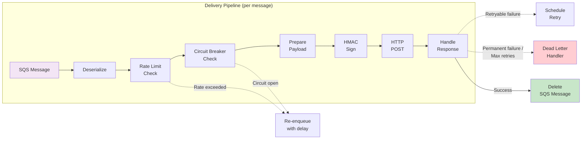
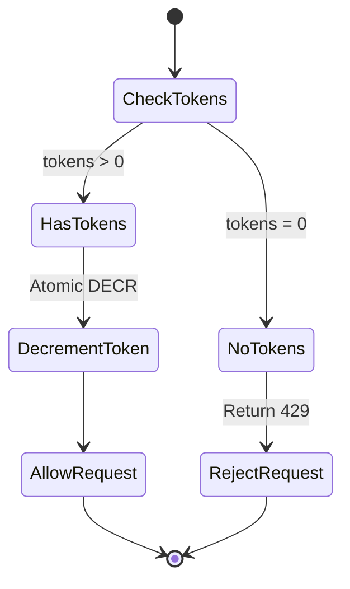
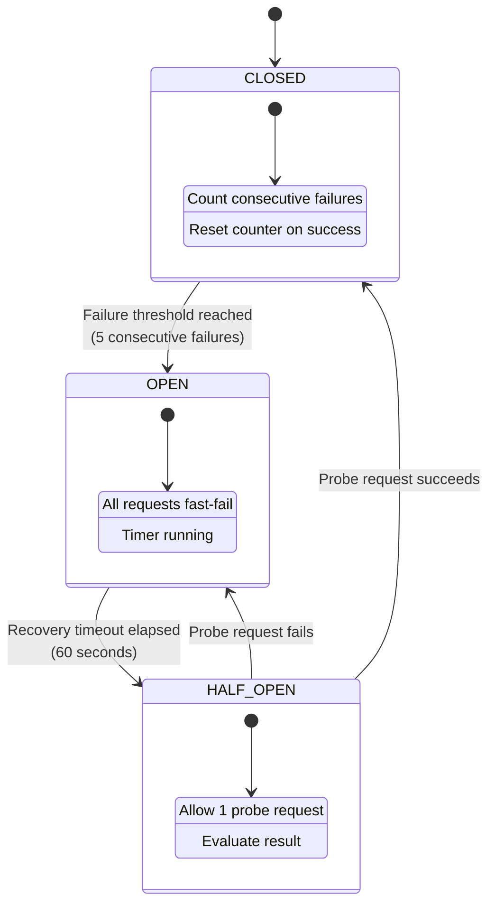

# Component Diagram — EventRelay Internal Architecture

> **Document Version:** 1.0  
> **Last Updated:** 2026-07-10  
> **Status:** Production Reference

## Overview

This document details the **internal component structure** of each service within EventRelay. Every service follows a layered architecture (Controller → Service → Repository) with cross-cutting concerns (security, rate limiting, observability) applied via Spring filters and interceptors.

---

## Full Component Diagram



---

## Service Decomposition Details

### Ingest Service



| Layer | Responsibility | Key Classes |
|---|---|---|
| **Filters** | Cross-cutting: auth, rate limiting, request tracking | `ApiKeyAuthFilter`, `RateLimitFilter`, `RequestIdInterceptor` |
| **Controllers** | HTTP binding, request/response mapping, status codes | `EventController`, `TenantController`, `SubscriptionController` |
| **Validators** | Input validation, business rule checks | `EventValidator`, `SubscriptionValidator` |
| **Services** | Business logic, transaction management, orchestration | `EventService`, `TenantService`, `IdempotencyService` |
| **Repositories** | Data access, query execution | `EventRepository`, `OutboxRepository`, `TenantRepository` |

### Dispatcher Worker — Delivery Pipeline



| Stage | Component | Failure Behavior |
|---|---|---|
| **Deserialize** | `MessageDeserializer` | Log error + delete poison message |
| **Rate Limit** | `RateLimitChecker` | Re-enqueue with 1s delay |
| **Circuit Breaker** | `CircuitBreakerChecker` | Re-enqueue with recovery timeout delay |
| **Prepare** | `PayloadPreparer` | Log error + dead-letter |
| **HMAC Sign** | `HmacSigner` | Log error + dead-letter (config issue) |
| **HTTP POST** | `HttpDeliveryClient` | Return response/exception to handler |
| **Handle Response** | `ResponseHandler` | Route to retry or dead-letter |

---

## Shared Library Components

### Rate Limiter — Token Bucket (Redis Lua Script)



| Parameter | Default Value | Configurable Per |
|---|---|---|
| Bucket capacity | 100 requests | Tenant |
| Refill rate | 100 requests/second | Tenant |
| Refill interval | 1 second | Global |

### Circuit Breaker — State Machine



| Parameter | Value | Notes |
|---|---|---|
| Failure threshold | 5 consecutive | Per endpoint (tenant + URL combination) |
| Recovery timeout | 60 seconds | Time before transitioning OPEN → HALF_OPEN |
| Half-open probe count | 1 request | Only 1 request allowed through to test recovery |
| State storage | Redis | Key: `cb:{tenant_id}:{endpoint_hash}` |
| State TTL | 24 hours | Auto-cleanup of stale circuit breaker state |

---

## Package Structure

```
com.eventrelay
├── ingest/
│   ├── controller/
│   │   ├── EventController.java
│   │   ├── TenantController.java
│   │   └── SubscriptionController.java
│   ├── filter/
│   │   ├── ApiKeyAuthFilter.java
│   │   ├── RateLimitFilter.java
│   │   └── RequestIdInterceptor.java
│   ├── validator/
│   │   ├── EventValidator.java
│   │   ├── SubscriptionValidator.java
│   │   └── TenantValidator.java
│   ├── service/
│   │   ├── EventService.java
│   │   ├── TenantService.java
│   │   ├── SubscriptionService.java
│   │   └── IdempotencyService.java
│   └── repository/
│       ├── EventRepository.java
│       ├── TenantRepository.java
│       ├── SubscriptionRepository.java
│       ├── OutboxRepository.java
│       └── ApiKeyRepository.java
├── poller/
│   ├── PollerScheduler.java
│   ├── LeaderElection.java
│   ├── OutboxBatchReader.java
│   ├── SqsPublisher.java
│   └── OutboxMarker.java
├── dispatcher/
│   ├── listener/
│   │   ├── SqsMessageListener.java
│   │   └── MessageDeserializer.java
│   ├── pipeline/
│   │   ├── RateLimitChecker.java
│   │   ├── CircuitBreakerChecker.java
│   │   ├── PayloadPreparer.java
│   │   ├── HmacSigner.java
│   │   └── HttpDeliveryClient.java
│   └── result/
│       ├── ResponseHandler.java
│       ├── DeliveryAttemptRecorder.java
│       ├── RetryScheduler.java
│       └── DeadLetterHandler.java
├── dashboard/
│   ├── controller/
│   ├── service/
│   └── dto/
└── common/
    ├── security/
    │   ├── HmacUtils.java
    │   └── ApiKeyValidator.java
    ├── resilience/
    │   ├── RateLimiter.java
    │   └── CircuitBreaker.java
    ├── observability/
    │   ├── MetricsManager.java
    │   └── StructuredLogger.java
    └── model/
        ├── Event.java
        ├── Tenant.java
        ├── Subscription.java
        ├── DeliveryAttempt.java
        ├── OutboxEntry.java
        ├── DeadLetterEvent.java
        └── ApiKey.java
```

---

## Inter-Component Communication Matrix

| From | To | Protocol | Pattern | Notes |
|---|---|---|---|---|
| Ingest Service | PostgreSQL | JDBC | Synchronous | Transactional writes |
| Ingest Service | Redis | Redis protocol | Synchronous | Idempotency check, rate limit |
| Outbox Poller | PostgreSQL | JDBC | Polling (500ms) | `SELECT FOR UPDATE SKIP LOCKED` |
| Outbox Poller | SQS | AWS SDK | Async batch send | `SendMessageBatch` (up to 10) |
| Dispatcher | SQS | AWS SDK | Long polling (20s) | `ReceiveMessage` |
| Dispatcher | Redis | Redis protocol | Synchronous | Rate limit + circuit breaker |
| Dispatcher | PostgreSQL | JDBC | Synchronous | Record delivery attempt |
| Dispatcher | Target URLs | HTTP/HTTPS | Synchronous (30s timeout) | HMAC-signed POST |
| Dashboard | PostgreSQL | JDBC | Synchronous | Read queries |
| Dashboard | SQS DLQ | AWS SDK | Synchronous | Read DLQ for replay |

---

## Related Documents

- [System Overview](../Architecture_Diagrams/System_Overview.md) — High-level architecture
- [Deployment Diagram](../Architecture_Diagrams/Deployment_Diagram.md) — AWS infrastructure
- [Event Ingestion Sequence](../Sequence_Diagrams/Event_Ingestion.md) — Detailed request flow
- [HMAC Signing Sequence](../Sequence_Diagrams/HMAC_Signing.md) — Signing implementation details
