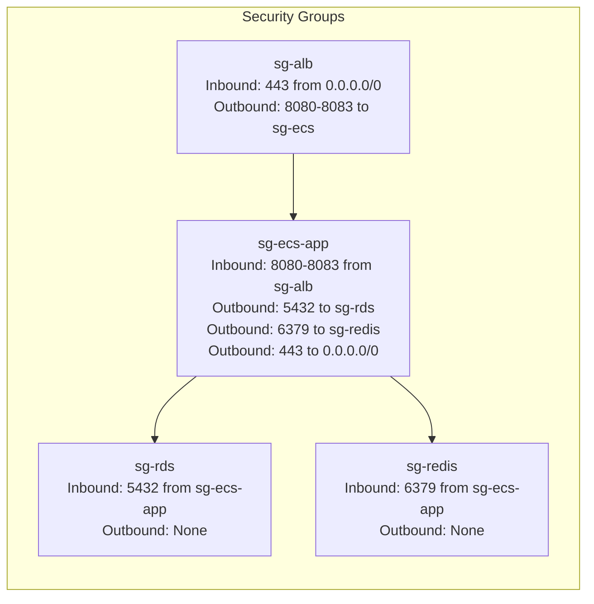
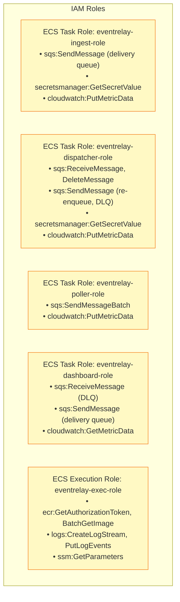

# Deployment Diagram — AWS Infrastructure Layout

> **Document Version:** 1.0  
> **Last Updated:** 2026-07-10  
> **Status:** Production Reference

## Overview

EventRelay is deployed on **AWS** using a fully managed, containerized architecture. All compute runs on **ECS Fargate** (serverless containers), data is stored in **RDS PostgreSQL** (multi-AZ) and **ElastiCache Redis**, and messaging uses **SQS**. The deployment spans **2 Availability Zones** for high availability.

---

## AWS Deployment Diagram

```mermaid
graph TB
    subgraph Internet ["Internet"]
        USERS["Clients / Event Producers"]
        TARGETS["Webhook Target Servers"]
    end

    subgraph AWS ["AWS Account (us-east-1)"]
        subgraph VPC ["VPC: 10.0.0.0/16"]
            subgraph PublicSubnets ["Public Subnets"]
                subgraph PubAZ1 ["AZ-1 (us-east-1a)<br/>10.0.1.0/24"]
                    ALB1["ALB Node 1"]
                    NAT1["NAT Gateway 1"]
                end
                subgraph PubAZ2 ["AZ-2 (us-east-1b)<br/>10.0.2.0/24"]
                    ALB2["ALB Node 2"]
                    NAT2["NAT Gateway 2"]
                end
            end

            subgraph PrivateSubnets ["Private Subnets — Application Tier"]
                subgraph PrivAZ1 ["AZ-1 (us-east-1a)<br/>10.0.10.0/24"]
                    IS1["ECS Task: Ingest Service<br/>vCPU: 1 · Mem: 2GB"]
                    DW1["ECS Task: Dispatcher Worker 1<br/>vCPU: 1 · Mem: 2GB"]
                    DW2["ECS Task: Dispatcher Worker 2<br/>vCPU: 1 · Mem: 2GB"]
                    OP1["ECS Task: Outbox Poller<br/>vCPU: 0.5 · Mem: 1GB"]
                    DASH1["ECS Task: Dashboard<br/>vCPU: 0.5 · Mem: 1GB"]
                end
                subgraph PrivAZ2 ["AZ-2 (us-east-1b)<br/>10.0.11.0/24"]
                    IS2["ECS Task: Ingest Service<br/>vCPU: 1 · Mem: 2GB"]
                    DW3["ECS Task: Dispatcher Worker 3<br/>vCPU: 1 · Mem: 2GB"]
                    DW4["ECS Task: Dispatcher Worker 4<br/>vCPU: 1 · Mem: 2GB"]
                    OP2["ECS Task: Outbox Poller (standby)<br/>vCPU: 0.5 · Mem: 1GB"]
                    DASH2["ECS Task: Dashboard<br/>vCPU: 0.5 · Mem: 1GB"]
                end
            end

            subgraph DataSubnets ["Private Subnets — Data Tier"]
                subgraph DataAZ1 ["AZ-1 (us-east-1a)<br/>10.0.20.0/24"]
                    RDSP["RDS PostgreSQL<br/>Primary<br/>db.r6g.xlarge<br/>200GB gp3"]
                    REDIS1["ElastiCache Redis<br/>Primary Node<br/>cache.r6g.large"]
                end
                subgraph DataAZ2 ["AZ-2 (us-east-1b)<br/>10.0.21.0/24"]
                    RDSS["RDS PostgreSQL<br/>Standby (Multi-AZ)<br/>Synchronous Replication"]
                    REDIS2["ElastiCache Redis<br/>Replica Node"]
                end
            end
        end

        subgraph ManagedServices ["Managed Services (Outside VPC)"]
            SQS_MAIN["SQS: eventrelay-delivery-queue<br/>Standard Queue<br/>Visibility: 60s · Retention: 4d"]
            SQS_DLQ["SQS: eventrelay-dlq<br/>Dead-Letter Queue<br/>Retention: 14d"]
            S3["S3: eventrelay-artifacts<br/>Deployment artifacts<br/>Config backups<br/>Large payload overflow"]
            ECR["ECR: eventrelay-*<br/>Container image registry<br/>Image scanning enabled"]
        end

        subgraph Observability ["Observability & Monitoring"]
            CW_LOGS["CloudWatch Logs<br/>Log Groups per service<br/>Retention: 30 days"]
            CW_ALARMS["CloudWatch Alarms<br/>• DLQ depth > 100<br/>• 5xx rate > 1%<br/>• Queue age > 5min<br/>• CPU > 80%"]
            CW_DASH["CloudWatch Dashboard<br/>Operational overview"]
            PROM["Prometheus<br/>(ECS Task)<br/>Scrape interval: 15s"]
            GRAF["Grafana<br/>(ECS Task)<br/>Custom dashboards"]
            SNS["SNS: eventrelay-alerts<br/>PagerDuty integration<br/>Slack webhook"]
        end

        subgraph CICD ["CI/CD"]
            GHA["GitHub Actions<br/>Build → Test → Push → Deploy"]
            CF["CloudFormation<br/>Infrastructure as Code"]
        end

        R53["Route 53<br/>api.eventrelay.io → ALB<br/>Health check routing"]
        ACM["ACM Certificate<br/>*.eventrelay.io<br/>Auto-renewal"]
        WAF["AWS WAF<br/>Rate limiting (IP)<br/>SQL injection protection<br/>Geo-blocking"]
        SM["Secrets Manager<br/>DB credentials<br/>Signing secrets<br/>API keys"]
    end

    %% Internet → Edge
    USERS -- "HTTPS (TLS 1.3)" --> R53
    R53 --> WAF
    WAF --> ALB1 & ALB2

    %% ALB → Services
    ALB1 & ALB2 -- "/api/v1/*" --> IS1 & IS2
    ALB1 & ALB2 -- "/dashboard/*" --> DASH1 & DASH2

    %% NAT Gateway → Internet (outbound)
    DW1 & DW2 --> NAT1
    DW3 & DW4 --> NAT2
    NAT1 & NAT2 -- "HTTPS POST<br/>(HMAC signed)" --> TARGETS

    %% App → Data
    IS1 & IS2 & OP1 & DW1 & DW2 & DASH1 --> RDSP
    IS1 & IS2 & DW1 & DW2 --> REDIS1
    IS2 & DW3 & DW4 --> REDIS1

    %% Poller → SQS
    OP1 --> SQS_MAIN
    SQS_MAIN --> DW1 & DW2 & DW3 & DW4
    SQS_MAIN -. "Max receives exceeded" .-> SQS_DLQ

    %% RDS Replication
    RDSP -. "Sync replication" .-> RDSS
    REDIS1 -. "Async replication" .-> REDIS2

    %% Observability
    IS1 & IS2 & DW1 & DW2 & DW3 & DW4 & OP1 -. "stdout" .-> CW_LOGS
    CW_ALARMS --> SNS
    PROM -. "scrape" .-> IS1 & IS2 & DW1 & DW2 & DW3 & DW4 & OP1
    PROM --> GRAF

    %% CI/CD
    GHA --> ECR
    GHA --> CF

    %% Secrets
    IS1 & IS2 & DW1 & DW2 & DW3 & DW4 -. "fetch secrets" .-> SM

    classDef public fill:#fff3e0,stroke:#e65100,stroke-width:2px
    classDef private fill:#e8f5e9,stroke:#2e7d32,stroke-width:2px
    classDef data fill:#fce4ec,stroke:#c62828,stroke-width:2px
    classDef managed fill:#e3f2fd,stroke:#1565c0,stroke-width:2px
    classDef observability fill:#f3e5f5,stroke:#6a1b9a,stroke-width:1px
    classDef external fill:#eceff1,stroke:#37474f,stroke-width:2px

    class ALB1,ALB2,NAT1,NAT2 public
    class IS1,IS2,DW1,DW2,DW3,DW4,OP1,OP2,DASH1,DASH2 private
    class RDSP,RDSS,REDIS1,REDIS2 data
    class SQS_MAIN,SQS_DLQ,S3,ECR managed
    class CW_LOGS,CW_ALARMS,CW_DASH,PROM,GRAF,SNS observability
    class USERS,TARGETS external
```

---

## Network Architecture

### CIDR Allocation

| Subnet | CIDR | AZ | Purpose | Internet Access |
|---|---|---|---|---|
| Public Subnet 1 | `10.0.1.0/24` | us-east-1a | ALB, NAT Gateway | Direct (IGW) |
| Public Subnet 2 | `10.0.2.0/24` | us-east-1b | ALB, NAT Gateway | Direct (IGW) |
| Private App Subnet 1 | `10.0.10.0/24` | us-east-1a | ECS Tasks (App tier) | Outbound via NAT |
| Private App Subnet 2 | `10.0.11.0/24` | us-east-1b | ECS Tasks (App tier) | Outbound via NAT |
| Private Data Subnet 1 | `10.0.20.0/24` | us-east-1a | RDS, ElastiCache | None |
| Private Data Subnet 2 | `10.0.21.0/24` | us-east-1b | RDS, ElastiCache | None |

### Security Groups

---

## ECS Service Definitions

| Service | Task Definition | Desired Count | Min | Max | CPU | Memory | Scaling Metric |
|---|---|---|---|---|---|---|---|
| `eventrelay-ingest` | `ingest-td` | 2 | 2 | 10 | 1024 (1 vCPU) | 2048 MB | ALBRequestCountPerTarget > 1000 |
| `eventrelay-dispatcher` | `dispatcher-td` | 4 | 2 | 20 | 1024 (1 vCPU) | 2048 MB | SQS ApproximateNumberOfMessages > 1000 |
| `eventrelay-poller` | `poller-td` | 2 | 1 | 2 | 512 (0.5 vCPU) | 1024 MB | N/A (leader-elected) |
| `eventrelay-dashboard` | `dashboard-td` | 2 | 2 | 4 | 512 (0.5 vCPU) | 1024 MB | CPU > 70% |
| `eventrelay-prometheus` | `prometheus-td` | 1 | 1 | 1 | 512 (0.5 vCPU) | 2048 MB | N/A |
| `eventrelay-grafana` | `grafana-td` | 1 | 1 | 1 | 512 (0.5 vCPU) | 1024 MB | N/A |

---

## Data Store Configuration

### RDS PostgreSQL

| Parameter | Value |
|---|---|
| Engine | PostgreSQL 15.4 |
| Instance Class | db.r6g.xlarge (4 vCPU, 32 GB RAM) |
| Storage | 200 GB gp3 (3000 IOPS, 125 MB/s) |
| Multi-AZ | Enabled (synchronous standby in AZ-2) |
| Backup Retention | 7 days (automated) |
| Encryption | AES-256 (AWS KMS) |
| Max Connections | 200 |
| Connection Pooling | HikariCP (per ECS task, pool size: 10) |
| Maintenance Window | Sun 03:00–04:00 UTC |
| Performance Insights | Enabled (7-day retention) |

### ElastiCache Redis

| Parameter | Value |
|---|---|
| Engine | Redis 7.0 |
| Node Type | cache.r6g.large (2 vCPU, 13.07 GB) |
| Cluster Mode | Enabled (2 shards, 1 replica per shard) |
| Encryption at Rest | AES-256 (AWS KMS) |
| Encryption in Transit | TLS enabled |
| AUTH | Token-based authentication |
| Max Memory Policy | `allkeys-lru` |
| Backup | Daily snapshot, 3-day retention |
| Maintenance Window | Tue 04:00–05:00 UTC |

### SQS Queues

| Queue | Type | Visibility Timeout | Message Retention | Max Message Size | Redrive Policy |
|---|---|---|---|---|---|
| `eventrelay-delivery-queue` | Standard | 60 seconds | 4 days | 256 KB | Max receive count: 5 → DLQ |
| `eventrelay-dlq` | Standard | 300 seconds | 14 days | 256 KB | None |

---

## IAM Roles & Policies

---

## Cost Estimation (Monthly — us-east-1)

| Resource | Configuration | Estimated Cost |
|---|---|---|
| ECS Fargate (Ingest × 2) | 2 × (1 vCPU, 2 GB) × 730 hrs | ~$95 |
| ECS Fargate (Dispatcher × 4) | 4 × (1 vCPU, 2 GB) × 730 hrs | ~$190 |
| ECS Fargate (Poller × 1) | 1 × (0.5 vCPU, 1 GB) × 730 hrs | ~$24 |
| ECS Fargate (Dashboard × 2) | 2 × (0.5 vCPU, 1 GB) × 730 hrs | ~$48 |
| RDS PostgreSQL (Multi-AZ) | db.r6g.xlarge, 200 GB gp3 | ~$580 |
| ElastiCache Redis | 2 × cache.r6g.large (cluster) | ~$370 |
| SQS | ~100M messages/month | ~$40 |
| ALB | 1 ALB + data processing | ~$25 |
| NAT Gateway | 2 × NAT + data processing | ~$90 |
| CloudWatch | Logs + alarms + metrics | ~$50 |
| S3 + ECR | Artifacts + images | ~$10 |
| **Total (baseline)** | | **~$1,522/month** |

> [!NOTE]
> Costs scale primarily with Dispatcher instance count and SQS message volume. At peak load with 20 dispatcher instances, monthly cost may reach ~$2,500.

---

## Disaster Recovery

| Aspect | Strategy | RPO | RTO |
|---|---|---|---|
| **Database** | Multi-AZ automatic failover | 0 (sync replication) | < 2 minutes |
| **Redis** | Replica promotion | < 1 second | < 30 seconds |
| **SQS** | Multi-AZ by design | 0 | 0 |
| **ECS Tasks** | Auto-restart on failure | N/A | < 60 seconds |
| **Full Region Failure** | Cross-region backup restore | < 1 hour | < 4 hours |

---

## Related Documents

- [System Overview](../Architecture_Diagrams/System_Overview.md) — High-level architecture
- [Component Diagram](../Architecture_Diagrams/Component_Diagram.md) — Service internals
- [Performance Baseline](../Benchmark_Reports/Performance_Baseline.md) — Capacity planning targets
