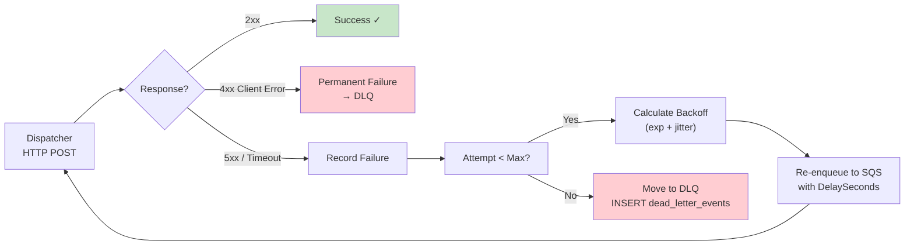
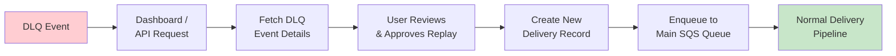
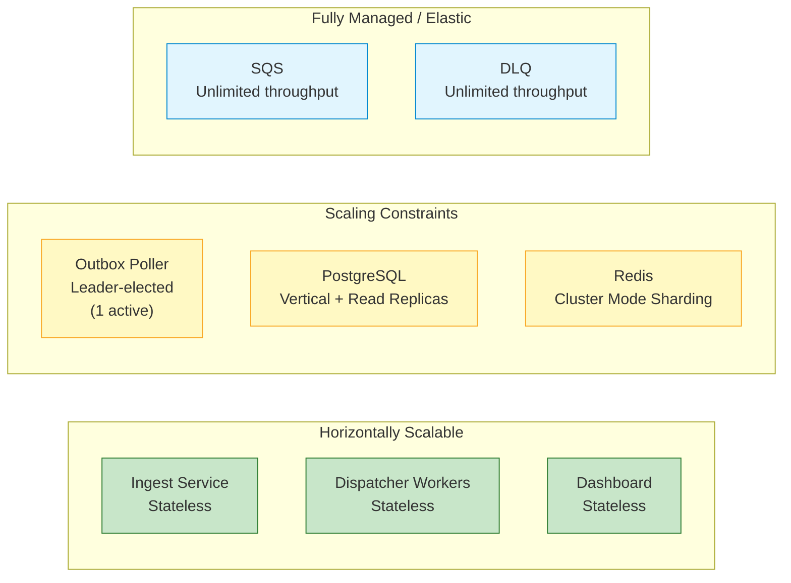

# System Overview — EventRelay Architecture

> **Document Version:** 1.0  
> **Last Updated:** 2026-07-10  
> **Status:** Production Reference

## Overview

EventRelay is a **reliable webhook delivery platform** that guarantees at-least-once delivery of events to subscriber-registered HTTP endpoints. The architecture follows a **producer-consumer pattern** with the **Transactional Outbox** ensuring exactly-once publishing from the database to the message queue.

This document provides a high-level view of every component in the system, their interconnections, protocols, and data flow paths — including the happy path, failure/retry path, and dead-letter/replay path.

---

## System Architecture Diagram

```mermaid
graph TB
    subgraph Clients ["External Clients"]
        P["Event Producers<br/>(Tenant Applications)"]
        D["Dashboard Users<br/>(Ops / Tenant Admins)"]
    end

    subgraph Edge ["Edge Layer"]
        AG["API Gateway<br/>(ALB + WAF)<br/>TLS 1.3 · Rate Limiting"]
    end

    subgraph IngestCluster ["Ingest Service Cluster (ECS Fargate)"]
        IS1["Ingest Service<br/>Instance 1"]
        IS2["Ingest Service<br/>Instance 2"]
        ISn["Ingest Service<br/>Instance N"]
    end

    subgraph DataStores ["Persistent Data Stores"]
        PG[("PostgreSQL (RDS Multi-AZ)<br/>──────────────────<br/>• events<br/>• outbox<br/>• tenants<br/>• subscriptions<br/>• delivery_attempts<br/>• dead_letter_events<br/>• api_keys")]
    end

    subgraph CacheLayer ["Cache & Rate Limiting"]
        RD[("Redis (ElastiCache)<br/>──────────────────<br/>• Idempotency Cache (TTL 24h)<br/>• Rate Limit Counters<br/>• Circuit Breaker State<br/>• Tenant Config Cache")]
    end

    subgraph Messaging ["Message Queue Layer"]
        SQS["AWS SQS<br/>──────────────────<br/>Main Delivery Queue<br/>Visibility Timeout: 60s<br/>Max Receive Count: 5"]
        DLQ["AWS SQS DLQ<br/>──────────────────<br/>Dead-Letter Queue<br/>Retention: 14 days"]
    end

    subgraph PollerCluster ["Outbox Poller (ECS Fargate)"]
        OP["Outbox Poller<br/>──────────────────<br/>Scheduled Polling (500ms)<br/>Batch Size: 100<br/>SELECT FOR UPDATE SKIP LOCKED"]
    end

    subgraph DispatchCluster ["Dispatcher Worker Cluster (ECS Fargate)"]
        DW1["Dispatcher Worker 1"]
        DW2["Dispatcher Worker 2"]
        DWn["Dispatcher Worker N"]
    end

    subgraph Targets ["Subscriber Endpoints"]
        T1["Target URL 1<br/>(https://hooks.example.com)"]
        T2["Target URL 2<br/>(https://api.partner.io)"]
        Tn["Target URL N"]
    end

    subgraph Observability ["Observability Stack"]
        PROM["Prometheus<br/>Metrics Scraping"]
        GRAF["Grafana<br/>Dashboards & Alerts"]
        CW["CloudWatch<br/>Logs & Alarms"]
    end

    subgraph DashboardApp ["Dashboard Service (ECS Fargate)"]
        DASH["Dashboard API<br/>+ React SPA"]
    end

    %% Client → Edge → Ingest
    P -- "HTTPS POST /api/v1/events<br/>API Key Auth" --> AG
    D -- "HTTPS<br/>Session Auth" --> AG
    AG -- "HTTP (internal)" --> IS1
    AG -- "HTTP (internal)" --> IS2
    AG -- "HTTP (internal)" --> ISn
    AG -- "HTTP (internal)" --> DASH

    %% Ingest → Data Stores
    IS1 & IS2 & ISn -- "JDBC (TLS)<br/>Transactional Write:<br/>INSERT event + outbox row" --> PG
    IS1 & IS2 & ISn -- "Redis Protocol (TLS)<br/>GET/SET idempotency key<br/>INCR rate limit counter" --> RD

    %% Outbox Poller → PG & SQS
    OP -- "JDBC (TLS)<br/>Poll outbox table<br/>SELECT ... SKIP LOCKED" --> PG
    OP -- "AWS SDK (HTTPS)<br/>SendMessageBatch" --> SQS

    %% SQS → Dispatcher Workers
    SQS -- "AWS SDK (HTTPS)<br/>ReceiveMessage<br/>Long Poll: 20s" --> DW1
    SQS -- "AWS SDK (HTTPS)<br/>ReceiveMessage" --> DW2
    SQS -- "AWS SDK (HTTPS)<br/>ReceiveMessage" --> DWn

    %% Dispatcher → Targets
    DW1 & DW2 & DWn -- "HTTPS POST<br/>HMAC-SHA256 Signed<br/>Timeout: 30s" --> T1
    DW1 & DW2 & DWn -- "HTTPS POST" --> T2
    DW1 & DW2 & DWn -- "HTTPS POST" --> Tn

    %% Dispatcher → Data Stores
    DW1 & DW2 & DWn -- "JDBC (TLS)<br/>INSERT delivery_attempt" --> PG
    DW1 & DW2 & DWn -- "Redis Protocol (TLS)<br/>Rate Limit Check<br/>Circuit Breaker Check" --> RD

    %% Failure Path: SQS → DLQ
    SQS -. "After max receive count<br/>exceeded (5 attempts)" .-> DLQ

    %% Dashboard
    DASH -- "JDBC (TLS)<br/>Read queries" --> PG
    DASH -- "AWS SDK<br/>Read DLQ messages" --> DLQ

    %% Observability
    IS1 & IS2 & ISn -. "/actuator/prometheus" .-> PROM
    DW1 & DW2 & DWn -. "/actuator/prometheus" .-> PROM
    OP -. "/actuator/prometheus" .-> PROM
    PROM -. "PromQL" .-> GRAF
    IS1 & IS2 & ISn -. "stdout/stderr" .-> CW
    DW1 & DW2 & DWn -. "stdout/stderr" .-> CW
    OP -. "stdout/stderr" .-> CW

    %% Styling
    classDef client fill:#e1f5fe,stroke:#0288d1,stroke-width:2px
    classDef edge fill:#fff3e0,stroke:#f57c00,stroke-width:2px
    classDef service fill:#e8f5e9,stroke:#388e3c,stroke-width:2px
    classDef datastore fill:#fce4ec,stroke:#c62828,stroke-width:2px
    classDef queue fill:#f3e5f5,stroke:#7b1fa2,stroke-width:2px
    classDef target fill:#fff9c4,stroke:#f9a825,stroke-width:2px
    classDef observability fill:#efebe9,stroke:#5d4037,stroke-width:1px,stroke-dasharray: 5 5

    class P,D client
    class AG edge
    class IS1,IS2,ISn,OP,DW1,DW2,DWn,DASH service
    class PG,RD datastore
    class SQS,DLQ queue
    class T1,T2,Tn target
    class PROM,GRAF,CW observability
```

---

## Data Flow Paths

### 1. Happy Path — Event Ingestion & Delivery

```mermaid
flowchart LR
    A["1. Client POST<br/>/api/v1/events"] --> B["2. Auth + Validate<br/>+ Idempotency Check"]
    B --> C["3. BEGIN TX:<br/>INSERT event<br/>INSERT outbox"]
    C --> D["4. COMMIT TX<br/>Return 202"]
    D --> E["5. Poller reads<br/>outbox row"]
    E --> F["6. Send to SQS<br/>Mark PROCESSED"]
    F --> G["7. Dispatcher<br/>receives msg"]
    G --> H["8. HMAC sign<br/>+ HTTP POST"]
    H --> I["9. 2xx Response<br/>Record success"]
    I --> J["10. Delete<br/>SQS message"]

    style A fill:#e3f2fd
    style D fill:#c8e6c9
    style I fill:#c8e6c9
    style J fill:#c8e6c9
```

### 2. Failure & Retry Path

### 3. Dead-Letter & Replay Path

---

## Component Inventory

| Component | Technology | Instances | Port | Health Check |
|---|---|---|---|---|
| API Gateway | AWS ALB + WAF | 2 (cross-AZ) | 443 | `/health` |
| Ingest Service | Spring Boot 3.x (Java 17) | 2–10 (auto-scale) | 8080 | `/actuator/health` |
| Outbox Poller | Spring Boot 3.x (Java 17) | 1–2 (leader election) | 8081 | `/actuator/health` |
| Dispatcher Worker | Spring Boot 3.x (Java 17) | 2–20 (auto-scale) | 8082 | `/actuator/health` |
| Dashboard API | Spring Boot 3.x (Java 17) | 2 | 8083 | `/actuator/health` |
| PostgreSQL | AWS RDS (PostgreSQL 15) | Multi-AZ (primary + standby) | 5432 | RDS health |
| Redis | AWS ElastiCache (Redis 7.x) | Cluster mode, 2 shards | 6379 | ElastiCache health |
| Main Queue | AWS SQS Standard | Managed | — | SQS metrics |
| Dead-Letter Queue | AWS SQS Standard | Managed | — | SQS metrics |
| Prometheus | Prometheus 2.x | 1 | 9090 | `/-/healthy` |
| Grafana | Grafana 10.x | 1 | 3000 | `/api/health` |

---

## Protocol & Security Summary

| Connection | Protocol | Authentication | Encryption |
|---|---|---|---|
| Client → ALB | HTTPS (TLS 1.3) | API Key (`X-API-Key` header) | TLS in transit |
| ALB → Ingest Service | HTTP (internal VPC) | Security Group restricted | VPC internal |
| Ingest → PostgreSQL | JDBC over TLS | IAM Auth / password | TLS in transit, AES-256 at rest |
| Ingest → Redis | Redis protocol over TLS | AUTH token | TLS in transit, AES-256 at rest |
| Poller → SQS | HTTPS (AWS SDK) | IAM Role (Task Role) | TLS in transit, SSE-SQS at rest |
| Dispatcher → Target | HTTPS | HMAC-SHA256 signature | TLS in transit |
| Prometheus → Services | HTTP (internal VPC) | Security Group restricted | VPC internal |

---

## Scaling Characteristics

| Component | Scaling Strategy | Scaling Trigger | Min | Max |
|---|---|---|---|---|
| Ingest Service | ECS Auto Scaling (CPU/Request count) | CPU > 70% or RequestCount > 1000/min | 2 | 10 |
| Dispatcher Workers | ECS Auto Scaling (SQS queue depth) | ApproximateNumberOfMessages > 1000 | 2 | 20 |
| Outbox Poller | Leader election (only 1 active) | N/A — single active instance | 1 | 2 |
| PostgreSQL | Vertical scaling + read replicas | CPU > 80%, connections > 80% | db.r6g.large | db.r6g.4xlarge |
| Redis | Cluster mode resharding | Memory > 75%, CPU > 65% | 2 shards | 8 shards |

---

## Key Design Decisions

| Decision | Rationale |
|---|---|
| **Transactional Outbox** over CDC | Simpler operational model; no Debezium/Kafka dependency; sufficient for target throughput (5K events/sec) |
| **SQS** over Kafka | Lower operational overhead; built-in DLQ; sufficient ordering guarantees (per-message, not total order) |
| **PostgreSQL** over DynamoDB | Strong consistency for event storage; complex query support for dashboard; familiar ACID semantics |
| **Redis** for rate limiting | Sub-millisecond latency for token bucket operations; atomic Lua scripts; built-in TTL |
| **HMAC-SHA256** over mTLS | Simpler for webhook consumers to implement; industry standard (Stripe, GitHub, Svix all use HMAC) |
| **At-least-once** delivery | Exactly-once is impractical across network boundaries; consumers must be idempotent (we provide idempotency keys) |

---

## Related Documents

- [Component Diagram](../Architecture_Diagrams/Component_Diagram.md) — Internal structure of each service
- [Deployment Diagram](../Architecture_Diagrams/Deployment_Diagram.md) — AWS infrastructure layout
- [Database Schema](../ER_Diagrams/Database_Schema.md) — Complete entity-relationship diagram
- [Event Ingestion Flow](../Sequence_Diagrams/Event_Ingestion.md) — Detailed ingestion sequence
- [Successful Delivery Flow](../Sequence_Diagrams/Successful_Delivery.md) — End-to-end delivery sequence
