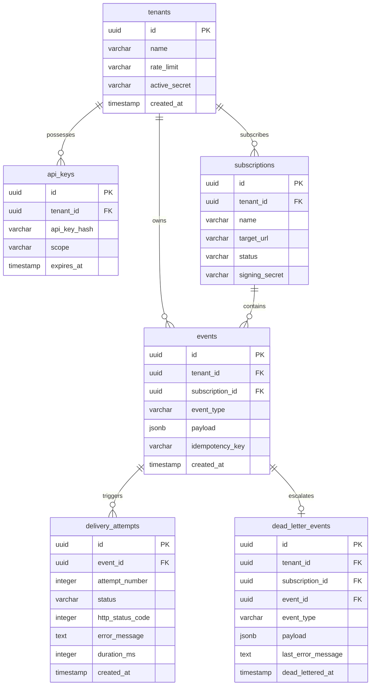

# EventRelay — Database Entity Relationship (ER) Diagram

This document details the schema definitions, relational constraints, and index layouts for the EventRelay PostgreSQL database.

---

## 1. Database Schema Diagram (Mermaid ER)

---

## 2. High-Performance Indices

To maintain fast query response times under high write loads:
- **Composite Index for Outbox**: `CREATE INDEX idx_outbox_poll ON outbox(status, created_at)`.
- **Tenant Isolation Index**: `CREATE INDEX idx_events_tenant ON events(tenant_id, created_at DESC)`.
- **Deduplication Constraint**: `ALTER TABLE events ADD CONSTRAINT unique_idempotency UNIQUE(tenant_id, idempotency_key)`.
