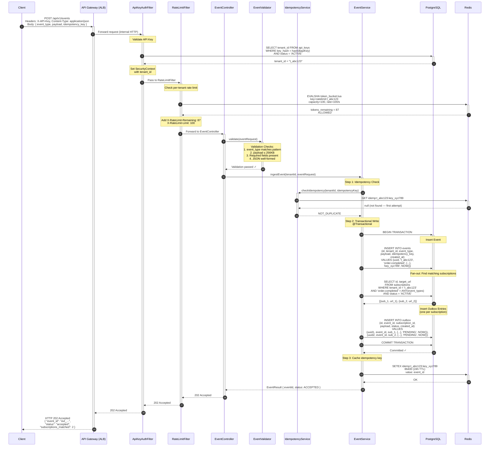
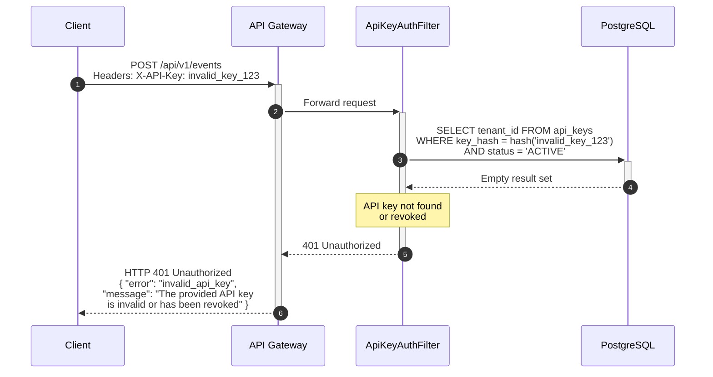
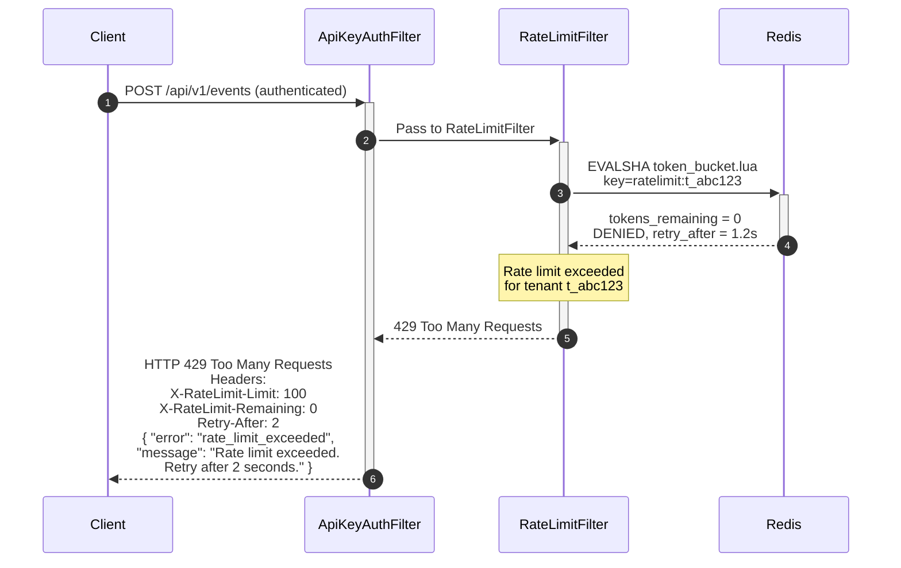
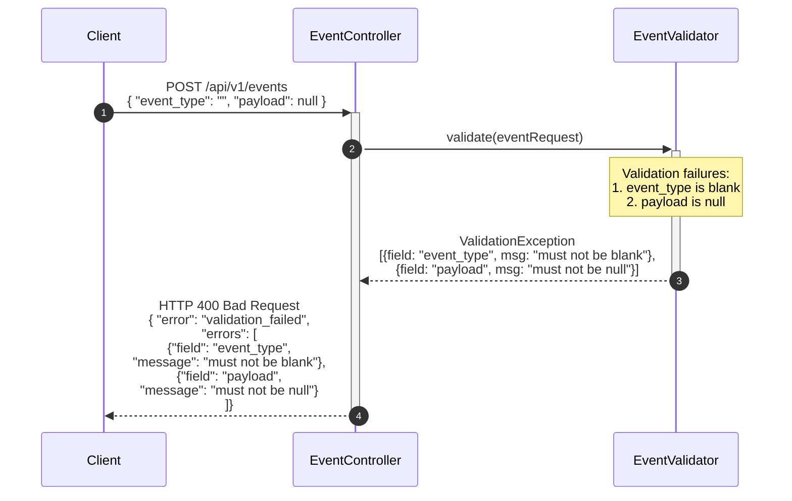
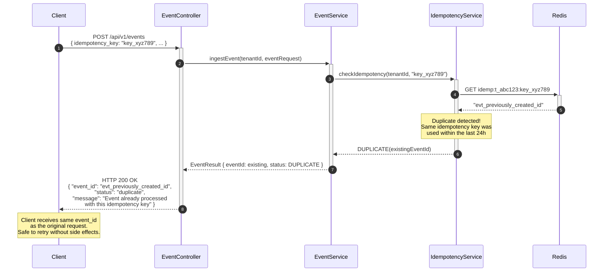
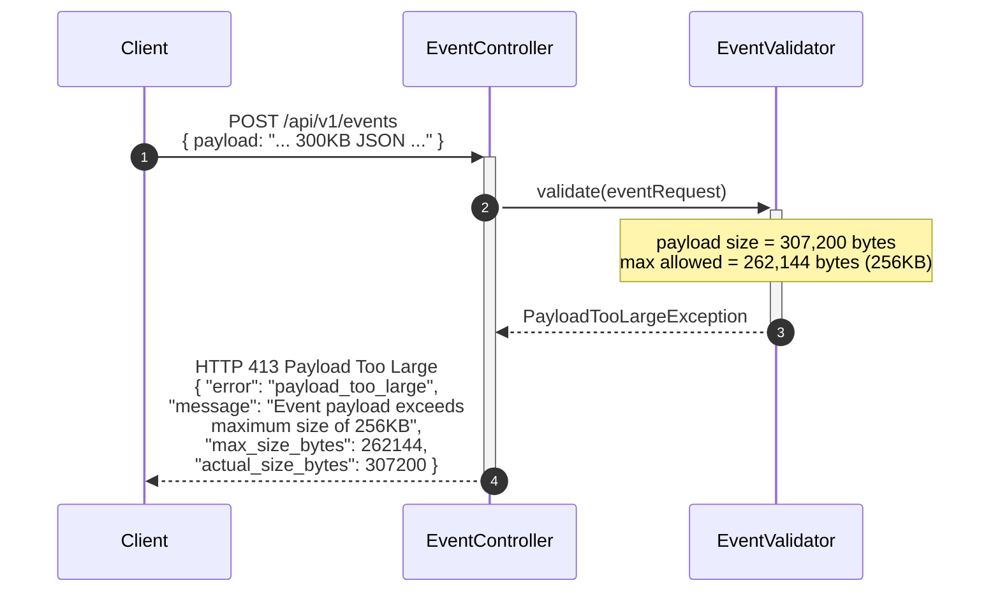
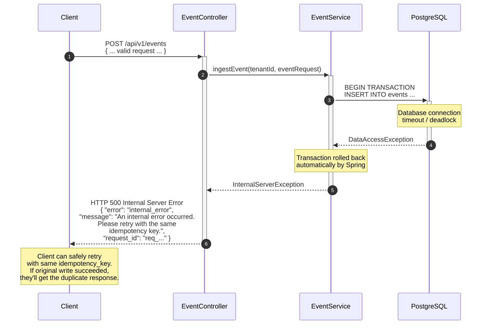

# Event Ingestion — Sequence Diagram

> **Document Version:** 1.0  
> **Last Updated:** 2026-07-10  
> **Status:** Production Reference

## Overview

This document details the **complete request lifecycle** for event ingestion — from the client's HTTP POST through authentication, validation, idempotency checking, transactional outbox write, and response. All error paths are documented with their corresponding HTTP status codes.

---

## Happy Path — Successful Event Ingestion



---

## Error Path 1 — Invalid API Key (401 Unauthorized)



---

## Error Path 2 — Rate Limit Exceeded (429 Too Many Requests)



---

## Error Path 3 — Validation Failure (400 Bad Request)



---

## Error Path 4 — Duplicate Event (200 OK — Idempotent Return)



---

## Error Path 5 — Payload Too Large (413)



---

## Error Path 6 — Internal Server Error (500)



---

## Request/Response Specification

### Request

```http
POST /api/v1/events HTTP/1.1
Host: api.eventrelay.io
Content-Type: application/json
X-API-Key: ak_live_7f3d9a2b1c4e8f...
X-Idempotency-Key: ord_12345_completed_v1
X-Request-Id: req_abc123def456

{
  "event_type": "order.completed",
  "payload": {
    "order_id": "ord_12345",
    "customer_id": "cust_67890",
    "total": 99.99,
    "currency": "USD",
    "items": [
      {"sku": "ITEM-001", "qty": 2, "price": 49.99}
    ],
    "completed_at": "2026-07-10T04:00:00Z"
  }
}
```

### Response (202 Accepted)

```http
HTTP/1.1 202 Accepted
Content-Type: application/json
X-Request-Id: req_abc123def456
X-RateLimit-Limit: 100
X-RateLimit-Remaining: 87

{
  "event_id": "evt_a1b2c3d4e5f6",
  "status": "accepted",
  "event_type": "order.completed",
  "subscriptions_matched": 2,
  "created_at": "2026-07-10T04:00:45.123Z"
}
```

### Error Response Format

```json
{
  "error": "error_code",
  "message": "Human-readable error description",
  "request_id": "req_abc123def456",
  "errors": [
    {
      "field": "field_name",
      "message": "Specific field-level error"
    }
  ]
}
```

---

## HTTP Status Code Summary

| Status Code | Condition | Idempotent? | Client Action |
|---|---|---|---|
| **200 OK** | Duplicate idempotency key | Yes | Use returned event_id |
| **202 Accepted** | Event accepted for delivery | Yes (with key) | Store event_id |
| **400 Bad Request** | Validation failure | N/A | Fix request body |
| **401 Unauthorized** | Invalid/missing API key | N/A | Check API key |
| **413 Payload Too Large** | Payload > 256KB | N/A | Reduce payload size |
| **429 Too Many Requests** | Rate limit exceeded | N/A | Retry after `Retry-After` header |
| **500 Internal Error** | Database/system failure | Safe to retry | Retry with same idempotency key |

---

## Related Documents

- [System Overview](../Architecture_Diagrams/System_Overview.md) — Where ingestion fits in the overall architecture
- [Successful Delivery](../Sequence_Diagrams/Successful_Delivery.md) — What happens after ingestion
- [Database Schema](../ER_Diagrams/Database_Schema.md) — Event and outbox table structures
- [Postman Collection](../API_Collections/Postman_Collection.md) — Ready-to-use API requests
