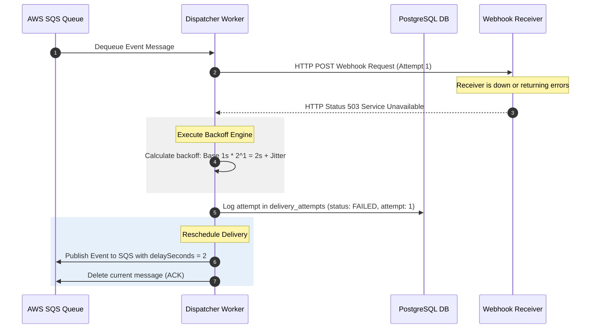

# Sequence Diagram — Failed Delivery and SQS Retry Routing

This document provides a sequence diagram detailing how EventRelay handles failed HTTP delivery attempts, executes backoff calculations, and schedules retries.

---

## 1. Sequence Diagram (Mermaid)

---

## 2. Dynamic Redrive Window

- If the receiver returns a retryable status code (such as `500`, `503`, `504`, `428`, or connection timeout), the event is re-queued with a delay.
- Non-retryable statuses (such as `400`, `401`, `403`, `404`) bypass the retry loop and move directly to the Dead-Letter Queue (DLQ).
