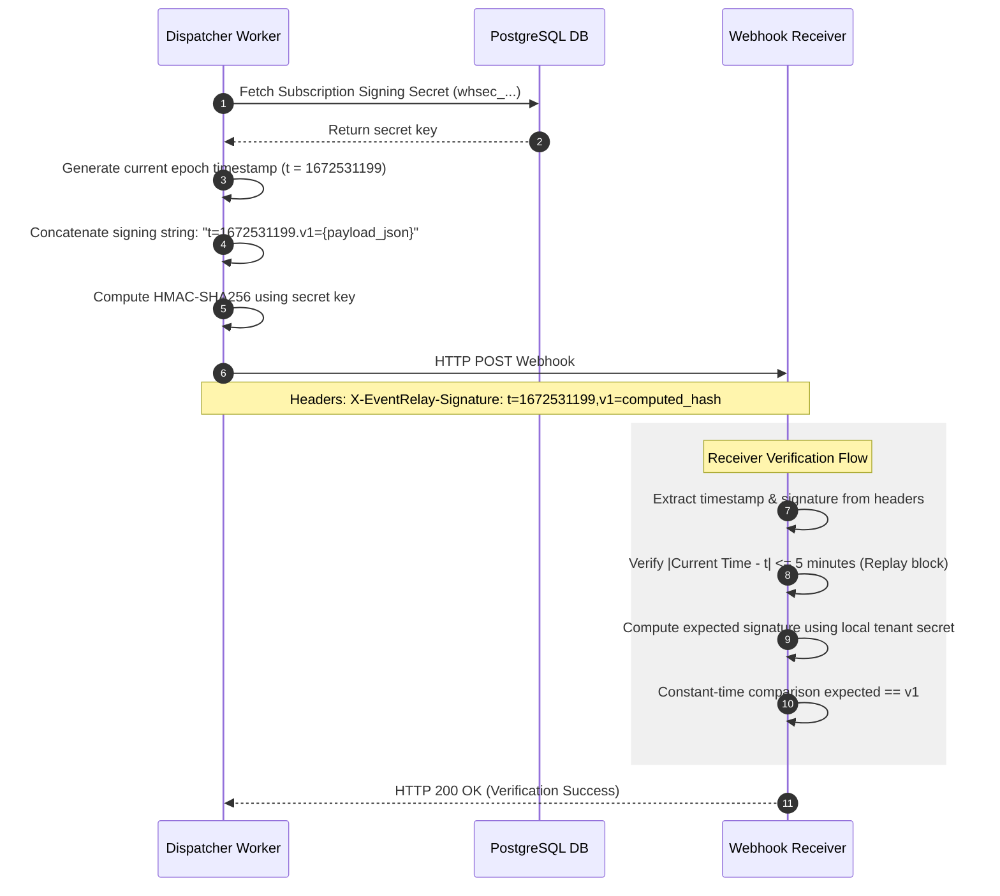

# Sequence Diagram — HMAC-SHA256 Request Signing

This document details the sequence of operations for generating and verifying HMAC signatures in EventRelay.

---

## 1. Sequence Diagram (Mermaid)


---

## 2. Receiver-Side Verification Code Example (Java)

Webhook receivers can verify signature validity:

```java
public boolean verifySignature(String payload, String signatureHeader, String secret) {
    // Parse header: t=...,v1=...
    String[] parts = signatureHeader.split(",");
    String t = parts[0].split("=")[1];
    String v1 = parts[1].split("=")[1];

    // Reconstruct signing string
    String signingString = "t=" + t + ".v1=" + payload;

    // Compute local HMAC
    Mac mac = Mac.getInstance("HmacSHA256");
    SecretKeySpec secretKey = new SecretKeySpec(secret.getBytes(StandardCharsets.UTF_8), "HmacSHA256");
    mac.init(secretKey);
    byte[] hash = mac.doFinal(signingString.getBytes(StandardCharsets.UTF_8));
    String expectedSignature = Hex.encodeHexString(hash);

    // Constant-time compare
    return MessageDigest.isEqual(
        expectedSignature.getBytes(StandardCharsets.UTF_8), 
        v1.getBytes(StandardCharsets.UTF_8)
    );
}
```
