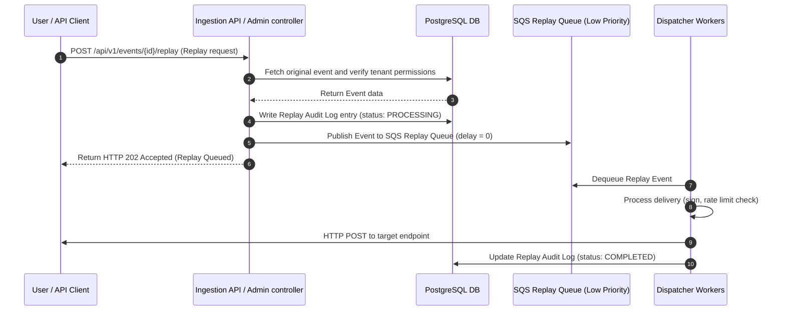

# Sequence Diagram — Event Replay Flow

This document details the sequence of operations for triggering event replays from the Dead-Letter Queue (DLQ).

---

## 1. Sequence Diagram (Mermaid)

---

## 2. Replay Performance Guarantees

- **Low Priority Workers**: SQS Replay queue is processed by a smaller subset of worker threads, ensuring live traffic is never blocked.
- **Audit Trails**: Every replay execution creates a mapping log entry tracking who triggered the replay, when, and the delivery result.
