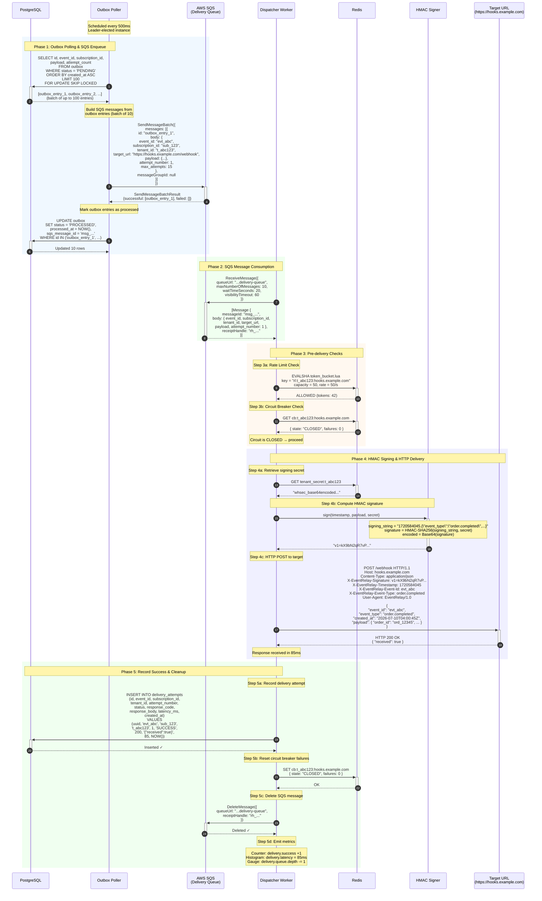
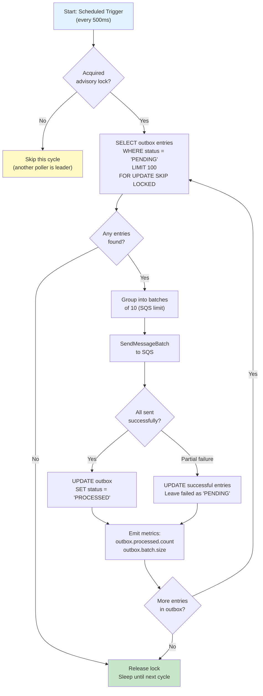

# Successful Delivery — Sequence Diagram

> **Document Version:** 1.0  
> **Last Updated:** 2026-07-10  
> **Status:** Production Reference

## Overview

This document traces the **complete delivery pipeline** for a successfully delivered event — from the Outbox Poller reading a pending outbox entry, through SQS enqueue, Dispatcher processing, HMAC signing, HTTP delivery, and final success recording. This is the **happy path** that the vast majority (~99%) of deliveries should follow.

---

## End-to-End Successful Delivery Sequence



---

## Timing Breakdown

```mermaid
gantt
    title Delivery Latency Breakdown (Typical Successful Delivery)
    dateFormat X
    axisFormat %L ms

    section Outbox Poll
    Poll query (SELECT)         :0, 15
    Send to SQS                 :15, 25
    Mark processed (UPDATE)     :25, 30

    section Queue Wait
    SQS propagation delay       :30, 35

    section Dispatcher
    Receive from SQS            :35, 37
    Rate limit check (Redis)    :37, 38
    Circuit breaker check       :38, 39
    Fetch signing secret        :39, 40
    HMAC computation            :40, 41
    HTTP POST to target         :41, 126
    Record delivery attempt     :126, 131
    Delete SQS message          :131, 133
```



| Phase | Component | Typical Duration | Notes |
|---|---|---|---|
| Outbox polling | Poller → PostgreSQL | 10–20ms | Batched `SELECT FOR UPDATE SKIP LOCKED` |
| SQS enqueue | Poller → SQS | 5–15ms | `SendMessageBatch` API call |
| Mark processed | Poller → PostgreSQL | 3–8ms | Batch `UPDATE` |
| SQS propagation | SQS internal | 1–10ms | Standard queue — usually sub-5ms |
| SQS receive | Dispatcher → SQS | 1–2ms | Long poll returns immediately if messages exist |
| Rate limit check | Dispatcher → Redis | < 1ms | Redis Lua script execution |
| Circuit breaker | Dispatcher → Redis | < 1ms | Simple `GET` |
| HMAC signing | Dispatcher (in-memory) | < 1ms | CPU-bound, negligible |
| **HTTP POST** | **Dispatcher → Target** | **50–200ms** | **Dominates total latency** |
| Record attempt | Dispatcher → PostgreSQL | 3–8ms | Single `INSERT` |
| Delete SQS msg | Dispatcher → SQS | 2–5ms | `DeleteMessage` API call |
| **Total (end-to-end)** | | **~100–300ms** | From outbox poll to success recorded |

> [!IMPORTANT]
> The HTTP POST to the target URL dominates total delivery latency. The EventRelay overhead (everything except the HTTP call) is typically **< 50ms**.

---

## Outbox Poller — Detailed Behavior

### Polling Loop



### `SELECT FOR UPDATE SKIP LOCKED` — Why It Matters

```sql
-- This query ensures:
-- 1. Row-level locking prevents duplicate processing
-- 2. SKIP LOCKED means concurrent pollers don't block each other
-- 3. ORDER BY created_at ensures FIFO ordering
-- 4. LIMIT 100 caps batch size for predictable throughput

SELECT id, event_id, subscription_id, payload, attempt_count, created_at
FROM outbox
WHERE status = 'PENDING'
ORDER BY created_at ASC
LIMIT 100
FOR UPDATE SKIP LOCKED;
```

---

## SQS Message Format

```json
{
  "event_id": "evt_a1b2c3d4e5f6",
  "event_type": "order.completed",
  "tenant_id": "t_abc123",
  "subscription_id": "sub_s1t2u3v4w5",
  "target_url": "https://hooks.example.com/webhook",
  "attempt_number": 1,
  "max_attempts": 15,
  "payload": {
    "event_id": "evt_a1b2c3d4e5f6",
    "event_type": "order.completed",
    "created_at": "2026-07-10T04:00:45.123Z",
    "payload": {
      "order_id": "ord_12345",
      "customer_id": "cust_67890",
      "total": 99.99,
      "currency": "USD"
    }
  },
  "metadata": {
    "outbox_id": "ob_x1y2z3",
    "enqueued_at": "2026-07-10T04:00:45.200Z",
    "trace_id": "tr_m1n2o3p4"
  }
}
```

---

## Success Criteria

A delivery is considered **successful** when the target URL responds with any **2xx HTTP status code** within the configured timeout:

| Response Code | Interpretation | Action |
|---|---|---|
| 200 OK | Standard success | Record success, delete SQS message |
| 201 Created | Resource created | Record success, delete SQS message |
| 202 Accepted | Accepted for processing | Record success, delete SQS message |
| 204 No Content | Success, no body | Record success, delete SQS message |

> [!NOTE]
> **Response body truncation**: We store up to **4KB** of the response body in `delivery_attempts.response_body` for debugging purposes. Larger responses are truncated with a `[TRUNCATED]` suffix.

---

## Related Documents

- [Event Ingestion](../Sequence_Diagrams/Event_Ingestion.md) — What happens before delivery
- [Failed Delivery & Retry](../Sequence_Diagrams/Failed_Delivery_Retry.md) — What happens when delivery fails
- [HMAC Signing](../Sequence_Diagrams/HMAC_Signing.md) — Detailed signing process
- [Database Schema](../ER_Diagrams/Database_Schema.md) — Outbox and delivery_attempts tables
